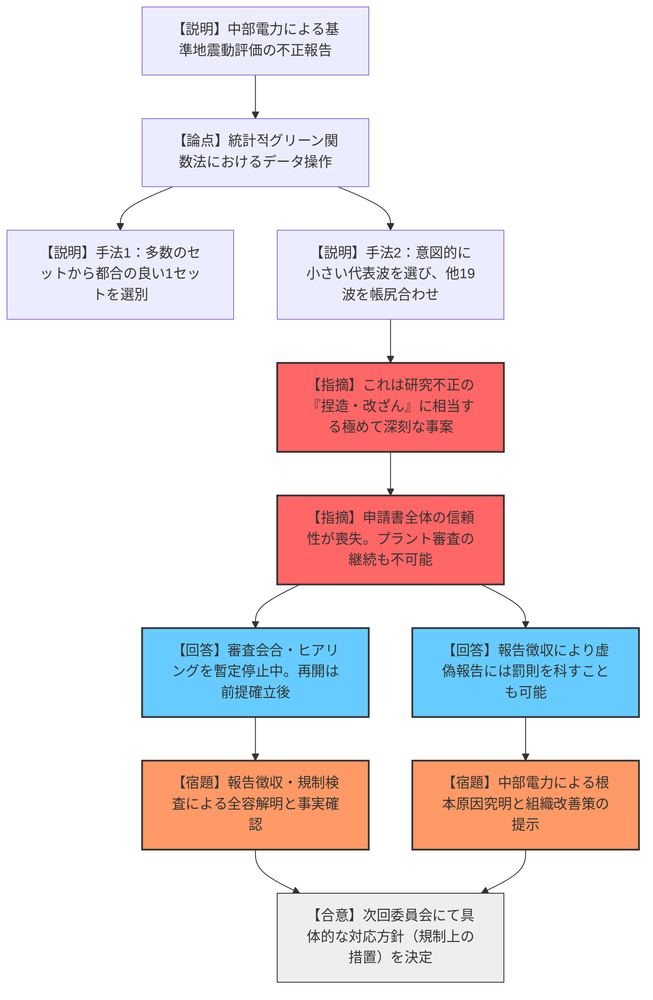
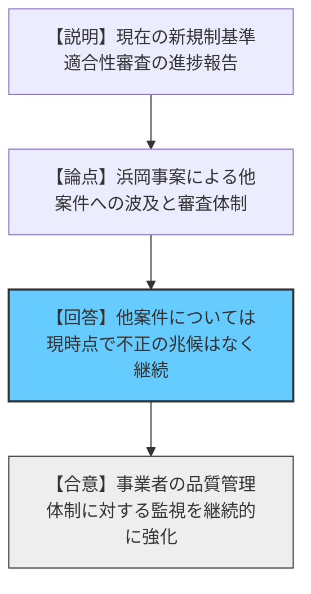
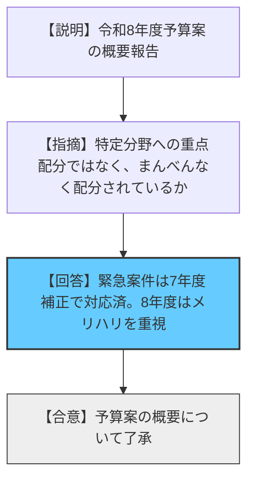

# 第50回原子力規制委員会（令和8年1月7日）
> 出典 : https://youtube.com/live/xoDvB3NP3CQ?si=ngM599KQ9CHGKbGe

### 会合の概要

* **浜岡原子力発電所の審査における「不正行為」の報告と糾弾**: 中部電力による基準地震動策定プロセスでのデータ意図的選定（不正行為）が報告され、委員からは「捏造・改ざんに類する」「前提を根底から覆す」といった極めて厳しい批判が相次いだ。
* **適合性審査の全面的な暫定停止**: 基準地震動の信頼性のみならず、事業者（中部電力）の品質管理体制や申請書全体の信用性が喪失したと判断され、審査の継続は不可能であるとの認識で一致した。
* **厳格な行政措置の検討**: 原子炉等規制法に基づく「報告徴収」や「原子力規制検査」を通じた全容解明、および組織改善が確認されるまで審査を再開しない方針が示された。
* **リスク低減業務の継続判断**: 核物質防護や保障措置、廃止措置など、安全リスクを低減する行為については、信頼性の懸念を抱えつつも、止めることによるリスクを考慮し、慎重な取り扱いが議論された。

---

### 議題1：中部電力株式会社浜岡原子力発電所の新規制基準適合性審査における基準地震動策定に係る不正行為 報告

* **議論の背景と論点**
* 浜岡原発の新規制基準適合性審査において、基準地震動を策定するための「統計的グリーン関数法」による地震動評価で、事業者が意図的に計算結果を操作（過小評価）していた疑い。
* 審査の前提となる事業者の「誠実さ」と「品質管理体制」が根本から問われる事態となった。

* **質疑応答（詳細）**
* **【説明者側（規制庁）】の説明**: 令和7年2月に内部告発（申告制度）があり調査。中部電力は、数千の計算結果から意図的に小さな波（代表波）を選び、それが平均的に見えるよう他の19波を後から選定する手法などで、データを操作していた。
* **【規制側（山岡委員）】の懸念・指摘点**: 統計的な評価を行うべきところを恣意的に操作し、図までもっともらしく加工したのは、研究不正における「捏造・改ざん」にあたる重大な事案である。
* **【説明者側（規制庁）】の回答**: その通り。特に敷地に大きな影響を及ぼす内陸地殻内地震の審査時期（2018年以降）に、不適切な手法が適用されていた。
* **【規制側（山中委員長）】の再反論・確認**: 申請書全体において、どこが信用できてどこができないのか判別不能な状態。このままではプラント審査の継続も容認できない。

* **結論と宿題事項（アクションアイテム）**
* **審査の停止**: 審査会合およびヒアリングを暫定的に停止し、審査の前提が確立するまで再開しない。
* **行政措置の実施**: 次回委員会にて、報告徴収や原子力規制検査の実施方針を決定する。
* **組織改善の要求**: 単なる事実解明だけでなく、なぜ不正が起こったかの根本原因究明と、機能する組織改善策の提示を中部電力に求める。

---

### 議題2：原子力発電所の新規制基準適合性審査等の状況報告

* **議論の背景と論点**
* 浜岡原発の不正事案を受け、他の原子力発電所の審査状況や今後の進め方に対する影響の確認。

* **質疑応答（詳細）**
* **【説明者側（規制庁）】の説明**: 浜岡については審査を停止しているが、他の電力会社については現時点で同様の事案は確認されていない。
* **【規制側】の懸念・指摘点**: 他の事業者の品質管理は大丈夫なのか。審査プロセスそのものに対する信頼への影響。

* **結論と宿題事項（アクションアイテム）**
* **現状維持**: 他の審査案件については継続するが、今回の事案を教訓に審査の厳格性を維持する。

---

### 議題3：原子力規制委員会の令和8年度予算案等の概要 報告

* **議論の背景と論点**
* 令和8年度の予算配分方針。特に重要・緊急性の高い項目への対応状況。

* **質疑応答（詳細）**
* **【規制側】の懸念・指摘点**: 8年度予算において特定の分野に偏りなく、まんべんなく配分されている印象だが、その方針で良いか。
* **【説明者側（会計担当参事官）】の回答**: 緊急性の高いものは令和7年度補正予算で重点的に措置しており、8年度予算は各分野にメリハリをつけつつ配分している。

* **結論と宿題事項（アクションアイテム）**
* **了承**: 提示された予算案の概要について了承。

