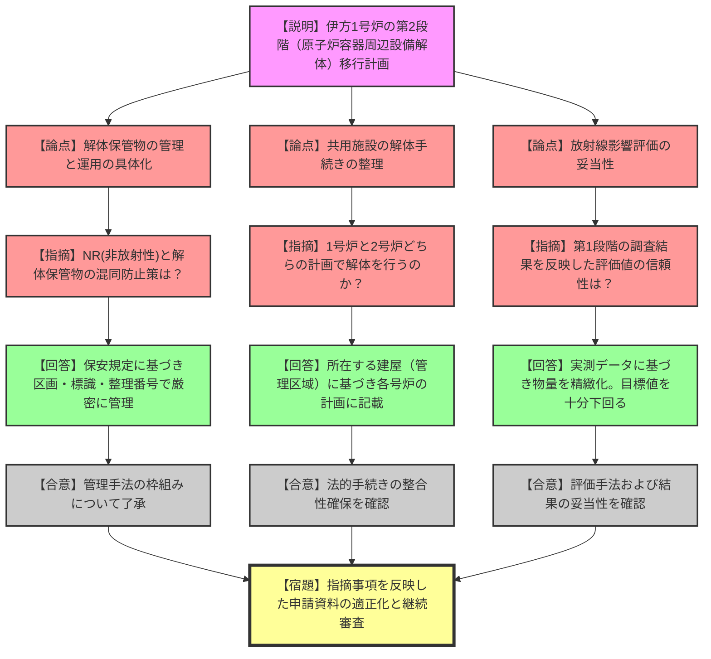

# 第43回実用発電用原子炉施設の廃止措置計画に係る審査会合（令和8年1月13日）
> 出典 : https://youtube.com/live/d6SdLCJC_YQ?si=y5YnJjErH4tjGC45

### 会合の概要

* **伊方1号炉の第2段階移行への具体的進展**: 1号炉の廃止措置が第1段階（準備期間）から第2段階（原子炉容器周辺設備解体撤去期間）へ移行するための具体的な計画、およびそれに伴う2号炉の計画変更について詳細な説明がなされました。
* **解体保管物管理の具体化**: 放射性廃棄物として扱う必要のないもの（NR）やクリアランス候補となる「解体保管物」の分別・保管・処理プロセスが具体化され、現場運用の透明性が高まりました。
* **1・2号炉共用施設の整理の見直し**: 従来2号炉のみの解体対象としていた共用施設を、1号炉の解体対象にも含めるよう修正し、法的手続きの整合性を確保しました。
* **被曝・環境影響評価の精緻化**: 第1段階での調査結果を反映し、廃棄物発生量や被曝線量の評価をモデルプラントベースから伊方発電所の実測データに基づいた数値へ更新し、安全目標値を下回ることが確認されました。

---

### 議題ごとの詳細整理（テキスト）

**【議題1：四国電力(株)伊方発電所1号炉及び2号炉の廃止措置計画変更認可申請及び原子炉施設保安規定変更認可申請の審査について】**

* **議論の背景と論点**:
伊方1号炉が「原子炉容器周辺設備」の解体を開始する第2段階へ移行するにあたり、解体手順、発生する廃棄物（特にクリアランス候補となる解体保管物）の管理方法、および周辺公衆・従事者の被曝評価の妥当性が主な論点となりました。また、1号炉と2号炉で共用している施設の解体責任と手続き上の整理についても議論されました。
* **質疑応答（詳細）**:
* **【説明者側（四国電力）】**: 第2段階では原子炉補給冷却水ポンプ等の解体に着手する。解体は放射能レベルの低いものから行うことを基本とし、エリア確保のために一部設備を先行解体する。
* **【規制側】**: 解体保管物の保管エリアの管理や、NR（放射性物質として扱う必要のないもの）との分別の厳密性をどのように担保するのか。
* **【説明者側】**: 保安規定に基づき、壁・柵等による区画、標識の掲示、整理番号による記録管理を行う。NRについては念のための放射線測定を実施した上で管理区域外へ搬出する。
* **【規制側】**: 1・2号炉共用施設の解体について、どちらの号炉の計画で実施するのか。
* **【説明者側】**: 基本的に、1号炉建屋内にある共用設備は1号炉の計画で、2号炉建屋内にあるものは2号炉の計画で解体・撤去を行うよう整理を変更し、両号炉の申請書に記載する。

* **結論と宿題事項（アクションアイテム）**:
* **結論**: 第2段階移行に伴う解体計画および廃棄物管理方針、被曝評価の計算結果（年間約5.9μSv等、目標値50μSvを十分下回る）については概ね理解が得られました。
* **条件・合意事項**: 共用施設の整理については、各号炉の管理区域の境界に基づき、どちらの計画で解体するのかを明確に定義することで合意されました。
* **宿題事項**: 本日の議論を踏まえ、資料の適正化を行い、次回以降の審査で詳細な技術的妥当性の確認を継続することとなりました。

---

### 論理構造の可視化（Mermaid）

