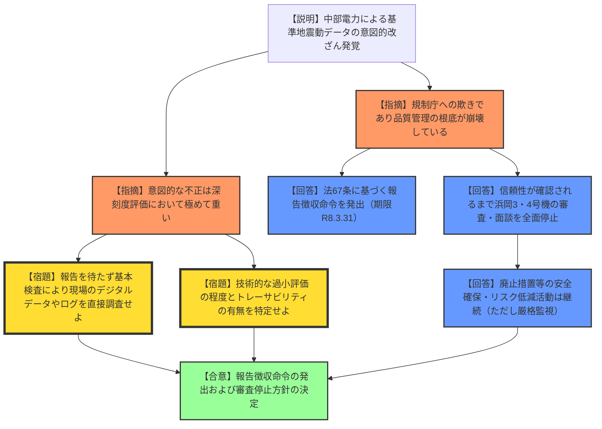
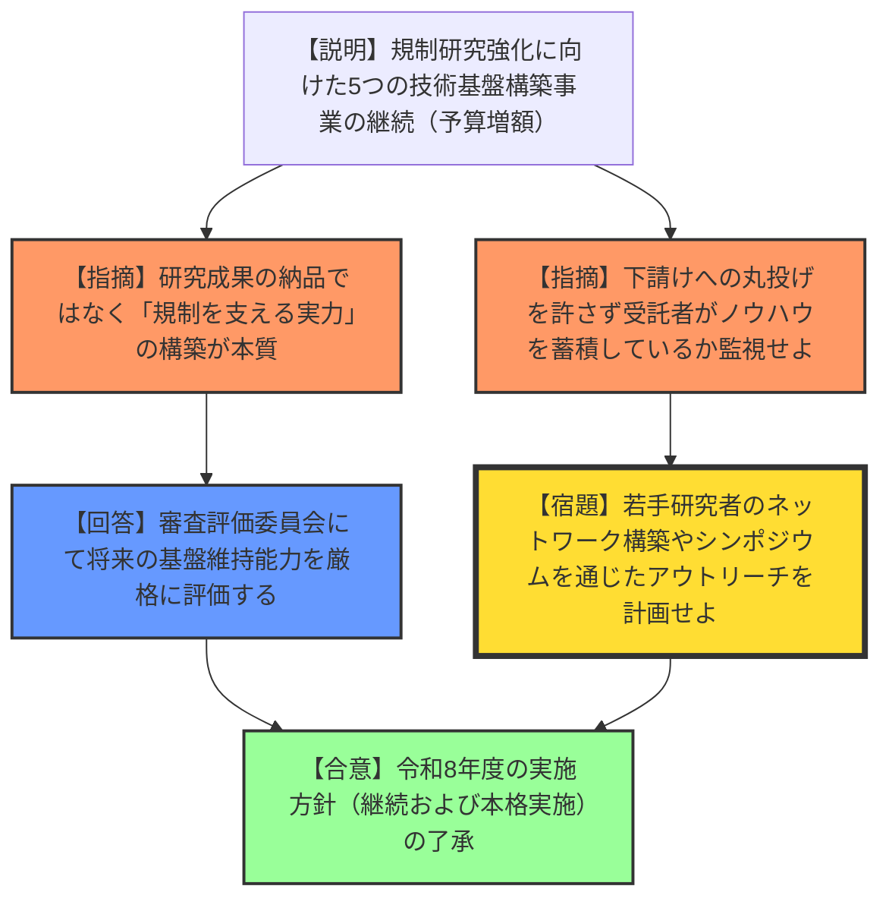
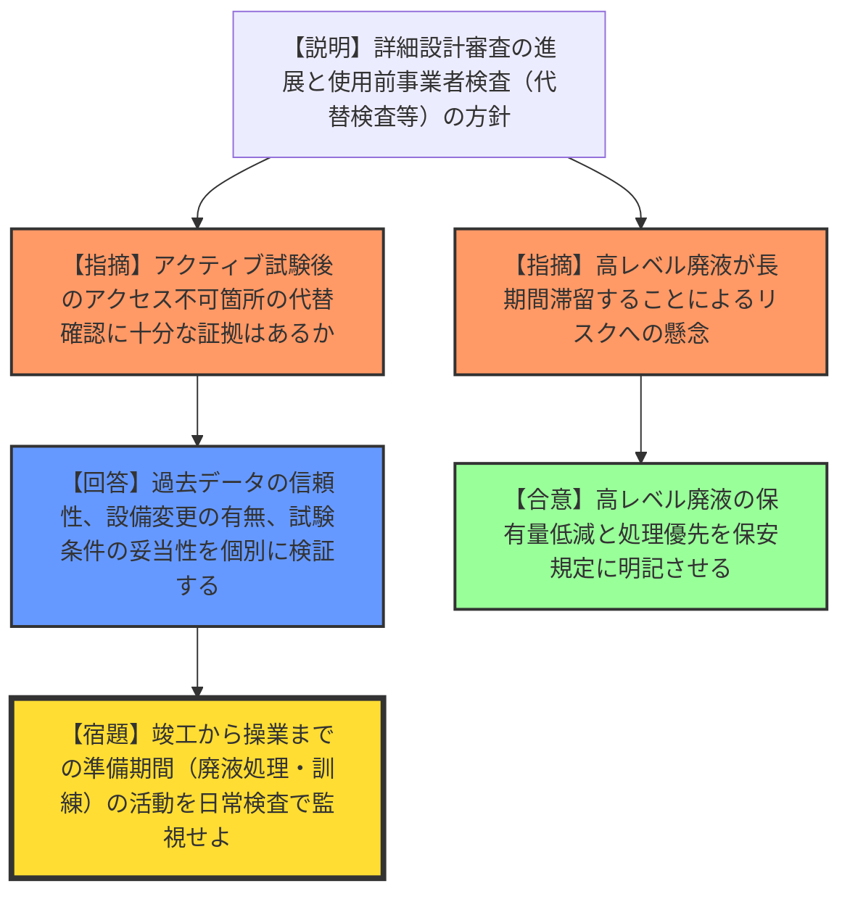
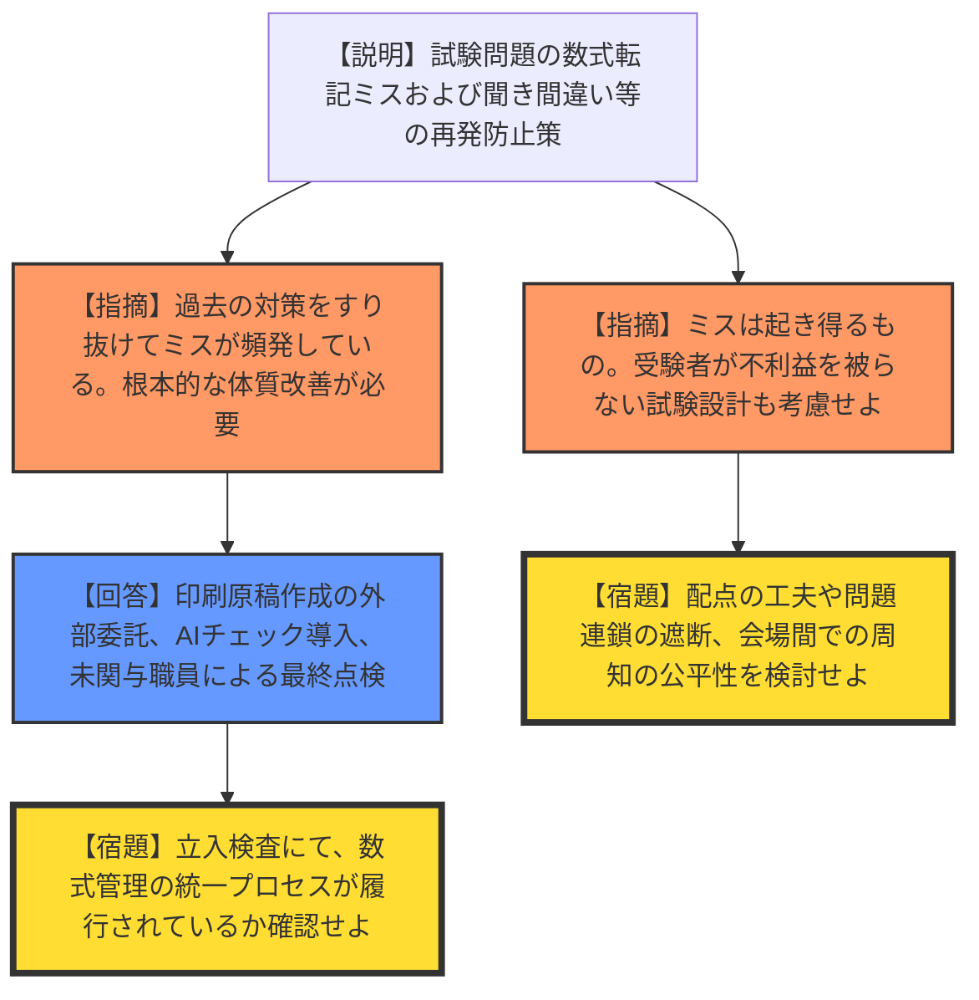

# 第51回原子力規制委員会（令和8年1月14日）
> 出典 : https://youtube.com/live/K1BPKxXVQwc?si=5E9BsoF1t5EKGj-m

# 会合の概要
* **中部電力の不正に対する厳格な姿勢:** 基準地震動策定における意図的なデータ操作（不正行為）に対し、委員会は強い遺憾の意を表明。報告徴収命令の発出を決定するとともに、信頼性が回復されるまで浜岡原子力発電所の設置変更許可申請等の審査・ヒアリングを全面的に停止することを決定した。
* **「報告待ち」を許さない独自の事実究明:** 規制庁に対し、事業者からの報告を待つことなく、原子力規制検査（基本検査）を通じて現場のデジタルデータや記録、関係者への聞き取りを独自に行うよう指示。単なる整合性確認に留まらず、不正の背景にある「安全文化」の欠如まで踏み込んだ徹底調査を求めた。
* **技術基盤構築の長期化と人材育成:** 原子力規制研究の強化事業において、単なる研究成果の納品ではなく、将来の規制を支える「設備・人材・ノウハウ」の維持・自律化を重視。若手研究者間のネットワーク構築やシンポジウム開催を通じた知見の公開を促した。
* **再処理施設審査の現実的対応:** 日本原燃の再処理施設において、アクティブ試験後のアクセス困難箇所に対する「代替検査」の妥当性を厳格に確認する方針を確認。高レベル廃液の保有量リスク低減を保安規定に明記させるなど、実効的なリスク管理を追求している。

---

# 議題ごとの詳細整理

## (1) 中部電力株式会社の不正行為に対する今後の対応
* **議論の背景と論点:** 中部電力浜岡原子力発電所の設置変更許可申請における基準地震動策定データに、意図的な操作（不正）が発覚。この不正が「品質管理の崩壊」および「規制当局への欺き」に当たると判断し、行政処分も視野に入れた事実関係の特定と、審査継続の可否が最大の論点となった。
* **質疑応答（詳細）:**
    * 【説明者側（竹内課長）】: 原子炉等規制法第67条第1項に基づく報告徴収命令を発出し、事実関係、原因、再発防止策を令和8年3月31日までに報告させる。また、信頼性が確認されるまで、浜岡3・4号機の審査、ヒアリング、面談等は実施しない。
    * 【規制側（山岡委員）】: 報告を待つだけでなく、検査によって独立して事実を明らかにすべき。技術的にどの程度「過小評価」になったのか、また、後から検証可能なデジタルデータ（シミュレーションのログ等）が保存されているか、トレーサビリティを徹底確認してほしい。
    * 【説明者側（竹内課長）】: 検査は報告を待たずに着手する。整合性に食い違いがあればさらに深掘りする。過小評価の客観的評価についても、どのような方法が可能か検討し、外注先も含めたデータ確認を行う。
    * 【規制側（杉山委員）】: 報告聴取の範囲が「地震動の申請書」に限定されているが、他の申請案件への影響はどう考えるのか。また、廃止措置作業等のリスク低減活動まで止めるべきではないが、その安全評価自体も疑わしいのではないか。
    * 【説明者側（竹内課長）】: 報告聴取は一旦範囲を限定するが、検査で疑義があれば対象を広げ、追加命令も検討する。廃止措置等の保安活動は継続させるが、その品質管理（不正の有無）については厳格に監視・検査を行う。
    * 【規制側（伴委員・長﨑委員）】: 不正の意図、規制活動への影響、組織文化の蔓延度を多段階で評価し、深刻度を決定すべき。学生の実験ノートのように、証拠となる記録（エビデンス）を徹底的にフォローせよ。
* **結論と宿題事項（アクションアイテム）:**
    * 原子炉等規制法に基づく報告徴収命令の発出を決定。
    * 浜岡原子力発電所の新規制基準適合性審査の凍結を了承。
    * **【宿題】**: 規制庁は基本検査を通じて、事業者の報告との整合性を検証し、適宜委員会に報告すること。
    * **【宿題】**: 規制庁内で、意図的な改ざんを見抜くための「データのトレーサビリティ」要求の在り方、審査プロセスの改善案を並行して立案すること。

## (2) 原子力規制研究の強化に向けた技術基盤構築事業
* **議論の背景と論点:** 令和6年度から開始された、将来の規制課題に対応するための技術基盤（設備・人材）の構築状況。FY2026に向け、既存の5事業を継続し、予算を増額して本格実施フェーズに移行させる方針の妥当性。
* **質疑応答（詳細）:**
    * 【説明者側（永瀬総括官）】: 東京科学大（廃棄物評価）、東大（セメント長期評価）、長岡技科大（水素爆発）、JAEA（リスク評価高度化）、有人宇宙システム（人間信頼性）の5事業を継続。FY2026は新規採択を行わず、これら5事業の設備整備と本格実施に集中する。
    * 【規制側（杉山委員）】: この事業は「研究成果の納品」ではなく、受託側が「規制を支援する実力をつける」ことが目的。下請けへの丸投げは厳禁であり、目的外使用がないか厳格にチェックせよ。
    * 【説明者側（永瀬総括官）】: 毎年度の審査評価委員会にて、将来にわたって基盤が維持できるかを確認項目に入れている。
    * 【規制側（神田委員・長﨑委員）】: 3年目の区切りとして、若手研究者の活躍の場（合同報告会）や、規制庁の若手職員とのネットワーク構築を推進すべき。
* **結論と宿題事項（アクションアイテム）:**
    * 令和8年度の実施方針（既存5事業の継続）を了承。
    * **【宿題】**: 研究活動のシンポジウム開催やアウトリーチ計画を策定し、規制庁内の知見共有を強化すること。

## (3) 日本原燃株式会社再処理施設の設公認審査の進捗を踏まえた対応
* **議論の背景と論点:** 再処理施設の審査が詳細設計段階（ステップ5・6）に移行。アクティブ試験済みのために物理的に確認が困難な箇所の「使用前事業者検査」の進め方と、高レベル廃液のリスク管理が論点。
* **質疑応答（詳細）:**
    * 【説明者側（熊谷管理官・高須管理官）】: アクセス困難箇所は旧検査記録や工事記録を用いる「代替検査」を行う。また、技術基準から規定がなくなった項目（ガラス溶融炉の能力試験等）は自主確認に整理する。
    * 【規制側（長﨑委員）】: 記録が存在しない場合や代替検査の際、国民に納得感のある説明ができるよう、妥当性の根拠をしっかりフォローせよ。
    * 【説明者側（高須管理官）】: 技術基準の適合性を過去のデータで担保できるか、設備に変更がないか、試験条件が適切かを厳密に確認する。
    * 【規制側（山中委員長）】: 「竣工（検査終了）」と「操業（燃料切断開始）」の間に数ヶ月の隙間があるが、この間の扱いは。
    * 【説明者側（熊谷管理官）】: 過去の廃液をガラス固化してリスクを下げる準備期間、および運転員の訓練期間としている。
* **結論と宿題事項（アクションアイテム）:**
    * 現時点の進捗および検査方針について報告を受理。
    * **【合意】**: 高レベル濃縮廃液の保有量低減方針を保安規定に明記させる。

## (4) 放射線取扱主任者試験の問題誤りに対する再発防止策
* **議論の背景と論点:** 令和7年度試験での数式転記ミス等の再発防止。過去にも同様のミスを繰り返している登録試験機関（センター）の体質改善。
* **質疑応答（詳細）:**
    * 【説明者側（野村管理官）】: 数式エディターの不一致による手入力での転記ミス、読み合わせ時の「A」と「N」の聞き間違いが原因。対策として、印刷原稿作成の外部委託、マーカーによる消し込み確認、AIチェックの導入、未関与職員によるダブルチェックを行う。
    * 【規制側（杉山委員）】: ミスゼロを目指す努力は当然だが、ミスが起きた際に「配点の工夫」や「後続問題への影響遮断」など、受験者が不利益を被らない現実的な設計も重要。
* **結論と宿題事項（アクションアイテム）:**
    * 再発防止策の報告を受理。
    * **【宿題】**: 規制庁は立入検査を通じて、新たな防止策の履行状況（特に数式管理の統一）を厳格に確認すること。

---

# 論理構造の可視化（Mermaid）

## 議題1：中部電力不正行為への対応

## 議題2：技術基盤構築事業（FY2026方針）

## 議題3：日本原燃・再処理施設審査状況

## 議題4：放射線試験問題誤り再発防止
