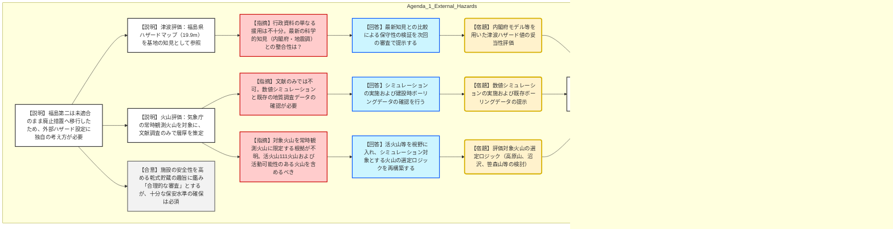

# 第44回実用発電用原子炉施設の廃止措置計画に係る審査会合（令和8年1月15日）
> 出典 : https://youtube.com/live/UHxbhMRXds0?si=Xw99N2k5Yk1AfCEq

# 会合の概要
* **廃止措置段階における「合理的な審査」の定義:** 新規制基準に適合することなく廃止措置へ移行した福島第二原子力発電所において、乾式貯蔵施設設置に伴う外部ハザード（津波・火山）をどう設定するかが最大の争点となった。規制庁側は、安全性を高めるための措置であることを踏まえつつも、設定の「確かさ」と「十分な保安水準」の証明を厳格に求めた。
* **行政資料の援用に対する疑義:** 東京電力は津波設定において福島県のハザードマップ（19.9m）を、火山設定において気象庁の常時観測火山データをそれぞれ「既知の知見」として引用した。これに対し、規制側は「最新知見（内閣府モデル等）との整合性」や「行政資料のスクリーニング基準の妥当性」について、科学的根拠に基づく再説明を要求した。
* **火山評価における調査不足の指摘:** 降下火砕物の層厚評価において、東京電力が文献調査のみで済ませようとした点に対し、規制側は「数値シミュレーションの実施」および「建設当時のボーリングデータ等の地質調査データの確認」を必須とする強い姿勢を示した。
* **審査体制の強化:** 今後、外部ハザード（津波・火山）の専門的な評価が必要になることから、山岡委員および内容に応じて杉山委員が審査に加わることが決定され、審査のフェーズが一段階上がった緊張感が示された。

---

# 議題の詳細整理

## 【議題1】東京電力ホールディングス株式会社福島第二原子力発電所1号炉、2号炉、3号炉及び4号炉の廃止措置計画変更認可申請の審査について
### 議論の背景と論点
福島第二原子力発電所は新規制基準適合性審査を受けずに廃止措置へ移行したため、設計の基準となる「基準津波」や「基準降下火砕物」が確定していない。本会合では、新設する乾式貯蔵施設の設計要件として、これらの外部ハザードをどのような論理で設定し、先行サイトと同等の安全性を担保するかが焦点となった。

### 質疑応答（詳細）

#### 1. 津波評価の考え方について
*   **【説明者側（東京電力）】の説明**
    *   福島県が作成した津波ハザードマップ（日本海溝沿いのプレート間・プレート内地震を想定）の解析値（富岡海岸：19.9m）を参照し、設計用の津波高さを策定。
    *   波源モデルの妥当性は福島県の資料を既知の知見として採用。不確かさを考慮し、設計段階で十分なマージン（防護高さ）を確保する。
*   **【規制側（島田審査官）】の懸念・指摘点**
    *   乾式貯蔵施設を標高約50mの場所に設置する方針は理解するが、引用した福島県の規模評価が福島第二のサイトに対して適用性があるかを説明すべき。
    *   2012年の内閣府モデルや、地震調査研究推進本部の最新知見など、最新の科学的知見に照らして、県のハザードマップが十分な保守性を有しているかを検証せよ。
*   **【説明者側（東京電力）】の回答・根拠**
    *   最新知見等との比較を含め、設定の妥当性について、今後の審査の中で対津波設計方針と併せて説明する。

#### 2. 火山評価（降下火砕物の層厚）の考え方について
*   **【説明者側（東京電力）】の説明**
    *   乾式貯蔵モジュールの給排気口閉塞防止を目的として設定。
    *   火山影響評価ガイドを参考にしつつ、使用済み燃料の貯蔵期間を考慮した「中期的」な評価として、気象庁の「常時観測火山」を対象に抽出。
    *   地質調査は行わず、気象庁や行政機関の資料から保守的な層厚を策定。
*   **【規制側（藤川審査官）】の懸念・指摘点**
    *   新規制基準適合性審査では、文献調査に加え、地質調査（ボーリング等）や数値シミュレーションの総合的な判断が必須である。
    *   福島第二においても、少なくとも数値シミュレーションの実施と、建設当時のボーリングデータの確認は不可欠である。
    *   不確かさを踏まえても給排気口が閉塞しない「余裕のある設計」であることを証明せよ。
*   **【説明者側（東京電力）】の回答・根拠**
    *   指摘された地質調査データの確認および数値シミュレーションについて実施し、改めて説明する。

#### 3. 評価対象火山の選定基準について
*   **【規制側（藤川審査官）】の再反論・確認事項**
    *   評価対象を気象庁の「常時観測火山」のみに絞っているが、ガイドでは「活火山（全国111火山）」および「将来の活動可能性が否定できない火山」を対象とすべき。
    *   具体的には、高原山、沼沢、男体・日光火山群、鳴子カルデラ、燧ヶ岳などを含めるべきではないか。
    *   さらに、ガイドに倣い笹森山や二俣山など、先行審査で影響を及ぼし得るとされた火山も視野に入れ、どの火山でシミュレーションを行うかのロジックを提示せよ。
*   **【説明者側（東京電力）】の回答・根拠**
    *   活火山111火山に加え、活動可能性が否定できない火山についても選定対象に含める。シミュレーション対象火山の選定ロジックを次回の審査で説明する。

### 結論と宿題事項（アクションアイテム）
*   **結論:**
    *   廃止措置段階という特殊性を踏まえ、必ずしも全ての項目で新規制基準適合サイトと同一の手順を求めない「合理的な審査」を行うが、ハザード設定の「確かさ」については科学的根拠が必要であるとの方針で一致した。
    *   津波：最新知見（内閣府モデル等）との比較による妥当性の検証が必要。
    *   火山：文献調査のみでは不十分であり、数値シミュレーションおよび既存地質データの確認が必要。
*   **宿題事項:**
    1.  **【津波】**: 2012年内閣府モデルや地震調の知見を用いた、福島県ハザードマップ値（19.9m）の保守性・妥当性の再評価。
    2.  **【火山】**: 評価対象火山を「常時観測火山」から「活火山および活動可能性のある火山」へ拡大した上での選定ロジックの提示。
    3.  **【火山】**: 選定された火山に基づく数値シミュレーションの実施、および建設時ボーリングデータの再確認。
    4.  **【設計】**: 津波・火山灰ハザードに対する乾式貯蔵施設の具体的な防護設計（標高、給排気口構造）の説明。

---

# 論理構造の可視化（Mermaid）

## 福島第二乾式貯蔵施設ハザード設定の論理構造

