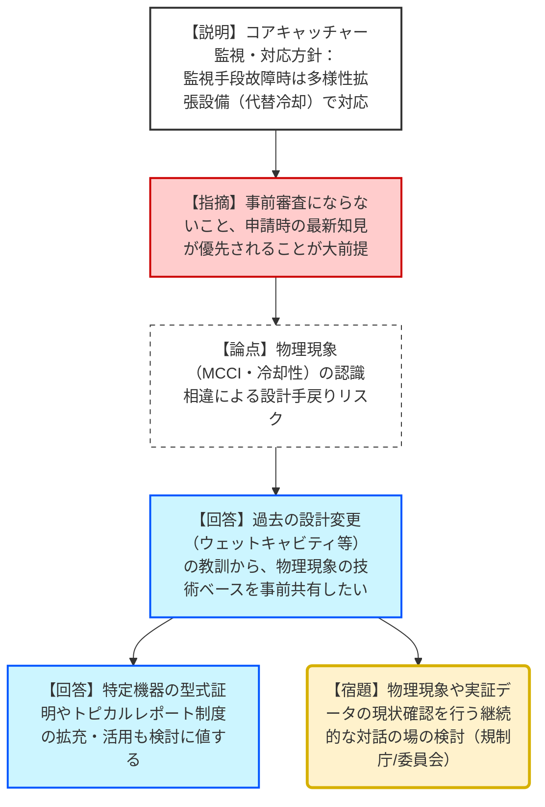
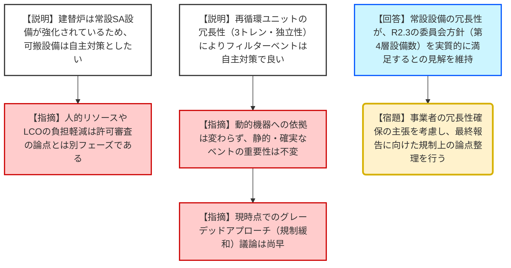

# 第7回建替原子炉の設計に関する事業者との実務レベルの技術的意見交換会（令和8年1月15日）
> 出典 : https://youtube.com/live/ZxXTnr2rrDE?si=5dbXOtwnlUrzDmy3

# 会合の概要
* **コアキャッチャー導入における認識共有の緊要性:** 事業者側は、ドライ型コアキャッチャーのような新技術導入において、物理現象（MCCIや溶融炉心の広がり挙動等）の解釈の相違が審査終盤で露呈し、大規模な「設計手戻り」が発生することを極めて強く懸念。事前審査にならない範囲での、技術ベース・知識ベースの継続的なすり合わせを要望した。
* **可搬型設備の規制上の位置付けを巡る相違:** 事業者は、常設SA設備の信頼性向上を根拠に、可搬型設備を「自主対策設備」とすることを主張。対して規制庁側は、LCO（運転上の制限）等の後段の負担軽減を理由とした設備登録の回避については、許可段階の議論とはフェーズが異なると指摘し、議論を切り分ける姿勢を示した。
* **フィルターベントの必須性とグレーデッドアプローチ:** 事業者は再循環ユニットの冗長性強化を理由に、フィルターベントを「自主対策」とし、規制の程度を下げる（グレーデッドアプローチ）を求めたが、規制庁側は「フィルターベントは特重段階で欠かすことができない重要な設備」との委員会の立場を再確認し、現時点でのグレード緩和議論は尚早であると一蹴した。

---

# 議題ごとの詳細整理

## 【議題1】溶融炉心対策への新技術導入（コアキャッチャーの導入）（論点3）
* **議論の背景と論点:** 革新軽水炉（SRZ-1200）に導入されるドライ型コアキャッチャーについて、溶融炉心の挙動や冷却の不確かさをどう検知・対応するか、および新技術特有の審査リスクをどう低減するかが争点。
* **質疑応答（詳細）:**
    * 【説明者側】: 溶融炉心の移行プロセス（RV破損→RVピット→メルト通路→拡散層）を温度計やリミットスイッチで状態監視する。監視手段が故障した場合は、代替冷却手段（代替CVスプレーポンプ等）による多様性拡張設備で対応する方針を提示。
    * 【規制側（田尻）】: 不確かな事象が発生した場合でも、代替冷却手段を設けることで対策ができるという説明と理解してよいか。
    * 【説明者側】: その通り。左側のSA設備が機能することを前提とするが、不足の事態には代替手段を確保する。
    * 【説明者側（丸山・池田）】: 物理現象（溶融炉心が本当に広がるのか、水で冷えるのか）の解釈が審査中に論点化し、コアキャッチャーや格納容器底部の構造変更が必要になると、耐震評価も含め甚大な手戻りとなる。最新知見の範囲で「何が分かっていて、何が不確かなのか」の現状確認を、申請前に継続して議論したい。
    * 【規制側（田尻・星）】: 意見交換が将来の審査内容を確約・担保するものではないことは大前提。申請時の最新知見に基づく審査は不可避。ただし、現在の技術到達点（ステート・オブ・ザ・アート）や不確かさの範囲を確認するという趣旨であれば理解した。
* **結論と宿題事項（アクションアイテム）:**
    * 事業者は標準設計の段階で可能な限り技術ベースを規制側と揃え、設計に反映させる方針。
    * **【宿題】**: コアキャッチャーの物理現象や実証データ等の専門的な確認を継続する場の設置について、規制庁内で検討し、原子力規制委員会に諮る。

## 【議題2】令和7年度第40回原子力規制委員会での委員コメントを踏まえた事業者見解
* **議論の背景と論点:** 2025年11月の規制委員会で指摘された「可搬型設備の取扱い」「フィルターベントの規制上の位置付け」等に対する事業者の事実確認と見解の整理。
* **質疑応答（詳細）:**
    * **【論点1：可搬型設備の取扱い】**
        * 【説明者側】: 常設SA設備を完備する建替炉では、可搬型設備は「自主対策」に位置付けたい。SA設備として登録すると、LCO設定や型式変更のたびの許認可申請、人的リソースの過大な配分が運用上の課題となる。
        * 【規制側（田尻）】: LCOの議論は保安規定（後段の規制）の話。許可段階の設備登録の要否とはフェーズが異なる。委員会で議論するための「事業者が何を懸念しているか」の意図は把握した。
    * **【論点2：フィルターベントの取扱い】**
        * 【説明者側】: CV再循環ユニットのトレン数を増やし、DB/SA兼用の独立性を確保することで、第4層の対策設備数は実質的に満足している。したがって、動的機器（電源・ポンプ）がAPC等に対しても信頼性を有していることを前提に、フィルターベントへの規制はグレーデッドアプローチ（緩和）を検討してほしい。
        * 【規制側（岡本）】: 冗長性の向上は認めるが、動的機器に依存する対策である事実は変わらない。不確実性が大きい領域に対し、静的・確実なフィルターベントを求める委員会の立場は昨年11月にも再確認されており、現時点でグレードを下げる議論は不適切。
* **結論と宿題事項（アクションアイテム）:**
    * 建替炉における深層防護の各層の設備構成案について、事業者の主張（冗長性の強化）は理解された。
    * **【宿題】**: 規制庁は、今回提示された「常設設備による冗長性確保」が規制委員会の方針（第4層の設備数等）を実質的に満足するかどうか、規制上の論点として整理し、最終報告に向けて検討を進める。

---

# 論理構造の可視化（Mermaid）

## 議題1：コアキャッチャー新技術導入と継続議論の構造

## 議題2：規制委員会コメントに対する見解（可搬・ベント）

