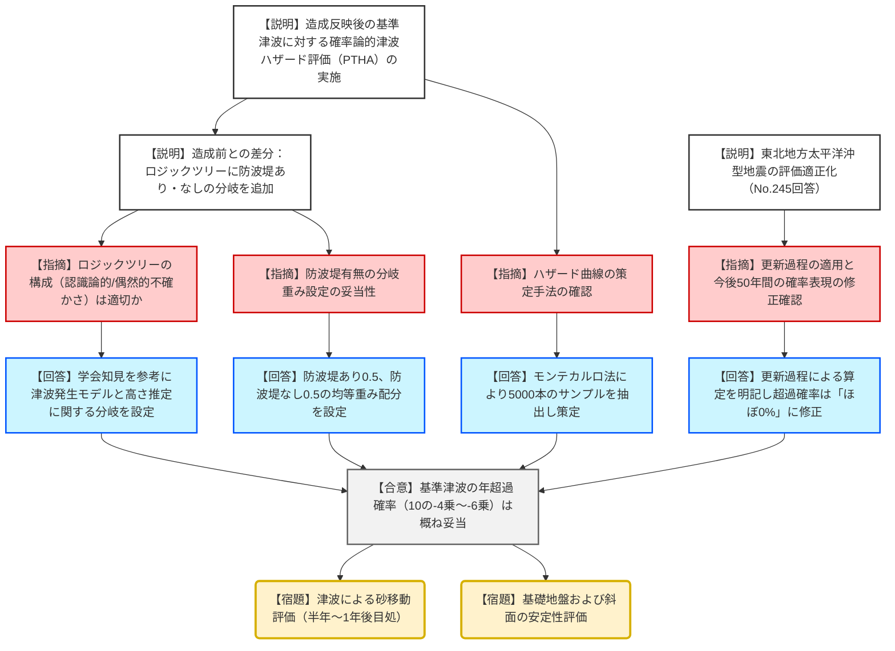
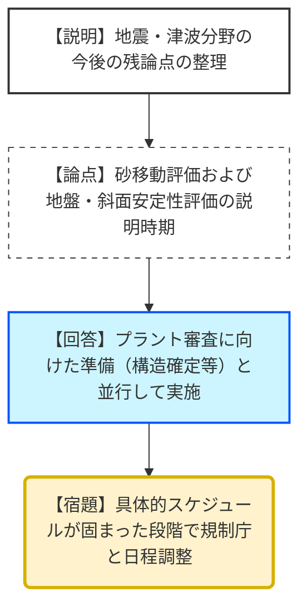

# 第1383回原子力発電所の新規制基準適合性（令和8年1月16日）
> 出典 : https://youtube.com/live/rIc2rS_b7cQ?si=rt6-ow_CX2JCDoyZ

# 会合の概要
* **基準津波の年超過確率の妥当性判断:** 東通1号炉の敷地造成を反映した基準津波について、その発生頻度を示す「年超過確率」の評価手法および結果が概ね妥当であると合意された。
* **ロジックツリーへの新条件追加:** 敷地造成前との主要な差分として、基準津波ごとに防波堤の状態が異なることを考慮し、ロジックツリーに「防波堤の有無（あり・なし）」の分岐が追加され、重み付けが適切に設定されていることが確認された。
* **東北地方太平洋沖型地震の評価修正:** 前回の指摘を踏まえ、2011年3月11日の地震を起点とした「更新過程」による評価であることを明文化し、今後50年間の超過確率を「ほぼ0%」とする表現の適正化が図られた。
* **残された地質・土木課題:** 今後の審査対象として「津波による砂移動評価」「基礎地盤・斜面の安定性評価」が特定された。これらはプラント審査の準備状況と合わせ、半年から1年後を目処に説明される見通しとなった。

---

# 議題ごとの詳細整理

## 【議題1】東通原子力発電所1号炉の敷地造成を反映した津波評価について
### 議論の背景と論点
本議題は、令和7年11月7日の審査会合で策定された「敷地造成反映後の基準津波」に対し、確率論的津波ハザード評価（PTHA）を実施し、それぞれの基準津波がどの程度の頻度で発生し得るか（年超過確率）を確認するものである。技術的な争点は、敷地造成に伴う防波堤条件の変化がロジックツリーに適切に反映されているか、および過去の地震知見（更新過程）の扱いが妥当かという点であった。

### 質疑応答（詳細）
* **【説明者側（鈴木氏）】からの説明**
    * 日本原子力学会、土木学会、および3.11地震の知見に基づき確率論的津波ハザード評価を実施。
    * 再評価した基準津波ごとに防波堤条件が異なるため、ロジックツリーに「防波堤あり」「防波堤なし」の分岐を新たに設定した。
    * 水位上昇側1（防波堤なし）の年超過確率は10の-5乗程度。
    * 新たに策定した水位上昇側2（防波堤なし）は10の-5乗〜-6乗程度、水位上昇側3（防波堤あり）は10の-5乗程度。
    * 水位下降側1および2（防波堤なし）は10の-4乗〜-5乗程度であり、造成前から大きな変更はない。
    * 前回コメント（No.245）への回答として、東北地方太平洋沖型の地震について、ポアソン過程ではなく「更新過程」を用いている旨を明記。
    * 今後50年間の超過確率は、地震調査研究推進本部の評価に合わせ「ほぼ0%」という表現に修正した。
* **【規制側（武田氏）】の確認・指摘点**
    * 令和6年4月の指摘事項（ポアソン過程を基本としつつ東北地方太平洋沖型には更新過程を適用すること、および確率表記の適正化）の反映状況の確認。
    * 評価フローにおいて、学会等の知見に基づき年超過確率が算定されていることを確認。
    * 敷地造成前との差分である「防波堤あり・なし」の分岐設定方針の妥当性を確認。
    * ロジックツリーの構成において、認識論的不確かさ（津波発生モデル）と偶然的不確かさ（津波高さ推定）が適切に考慮されているかの確認。
    * 分岐の重み設定について、防波堤有無の分岐にそれぞれ「0.5：0.5」の均等な重み配分としていることの確認。
    * 津波ハザード曲線の策定において、モンテカルロ法を用いて5000本のサンプルを抽出している手法の妥当性の確認。
* **【説明者側（鈴木氏）】の回答・根拠**
    * 指摘の通り、ロジックツリーの分岐、重み付け、サンプリング手法ともに従来の手法を踏襲しつつ、敷地条件の変更を適切に反映させている。
* **【規制側（武田氏）】の再反論や確認事項**
    * 年超過確率の策定については、適切に問題なく行われていると判断した。
* **【説明者側（伊塚氏）】からの補足説明**
    * 残された課題である「砂移動評価」「基礎地盤・斜面の安定性評価」については、プラント審査の準備状況を踏まえ、半年から1年程度かけて準備を進め、適切な時期に相談したい。

### 結論と宿題事項（アクションアイテム）
* **結論:**
    * 敷地造成を反映した基準津波の年超過確率の評価結果については、おおむね妥当な検討がなされたものと評価された。
* **宿題事項（今後の審査対象）:**
    * **【宿題】**: 津波による補給冷却取水設備の「砂移動評価」。
    * **【宿題】**: 「基礎地盤および斜面の安定性評価」。
    * 上記2点について、東北電力は半年から1年後の説明を目指し、プラント審査全体の進捗を考慮して具体的なスケジュールを規制庁と調整すること。

---

# 論理構造の可視化（Mermaid）

## 議題1：基準津波の年超過確率評価

## 議題2：今後の審査スケジュール確認

