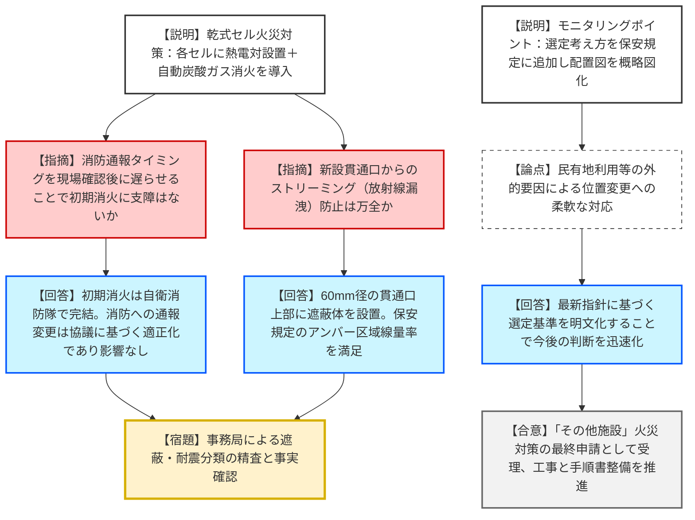
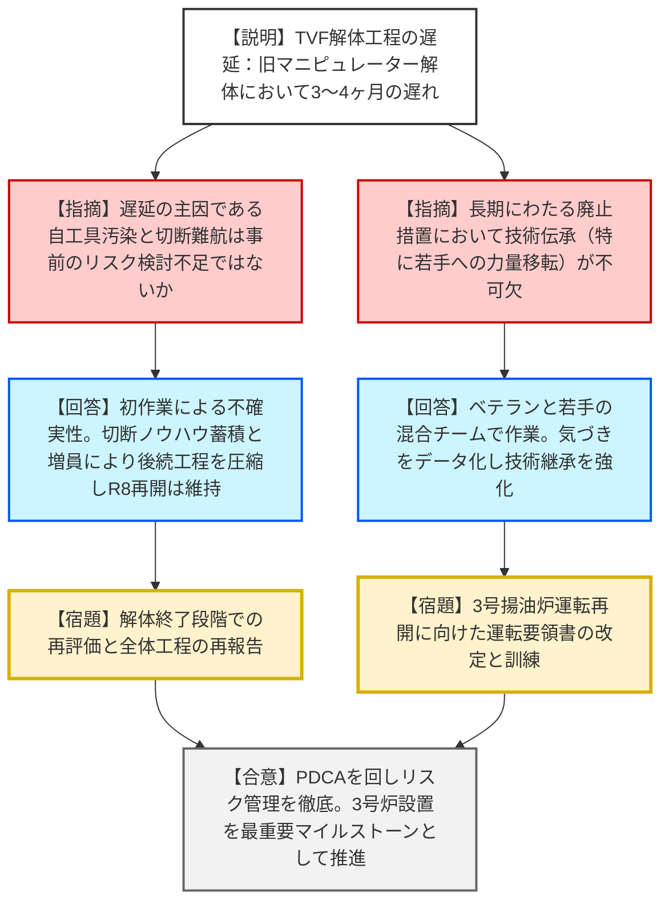

# 第82回東海再処理施設安全監視チーム（令和8年1月16日）
> 出典 : https://youtube.com/live/Miqvj6fdqbI?si=fzI5G7lVqXVabox2

# 会合の概要
* **火災防護対策の最終段階への移行:** 「ハル貯蔵庫」や「汚染機器類貯蔵庫」等の乾式セルにおいて、従来の検知・消火手法では対応に時間を要していた課題を解決するため、自動検知・自動消火（炭酸ガス）設備の設置が申請された。「その他施設」における火災対策の工事申請としては、今回が最後となる。
* **TVF解体作業における想定外の遅延:** ガラス固化技術開発施設（TVF）にて、旧パワーマニピュレーターの遠隔解体作業が想定より3〜4ヶ月遅延していることが報告された。原因は治工具の汚染度上昇と機器構造の複雑さにあり、規制側からは工程遅延を繰り返さないためのPDCAとリスク管理の徹底が厳しく求められた。
* **技術継承と若手育成への懸念:** 廃止措置が長期にわたる中、過去の溶融炉交換経験者が減少している現状を指摘。現場作業におけるベテランと若手の連携、およびノウハウの確実なデータ蓄積・伝承が、令和8年度第3四半期の運転再開（3号揚油炉）に向けた不可欠な要素として強調された。
* **モニタリングポイント設置基準の明確化:** 敷地外（民有地等）にあるモニタリングポイントの位置変更が円滑に行えるよう、設置場所選定の考え方を保安規定に追加し、規制要求の判断基準を透明化した。

---

# 議題ごとの詳細整理

## (1) 東海再処理施設の廃止措置計画変更認可申請等
* **議論の背景と論点:** 高放射性固体廃棄物貯蔵庫（ハス）内の乾式セルにおいて、火災発生時の特定および初期消火を迅速化するための設備更新が焦点。また、自動火災報知設備作動時の消防通報タイミングの変更（現場確認後の通報）の妥当性が問われた。
* **質疑応答（詳細）:**
    * 【説明者側（JAEA）】: 汚染機器類貯蔵庫は7セル共通の排気ダクトで検知していたため特定に時間を要していた。各セルに熱電対を新設し、火災を自動検知した上で、ダンパー閉止と炭酸ガス噴射を自動で行うシステムを導入する。
    * 【規制側（上野審査官）】: 炭酸ガスの供給量算出根拠は適切か。また、新設配管のための貫通口における遮蔽設計の妥当性を確認したい。
    * 【説明者側（JAEA）】: 炭酸ガス量は消防法施行令に基づき、最大容積のセル（R030）に合わせて算出。貫通口は60mmと小さく、遮蔽体を設置することでアンバー区域（管理区域）の線量率を十分下回る設計とした。
    * 【規制側（真田審査官）】: 消防への通報タイミングを「現場確認後」に変更するとのことだが、初期消火活動に悪影響はないか。
    * 【説明者側（JAEA）】: 火災影響評価では自衛消防隊等による初期消火時間を評価しており、公設消防の活動時間は参考情報である。この変更は公設消防側との協議に基づく「適正化」であり、消火の有効性に影響はない。
    * 【規制側（上野審査官）】: モニタリングポイントの位置変更について、保安規定に選定の考え方を追加する意図は。
    * 【説明者側（JAEA）】: 民間地の利用など外的要因で今後も変更の可能性がある。最新の指針を満足する選定基準を保安規定に明記することで、今後の許認可判断を迅速化させるため。
* **結論と宿題事項（アクションアイテム）:**
    * 申請内容がこれまでの監視会合での議論を網羅していることを確認。
    * **【結論】**: 火災対策のハード・ソフト両面での整備を進め、認可後に着実に工事を実施する。
    * **【宿題】**: 事務局にて、遮蔽計算条件や耐震分類の詳細について事実確認を継続する。

## (2) ガラス固化処理に向けた準備状況
* **議論の背景と論点:** TVF（ガラス固化技術開発施設）の3号溶融炉設置に向けた固化セル内の解体作業の進捗状況。解体作業の遅延が令和8年度の再開スケジュールに与える影響が論点となった。
* **質疑応答（詳細）:**
    * 【説明者側（JAEA）】: 旧パワーマニピュレーター等の遠隔解体において、治工具の汚染が想定を超え、除染セルでの手解体からセル内遠隔解体へ物量がシフトした。また、切断箇所が溶融して硬化するなど、作業に難航し3〜4ヶ月遅延している。
    * 【規制側（山口管理官）】: 遅延の原因から得られた教訓をどう対策に反映するか。不確実さを考慮した適切な計画策定が必要だ。
    * 【説明者側（JAEA）】: 初めての作業であり定量評価が難しかったが、切断の順番や位置調整のノウハウが蓄積されてきた。作業員を増員し、力量向上を図っている。付帯配管の取付工程を精査・短縮し、令和8年度第3四半期の運転開始予定は維持する。
    * 【規制側（小島部長・佐野田審査官）】: 作業員と監視員の連携状況は確認したが、長期間のプロジェクトであるため技術伝承が不可欠。特に若手へのノウハウ継承を意識して進めるべき。PDCAを回し、二度と同じ遅延を繰り返さないように。
* **結論と宿題事項（アクションアイテム）:**
    * **【合意】**: 現時点での運転再開予定（R8 第3四半期）に変更はないが、解体終了後に改めて全体工程を精査し報告すること。
    * **【宿題】**: 溶融炉設置に向けた運転要領書の改定および、モックアップ試験結果に基づく管理基準のフィックスを計画的に進めること。

---

# 論理構造の可視化（Mermaid）

## 議題1：火災防護対策および保安規定変更

## 議題2：ガラス固化処理（TVF）の準備状況

