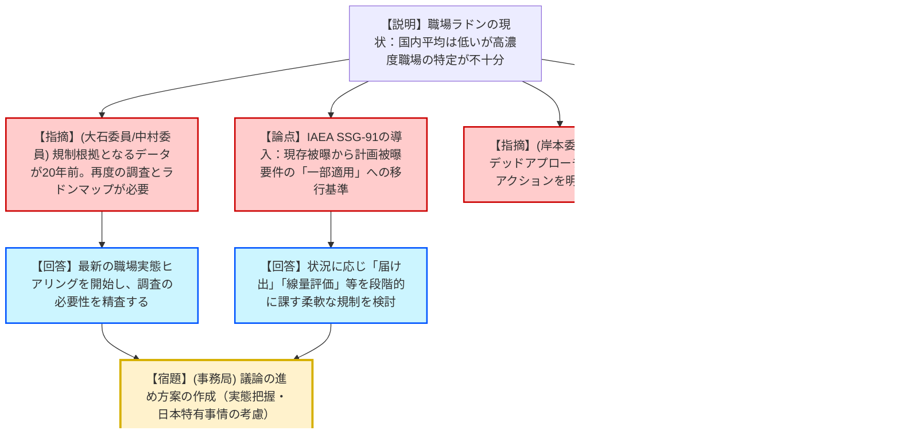

# 第169回放射線審議会総会（令和8年1月19日）
> 出典 : https://youtube.com/live/xpvi0vb3Ts4?si=X_xV6UonLIAQyUgt

# 会合の概要
* **航空機乗務員の防護指針改定:** 平成18年策定のガイドラインを20年ぶりに改定。国際基準（ICRP/IAEA）との整合を図りつつ、あくまで「規制」ではなく事業者の「自主的取り組みの目安」として年間5mSvの参考レベルを導入し、妊娠中の乗務員への追加管理（1mSv）を新たに盛り込んだ。
* **自然起源放射性物質（NORM）防護の社会実装:** 昨年取りまとめたNORM報告書の周知状況を報告。国際シンポジウム（ICRPアブダビ）での発信が各国の高い関心を集めたことや、現場実態把握のためのヒアリング調査の開始が示された。
* **職場ラドン防護への着手:** 今後の最重要課題として「職場環境におけるラドン」を議論。IAEAの最新指針（SSG-91）に基づき、参考レベル超過時に「計画被曝状況」の要件を段階的に適用する柔軟な規制アプローチの検討を開始した。
* **科学的根拠と実情の乖離への懸念:** 国内のラドン濃度データが20年前の大規模調査に留まっていることや、温泉文化といった日本独自の背景をどう考慮するか、最新の知見（線量換算係数の2倍化議論等）をどう反映させるかが技術的な争点となった。

---

# 議題ごとの詳細整理

## 【議題1】航空機乗務員等の宇宙放射線防護検討部会の中間取りまとめについて
* **議論の背景と論点:** 宇宙放射線被曝は「現存被曝状況」であり職業被曝に分類されるが、高度や太陽活動に依存するため制御が難しく、法令規制には馴染まない。国際的な防護体系（参考レベルの概念）を日本の航空業界にどう適用し、乗務員の不安を払拭するかが論点。
* **質疑応答（詳細）:**
    * 【説明者側（松田部会長・事務局）】: 年間5mSvの参考レベルを維持しつつ、妊娠申告後の胎児への1mSv制限を新設する。線量評価は計算ツール（JISCARD等）を基本とし、記録保存期間は「一般健康診断記録（5年）」等を例示する。パブリックコメントを1〜2月に実施予定。
    * 【規制側（吉田委員）】: 先に策定したNORM報告書では「参考レベル」「推奨値」「自主的管理指標」の3層フレームワークを提示している。本ガイドラインでも「参考レベルとしての5mSvを審議会として推奨する」という主語を明確にし、ターミノロジー（用語法）の整合性を取らないと現場が混乱する。
    * 【説明者側（松田部会長）】: 業界からは「管理目標値」か「基準値」かという議論があったが、国際的に「コントロールレベル」とされているため「参考レベル」を採用した。審議会としての推奨であることを明文化する方向で検討する。
    * 【規制側（横山委員）】: 不安払拭のための教育が重要。事業者から具体的な不安の声はあったか。
    * 【説明者側（事務局）】: 特段具体的な不安は届いていないが、改定後には定期航空協会等の業界団体で均一な教育教材を更新し、普及を図る。
    * 【規制側（栗原委員）】: 平成18年時点では計算精度に信頼性があるとしたが、最新の線量計による実測値との比較・再検証を継続的に行うべき。
    * 【規制側（大野委員）】: 格安航空（LCC）の増加やヘリコプター事業者など、事業態様の多様化に合わせた配慮が必要。
* **結論と宿題事項（アクションアイテム）:**
    * ガイドライン改定案のパブリックコメント実施を了承。
    * **【宿題】**: NORM報告書のフレームワークとの用語の整合性および「審議会による推奨」の明確化。
    * **【宿題】**: 最新の測定技術を用いた計算プログラムの正確性の再検証。

## 【議題2】自然起源放射性物質（NORM）に対する放射線防護の基本的考え方（対応状況）
* **議論の背景と論点:** 2025年11月に公表された報告書の周知・普及状況と、今後のヒアリング調査の計画。
* **質疑応答（詳細）:**
    * 【説明者側（事務局）】: 経産省・環境省・消費者庁を通じた周知依頼を実施。13の関連学会へ協力要請。ICRPシンポジウム（アブダビ）で長松企画官が日本のポリシーを発表し、高い関心を得た。
    * 【規制側（横山委員）】: 現場実態把握のヒアリング結果は審議会に報告されるか。
    * 【説明者側（事務局）】: 企業や自治体への調査結果を折に触れて報告する。
* **結論と宿題事項（アクションアイテム）:**
    * 現在の周知活動を継続し、現場での管理事例の蓄積を待つ。

## 【議題3】職場環境におけるラドンについて
* **議論の背景と論点:** 職場ラドンはNORM防護の「今後の課題」として残された領域。IAEAの最新安全指針（SSG-91）の受入れと、国内の高濃度職場（温泉、トンネル等）の実態把握の必要性が争点。
* **質疑応答（詳細）:**
    * 【説明者側（小平氏・荻野氏）】: 国内文献は17件、大規模調査は2006年が最後。IAEA SSG-91では、参考レベル（1000Bq/m3）超過時に「計画被曝状況の要件（届出・被曝評価等）」を段階的に適用するアプローチが示された。線量換算係数はICRP（約2倍に引き上げ）とUNSCEARで乖離があり、国際コンセンサスはない。
    * 【規制側（高田委員）】: オーストラリア等の例ではデータベース登録が義務か。
    * 【説明者側（小平氏）】: オーストリア等では測定データの国への報告・登録がシステム化されている。
    * 【規制側（吉田委員）】: 特定の職場（鉱山・温泉等）を参考レベルに関わらず「職業被曝」とみなすべきか、Pub 126の議論はどう扱われたか。
    * 【説明者側（荻野氏）】: SSG-91は2014年の要件（GSR Part3）の履行を優先したため、Pub 126の深掘りには至っていない。ただし「関連する要件の一部適用」という柔軟な枠組みが確保された。
    * 【規制側（岸本委員）】: 「グレーデッド（段階的）」や「インテグレーテッド（統合的）」アプローチが具体的に何を指すのか、事業者が迷わない指針が必要。
    * 【規制側（大石委員）】: 日本は屋内濃度は低いが、職場（洞窟・温泉）のデータ品質にはばらつきがある。規制の根拠となるラドンマップの整備が必要ではないか。
    * 【規制側（中村委員）】: 大規模調査が必要だが、高濃度エリアをどう抽出するかのコストと労力のバランスが課題。
* **結論と宿題事項（アクションアイテム）:**
    * 職場ラドン防護の基本的考え方の検討開始を確認。
    * **【宿題】**: 事務局にて、本日出された「実態把握の方法」「日本独自の温泉文化の扱い」「国際指針の段階的適用の具体化」を検討し、今後の議論の進め方案を作成する。

---

# 論理構造の可視化（Mermaid）

## 議題1：宇宙放射線防護（航空機乗務員）の論理構造

## 議題3：職場環境におけるラドンの論理構造

