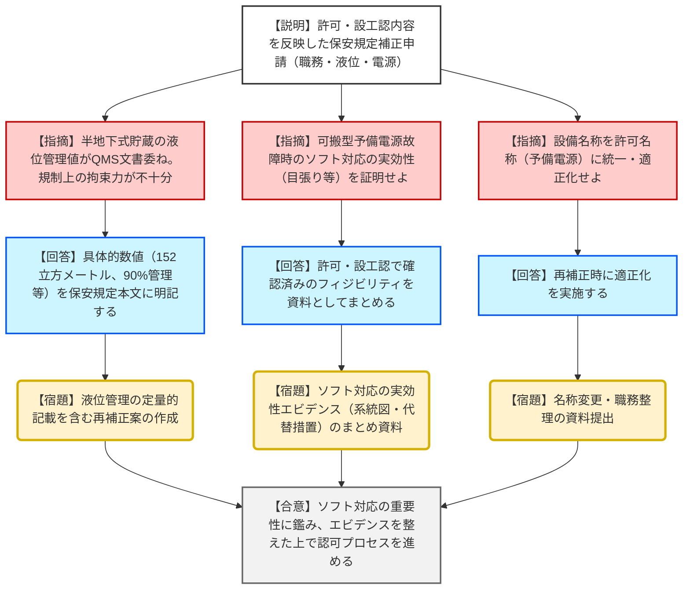
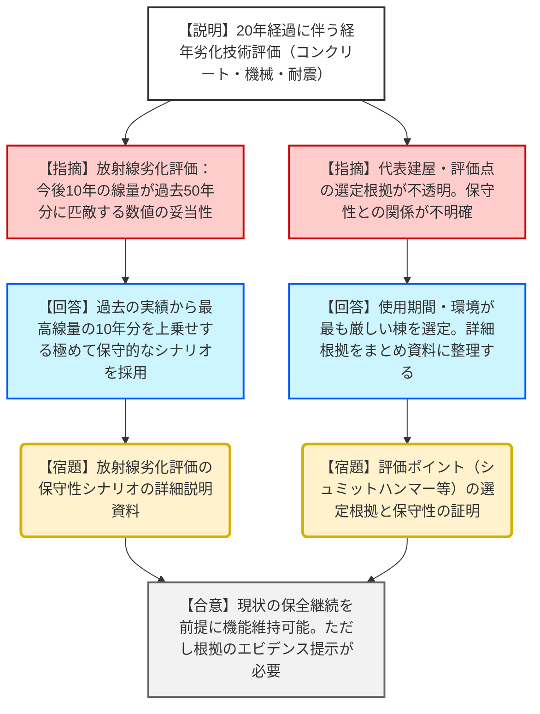

# 第567回核燃料施設等の新規制基準適合性に係る審査会合（令和8年1月19日）
> 出典 : https://youtube.com/live/S-_WsVvabRY?si=LdetCykkKG_j43ni

# 会合の概要
* **ソフト対策の実効性と規制上の位置付け:** 大洗廃棄物管理施設は、ハード面だけでなく運用管理（ソフト対応）を組み合わせることで安全性を確保する「合わせ技」の設計である。そのため、従来の下位規定（QMS文書）に委ねられていた管理値や手順を保安規定本文へ格上げし、規制上の拘束力を持たせることが最大の争点となった。
* **液位管理における定量的定義の要求:** 廃液貯留施設において、漏えい時に堰（石ピット）が機能するための液位制限を「QMS文書で定める」としたJAEAに対し、規制庁側は「具体的な数値（152立方メートル、90%管理等）を保安規定本文に明記せよ」と厳格に指示し、JAEAがこれを承諾した。
* **経年劣化評価の保守性への疑義:** 長期施設管理方針において、今後10年間の予測放射線量が過去50年分に匹敵する極めて高い数値として示された。これに対し、評価の前提となる廃棄物受け入れシナリオの保守性や、評価ポイント選定の妥当性をエビデンス（証拠資料）として明確に示すよう宿題が課された。
* **OWTFの切り離しと計画的申請:** 使用前事業者検査を受検中の固体廃棄物減容処理施設（OWTF）については、今回の補正から除外して別途申請する方針が確認され、全体の新規制基準対応の工程が整理された。

---

# 議題ごとの詳細整理（テキスト）

## 【議題1】日本原子力研究開発機構大洗原子力工学研究所の廃棄物管理施設の保安規定変更認可申請について（新規制基準適合）
* **議論の背景と論点:** 事業変更許可および設工認の審査完了を受け、これらを保安規定（運用ルール）に適切に反映できているか。特に「液位管理」や「予備電源」において、設備不足を補うソフト対策の「確実性」と「定量的根拠」が技術的争点となった。
* **質疑応答（詳細）:**
    * **【説明者側】:** 共通設備（通信連絡等）の保守管理職務を危機管理課長等へ追加。設工認と整合し、従来の実運用を明文化するものである。
    * **【規制側】:** 職務の追加に伴い、現行の保安措置に悪影響がないか確認したい。また、通信連絡設備は原子炉施設と共用であることを踏まえた整合性は取れているか。
    * **【説明者側】:** 原子炉施設との整合性を図るための変更であり、実運用に変更はないため悪影響はない。
    * **【規制側】:** 半地下式貯蔵槽の液位管理について、石ピット容量（152立方メートル）を超えない運用を「QMSに基づく文書で定める」としているが、それでは規制側が管理できない。定量的な敷居値を保安規定本文に定めるべきである。
    * **【説明者側】:** 90%管理（136立方メートル）等の運用は持っているが、具体的な数値を保安規定本文に記載することを検討・実施する。
    * **【規制側】:** 予備電源（可搬型発電機）の故障時の代替措置（目張りやモバイル計測等）について、許可・設工認で認めた「ソフト対応のフィージビリティ（実効性）」の証拠を、保安規定のまとめ資料として提出せよ。
    * **【説明者側】:** 系統図や代替措置の詳細を含め、実効性が担保されていることを示すまとめ資料を整備して提出する。
* **結論と宿題事項（アクションアイテム）:**
    * **結論:** 液位管理の具体的数値の保安規定への明記、および設備名称（予備電源）の適正化について合意された。
    * **【宿題】**: 職務変更、予備電源の給電先系統図、故障時の代替措置の実効性に関するエビデンスを整えた「まとめ資料」をヒアリングまでに提出すること。

## 【議題2】長期施設管理方針（経年劣化技術評価）
* **議論の背景と論点:** 事業開始から20年経過に伴い、今後10年間の経年劣化評価の妥当性を確認。コンクリートの塩害、中性化、放射線劣化、および機械設備の腐食評価において、代表機器の選定根拠と「保守性」の証明が焦点。
* **質疑応答（詳細）:**
    * **【規制側】:** 建屋評価において管理機械棟を代表とした理由は。また、評価ポイント（シュミットハンマーの測定点等）の選定根拠を具体的に示せ。
    * **【説明者側】:** 使用期間が最も長く、ライニングがなく蒸気が直接触れる等の過酷な環境にある管理機械棟を選定した。評価ポイントについても妥当性を資料に整理する。
    * **【規制側】:** 放射線劣化評価において、過去50年の蓄積量（5.9×10^6 Gy）に対し、今後10年で倍増（トータル1.1×10^7 Gy）すると予測されている。この線量評価の前提となる廃棄物受け入れ想定がどう「保守的」なのか説明せよ。
    * **【説明者側】:** 過去の受け入れ実績の中で線量率が特に高い10年間を抽出し、それを今後の10年間分として加算したため、極めて保守的な（厳しい）評価となっている。
    * **【規制側】:** 評価手法の説明だけでなく、実運用と評価方法の相関、およびそれによって担保される「保守性」が第三者にも明確に伝わるように資料を再構成せよ。
* **結論と宿題事項（アクションアイテム）:**
    * **結論:** 経年劣化による機能喪失を防止できるとする評価結果の方向性は確認されたが、その根拠となるデータの裏付けが求められた。
    * **【宿題】**: 評価点の考え方の妥当性（シュミットハンマー測定点等）、実運用と評価手法の保守性の関係を明確にした「まとめ資料」を作成し提出すること。

---

# 論理構造の可視化（Mermaid）

## 議題1：保安規定補正（新規制基準適合）

## 議題2：長期施設管理方針（経年劣化評価）

