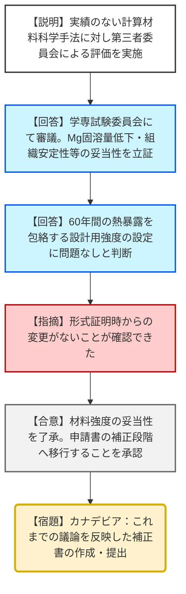
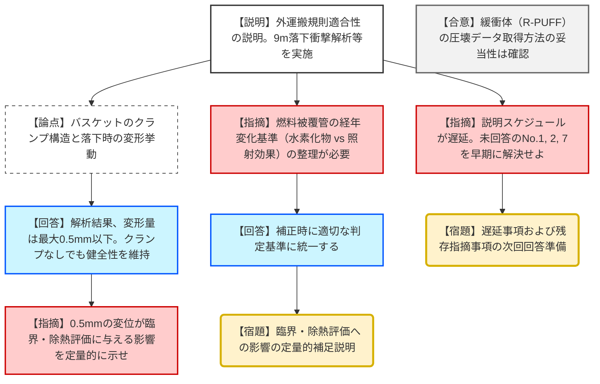

# 第39回特定兼用キャスクの設計の型式証明等に係る審査会合（令和8年1月20日）
> 出典 : https://youtube.com/live/wb5WvXo3ums?si=7f7jWaTC_B0apvBm

# 会合の概要
* **Hitz-P24型の立証完了と補正指示:** バスケットプレート用アルミニウム合金の設計用強度について、計算材料科学を用いた評価手法の妥当性を「学専（学術・専門）試験委員会」による第三者評価で立証。規制側はこれを了承し、型式指定に向けた最終的な補正準備を指示した。
* **Hitz-B69型の構造評価における定量性の要求:** 輸送時の9m落下衝撃において、バスケットの構成部材に最大0.5mm程度の変形・移動が生じる解析結果に対し、規制側は「臨界評価や除熱評価に与える影響」について、より具体的な定量データによる補足を求めた。
* **経年変化評価基準の不整合の指摘:** 使用済燃料被覆管の経年変化に関し、申請書内で「水素化物再配向の基準（300℃）」と「照射効果回復の基準」の複数が混在している点について、どちらを根拠とするのか論理的整理を要求した。
* **スケジュール遅延への厳しい指摘:** バスケット材料に関する回答等の説明が、前回提示されたスケジュールから遅延している状況について、規制側（水永氏）から遺憾の意が示され、迅速な準備が促された。

---

# 議題ごとの詳細整理

## (1) カナデビア（株）特定兼用キャスクの設計の型式指定について（Hitz-P24 型）
* **議論の背景と論点:** アルミニウム合金（HZA3004）の長期健全性を評価する際、計算コード（カルファット法等）を用いた手法に実績がなかったため、第三者による評価（委員会審議）の実施が求められていた。
* **質疑応答（詳細）:**
    * 【説明者側（樋口氏）】: 
        * 学識経験者による委員会（6月～12月）を設置。
        * マグネシウム（Mg）固溶量の低下、マンガン（Mn）系分散相の粗大化抑制、不純物元素の許容量制限、過時効熱処理条件を審議。
        * 60年間の設計貯蔵期間における強度低下を保守的に包絡した設計用強度の設定は妥当であるとの結論を得た。
    * 【規制側（松野氏）】: 
        * 審議項目の説明内容および考え方に問題がないことを確認した。
        * 長期健全性を考慮した設計用強度の妥当性に関し、形式証明時からの変更がないことを再確認できたため、追加コメントはない。
    * 【規制側（皆川氏）】: 
        * 指摘に対する回答は概ね確認できた。これまでの議論を踏まえた申請書の「補正」が必要な段階である。
    * 【説明者側（樋口氏）】: 
        * 補正に向けて適切に準備・対応する。
* **結論と宿題事項（アクションアイテム）:**
    * **【結論】**: アルミニウム合金の評価手法および設計用強度の妥当性を了承。
    * **【宿題】**: カナデビアは、本会合までの議論を反映した申請書の補正措置を迅速に実施すること。

## (2) カナデビア（株）特定兼用キャスクの設計の型式指定について（Hitz-B69 型）
* **議論の背景と論点:** 外運搬規則（輸送時の安全性）への適合性評価、および前回の指摘事項（構造、熱、密封、経年変化）に対する回答。特にバスケットの「クランプ構造」の評価上の位置付けが焦点。
* **質疑応答（詳細）:**
    * 【説明者側（濱田氏・説明担当）】: 
        * BM型輸送物として外運搬規則（第6条, 7条, 11条）に適合。
        * 落下衝撃時の構造解析（Abaqus使用）により、密封境界・水密境界の健全性を維持。
        * 経年変化（60年）を考慮した累積照射量や熱劣化評価も基準値以下。
    * 【規制側（松本氏）】: 
        * 燃料被覆管の経年変化について、資料では「水素化物再配向基準（300℃）」を用いているが、申請書には「照射効果回復の現象」も記載されている。どちらを評価基準とするのか整理せよ。
    * 【説明者側（岡田氏）】: 
        * 補正にて記載を見直し、適切に整理する。
    * 【説明者側（篠原氏）】: 
        * バスケットのクランプ構造について、9m落下時の挙動を解析。
        * クランプが塑性変形、あるいはクランプがない場合でも、変形は本体胴（キャスク内面）で抑制され、隙間変化は0.5mm以下に留まる。
        * 中性子吸収材の脱落はなく、伝熱パスも維持されるため、クランプを構造強度部材としない評価は妥当である。
    * 【規制側（松本氏）】: 
        * 解析により配置が維持されることは理解したが、0.5mmの変形・移動が「臨界評価」や「除熱評価」に与える影響の度合いについて、より具体的な定量感を持って補足説明せよ。
    * 【説明者側（岡田氏）】: 
        * 定量的影響について資料に反映するよう検討する。
    * 【規制側（水永氏）】: 
        * バスケット材料に関する回答が前回のスケジュール通りに進んでいない。
        * 未回答の指摘事項（No.1, 2, 7）および本日の外運搬に関する追加指摘について、しっかり準備して説明するように。
* **結論と宿題事項（アクションアイテム）:**
    * **【結論】**: 緩衝体（R-PUFF）の圧壊データ取得方法については了承。
    * **【宿題】**: 落下時のバスケット変形による臨界・除熱への影響に関する定量的データの提示。
    * **【宿題】**: 被覆管の経年変化評価における判定基準の整理。
    * **【宿題】**: 遅延している未回答事項（No.1, 2, 7および材料特性）の早期回答。

---

# 論理構造の可視化（Mermaid）

## Hitz-P24型：アルミニウム合金材料評価

## Hitz-B69型：外運搬適合性と構造解析

