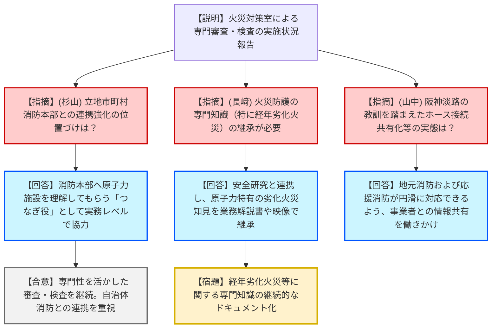
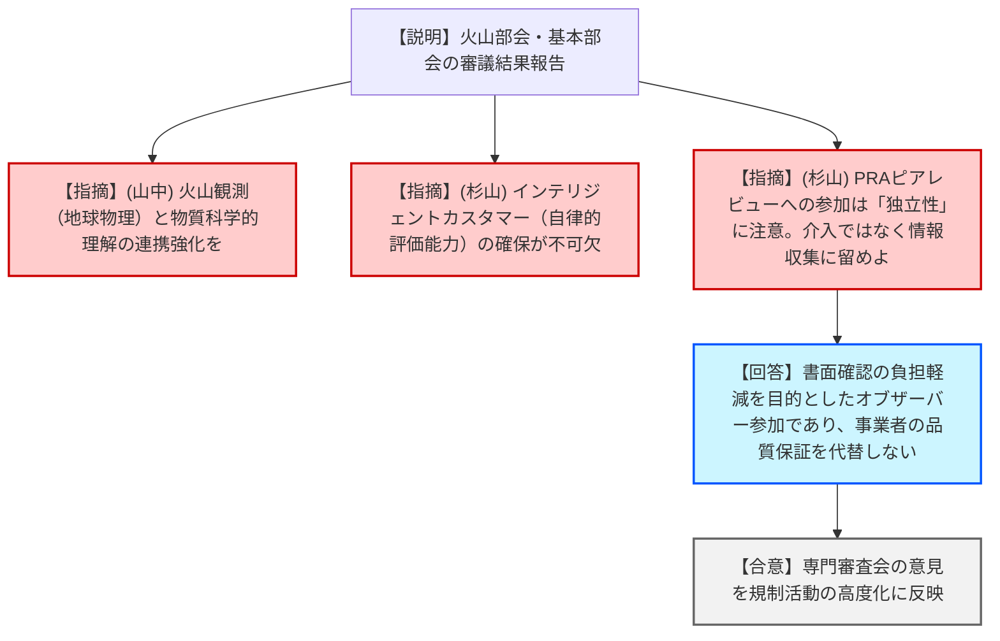
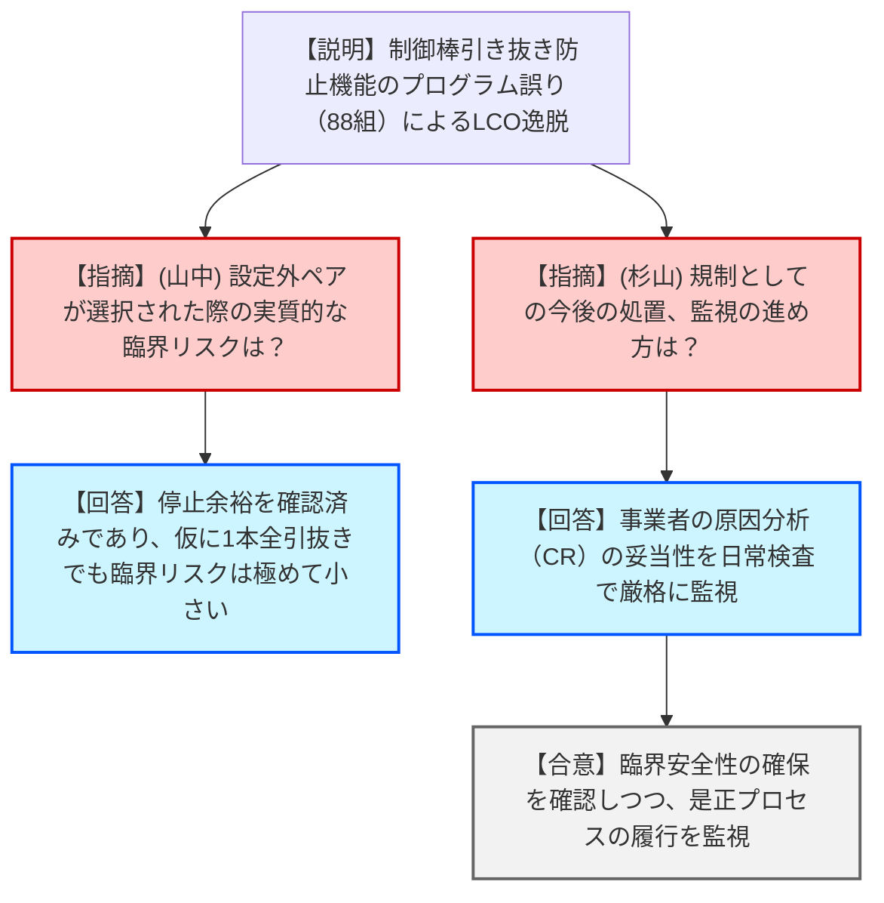

# 第52回原子力規制委員会（令和8年1月21日）
> 出典 : https://youtube.com/live/mhxYa6oupfo?si=ShGcXA1ast_MDkmv

# 会合の概要
*   **現場視点の火災防護の深化:** 消防庁等の出向者で構成される火災対策室が、消防法・建築基準法の専門的知見を原子力規制に注入。立地市町村消防本部との実務レベルでの協力関係構築や、原子力施設特有の「経年劣化火災」への安全研究を通じた対応が評価された。
*   **「インテリジェントカスタマー」としての規制当局:** 原子炉安全専門審査会において、外部知見を丸投げせず「自ら理解し評価する能力（インテリジェントカスタマー）」の重要性が再確認された。また、産業界のピアレビューへの関与については、規制が独立性を保つため「介入」ではなく「情報収集のためのオブザーバー」に徹すべきとの強い注意喚起がなされた。
*   **国際基準の技術中立性へのシフト:** IAEA安全基準委員会（CSS）において、SMR（小型モジュール炉）や先進炉を見据えた「テクノロジーニュートラル（技術中立性）」な立地評価基準や、レベル3 PRA（公衆リスク評価）の策定方針が示され、日本の規制への取り込みが今後の課題となった。
*   **柏崎刈羽6号機におけるプログラム不備への厳格な対応:** 制御棒引き抜き防止機能のプログラム設定誤り（88組の不備）によるLCO逸脱に対し、臨界リスクは極めて低いと判断しつつも、日常検査を通じて事業者の原因分析と是正措置を厳格に監視する方針が決定された。

---

# 議題ごとの詳細整理（テキスト）

## (1) 火災防護に係る審査・検査への対応状況
*   **議論の背景と論点:** 消防専門家による火災防護審査の実施状況と、規制庁内の知識継承、および立地自治体消防との連携の実態。
*   **質疑応答（詳細）:**
    *   **【説明者側（鳥枝室長）】**: 消防庁等からの出向者5名が、現場の実効性（自衛消防隊が動けるか等）を審査。原子力規制検査では系統分離や作動障害を確認。
    *   **【規制側（杉山委員）】**: 立地市町村の消防本部とのコミュニケーションは非常に重要。火災室の余力でやっているようだが、本庁として支援すべき活動ではないか。
    *   **【説明者側（鳥枝室長）】**: 消防本部は原子力以外（一般家庭等）も対応するため、原子力施設の中身を理解してもらう「間をつなぐ役割」として活動している。
    *   **【規制側（長﨑委員）】**: 経年劣化を考慮した火災防護の安全研究が始まっている。原子力施設特有の電気火災などの知識を、映像資料等も活用して確実に継承してほしい。
    *   **【説明者側（鳥枝室長）】**: 汎用的な工場火災データと、原子力特有の劣化要因を組み合わせて研究・対策を進めていく。
    *   **【規制側（山中委員長）】**: 阪神淡路大震災ではホース接続の不一致が問題となった。接続の共有化や地元消防との情報共有の現状は。
    *   **【説明者側（鳥枝室長）】**: 一義的には事業者と地元消防の連携だが、他地域からの応援がスムーズにいくよう、地元消防本部へも働きかけを行っている。
*   **結論と宿題事項（アクションアイテム）:**
    *   火災防護に関する専門知見の維持・継承に向けた「業務解説書」の作成・更新を継続。
    *   **【宿題】**: 原子力施設特有の経年劣化火災に関する知見の蓄積と、立地自治体消防との実務レベルの協力体制のさらなる強化。

## (2) 原子炉安全専門審査会及び核燃料安全専門審査会の審議結果報告
*   **議論の背景と論点:** 火山部会によるモニタリング評価の妥当性と、基本部会で指摘されたIRRSアクションプランへの対応。
*   **質疑応答（詳細）:**
    *   **【説明者側（片野氏）】**: 火山モニタリング（九電、原燃、RFS等）は適切と評価。また、階段ダイアグラムの標準的作成方法の知見を収集。
    *   **【規制側（山中委員長）】**: 地球物理学的観測（変動）と物質科学的理解（マグマの状態）の連携が、中長期的なモニタリング高度化に不可欠である。
    *   **【説明者側（田口氏）】**: 基本部会では、許認可制度の見直しや「インテリジェントカスタマー」の重要性、ドローン対策、AIの審査活用について審議。
    *   **【規制側（杉山委員）】**: 「インテリジェントカスタマー（外部知見を自ら評価する能力）」の視点は極めて重要。また、15ページの「産業界のピアレビューへの参加」という表現は危うい。ピアレビューは事業者の品質保証活動であり、規制が介入・検証するのではなく、あくまで「情報収集のためのオブザーバー」であるべきだ。
*   **結論と宿題事項（アクションアイテム）:**
    *   審議結果を了承。
    *   **【宿題】**: 規制側がインテリジェントカスタマーとして能力向上を図る体制の維持。

## (3) 国際原子力機関（IAEA）安全基準委員会（CSS）第58回会合結果概要
*   **議論の背景と論点:** SMR（小型モジュール炉）や核融合炉を見据えた国際基準の最新動向。
*   **質疑応答（詳細）:**
    *   **【説明者側（山田分析官）】**: 輸送物の経年変化管理（DS546）やレベル3 PSA（DS560）の新規策定が決定。SSR-1（立地評価）の改定では、核融合炉を直接のスコープからは外すが「有用である」との記述に留めた。
    *   **【規制側（山中委員長）】**: LTO（長期運転）に関する文書で「オブソレッセンス（設計の古さ）」について何か踏み込んだ議論はあったか。
    *   **【説明者側（山田分析官）】**: 今回はDPP（作成計画）段階のため、具体的な内容の詳細は今後の議論となる。
*   **結論と宿題事項（アクションアイテム）:**
    *   報告を受理。
    *   **【宿題】**: レベル3 PRA（公衆リスク評価）のガイドライン策定状況を注視し、国内規制への反映の要否を検討。

## 【トピックス】柏崎刈羽原子力発電所6号機におけるLCO逸脱
*   **議論の背景と論点:** 制御棒引き抜き防止機能の不備発覚。2万通りのうち88組の設定にプログラムミスがあった。
*   **質疑応答（詳細）:**
    *   **【説明者側（川崎室長）】**: 起動前試験中に警報が鳴らないことで発覚。ABWR特有のペアロッド認識プログラムに誤りがあった。現在は修正・全数確認済み。
    *   **【規制側（山中委員長）】**: 設定外の制御棒が駆動できる状態のリスクは。インターロックの有無は。
    *   **【説明者側（実用監視部門）】**: 停止余裕を事前に確認しており、万一1本引き抜いても臨界リスクは極めて小さい。物理的にもラッチやボールネジにより落下が防止されている。
    *   **【規制側（杉山委員）】**: 日常検査の中で是正プロセスを監視するのか。
    *   **【説明者側（実用監視部門）】**: 事業者のコンディションレポート（CR）および原因分析が適切か、日常検査で確認する。
*   **結論と宿題事項（アクションアイテム）:**
    *   **【合意】**: 臨界リスクが低いことを確認し、試験使用承認に向けた現地検査官の確認を継続。

---

# 論理構造の可視化（Mermaid）

## 議題1：火災防護の審査・検査対応

## 議題2：専門審査会（火山・基本）審議結果

## トピックス：柏崎刈羽6号機 LCO逸脱
