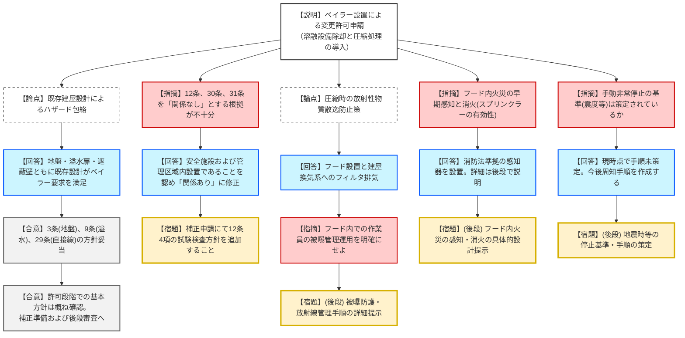

# 第1384回原子力発電所の新規制基準適合性に係る審査会合（令和8年1月22日）
> 出典 : https://youtube.com/live/z5pFv0z0d_Y?si=l-q1-WccCZgiTBHL

# 会合の概要
* **審査対象条文の再整理と基準適合性の明確化:** 前回会合で「関係なし」と整理されていた試験検査性（12条）や放射線管理（30条・31条）について、規制庁側の指摘を受け事業者が「関係あり」へと見直し、改めて設計方針を説明。基準要求の解釈の適正化が図られた。
* **既存設計による包絡の妥当性確認:** ベイラーを設置する「第2固体廃棄物処理建屋」の既存の地盤支持力、溢水防護（水密扉）、放射線遮蔽設計が、追加設備に対しても十分な余裕を持って機能することが確認された。
* **運用面・詳細設計への継続課題:** 圧縮処理を行う「フード内」での火災早期感知手法や、作業員の被曝管理手順、地震発生時の具体的な非常停止基準など、ソフト（運用）面を中心とした課題が詳細設計（設工認）段階での審査事項として特定された。
* **記載の整合性確保:** 添付書類と補足説明資料の間で生じていた避雷設備設置に関する不一致について、規制側の指摘により事業者が補正での修正を約束した。

---

# 議題ごとの詳細整理（テキスト）

## 【議題1】美浜発電所3号炉の設置変更許可申請（廃棄物圧縮処理装置の設置）に係る審査について

### 議論の背景と論点
美浜3号炉において、既設の溶融設備を除却し、新たに廃棄物を圧縮減容する「ベイラー」を設置するための変更許可申請。最大の論点は、ベイラー設置が既存の安全設計（地盤、溢水、遮蔽）に与える影響の有無と、前回会合で除外されていた条文に対する適合性の再整理である。

### 質疑応答（詳細）

#### 1. 既存設計方針による包絡（地盤・溢水・直接線防護）
* **【説明者側】からの説明**
    * **地盤（3条）:** Cクラス施設だが、Bクラスの支持力を有する既存建屋に設置するため変更なし。
    * **溢水（9条）:** ベイラーは油圧式だが、建屋間には水密扉があり、補助建屋の防護対象設備への影響はない。
    * **直接線（29条）:** 地上のドラム缶を地下へ移動するため、敷地境界外の線量評価は許可値に包絡される。
* **【規制側】の確認点**
    * 各条文に対し、具体的な許可の設計方針との対比による影響の有無を確認（藤川審査官）。
* **【結論】**
    * 既存方針から変更がないとの判断は妥当。追加指摘なし。

#### 2. 審査対象条文の見直し（試験検査性、放射線管理）
* **【説明者側】からの説明**
    * **試験検査性（12条4項）:** 安全施設に該当するため「関係あり」に変更。保全プログラムに基づき点検を実施する方針を補正で追加する。
    * **放射線管理（30条・31条）:** 管理区域内設置であり、頻繁に立ち入る箇所であるため「関係あり」に変更。既設の管理施設・モニタリング設備で対応可能。
* **【規制側】の懸念・指摘点**
    * 12条4項の適合方針が当初申請に欠落している。補正申請で明確化されるのか（藤川審査官）。
* **【説明者側】の回答・根拠**
    * 補正において設計方針を追加し、明確化する。

#### 3. 誤操作防止と環境条件（10条）
* **【説明者側】からの説明**
    * 余震や外部電源喪失時、ベイラーは自動停止または非常停止スイッチによる容易な停止が可能。
* **【規制側】の懸念・指摘点**
    * 手動停止について、どの程度の地震動で停止させるのか。基準を定めるのか現場判断か（金城審議官）。
* **【説明者側】の回答・根拠**
    * 具体的な手順は未策定。作業員への周知・手順化を検討し回答する。

#### 4. 廃棄物処理過程の散逸防止と火災防護（27条・8条）
* **【説明者側】からの説明**
    * ドラム缶投入口をフードで囲い、換気系フィルタを通して排気する設計により放射性物質の散逸を防止。
    * ベイラーは不燃・難燃材を使用。火災源は潤滑油だが、エリア全体で感知可能。
* **【規制側】の懸念・指摘点**
    * フード内で作業員が出入りする際の「被曝防護手順」を後段で説明せよ（宮崎審査官）。
    * フード内で火災が発生した場合、スプリンクラーの届かない「閉鎖空間」での早期感知・消火はどう担保するのか（杉山委員・藤原審査官）。
    * 避雷設備の有無について、添付書類と補足資料で整合が取れていない（藤原審査官）。
* **【説明者側】の回答・根拠**
    * 消防法に基づき2種類以上の感知器を設置。詳細は詳細設計（設工認）段階で整理する。
    * 避雷設備の不整合は補正で修正する。

### 結論と宿題事項（アクションアイテム）
* **結論:** 設置許可段階（デリバティブ）としての基本的な適合方針は確認された。今後、これまでの議論を反映した申請書の補正が必要。
* **宿題事項:**
    * **【宿題（補正反映）】**: 12条4項（試験検査性）の設計方針の追加。
    * **【宿題（補正反映）】**: 避雷設備に関する添付書類の整合性修正。
    * **【宿題（後段審査）】**: 地震時のベイラー停止判断基準および具体的運用の策定。
    * **【宿題（後段審査）】**: フード内作業時の放射線管理手順の詳細提示。
    * **【宿題（後段審査）】**: フード内火災の早期感知および消火（消火器活用等）の具体的な具体的設計・運用。

---

# 論理構造の可視化（Mermaid）

## 議題1：ベイラー設置に伴う基準規則適合性の整理

