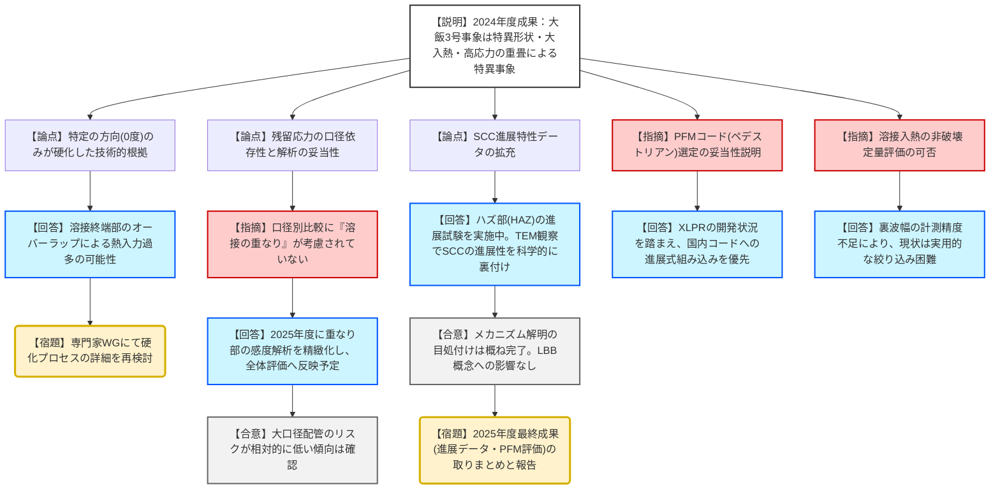

# 第27回新規制要件に関する事業者意見の聴取に係る会合（PWR1次系におけるステンレス鋼配管粒界割れ）（令和8年1月22日）
> 出典 : https://youtube.com/live/mheJXF9Xaxo?si=GN5MRFdlr4IpTD82

# 会合の概要
* **発生メカニズムの「目処付け」完了:** 大飯3号機で発生したステンレス鋼配管の粒界割れ（SCC）について、5カ年計画の4年目にあたる2024年度の検討により、発生・進展メカニズムの解明に一定の目処が立った。
* **大飯3号事象の「特異性」を立証:** 破壊調査やモックアップ検証、残留応力解析を組み合わせ、本事象が「管台エルボの拘束形状」「溶接時の過大入熱による特異な硬化（320HV超）」「内表面の高い引張応力」の3要素が相まって発生した「極めて稀なケース」であることを説明。
* **口径依存性とリスクの差別化:** 残留応力解析により、小口径（4B/6B）は内表面が引張傾向にあるが、大口径（12B/14B）は圧縮傾向にあり、SCCの発生・進展感受性が低いことを定量的に示した。
* **技術的課題の残存:** 溶接入熱を非破壊（超音波等）で精度良く定量評価する手法については、現状の技術では精度不足（数ミリ単位の誤差）により困難であるとの見通しが示された。
* **LBB概念の維持:** 本事象は特異的であり、水平展開検査（延べ1102箇所）でも有意な指示が未発見であることから、従来の「破断前漏えい（LBB）」概念に影響を与えるものではないとの見解で一致。

---

# 議題ごとの詳細整理

## (1) PWR 1次系におけるステンレス鋼配管粒界割れの知見拡充に関する2024年度の検討結果について
### 議論の背景と論点
2020年に大飯3号機で発見されたSCCに関し、アテナが主導して進めている「発生・進展メカニズムの解明」および「他プラントへの波及性（特異性の証明）」が技術的争点。具体的には、溶接条件（入熱量）が材料の硬さや残留応力にどう寄与したかの定量的立証が求められた。

### 質疑応答（詳細）

#### 1. 発生メカニズムの特定（硬さと入熱の関係）
* **【説明者側（アテナ）】**: 大飯3号機の形状・材料を模したモックアップで「初層大入熱・2層目以降小入熱」を再現した結果、実機相当の硬さ（最大327HV）が再現された。これにより、入熱管理の不備が効果の主因であると特定。
* **【規制側（小島部長）】**: 大飯3号の実機データでは、亀裂が発生した0度方向のみが突出して硬い（平均290HV超）。この特定方向のみが硬化した技術的理由は何か。
* **【説明者側（アテナ）】**: 溶接の終端部（オーバーラップ）であり、他の部位に比べて熱入力が重なりやすかったことが要因の一つと考えられるが、今後の専門家ワーキングでも議論を深める。

#### 2. 溶接残留応力の解析と妥当性
* **【説明者側（アテナ）】**: 解析の結果、小口径配管（4B/6B）は内面引張応力が高いが、大口径（12B/14B）は曲げ剛性の影響で内面が圧縮傾向になる。大口径におけるSCCリスクは極めて低い。
* **【規制側（勝山氏/鬼沢氏：JAEA）】**: 解析における入熱・拘束条件の妥当性を確認したい。特に「溶接ビードの重なり（ケース3）」が内部応力を高める結果が出ているが、口径別の比較ではこれが考慮されていないのではないか。
* **【説明者側（アテナ）】**: 口径別比較（資料3-19P）は熱源360度同時モデルであり重なりは未考慮。2025年度の検討で重なり部の影響を精緻化し、評価に反映する。

#### 3. SCC進展評価とPFM（確率論的破壊力学）の活用
* **【説明者側（アテナ）】**: 2025年度はJASME事例規格（50%包絡式）を用いたケーススタディを実施中。主亀裂先端のTEM（透過電子顕微鏡）観察でニッケル濃化を確認し、SCCとしての進展性を有していたことを裏付けた。
* **【規制側（佐々木審査官）】**: PFMコードの選定について。米国の「XLPR」ではなく、国内の「ペデストリアン（電中研コード）」を使用する理由は。
* **【説明者側（アテナ）】**: XLPRはステンレス鋼SCCの進展式組み込みが未完了であるため、国内コードに今回の進展速度式を組み込んで評価する方針とした。

#### 4. 溶接入熱の定量評価手法（山中委員長からの過去指摘への回答）
* **【規制側（河野審査官）】**: 溶接入熱を定量的に非破壊評価する手法の検討状況は。
* **【説明者側（アテナ）】**: 裏波（うらなみ）幅の非破壊計測を試みたが、通常の溶接と大入熱溶接の差が1〜2ミリ程度に対し、計測精度が追いつかず、絞り込みの手法としては困難であると判断した。

### 結論と宿題事項（アクションアイテム）
* **結論:** 2024年度までの検討により、大飯3号機事象の特異性とメカニズム解明は概ね完了。今年度の成果を技術情報検討会へ報告する。
* **宿題事項:**
    * **【宿題】**: 2025年度（最終年度）の検討（ハズ部の進展データ取得、PFMによる破断確率評価）の結果を来年度に報告すること。
    * **【宿題】**: 残留応力解析の精緻化（重なり部の考慮）および、評価に用いる運転時荷重の代表性の根拠提示（鬼沢氏指摘事項）。

---

# 論理構造の可視化（Mermaid）

## 議題1：流界割れ発生・進展メカニズムの知見拡充

