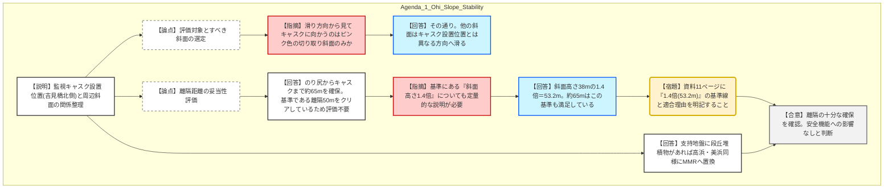

# 第1386回原子力発電所の新規制基準適合性に係る審査会合（令和8年1月23日）
> 出典 : https://youtube.com/live/iRppfd8bGvc?si=NRo-lflWuCXrRvF-

# 会合の概要
* **斜面崩壊影響の評価不要方針を了承:** 大飯3、4号機の乾式貯蔵施設設置にあたり、周辺斜面（切り取り斜面）から十分な離隔距離（約65m）を確保していることを確認。基準（50mおよび斜面高さの1.4倍）を満足しており、斜面崩壊によって監視キャスクの安全機能が損なわれる恐れがないという事業者の判断が妥当であると合意された。
* **説明性の向上（1.4H基準の明示）:** 規制庁側は、離隔距離が50mを超えているだけでなく、もう一つの評価基準である「斜面高さの1.4倍（53.2m）」に対しても十分な余裕があることを、数値および図面上で明記するよう要求した。
* **次なる課題:** 基準津波に関連し、日本海中南部の海域活断層の長期評価を反映した影響確認については、事業者の準備が整い次第、改めて審議することとなった。

---

# 議題ごとの詳細整理

## 【議題1】関西電力（株）大飯発電所３号炉及び４号炉の使用済燃料乾式貯蔵施設に係る周辺斜面の安定性評価について

### 議論の背景と論点
大飯発電所3、4号機において、吉見橋北側の地点に乾式貯蔵キャスク23基を設置する計画。前回の審査会合（令和7年4月29日）でキャスクの設置位置が1箇所に集約されたことを受け、当該位置が周辺の切り取り斜面崩壊の影響を物理的に受けない距離（離隔）にあるかを科学的・基準的に立証することが焦点となった。

### 質疑応答（詳細）

#### 1. 滑り方向と評価対象斜面の特定
* **【説明者側（関西電力）】の説明**
    * 監視キャスクの西側に斜面が位置。想定される3つの滑り方向のうち、キャスク設置位置に向かうのはピンク色でマーキングした「切り取り斜面」のみである。
* **【規制側（武田審査官）】の確認点**
    * 資料8ページの平面図・断面図に基づき、黄色および緑色のハッチング部分は滑り方向がキャスク位置を向いていないため、赤色（ピンク色）の切り取り斜面のみが評価対象になるという認識で相違ないか。
* **【説明者側（関西電力）】の回答・根拠**
    * その認識で相違ない。キャスクに向かってくる斜面はこの部分だけである。

#### 2. 離隔距離の妥当性と評価基準（50m vs 1.4H）
* **【説明者側（関西電力）】の説明**
    * 原子力技術基準（JEAG参考資料）における斜面崩壊土砂の到達距離基準（50mまたは斜面高さ1.4倍）に基づき確認。
    * 切り取り斜面ののり尻からキャスク設置位置までの距離は約65m。50m以上の離隔を確保しているため、斜面安定性評価は不要。
* **【規制側（武田審査官）】の懸念・指摘点**
    * 資料11ページにおいて、50m基準の適合は明確だが、もう一つの基準である「1.4倍（1.4H）」についても具体的な数値を出すべき。
    * 今回の斜面はEL58m（頂部）からEL20m（のり尻）であり、斜面高さ（H）は38m。その1.4倍は53.2mとなる。この「53.2m」という数値も資料に明示し、約65mの離隔がこれを上回ることを説明すべき。
* **【説明者側（関西電力）】の回答・根拠**
    * 50mを超えているため50mの方を基準として採用したが、指摘の趣旨（説明性の向上）を理解した。1.4倍（53.2m）の適合性についても整理して資料に追加する。

#### 3. 基礎地盤と置換処置
* **【説明者側（関西電力）】の説明**
    * 基礎地盤は輝緑岩・斑レイ岩（CL級）。造成（EL12m）の際に中位段丘堆積物が確認された場合は、高浜・美浜と同様にMMR（マンメイドロック）に置換する方針。

### 結論と宿題事項（アクションアイテム）
* **結論:**
    * 監視キャスクは斜面崩壊に対して十分な離隔を確保しており、安全機能は維持されると判断された。
    * 指摘された適正化（数値の追記）を前提に、検討内容は概ね妥当であると評価。
* **宿題事項:**
    * **【宿題】**: 資料11ページ等の図面に、斜面高さ1.4倍に相当する距離ライン（53.2m）を追記し、基準適合をより明確に示すこと。
    * **【継続審議】**: 海域活断層の長期評価に基づく基準津波への影響確認について、準備ができ次第説明を行うこと。

---

# 論理構造の可視化（Mermaid）

