# 第568回核燃料施設等の新規制基準適合性に係る審査会合（令和8年1月23日）
> 出典 : https://youtube.com/live/lGB08CpE5yI?si=yEG6k619Kd_WxwrR

# 会合の概要
* **軽水減速炉心の低濃縮化（LEU化）への移行:** 京都大学臨界実験装置（KUCA）において、高濃縮ウラン（HEU）から低濃縮ウラン（LEU）への燃料変更に伴う「炉心設計」の承認申請が主な議題となった。
* **解析手法の変更と評価結果の乖離:** 設置変更承認（基本設計）時の「決定論的手法」から、今回の設工認（詳細設計）での「モンテカルロ法（MCNP-6）」への変更に伴い、反応度温度係数が「正」から「負」に転じるなど結果に差が生じている。規制庁はこの妥当性と誤差評価の根拠を厳しく問うた。
* **代表炉心（25ケース）の選定と検査範囲の妥当性:** 25種類の代表炉心すべてに対して性能検査を行う計画に対し、規制側は「なぜ25ケースすべてが必要なのか」「一部の検査が任意の一炉心で済む根拠は何か」といった、合理的な検査範囲と設計妥当性の整理を求めた。
* **ハード設計（設工認）とソフト運用（保安規定）の境界整理:** 燃料取扱設備や計測設備において、ハード側の設備対策を不要とする根拠を、保安規定（運用）側でどう担保しているのか、その論理的連結を明確にするよう宿題が課された。

---

# 議題ごとの詳細整理（テキスト）

## 【議題1】京都大学臨界実験装置（ＫＵＣＡ）の変更に係る設計及び工事の計画の承認申請について

### 議論の背景と論点
KUCAのLEU化に向けた分割申請の第2回目（炉心の性能に関わる設計）。基本設計段階で認められた25の代表炉心に対し、詳細な核計算と熱的制限値の妥当性を確認することが焦点。特に、精密な解析コードへの変更が安全評価に与える影響と、使用前事業者検査の具体的手順が技術的な争点となった。

### 質疑応答（詳細）

#### 1. 反応度温度係数および最大反応度価値の解析妥当性
* **【規制側】の指摘:** 設置変更承認時（HEU）は一部「正」の値があった反応度温度係数が、今回の詳細解析ではすべて「負」となっている。解析コード変更（MCNP-6への移行）による結果の変化の妥当性と、30%程度とされる相対誤差の考慮方法を説明せよ（篠田審査官）。
* **【説明者側】の回答:** モンテカルロ法による詳細計算への移行が要因。妥当性については、計算誤差や判定基準への影響を含め、再確認した上で改めて説明する。
* **【規制側】の指摘:** 最大反応度価値を持つ制御棒が許可時から変わっている炉心がある。評価手法の変更による影響か。

#### 2. 代表炉心の選定根拠と検査の網羅性
* **【規制側】の指摘:** 25ケースすべてを総当たりで検査するとしているが、解析コードの信頼性を前提とした場合、これが「最小限必要な数」なのか。一方で、計測制御系統検査などを「任意の一炉心」とする妥当性の説明が不足している（宮脇審査官）。
* **【説明者側】の回答:** 25炉心はピッチや列数などスペクトル範囲を網羅するよう選定したもの。計測制御系は全炉心共通設備であるため一炉心で十分と考えているが、整理して回答する。
* **【規制側】の深掘り:** 検査数の一方は多く、一方は少なく感じる。解析と実測のバランスについて、論理的な仕分けを提示せよ（山中委員長）。

#### 3. 耐震性評価（第6条）の申請範囲
* **【説明者側】の説明:** 燃料要素は耐震部材ではないため対象外とし、支持フレームは許可時の評価に包含される（安全率6倍以上）ため、6条（地震）の説明は不要と判断した。
* **【規制側】の指摘:** 許可時の設計方針を受け、詳細設計を確認するのが設工認である。重量増加（LEU化）がある以上、手続き上、支持フレームの耐震性（6条）は審査事項に含まれるべきである（篠田審査官）。
* **【説明者側】の回答:** 許可との連続性・整合性の観点から、記載漏れを検討し反映する。

#### 4. 運用管理による設備対策の代替（第25条・第30条）
* **【規制側】の指摘:** 燃料取扱設備（25条）や計測設備（30条）において「設備対応不要」とする根拠として、保安規定（運用）側で何を制限し、どう担保するのか。ハード（スペック）とソフト（運用記録等）のセットでの説明が必要（内藤管理官）。
* **【説明者側】の回答:** 燃料取扱枚数の制限や、安全委員会による都度の審査プロセスを指している。設計仕様と運用の関係を再整理する。

### 結論と宿題事項（アクションアイテム）
* **結論:** 申請内容の事実確認段階であり、提示された解析手法や検査手順について、多くの論理的整理が必要であることが確認された。
* **宿題事項:**
    1.  **【宿題】**: 解析コード変更（MCNP-6）に伴う評価結果（正→負の係数変化等）の妥当性および不確かさの定量的説明。
    2.  **【宿題】**: 25の代表炉心における検査項目の必要数（総当たり vs 任意抽出）の論理的根拠の提示。
    3.  **【宿題】**: 支持フレームの耐震性評価（6条適合性）の申請書への反映。
    4.  **【宿題】**: ハード設備対策を不要とするための、保安規定（ソフト）側の具体的な制限値・プロセスの明確化。

---

# 論理構造の可視化（Mermaid）

```mermaid
graph TD
    classDef explanation fill:#ffffff,stroke:#333,stroke-width:2px;
    classDef point fill:#ffcccc,stroke:#cc0000,stroke-width:2px;
    classDef issue fill:#ffffff,stroke:#333,stroke-dasharray: 5 5;
    classDef answer fill:#ccf5ff,stroke:#0055ff,stroke-width:2px;
    classDef homework fill:#fff2cc,stroke:#d6b000,stroke-width:3px;
    classDef agreement fill:#f2f2f2,stroke:#666,stroke-width:2px;

    P1["【説明】軽水減速炉心の低濃縮化（LEU化）に伴う詳細設計（設工認）申請"]
    
    %% 解析手法の論点
    P1 --> L1["【論点】解析手法の変更（決定論的→MCNP6）と安全評価の連続性"]
    L1 --> Q1["【指摘】温度係数が正から負に変化している。解析の妥当性と誤差評価を示せ"]
    Q1 --> A1["【回答】詳細計算への移行による結果。誤差の判定基準への考慮方法を再整理する"]
    A1 --> S1("【宿題】新コードによる解析結果の妥当性裏付け")

    %% 検査範囲の論点
    P1 --> L2["【論点】使用前事業者検査の範囲と合理性"]
    L2 --> Q2["【指摘】25炉心すべての総当たり検査は必要か？逆に計測系を1例とする根拠は？"]
    Q2 --> A2["【回答】炉心パラメータの網羅性を重視。共通設備は1例で十分と考えるが、論理を再構築する"]
    A2 --> S2("【宿題】検査対象数（25炉心）のミニマム化と妥当性の整理")

    %% 条文適合性と運用の論点
    P1 --> Q3["【指摘】燃料重量増加に伴う支持フレームの耐震性（6条）を審査対象に含めるべき"]
    Q3 --> A3["【回答】許可との整合性を確認し、耐震安全性の説明を補完する"]
    
    P1 --> Q4["【指摘】設備対策を不要とする根拠（25条・30条）を保安規定（運用）側と紐付けて説明せよ"]
    Q4 --> A4["【回答】取扱枚数制限や安全委審査フロー等、ソフト側の担保内容を具体化する"]

    S1 --> G1["【合意】技術的論点の特定完了。京大は解析と検査手順の整合性を再検討する"]
    S2 --> G1
    A3 --> G1
    A4 --> G1

    class P1 explanation;
    class Q1,Q2,Q3,Q4 point;
    class L1,L2 issue;
    class A1,A2,A3,A4 answer;
    class S1,S2 homework;
    class G1 agreement;
```

