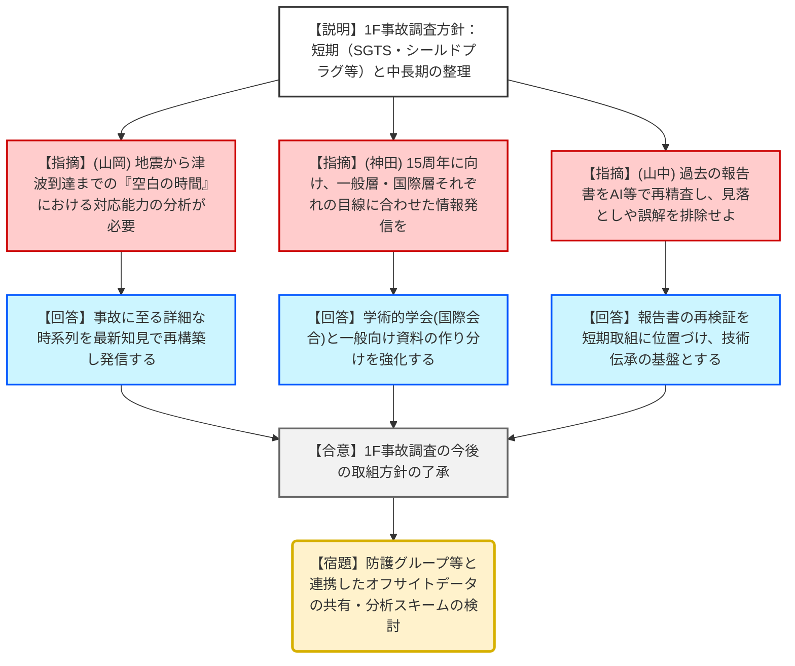
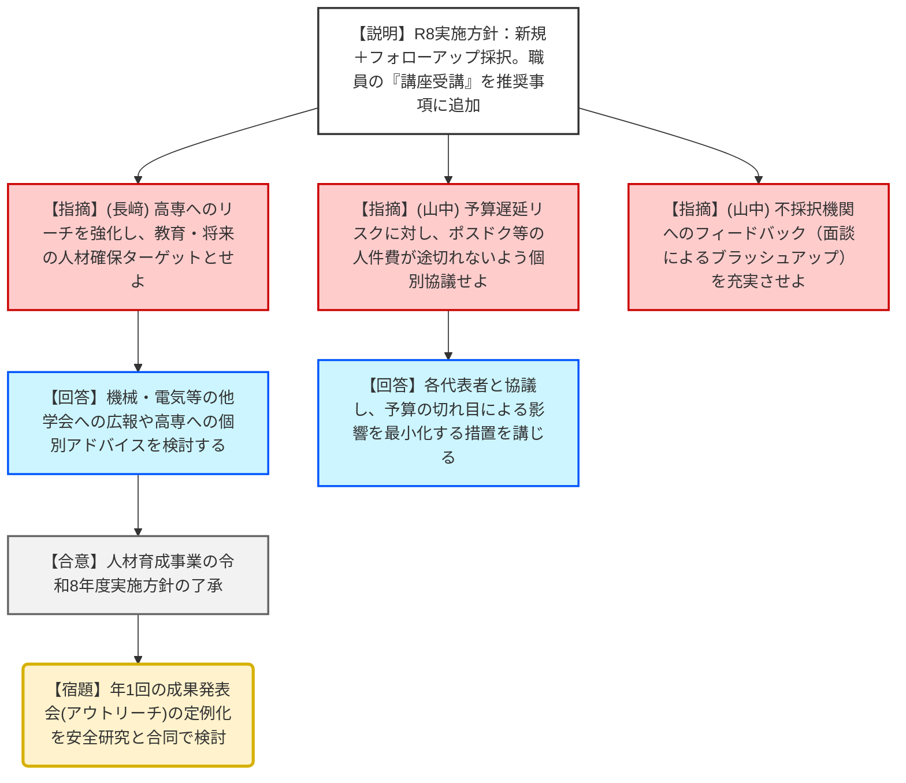
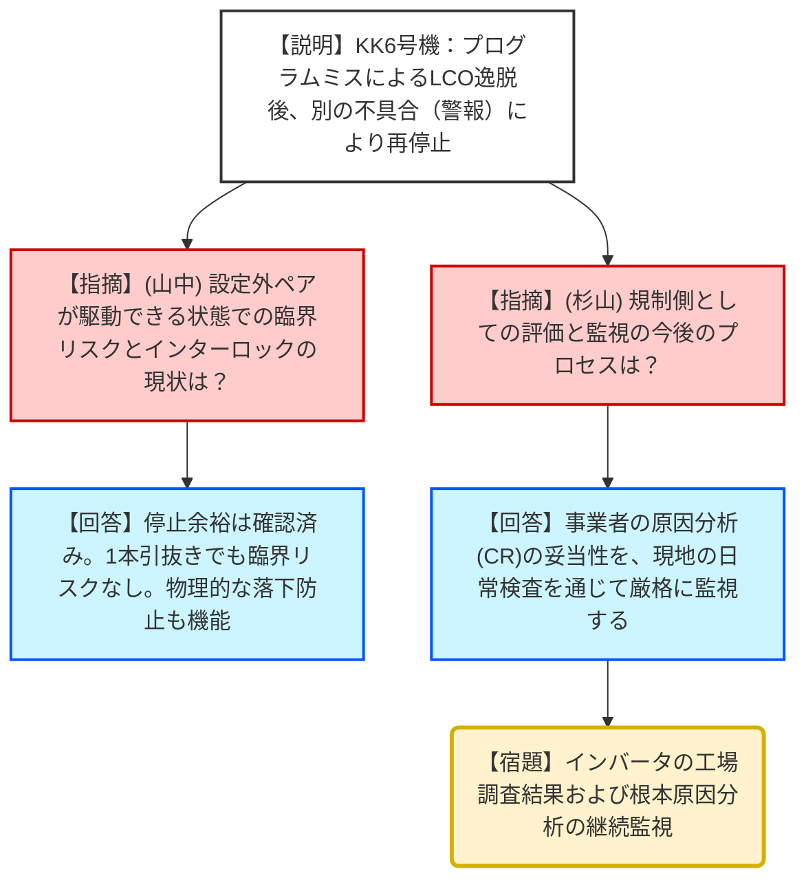

# 第54回原子力規制委員会（令和8年1月28日）
> 出典 : https://youtube.com/live/lk5FiCWtxkE?si=AA4n9s6v12jUFw1T

# 会合の概要
* **1F事故調査の「再定義」と「深化」:** 福島第一原発（1F）事故から15年を控え、これまでの調査実績を整理し、廃炉進捗に合わせた短期・中長期の調査方針を決定した。特に「最新知見に基づく過去の報告書の再検証」においてAIの活用も視野に入れるなど、技術継承と科学的精度向上を両立させる姿勢を鮮明にした。
* **双方向の人材育成事業への転換:** 原子力規制人材育成事業の令和8年度方針において、規制庁職員が講座に「受講生」として参加する仕組みを新設。単なる資金援助ではなく、学生と規制側が互いに高め合う双方向プログラムとしての独自性を強化した。
* **柏崎刈羽6号機の再起動プロセスへの厳格な監視:** 制御棒操作監視系のプログラムミスによる運転上の制限（LCO）逸脱に対し、臨界リスクは低いと判断しつつも、インバータ交換でも解消しない警報の原因究明と、事業者の是正措置の妥当性を日常検査で厳格に確認する方針を確認した。
* **法令報告の「解釈」を巡る事業者への指導:** ふげんにおける漏えい事案について、当初「報告対象外」と主張した事業者に対し、面談を通じて法令報告事象であるとの認識を徹底させた。軽微な事案であっても、規制当局としての厳格な判断基準を維持している。

---

# 議題ごとの詳細整理

## (1) 東京電力福島第一原子力発電所事故の調査・分析に係る今後の取組方針
* **議論の背景と論点:** 事故から長期間が経過し、線量低減や廃炉作業の進展によって「今ようやく調査可能になった箇所」が増加している。これまでの知見を整理し、将来のシビアアクシデント対策の改善にどう繋げるか、また国際的な発信責任をどう果たすかが争点。
* **質疑応答（詳細）:**
    * 【説明者側（宮本企画調査官）】: 短期的に「SGTS配管調査」「シールドプラグ汚染メカニズム」等に取り組み、過去の4つの中間取りまとめ内容を最新知見で再検証する。
    * 【規制側（杉山委員）】: 外部専門家や大学との連携、および国際的な情報共有・発信は、進め方として極めて重要である。
    * 【規制側（長﨑委員）】: 事故分析のフィードバックは長期的視点が必要。基礎科学から工学まで幅広い分野で社会の関心を維持できるよう情報発信すべき。
    * 【規制側（山岡委員）】: 地震発生から津波到達までの「10分〜60分の空白時間」に何ができたか、という視点は将来の訓練やマニュアルに活かせる重要な論点だ。
    * 【規制側（神田委員）】: 15年という節目に向け、対象者の目線に合わせた情報発信が必要。関係者の英知を結集してチャレンジしている姿勢を示すべき。
    * 【規制側（山中委員長）】: オンサイトの情報発信は日本の責任。AIも活用して過去の報告書に誤解や見落としがないか精査し、次世代への技術伝承を確実に行え。
* **結論と宿題事項（アクションアイテム）:**
    * 今後の短期・中長期の取組方針を了承。
    * **【合意】**: 過去の調査結果の再検証において、AIの活用や最新の内部調査知見を統合する。
    * **【宿題】**: 1F室および防護グループは、オフサイトのデータも含めた関係機関とのデータ共有・分析連携を検討すること。

## (2) 原子力規制人材育成事業の令和8年度実施方針
* **議論の背景と論点:** 他省庁の人材育成事業との差別化、および長期的な規制人材の確保。単なる「教育の場」から、規制庁職員自身の能力向上を伴う「双方向の教育」への進化。
* **質疑応答（詳細）:**
    * 【説明者側（須郷課長補佐）】: 新規採択に加え「フォローアップ事業（旧継続事業）」を整理。推奨事項に「規制庁職員の講座への参加」を追加し、職員の育成も図る。
    * 【規制側（長﨑委員）】: 学生訪問時に委員との意見交換を設けるべき。また、高専の学生は関心が高く地元の担い手となるため、大学だけでなく高専に特化した支援の枠組みも検討してほしい。
    * 【規制側（杉山委員）】: 職員の講座参加は採択済みの既存事業に対しても積極的に適用すべき。
    * 【規制側（山中委員長）】: 衆議院解散に伴う予算遅延が人件費（ポスドク等）に影響しないよう、各大学と密に協議し手当せよ。
    * 【規制側（山中委員長）】: 採択されなかった機関に対し、次年度に採択されるためのブラッシュアップ方法（面談等）をアドバイスする工夫が必要。
* **結論と宿題事項（アクションアイテム）:**
    * 令和8年度の実施方針を了承。2月上旬から公募開始。
    * **【合意】**: 規制庁職員の「受講生」としての参加を既存事業へも拡大。
    * **【宿題】**: 年1回程度の「アウトリーチ活動（成果発表会・ポスターセッション）」を安全研究とセットで検討すること。

## 【トピックス】ふげんの漏えい事案および柏崎刈羽6号機の不具合
* **ふげん事案:** 12月23日に発生。事業者が当初「報告対象外」としたが、規制庁が3回の面談を経て「法令報告事象」と認めさせた。外部・内部被曝はなく「C（軽微）」と分類。
    * **【結論】**: 日常検査で詳細原因を確認する。
* **柏崎刈羽6号機事案:** 制御棒引き抜き防止機能のプログラム設定ミス（88組）。修正後、起動試験を再開したが別の警報（インバータ不具合疑い）が発生し、再び停止中。
    * **【論点】**: 設定外の制御棒が動ける状態のリスク評価。
    * **【規制側回答】**: 停止余裕を確認済みであり、1本引き抜いても臨界リスクは極めて低い。物理的な落下防止機構（ラッチ・ボールネジ）も健在。
    * **【宿題】**: 故障したインバータの工場調査結果を待ち、日常検査で事業者のCR（コンディションレポート）対応を監視する。

---

# 論理構造の可視化（Mermaid）

## 議題1：1F事故調査・分析の今後の方針

## 議題2：原子力規制人材育成事業（令和8年度）

## トピックス：柏崎刈羽6号機 制御棒不具合

