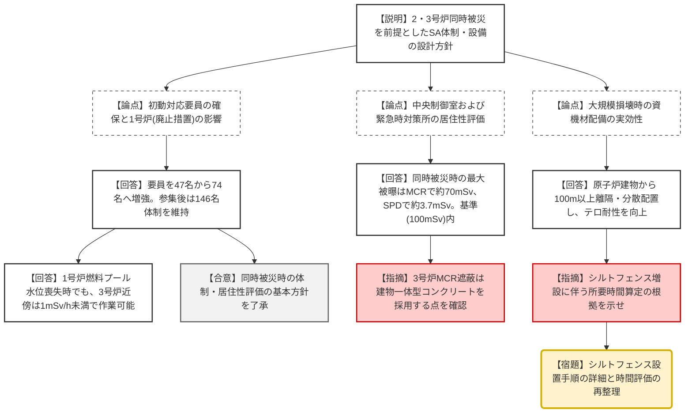
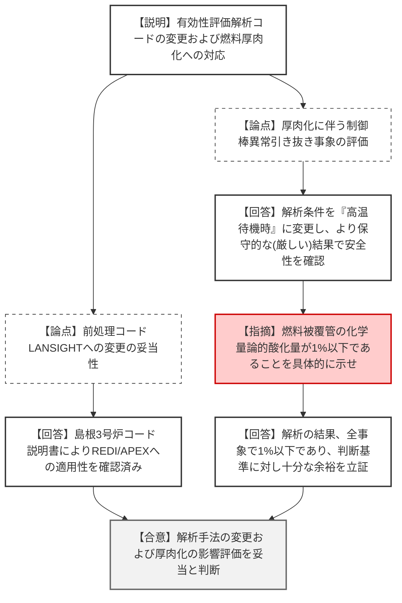
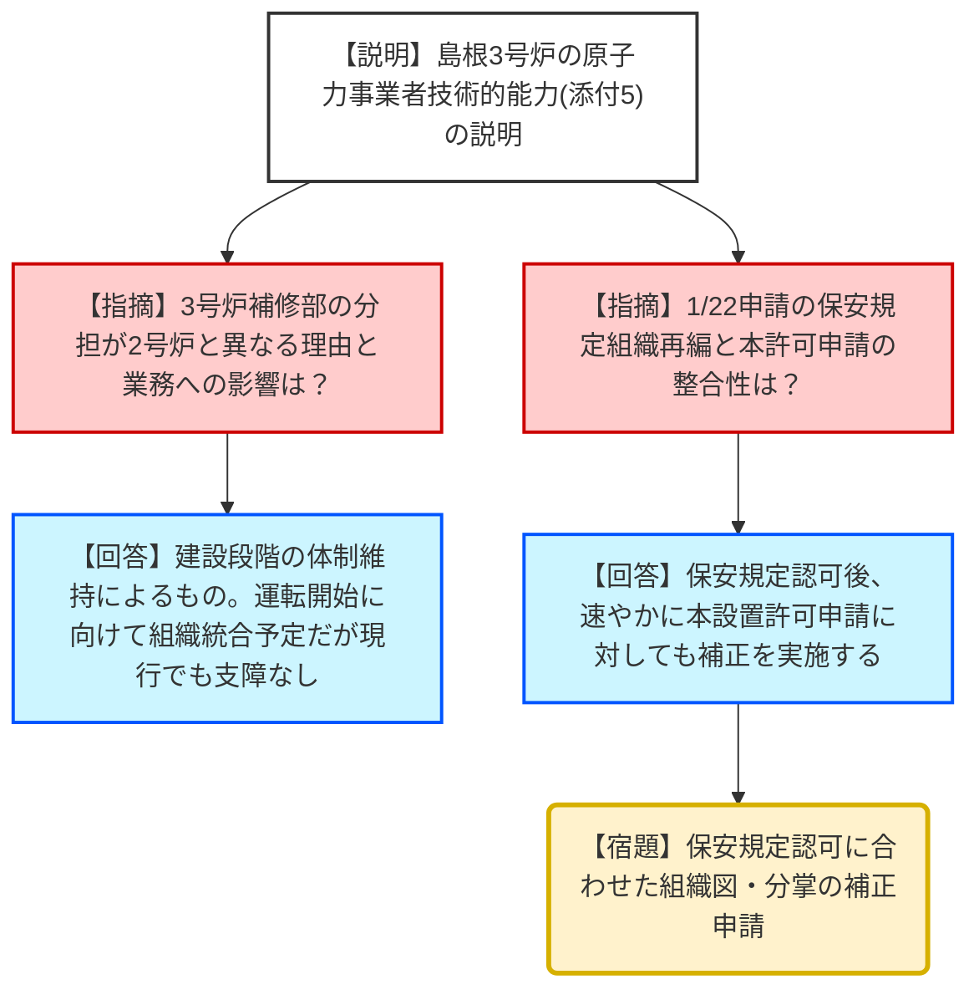

# 第1387回原子力発電所の新規制基準適合性に係る審査会合（令和8年1月29日）
> 出典 : https://youtube.com/live/mFQewiUSx0k?si=GxTArj2F3x-AljFB

# 会合の概要
* **2・3号炉同時被災を前提とした体制・設備設計の妥当性:** 島根3号炉の運転開始を見据え、2号炉との同時被災を想定した初動対応体制（要員74名）や、要員参集後の体制（146名以上）の構築、共有設備である緊急時対策所の収容能力（130名）および被曝評価の妥当性が確認された。
* **居住性と防護措置の強化:** 3号炉中央制御室において、建物一体型のコンクリート遮蔽の採用や、有毒ガス防護、同時被災時の被曝評価（約70mSv：基準100mSv以下）など、運転員の安全確保策が詳細に示された。
* **大規模損壊対応の柔軟性と実効性:** 大規模損壊（テロ等）に対し、資機材の100m以上の離隔・分散配置や、1・2号運転員と3号運転員の相互活用を含む流動的な体制整備方針が示された。
* **解析コード変更と厚肉化対応の検証:** 有効性評価における前処理コード「LANSIGHT」への変更や、チャンネルボックス厚肉化に伴う解析条件（高温待機時への変更）が燃料エンタルピー増分の観点でより厳しい条件を包括していることが立証された。

---

# 議題ごとの詳細整理

## (1) 島根原子力発電所3号炉の設計基準への適合性及び重大事故等対策について

### 【火災防護（第41条）】
* **議論の背景と論点:** 重大事故等対処施設（SA施設）における火災防護設計の妥当性。
* **質疑応答（詳細）:**
    * 【説明者側（中国電力）】: 3号炉8条（設計基準）と同様の方針。SA設備電気室の外壁は3時間耐火のコンクリート厚を確保。アナログ式感知器と自動/手動全域消火設備を設置する。
    * 【説明者側】: 屋外可搬設備については、離隔距離の確保や消火器配備を火災防護計画に定め管理する。
* **結論と宿題事項:** 島根2号炉と同様の方針であることを確認。

### 【原子力事業者の技術的能力（添付書類5）】
* **議論の背景と論点:** 2号炉および3号炉の運用・保守を行う組織体制および技術者確保の妥当性。
* **質疑応答（詳細）:**
    * 【規制側（秋元審査官）】: 業務分掌表（パワポ6P）にて、3号炉の補修部（電気系装・機械設備）の括りが2号炉と異なる理由は何か。
    * 【説明者側（山本部長）】: 3号炉は建設段階にあるため、建設時の組織体制を維持している。運転段階へ移行する際には2号炉と整合させる組織変更を検討するが、現時点の体制でも実務上の支障はない。
    * 【規制側（秋元審査官）】: 1月22日に申請された組織再編に伴う保安規定変更認可申請との関係はどうなるのか。
    * 【説明者側（大石氏）】: 保安規定の認可後、本許可申請についても適切に補正を行う。
* **結論と宿題事項:** 組織体制の考え方を了承。将来の組織変更に合わせた補正を宿題とする。

### 【重大事故等時の体制・居住性・通信連絡（技術的能力1.0等）】
* **議論の背景と論点:** 2・3号炉同時被災時の要員参集・配置、および中央制御室（MCR）・緊急時対策所（SPD）の居住性評価。
* **質疑応答（詳細）:**
    * 【説明者側】: 初動要員を47名（2号単独想定）から74名へ増員。参集後は146名体制を確保。1号炉（廃止措置中）の高線量場発生時でも2・3号炉近傍の線量は低く、対応可能。
    * 【説明者側】: MCR居住性について、2・3号炉同時被災時の運転員被曝は最大約70mSv（7日間）。SPD被曝は約3.7mSv（7日間）であり、いずれも100mSvを下回る。
    * 【説明者側】: 通信連絡設備は多様性を確保し、ガスタービン発電機や緊急時対策所用発電機から給電可能な設計。
* **結論と宿題事項:** 2・3号炉共用設備および体制の妥当性を確認。

### 【大規模損壊対応（技術的能力1.1等）】
* **議論の背景と論点:** テロ等による大規模損壊時の手順と資機材配備。
* **質疑応答（詳細）:**
    * 【説明者側】: 燃料建物から100m以上離れた場所に資機材を分散配備。同時被災を考慮し、2・3号炉共通要員の活用や、資機材保管数の増強を実施。
    * 【規制側（菊川審査官）】: 放射性物質拡散抑制のためのシルトフェンス設置箇所が6箇所増えている。放水砲の準備時間との兼ね合いで、所要時間をどう算定したのか。
    * 【説明者側（西田氏）】: (詳細回答は今後の事実確認プロセスへ継続)
* **結論と宿題事項:** 基本方針を了承。

### 【有効性評価およびチャンネルボックス厚肉化】
* **議論の背景と論点:** 解析コードの変更の妥当性、およびチャンネルボックス厚肉化による安全性への影響。
* **質疑応答（詳細）:**
    * 【説明者側】: 前処理コードを「LANSIGHT」へ変更したが、先行審査で実績のある「REDY」「APEX」への適用性は確認済み。
    * 【説明者側】: チャンネルボックス厚肉化に伴い、制御棒異常引き抜きの初期条件を「低温時」から、よりエンタルピー増分が厳しくなる「高温待機時」へ変更。評価結果は判断基準に対し十分な余裕（酸化量1%以下等）がある。
* **結論と宿題事項:** 解析方針の妥当性を確認。

---

# 論理構造の可視化（Mermaid）

## 議題1：島根3号炉 SA体制および居住性評価の構造

## 議題1：解析コード変更および厚肉化対応

## 議題1：組織体制の最適化

