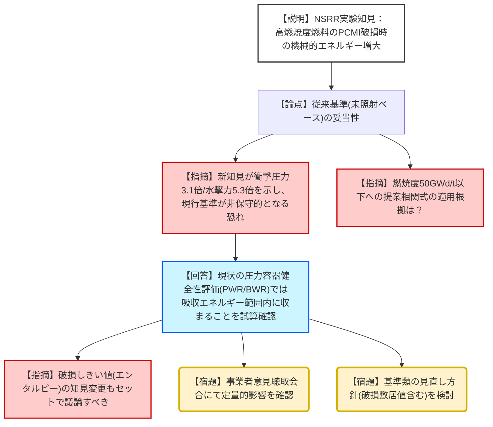
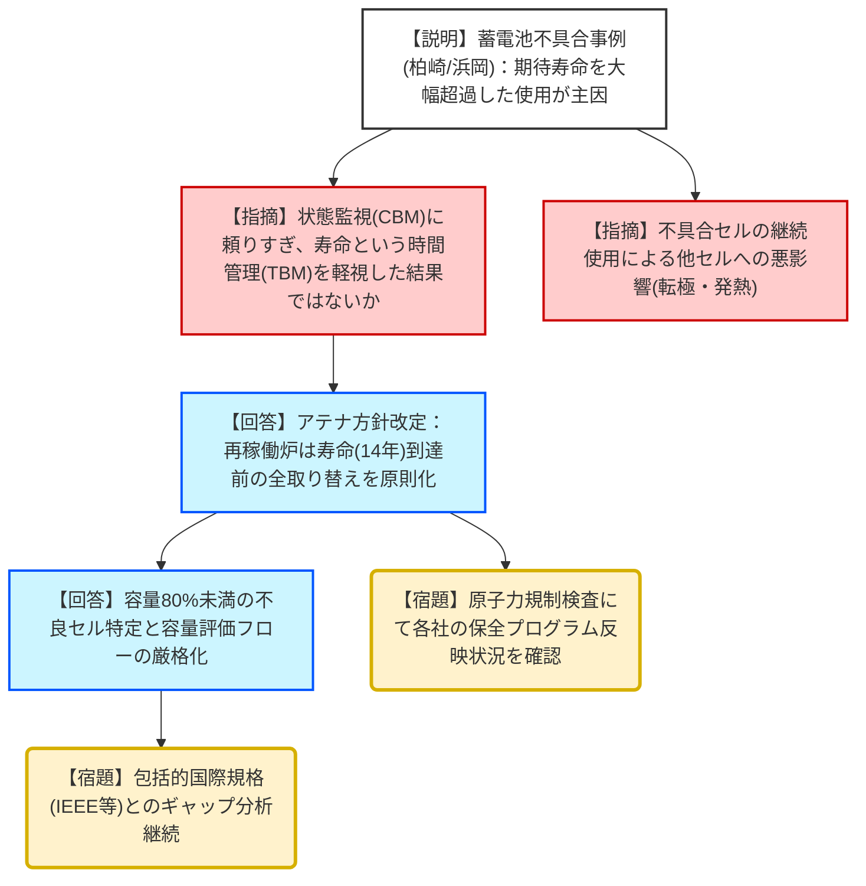
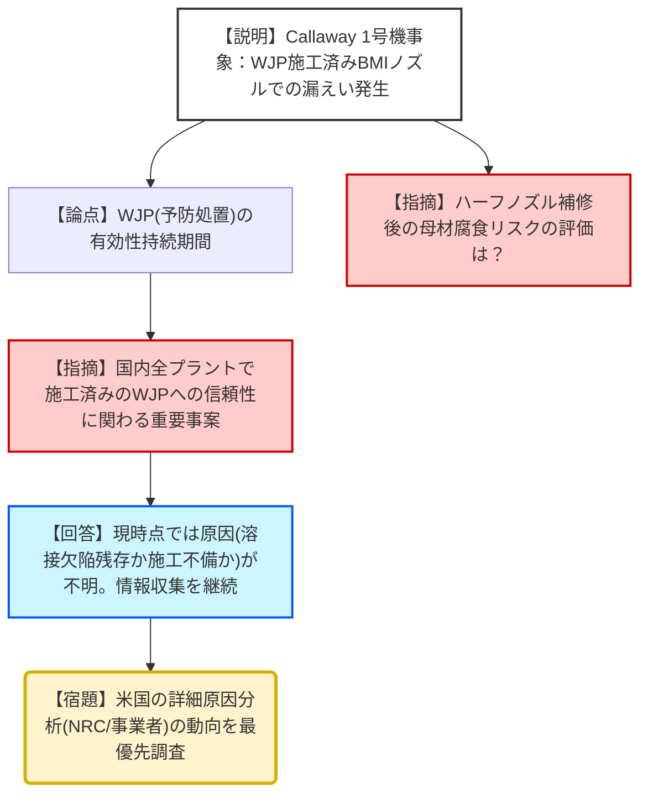

# 第77回技術情報検討会（令和8年1月29日）
> 出典 : https://youtube.com/live/xWdLJE16w5s?si=BLKwrEq9HDJL4_sp

# 会合の概要
* **高燃焼度燃料の反応度事故（RIA）における新知見の衝撃:** NSRR実験の結果、高燃焼度燃料のPCMI（ペレット・被覆管機械的相互作用）破損に伴う機械的エネルギーが、従来の規制基準（未照射燃料ベース）を大幅に上回る（衝撃圧力3.1倍、水撃力5.3倍）ことが判明。直ちに安全上の問題はないものの、基準類の見直しが必要な重要知見と位置付けられた。
* **蓄電池の「賞味期限」管理の徹底:** 柏崎刈羽や浜岡での不具合を受け、期待寿命（14年）を大幅に超えて使用し続ける「状態監視保全」の限界が露呈。業界全体として、再稼働済みプラントでは寿命到達前の全セル取り替えを原則とする「時間基準保全」への回帰と、容量評価フローの厳格化が決定された。
* **国際的なSCC（応力腐食割れ）知見の収集と国内反映:** 仏国PWRの安全注入系配管および米国PWRの炉内計装筒（BMI）でのSCC事象を分析。特に、米国でウォータージェットピーニング（WJP）施工後に発生した事象は、国内の予防処置の有効性評価に直結するため、詳細な原因究明（溶接欠陥かピーニングの限界か）を注視する。
* **検査・技術の高度化とインテリジェントカスタマー:** 検査員の世代交代を見据え、先進的なUT（超音波探傷）技術やPD（パフォーマンスデモンストレーション）認証の導入、AI活用の可能性など、規制側が技術を正しく評価・理解する「インテリジェントカスタマー」としての能力維持が強調された。

---

# 議題ごとの詳細整理（テキスト）

## (1) 安全研究及び学術的な調査・研究から得られる最新知見
### １）最新知見のスクリーニング状況の概要（自然ハザード以外に関するもの）
*   **議論の背景と論点:** 高燃焼度燃料（44～81 GWd/t）の反応度事故模擬実験において、FPガスの蓄積とペレットの微粒子化により、破損時に発生する機械的エネルギーが従来想定を超大することが判明。現行基準の保守性が揺らぐ可能性について検討。
*   **質疑応答（詳細）:**
    *   【説明者側（江口）】: NSRR実験の結果、50 GWd/t以上の高燃焼度域で、衝撃圧力のエネルギー変換係数が従来曲線の3.1倍、水撃力が5.3倍となる知見が公表された。原因は細粒化したペレットと冷却水の接触面積増大に伴う激しい反応である。
    *   【規制側（大島）】: 50 GWd/t以下の領域まで全体的に変換係数案をかさ上げしている根拠は何か。
    *   【説明者側（江口）】: 新規データを包含するように50 GWd/t以上の線形増加線をフィッティングし、その下限値を50 GWd/t以下の一定値として設定したためである。
    *   【規制側（杉山委員）】: 衝撃圧力と水撃力の物理的メカニズム（液相伝播 vs 水柱上昇）の説明を補足し、構造物がない前提の超保守的な評価である点も踏まえるべき。また、破損しきい値（エンタルピー）の知見見直しとセットで議論すべきである。
    *   【説明者側（北野）】: JAEAの提案式の妥当性は、今後NEA等の国際会議や燃料安全研究会等で議論される予定である。
    *   【規制側（市村）】: RIAの取り扱いについて、国際的には評価自体を簡略化する動き（State of the Art Report）もある。国際動向を注視しつつ、日本としての基準最適化を進めてほしい。
*   **結論と宿題事項（アクションアイテム）:**
    *   **【結論】**: 現在の稼働炉等において直ちに安全上の影響はないが、重要知見として受理。
    *   **【宿題】**: 事業者へ本知見を周知し、「事業者意見の聴取に係る会合」で定量的影響を確認。基準類の見直し方針を検討し、本検討会に再報告する。

## (2) 国内外の原子力施設の事故・トラブル情報
### １）原子力発電所の蓄電池の保守管理
*   **議論の背景と論点:** 期待寿命を超えた蓄電池の使用による容量低下。柏崎刈羽5号、浜岡3・5号での不具合事例を受け、アテナ（産業界）が策定した新保守管理方針の実効性を確認。
*   **質疑応答（詳細）:**
    *   【説明者側（皆川）】: 期待寿命（14年）を20年以上超えて使用したセルで不具合が発生。事業者は電圧さえ維持されていれば機能維持と判断しており、容量評価が不十分であった。
    *   【規制側（金城）】: 期待寿命があるにもかかわらず時間管理をせず状態監視に頼ったのは「賞味期限切れの食品を食べてお腹を壊した」ようなものだ。他の機器でも同様の例がないか水平展開はしているか。
    *   【説明者側（皆川）】: 蓄電池に関しては、アテナが「期待寿命上限（14年）到達前の全セル取り替え」を原則とする方針に見直した。他の機器については本件の対象外だが、状態監視保全も根拠があれば有効な手法ではある。
    *   【規制側（大島）】: 不良セルのバイパス運用は悪影響（転極や発熱）がないのか。
    *   【説明者側（皆川）】: 容量が枯渇したセルは転極により水の電気分解（水素発生）や加熱を招くリスクがあるため、規格では速やかな交換が推奨されている。
    *   【規制側（市村）】: 管理を複雑化しすぎるのが正しい道か検討が必要。
*   **結論と宿題事項（アクションアイテム）:**
    *   **【結論】**: アテナの新方針はリスク低減に資すると評価。
    *   **【宿題】**: 規制庁は各社の社内文書への反映状況を原子力規制検査で確認する。また、海外の包括的規格とのギャップ（負荷放電試験の実施等）についてアテナから継続聴取する。

### ２）仏国PWRの安全注入系ステンレス鋼配管で見つかった応力腐食現象（第四報）
*   **議論の背景と論点:** WENRA推奨事項への国内対応。特に「補修溶接の記録」と「UT検査の高度化」の状況。
*   **質疑応答（詳細）:**
    *   【説明者側（小嶋）】: アテナは「手入れ、手直し、補修」の用語を定義し、これまで記録が曖昧だった「手入れ溶接（グラインダー除去等）」についても自主保管記録とする方針を決定。
    *   【規制側（高須）】: 記録を残す対象範囲に各社でばらつきはないか。
    *   【説明者側（小嶋）】: アテナの検査ガイドで、一次隔離弁から二次隔離弁までの範囲を明示し、共通化を図っている。
    *   【規制側（森下）】: 検査員の世代交代に向け、AIによる自動判定などの先端技術の活用も事業者に促すべき。
*   **結論と宿題事項（アクションアイテム）:**
    *   **【結論】**: 事業者がWENRA推奨事項に概ね対応していることを確認。
    *   **【宿題】**: 仏国での原因究明状況を継続調査し、適宜報告する。

### ３）米国PWRの原子炉容器炉内計装筒の溶接部で発生したSCCについて
*   **議論の背景と論点:** キャラウェイ1号機でのBMIノズル漏えい。WJP（ウォータージェットピーニング）済みの箇所で発生したことの特異性。
*   **質疑応答（詳細）:**
    *   【説明者側（小嶋）】: 600系合金のJ溶接部で漏えいが発生。当該機は2017年にWJPを施工していた。アメレン社はハーフノズル工法で補修済み。
    *   【規制側（杉山委員）】: ハーフノズル補修により、上部の古い亀裂から水が入ることで、圧力容器の母材（低合金鋼）の腐食リスクはないのか。
    *   【説明者側（小嶋）】: 下部鏡の内面はステンレスクラッドされており、BMI管との隙間も極小だが、ホウ酸腐食の懸念はあり、事業者は寿命解析を実施中。
    *   【規制側（市村）】: 国内は全プラントでピーニング済みだが、WJP自体の効果が持続しなかったのか、あるいは施工不備かが最大の問題だ。
*   **結論と宿題事項（アクションアイテム）:**
    *   **【結論】**: 国内でのWJPの信頼性に関わるため、重要度が高い。
    *   **【宿題】**: 米国でのWJP施工状況と原因分析（溶接欠陥の有無等）について詳細な情報収集を継続する。

---

# 論理構造の可視化（Mermaid）

## 議題1：高燃焼度燃料の機械的エネルギー新知見

## 議題2-1：蓄電池の保守管理

## 議題2-3：米国PWR・BMIノズルSCC

