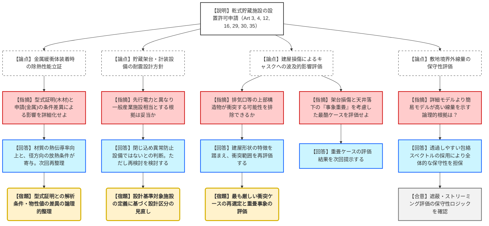

# 第1388回原子力発電所の新規制基準適合性に係る審査会合（令和8年2月03日）
> 出典 : https://youtube.com/live/X2hskEyfYZc?si=8QqOWaRd3dLSCJih

# 会合の概要
* **波及的影響評価の網羅性への疑義:** 貯蔵建屋の損傷に伴う「天井落下」の評価において、現在評価対象外としている排気口等の上部構造物がキャスクに衝突する可能性が指摘された。規制庁は、建屋形状が先行プラント（女川等）と異なる点を踏まえ、最も厳しい衝突ケースの再選定を求めた。
* **耐震設計方針の独自性と妥当性:** 九州電力は、貯蔵架台や計装設備を「一般産業施設相当」と設計する方針を提示。これは、これらを「設計基準対象施設」と整理してCクラス準拠とした先行電力（女川、高浜）とは異なる。規制側はこの整理の根拠を問うとともに、実質的な設計の差異について回答を求めた。
* **事象の重畳（同時被災）評価の要求:** 地震によって貯蔵架台や建屋基礎が損傷した状態で、さらに天井や側壁がキャスクに倒れ込むといった「事象の重畳」を考慮した、より過酷な条件での安全性立証が宿題となった。
* **型式証明と設置変更許可の評価条件の差異:** 除熱評価において、型式証明（木材相当の緩衝体）と今回の申請（金属製緩衝体）での物性値や配置条件（無限配列の扱い）の差が評価結果にどう影響しているか、論理的な再整理が求められた。

---

# 議題ごとの詳細整理

## 【議題1】川内原子力発電所1号炉及び2号炉の設置変更許可申請（使用済燃料乾式貯蔵施設の設置）に係る審査

### 議論の背景と論点
川内原発1・2号炉の敷地内に、使用済燃料を貯蔵する乾式キャスク（MSF-28P型）20基を設置する計画。本会合では、型式証明（Certified Design）を受けたキャスクを実際のサイト条件（地盤、地震、熱環境）に適用する際の設計方針、特に先行プラントとの設計区分や波及的影響評価の差異が主要な争点となった。

### 質疑応答（詳細）

#### 1. 除熱評価における型式証明との整合（第16条関連）
* **【説明者側】からの説明**
    * 型式証明では「木材相当」の緩衝体で評価しているが、本申請では熱伝導率の高い「金属製」貯蔵用緩衝体を採用するため、評価結果は型式証明に包含（より低温に）される。
* **【規制側】の懸念・指摘点**
    * 86ページの比較表にて、配置条件が「同様（無限配列）」とされているが、川内の設計では一部方向で放熱が期待できるのではないか。緩衝体の材質（熱伝導率）と配置条件の差異が、解析結果の数値にどう寄与しているか明確にせよ（松野審査官）。
* **【説明者側】の回答・根拠**
    * 軸方向は無限配列だが、径方向は厳密には無限配列としていない。材質以外の要因も影響している。記載が分かりにくかったため、条件の差異を再整理して説明する（田中氏、二宮氏）。

#### 2. 耐震設計方針と施設区分（第4条関連）
* **【説明者側】からの説明**
    * 貯蔵架台や計装設備は「閉じ込め機能の異常を防止する設備」ではないため、設計基準対象施設には該当せず、「一般産業施設相当」とする。これは先行プラント（Cクラス準拠）と方針が異なる。
* **【規制側】の懸念・指摘点**
    * 兼用キャスクガイドでは周辺施設も安全機能維持に応じた設計を求めている。Cクラスとした場合と一般産業施設とした場合で、実際の設計強度に違いが出るのか。また、先行プラントとの整理の差異を再検討せよ（島田審査官）。
* **【説明者側】の回答・根拠**
    * 実力としてはCクラス準拠でも変わらないと考えている。規制側の意向を踏まえ、設計基準対象施設の整理について見直しを検討する（田中氏、二宮氏）。

#### 3. 建屋損傷による波及的影響（第4条関連）
* **【規制側】の懸念・指摘点**
    * 29ページの評価範囲において、色塗りされていない排気口等の上部構造物が、右側に倒れた際にキャスクに寄りかかる可能性を否定できない。排気口の高さと離隔距離を踏まえ、順を追って説明せよ（藤川審査官）。
    * 32ページの落下評価において、架台や基礎が健全な状態を前提としているが、地震で架台が損傷した「後に」天井が落下するケースの方が厳しいのではないか。事象の重畳を評価すべき（藤川審査官）。
* **【説明者側】の回答・根拠**
    * 上部構造物の扱いを資料化する。また、より厳しい「重畳ケース」についても評価を実施し、次回説明する（二宮氏、田中氏）。

#### 4. 遮蔽評価とストリーミング（第29条関連）
* **【規制側】の懸念・指摘点**
    * 申請評価（一様な遮蔽体モデル）とバックアップ評価（MCNPによる詳細ストリーミングモデル）で、なぜ申請評価の方が線量が高く（保守的に）なるのか。スペクトルの設定の差を説明せよ（国公審査官）。
* **【説明者側】の回答・根拠**
    * 申請評価では遮蔽体を透過しやすい「包絡スペクトル」を用いているため。ストリーミングを考慮した詳細モデルよりも、全体的な保守性が上回ることを確認している（岡本氏）。

### 結論と宿題事項（アクションアイテム）
* **結論:** 審査対象条文の基本方針については概ね説明がなされたが、衝突評価の条件選定や耐震区分の論理構成に不十分な点があり、継続審議となった。
* **宿題事項:**
    1. **【宿題】**: 貯蔵用緩衝体装着時の除熱評価に関し、型式証明の解析条件との具体的な差異（物性・配置）を再整理すること。
    2. **【宿題】**: 貯蔵架台・計装設備の耐震設計区分について、先行プラントとの整合性およびガイドの要求事項を踏まえて見直すこと。
    3. **【宿題】**: 排気口等の構造物を含めた「天井落下評価」の範囲再選定、および架台損傷との「重畳評価」の実施。
    4. **【宿題】**: 津波による砂移動評価、地盤安定性評価の準備状況の提示。

---

# 論理構造の可視化（Mermaid）

## 議題1：川内原発 乾式貯蔵施設 適合性審査の構造

