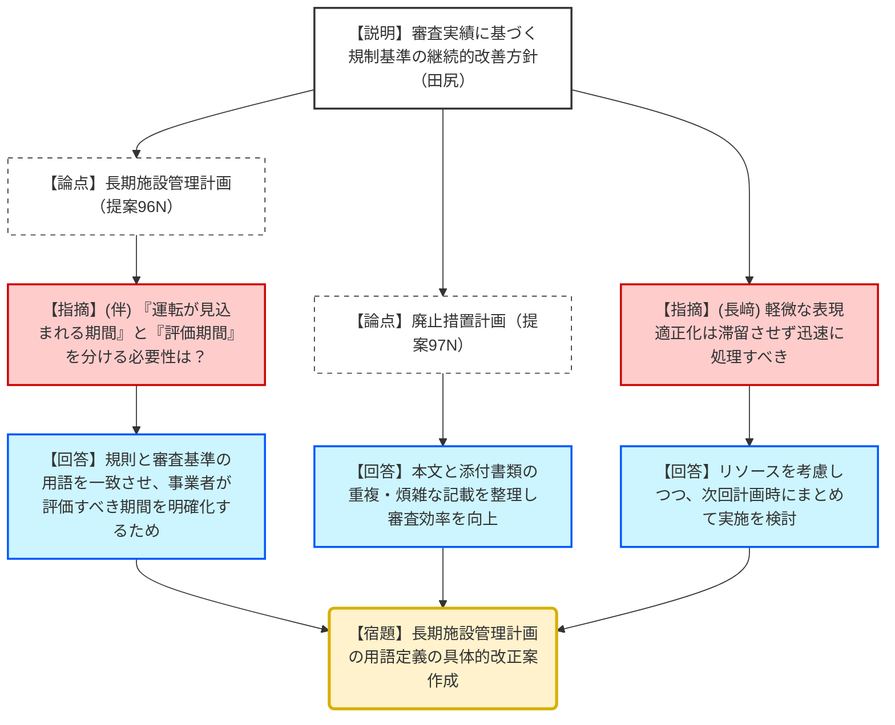
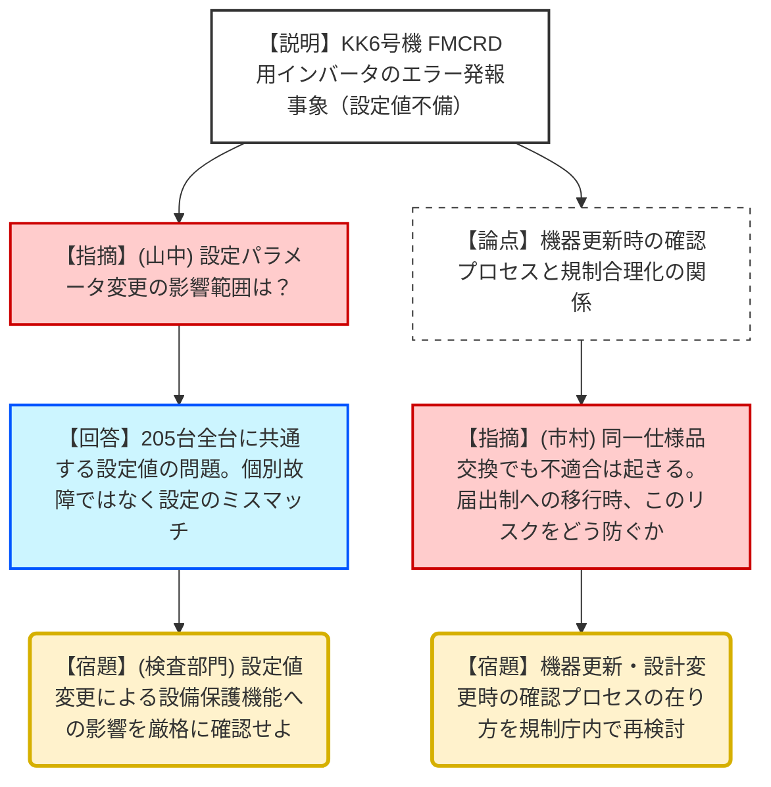

# 第55回原子力規制委員会（令和8年2月04日）
> 出典 : https://youtube.com/live/O-7oenUWg_U?si=7OLZVRd_AtEcxM26

# 会合の概要
* **玄海3・4号機 変圧器更新の正式許可:** 九州電力玄海原子力発電所の主変圧器および所内変圧器の更新について、経済産業大臣および原子力委員会からの「異存なし」との回答を受け、設置変更許可が正式に決定された。
* **規制基準の継続的改善（審査実績の反映）:** 長期施設管理計画や廃止措置計画の審査基準において、現場での解釈の揺れを防ぐための用語定義（「評価期間」と「運転が見込まれる期間」の明確化等）や、重複記載の整理を行う当面の実施計画が報告された。
* **行政手続きのデジタル化完了:** 許認可申請のオンライン化や、国家資格（炉主任・RI等）の手続きにおいてマイナンバー連携による住民票提出免除を可能とする関係規則の改正が決定・了承された。
* **柏崎刈羽6号機 インバータ不具合の本質的議論:** 2023年に一斉更新した制御棒駆動機構（FMCRD）用インバータの設定値不整合事象に対し、委員から「同一仕様品への更新時における確認プロセスの甘さ」や「今後の規制合理化（届出制への移行）におけるリスク判断」への厳しい問題提起がなされた。

---

# 議題ごとの詳細整理

## (1) 九州電力（株）玄海原子力発電所3号及び4号発電用原子炉施設の設置変更許可
* **議論の背景と論点:** 主変圧器および所内変圧器の更新に係る設置変更許可。昨年12月の技術的妥当性確認後の行政手続（他機関への意見聴取）完了に伴う最終決定。
* **質疑応答（詳細）:**
    * 【説明者側（田中企画調査官）】: 原子力委員会より「平和目的以外に利用される恐れがない」との答申を受領。経済産業大臣より「許可することに異存はない」との回答を受領。
    * 【規制側】: 特段の質問・異論なし。
* **結論と宿題事項:** 
    * 審査結果を決定し、発電用原子炉設置変更許可処分を決定した。

## (2) 審査実績を踏まえた規制基準等の記載の具体化・表現の改善
* **議論の背景と論点:** 審査経験（バックフィットを含む）を基準類に的確に反映させる継続的改善活動。今回は特に「長期施設管理計画（高経年化）」と「廃止措置計画」の基準改善が焦点。
* **質疑応答（詳細）:**
    * 【説明者側（田尻課長補佐）】: 
        * 提案96N：長期施設管理計画において、規則上の「運転が見込まれる期間」と審査基準上の「評価期間」の定義が曖昧な点を明確化する。
        * 提案97N：廃止措置計画において、本文と添付書類での重複記載を適正化し、審査の効率化を図る。
        * 取り下げ：アテナからの「個別審査で認められた結果をガイドに反映せよ」との提案は、立地・設計条件の個別性が強いため、一律の反映は不適当として却下した。
    * 【規制側（長﨑委員）】: リストには多くの項目があるが、軽微な表現適正化などは時間をかけず、他の改正に併せて積極的に片付けるべき。
    * 【説明者側（田尻課長補佐）】: リソースの制約はあるが、次回計画時に軽微な変更をまとめて実施できないか検討する。
    * 【規制側（伴委員）】: 「運転が見込まれる期間」と「評価期間」をわざわざ二つ定義し直す必要があるのか。現状の運用で問題ないなら、煩雑さを避ける視点も必要だ。
* **結論と宿題事項:** 
    * **【合意】**: 当面の実施計画（長期施設管理・廃止措置）に沿って検討を進める。
    * **【宿題】**: 改正案が整い次第、改めて委員会へ報告すること。

## (3) 原子力規制委員会の所管する許認可申請等及び国家資格の手続のデジタル化
* **議論の背景と論点:** 申請の全面オンライン化と、国家資格におけるマイナンバー活用。パブリックコメントで寄せられたセキュリティやデジタルデバイドへの懸念への回答。
* **質疑応答（詳細）:**
    * 【説明者側（西村係長）】: セキュリティ上の懸念（機密情報）がある場合は、オンラインでは「鏡」のみを提出し、詳細は電子的記録媒体（CD-R等）で提出する運用とする。マイナンバー活用により、路主任試験等の住民票提出は今後不要となる。
    * 【規制側】: 異議なし。
* **結論と宿題事項:** 
    * 意見募集結果に対する考え方を了承し、関係規則の改正を決定した。

---

# 【トピックス】柏崎刈羽6号機のインバータ不具合状況
* **議論の背景と論点:** FMCRD（制御棒駆動機構）用インバータの電圧確立設定ミス。2023年の全数交換時に含まれていた「エラー検知の仕様変更」が現場実態と整合していなかった。
* **質疑応答（詳細）:**
    * 【規制側（山中委員長）】: インバータの電圧確立までの制定時間設定が、装置の保護機能と噛み合っていない。全205台の設定を共通に変更するのか。
    * 【説明者側（実用監視部門）】: その通り。インバータ自体の出力・動作には問題ないが、エラーを吐き出す設定値の精査を進めている。
    * 【規制側（市村規制技監）】: これは「同一仕様品への更新」であっても、内部のマイナーチェンジ（エラー検知ロジックの追加等）によって不適合が起きる典型例。
    * 【規制側（市村規制技監）】: 今後、規制側として「設工認が不要な届出制」への移行（合理化）を検討しているが、こうした「設定ミスによる警報過多・過少リスク」をどこで担保すべきか、今回の事案は重い教訓である。
* **結論と宿題事項:** 
    * **【宿題】**: 現地事務所と連携し、事業者の原因分析（設定値見直しの妥当性）を検査プロセスで厳格に監視する。

---

# 論理構造の可視化（Mermaid）

## 議題2：規制基準の記載具体化・改善

## トピックス：柏崎刈羽6号機 インバータ不具合

