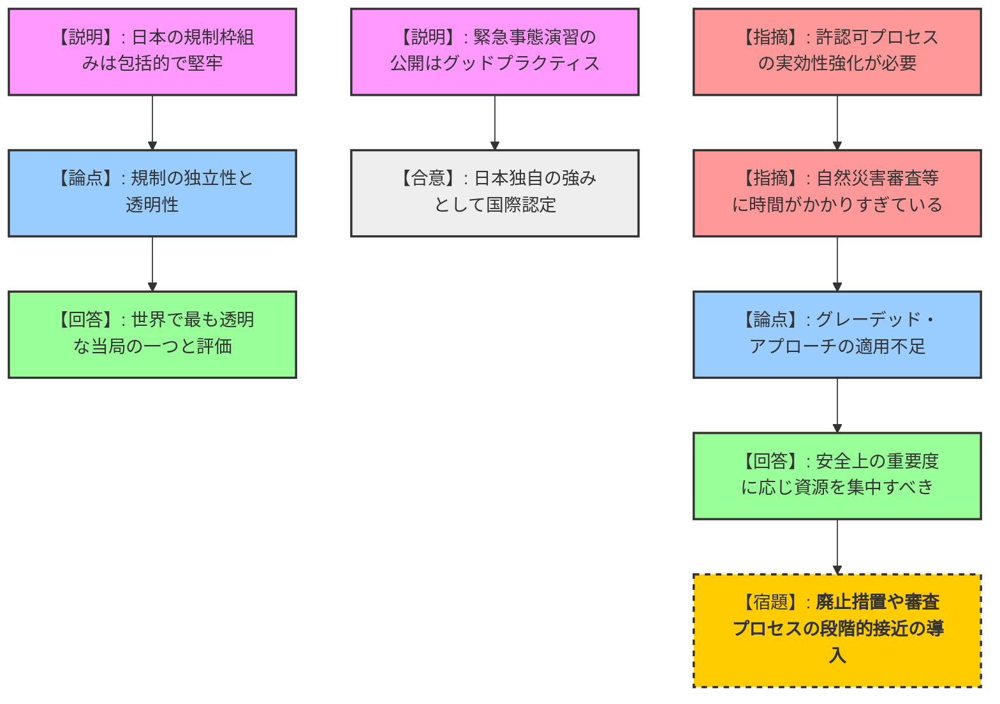
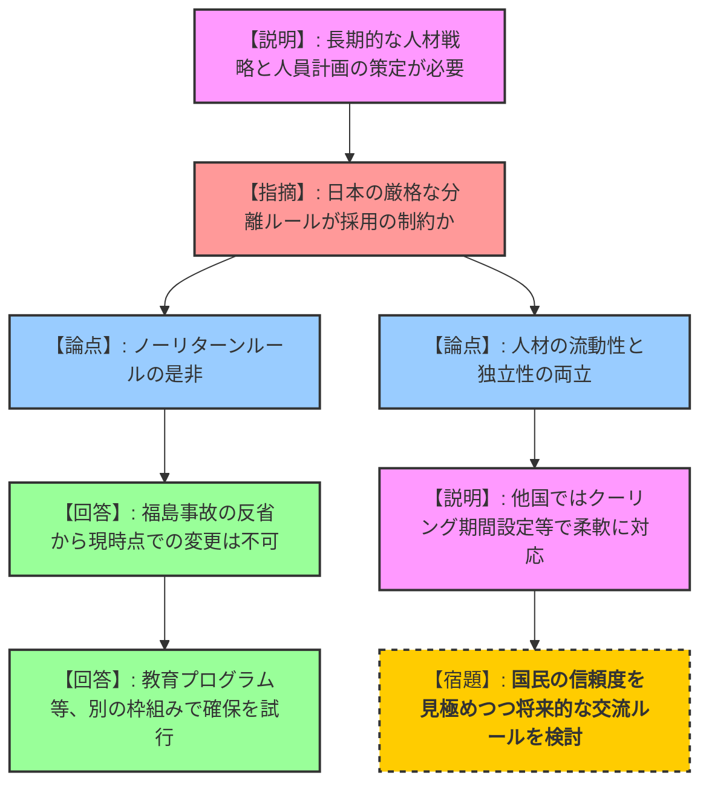
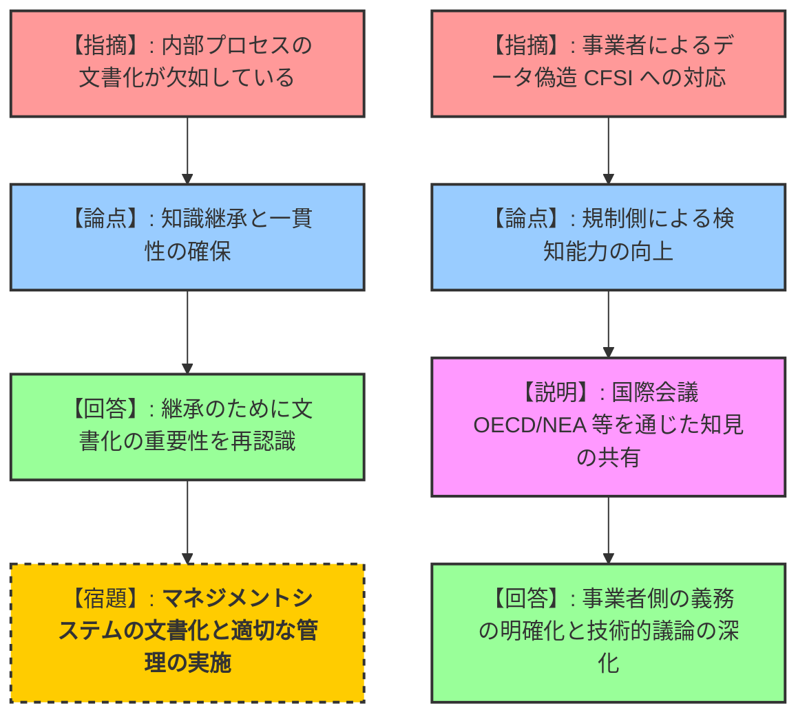

# IRRSレビュー結果に関する、IRRSミッションチームと原子力規制委員会の合同記者会見（令和8年2月06日）
> 出典 : https://youtube.com/live/9tVq5Rvwp8c?si=jgyOXWGEx9HU1-Qw

# 会合の概要
*   **最大の争点:** 規制の独立性・透明性を維持するための「ノーリターンルール（推進側との人事遮断）」を堅持する日本側と、人材不足解消のために「柔軟な流動性」を提案するIRRSチームとの、人材戦略におけるアプローチの差異。
*   **審査の進捗状況:** 2週間にわたるピアレビューが完了。日本の規制枠組みは「包括的かつ堅牢」であり、世界で最も透明・独立した当局の一つであると高く評価された一方で、組織運営の文書化や効率化に改善の余地があることが示された。
*   **特筆すべき決定事項:** 日本の「原子力防災訓練（全事業者が参加し結果を公開する仕組み）」が、グローバルなグッドプラクティスとして特定された。
*   **現場の緊張感と納得度:** 福島第一原発事故から15年を前に、山中委員長は「透明な自律」という新概念を提示。規制側はIRRSからの「文書化の欠如」や「人材流動性」という痛いところを突く指摘に対し、真摯かつ客観的な「処方箋」として受け入れる姿勢を示した。

---

# 議題ごとの詳細整理（テキスト）

## 【議題1】IRRSミッションの総括報告と日本への評価
*   **議論の背景と論点:** 日本の原子力規制枠組みが国際的な安全基準に照らして妥当であるかの総合評価。
*   **質疑応答（詳細）:**
    *   【説明者側（ティッパナ長官）】: 日本は包括的で堅牢な規制枠組みを有している。原子力規制庁は献身的で、世界で最も透明・独立した規制当局の一つである。
    *   【説明者側（エルビブ事務次長）】: 2011年の事故以来の改革により、有効な規制枠組みが実施されている。特に緊急事態の準備・応答演習の結果を公開している点は、グローバルなグッドプラクティスである。
    *   【規制側（山中委員長）】: 設立の原点である福島事故の教訓を忘れていない。独立性と透明性を堅持しつつ、「透明な自律」を目指す。
*   **結論と宿題事項:**
    *   日本の規制インフラは高度に機能していると認定。
    *   継続的な改善プロセスが機能していることを確認。

## 【議題2】許認可プロセスの実効性向上とグレーデッド・アプローチ
*   **議論の背景と論点:** 審査の長期化への対策と、安全上の重要度に応じた資源配分の最適化。
*   **質疑応答（詳細）:**
    *   【規制側（日経・伊田）】: 許認可プロセスの実効性強化という課題の具体的な中身は何か。
    *   【説明者側（ティッパナ長官）】: グレーデッド・アプローチ（段階的接近）の適切な実施が鍵である。
    *   【説明者側（ティッパナ長官）】: 特に自然災害等の外部事象の審査に多大な時間がかかっている。設計承認の段階を待たず、より早い段階で審査を終えるなど、プロセスの見直しが必要。
    *   【説明者側（ティッパナ長官）】: グレーデッド・アプローチは「手を抜く」ことではなく、重要な分野により注力し、リスクを減らすための合理的な手法である。
    *   【規制側（山中委員長）】: リスクに応じたプロセス見直しの必要性は既に認識しており、指摘と認識が一致している。
*   **結論と宿題事項:**
    *   廃止措置や自然ハザード審査において、リスクに応じた柔軟なプロセスを構築すること（継続検討）。

## 【議題3】長期的・戦略的な人材確保とノーリターンルール
*   **議論の背景と論点:** 専門人材の不足に対し、規制の独立性と人材の流動性をどう両立させるか。
*   **質疑応答（詳細）:**
    *   【説明者側（ティッパナ長官）】: 長期的な人員計画と人材戦略が必要。
    *   【規制側（朝日・小川、共同・橋村）】: 具体的な不足分野は何か。また、ノーリターンルールが採用の制約になっているのではないか。
    *   【説明者側（ティッパナ長官）】: 特定の分野というより、工学、電力、再処理など広範な専門知識が必要。
    *   【説明者側（ティッパナ長官）】: 日本のノーリターンルールや各種制約が、人材採用の限界（ボトルネック）になっている可能性がある。他国では「クーリング期間」を設けるなどして、問題ない形での人材交流を実現している。
    *   【規制側（山中委員長）】: 福島事故の教訓である「推進と規制の分離」のため、今直ちにノーリターンルールを変更する考えはない。
    *   【規制側（山中委員長）】: 代わりに、若者への教育プログラム派遣など、別の方法で人材を確保する。ただし、国民の信頼が得られれば、将来的なルール変更の検討は否定しない。
*   **結論と宿題事項:**
    *   「長期的な人材戦略の策定」が勧告された。
    *   規制側は独立性を守りつつ、いかに専門性を確保し続けるかという難題を持ち越した。

## 【議題4】マネジメントシステムの文書化と知識管理
*   **議論の背景と論点:** 組織内部の業務プロセスが文書化されていないことによる、継続性の危機。
*   **質疑応答（詳細）:**
    *   【規制側（朝日・小川）】: 文書化されていないことが具体的にどう支障をきたしているのか。
    *   【説明者側（ティッパナ長官）】: 文書化の欠如は明確性と一貫性の欠如に繋がる。大規模組織では膨大になるが、ユーザーフレンドリーな形で整備すべき。
    *   【規制側（山中委員長）】: 日本人は文書化を苦手とし、「プロセスが回っていれば良い」と考えがちだが、次世代への継承や環境変化への対応には不可欠であると再認識した。
*   **結論と宿題事項:**
    *   **【宿題】内部ガイダンス文書の整備、管理システムの強化。**
    *   作成されたマネジメント文書は、原則公開する方針を確認。

## 【議題5】データの偽造・不正に対する検知と対応
*   **議論の背景と論点:** 浜岡原発でのデータ改ざん事案等、事業者の不正を規制側がどう見抜くか。
*   **質疑応答（詳細）:**
    *   【規制側（日経・伊田、朝日・室川）】: 浜岡のデータ改ざんを見抜けなかった点について、改善策はあるか。
    *   【説明者側（ティッパナ長官）】: IRRSは個別の進行中の事案には介入しない。しかし、グローバルにデータ偽造（CFSI：偽造・模倣・疑わしい項目）は共通の課題である。
    *   【説明者側（ティッパナ長官）】: OECD/NEA等でワークショップが行われており、規制当局は「承認後の事業者の義務」を明確にし、検知能力を高める知見を共有すべきである。
*   **結論と宿題事項:**
    *   国際的な知見を共有し、事業者側の義務を明確化することで対応する（国際協力の継続）。

---

# 論理構造の可視化（Mermaid）

## 議題1・2：ミッション評価とプロセス実効性

## 議題3：人材戦略とノーリターンルール

## 議題4：マネジメントシステムと不正対応

