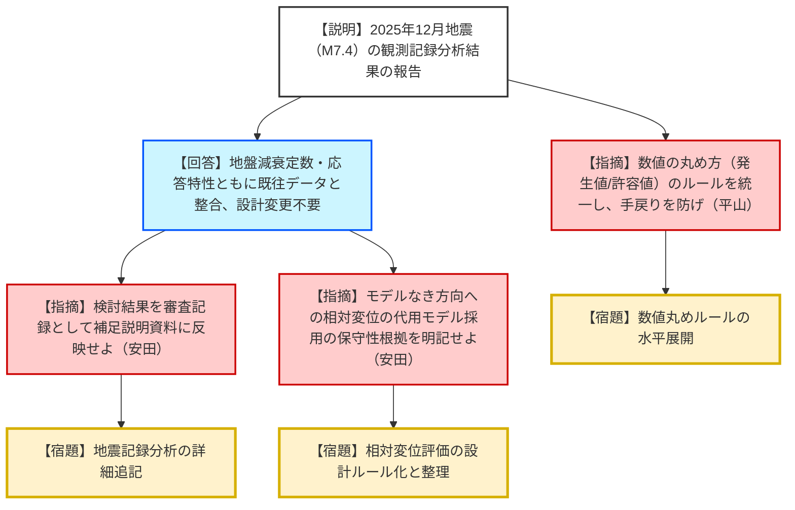
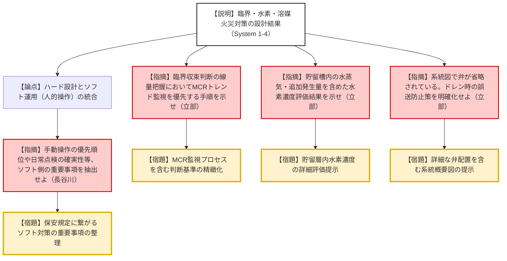
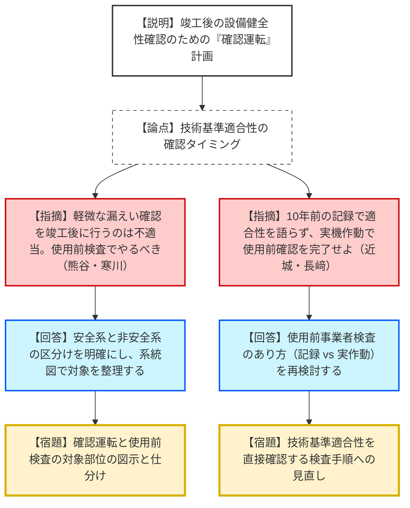

# 第569回核燃料施設等の新規制基準適合性に係る審査会合（令和8年2月09日）
> 出典 : https://youtube.com/live/GKOf-5SMhTc?si=Au0W-HC2xcU19P5-

# 会合の概要

*   **2025年12月地震データの耐震設計への反映:** 敷地近傍で発生した青森県東方沖地震（M7.4）の観測記録を分析した結果、地盤の減衰定数や建屋モデルの応答特性が既往データと整合しており、現在の耐震設計プロセスを変更する必要がないことが確認された。
*   **重大事故対策における「ハードとソフトの連携」の不備:** 臨界事故、水素爆発、溶媒火災対策において、自動作動だけでなく手動バックアップの手順や日常点検の重要性が浮き彫りになった。規制側からは、系統図における弁の省略や運用手順の具体化不足について厳しい指摘がなされた。
*   **「確認運転」と「使用前事業者検査」の境界論争:** 竣工（使用前確認証交付）後に実施予定の「確認運転」において、安全上重要な部位の漏えい確認を行うJNFLの方針に対し、規制側は「それは技術基準適合性を確認する使用前事業者検査として実施すべきではないか」と、制度上の位置付けの整理を強く求めた。
*   **全体計画の実効性への懸念:** 今後の審査項目が急増する計画に対し、規制側から「抜本的な効率化策がない限り、計画倒れになる」との懸念が示され、JNFLは設備のグループ化等による効率化を約束した。

---

# 議題ごとの詳細整理（テキスト）

## 【議題1】再処理施設及び廃棄物管理施設の設計及び工事の計画の認可申請について

### 1. 耐震設計：青森県東方沖地震（2025年12月8日）の観測記録を用いた検討
*   **議論の背景と論点:** 敷地近傍で発生した大規模な地震の観測データが、現在認可を進めている地盤モデルや建屋モデルの妥当性を揺るがすものではないか。
*   **質疑応答（詳細）:**
    *   **【説明者側（JNFL）】**: 震源は想定領域内であり、地盤の減衰定数や建屋応答は既往の地震動特性とよく合致している。耐震設計プロセスに新たな知見を加える必要はない。
    *   **【規制側（安田）】**: 検討結果に異論はないが、審査記録として残す必要があるため、補足説明資料への追記を求める。
    *   **【規制側（安田）】**: 洞道・建物間の相対変位評価において、NS方向（長手方向）のモデルがない場合にEW方向を代用しているが、その保守性の理由をルールとして明記せよ。
    *   **【説明者側（JNFL）】**: 了解した。保守的である理由を含め、設計プロセスのルールとして整理・追記する。

### 2. 重大事故等対処設備（臨界、水素爆発、溶媒火災・爆発）
*   **議論の背景と論点:** SA対策の4システム（臨界収束、水素濃度低減、移送停止、排ガス貯留）の具体的な設計結果と、人的操作（ソフト対策）の実効性。
*   **質疑応答（詳細）:**
    *   **【説明者側（JNFL）】**: 放射線検出器による2-out-of-3論理回路を起点とした自動作動を基本とする。弁の不作動時には中央制御室からの遠隔手動または現場手動にてバックアップする設計。
    *   **【規制側（立部）】**: 臨界事故の収束判断において、現場作業者の被曝低減のため、まずは中央制御室で検知システムのトレンドを確認するプロセスを補足説明資料に含めるべき。
    *   **【規制側（立部）】**: 排ガス貯留層内の水素濃度評価について、水蒸気の影響や貯留中の追加発生量を含めた評価結果を示せ。
    *   **【規制側（立部）】**: 系統図（資料06-10P）において、サンプリングラインとドレンラインの切り替え弁が省略されており、誤った方向へ流れる懸念がある。詳細な系統構成を明示せよ。
    *   **【規制側（長谷川）】**: ハード設計はシンプルだが、手動操作や日常点検といった「ソフト対策」の重要性が高い。現時点では弁の開閉順序などの理解が不十分に見える。後段の保安規定でつまずかないよう、今の段階で重要なソフト対策事項を抽出・検討せよ。
    *   **【説明者側（JNFL）】**: 運用手順と設備を組み合わせ、実効性を高める方向で詳細を整理し、再度説明する。

### 3. ガラス溶融炉等の確認運転
*   **議論の背景と論点:** 長期停止設備（2013年～）の健全性確認のため、竣工後に実施する「確認運転」の内容と法的位置付け。
*   **質疑応答（詳細）:**
    *   **【説明者側（JNFL）】**: 竣工後に非安全系のユーティリティを中心に、漏えいや閉塞がないか実液を用いて確認する。安全系は既存の記録で確認済みとする。
    *   **【規制側（熊谷・寒川）】**: 「軽微な漏えいがないこと」の確認は技術基準適合性の確認そのものではないか。それを竣工後（使用前確認後）に行うのはおかしい。
    *   **【規制側（近城・長﨑）】**: 10年前の検査記録で現在も適合していると言えるのか。実作動で確認できるものは「使用前事業者検査」として実施し、そこで技術基準への適合性を担保すべきだ。
    *   **【説明者側（JNFL）】**: 再処理特有の「竣工」と「操業」の間のリスク管理の難しさがあるが、指摘を踏まえ、どこまでを使用前事業者検査で見るか、再整理して説明する。

### 結論と宿題事項（アクションアイテム）
*   **耐震設計:** 青森県東方沖地震の分析結果および建物評価の妥当性を概ね確認。ただし、相対変位評価の代用モデルの保守性根拠の明記が宿題。
*   **重大事故対策:** ハード設計に加え、手順・訓練・点検等のソフト対策を含めた全体像の再整理が必要。特に系統図における詳細な弁の配置と切り替え手順の明確化が宿題。
*   **確認運転:** 「使用前事業者検査」と「確認運転」の区分けを技術基準適合性の観点でやり直すこと。実液による機能確認を使用前検査に取り込む検討が必須。
*   **全体計画:** スケジュールありきではなく、物量に応じた効率的な説明（類似設備のグループ化）を実施し、保安規定申請に向けた準備を並行して進めること。

---

# 論理構造の可視化（Mermaid）

## 議題1-1：耐震設計（地震記録分析）

## 議題1-2：重大事故等対処設備（SA対策）

## 議題1-3：確認運転と使用前検査の整理

