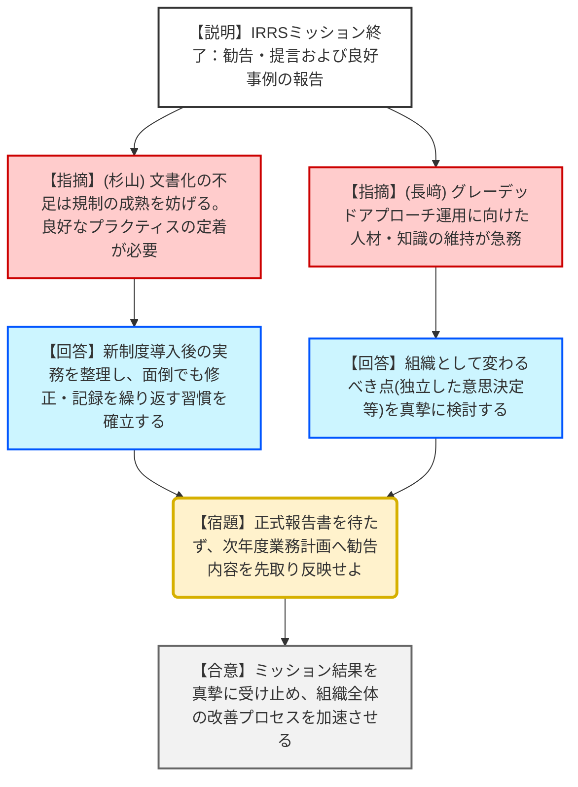
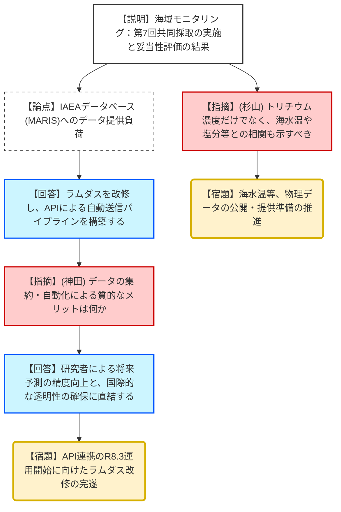
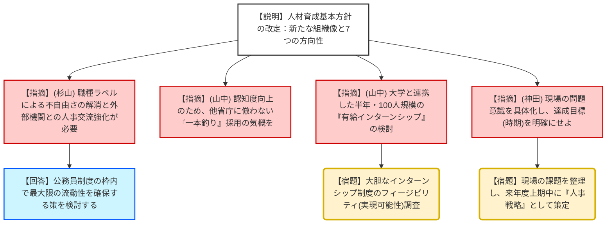
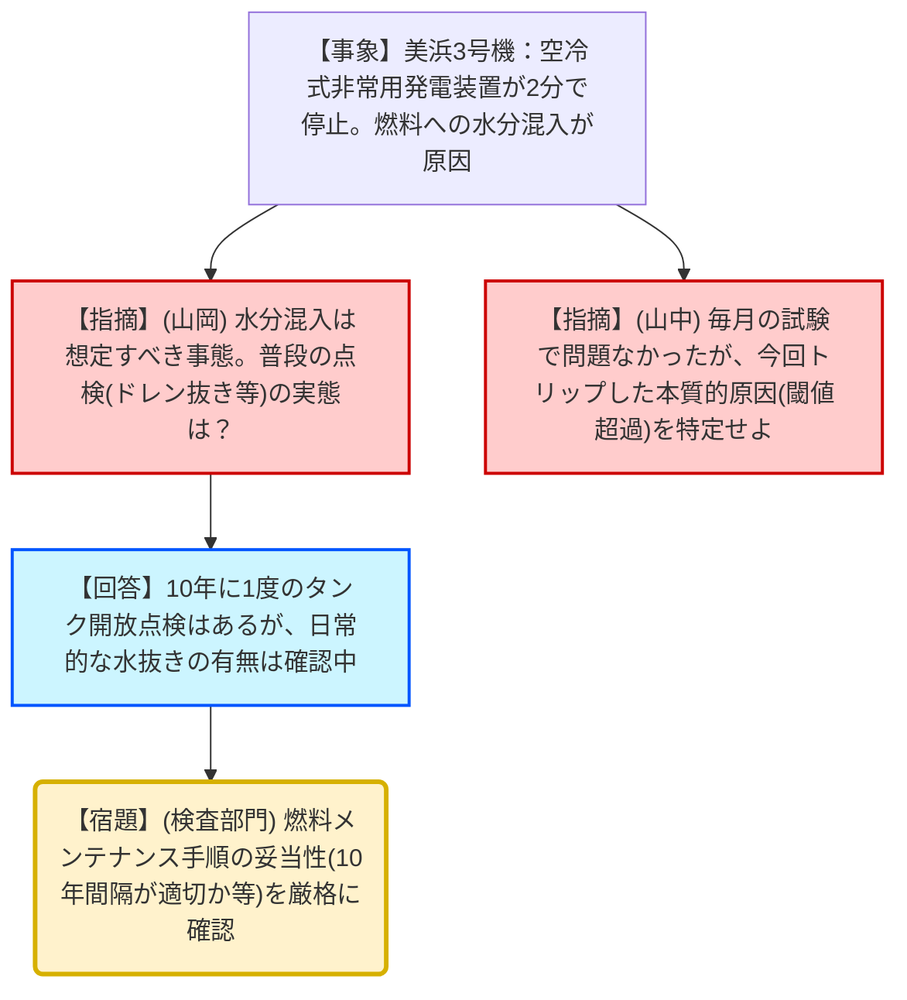

# 第57回原子力規制委員会（令和8年2月10日）
> 出典 : https://youtube.com/live/GygjW-iV8dI?si=SpF3g_uSKqxAQicZ

# 会合の概要
*   **IRRSミッションの総括と課題の明確化:** 2週間にわたるIAEA総合規制評価サービス（IRRS）が終了。日本の規制活動について「良好事例（防災訓練報告会）」が認められた一方、「規制プロセスの文書化不足」や「人材確保・知識維持」について具体的な提言を受けた。
*   **海域モニタリングデータの国際共有の高度化:** 福島県沖の海域モニタリングにおいて、IAEAおよび第三国（中国、ロシア等）との共同採取を継続。膨大なデータをIAEAのデータベース（MARIS）へ自動送信するAPI連携システムの構築（ラムダス改修）が決定され、透明性と効率性の向上が図られた。
*   **人材育成方針の抜本的転換:** 職員の人材育成基本方針改定に向け、採用の認知度向上や「インテリジェントカスタマー（外部知見を正しく評価する能力）」の育成が議論された。山中委員長からは「半年・100人規模の有給インターンシップ」という大胆な提言がなされた。
*   **美浜3号機における非常用発電機の不具合への警告:** 定期試験中の空冷式非常用発電装置の自動停止（燃料タンクへの水分混入が原因）に対し、委員から「非常用設備の生命線である燃料管理の甘さ」について厳しい指摘がなされた。

---

# 議題ごとの詳細整理（テキスト）

## (1) 国際原子力機関（IAEA）の総合規制評価サービス（IRRS）ミッションの結果
*   **議論の背景と論点:** 日本の原子力規制制度が国際基準（IAEA安全基準）に適合しているかを外部評価。規制の「実効性」と、それを支える「組織の成熟度（文書化・人材）」が焦点となった。
*   **質疑応答（詳細）:**
    *   **【説明者側（杉立副主任）】:** 17カ国から23名の専門家が来日。勧告として「グレーデッドアプローチによる実効性強化」「規制実施に必要な知識維持・人材確保」「マネジメントシステムの文書化と実施強化」の3点が示された。良好事例として、事業者との合同防災訓練レビューが挙げられた。
    *   **【規制側（杉山委員）】:** 文書化の不足は、新制度のプラクティスを積み上げている途上であることも一因だが、良好な慣行を定着させるために文書化は不可欠。非常に貴重な指摘である。
    *   **【規制側（長﨑委員）】:** グレーデッドアプローチの運用において、次世代への技術承継が重要。できないことはできないと整理し、我々が変わるべき点を真摯に検討すべき。
    *   **【規制側（山中委員長）】:** 記録を残し、面倒でも修正をかけていく「癖」をつけることが規制機関の成熟に繋がる。報告書の正式受領を待たず、できることから次年度業務計画に反映させるべき。
*   **結論と宿題事項（アクションアイテム）:**
    *   IRRSミッションのドラフト報告書を受理。
    *   **【宿題】**: 事務局にて勧告・提言を分類し、機械的に対応可能な事項と委員会での議論が必要な事項を整理。次年度業務計画への先取り反映を検討する。

## (2) 福島県沖の海域モニタリングの状況
*   **議論の背景と論点:** ALPS処理水放出に伴う海域モニタリングの信頼性確保。膨大なデータの管理・提供に伴う人的負担の軽減と、国際的な透明性の向上が技術的課題。
*   **質疑応答（詳細）:**
    *   **【説明者側（河野専門官）】:** 第7回追加的モニタリングにて、IAEA、韓国、スイス、中国、ロシアの分析機関と共同で海水を採取。
    *   **【説明者側（河野専門官）】:** JAEAによる妥当性評価（95%予測区間を用いた回帰分析）により、トリチウム等の濃度が過去の変動範囲内であることを確認。
    *   **【説明者側（河野専門官）】:** IAEAへのデータ提供が手入力で行われており負担が大きい。ラムダス（JAEAサイト）を改修し、API連携でIAEAのMARISへ自動送信する「データパイプライン」を構築する（R8.3運用開始予定）。
    *   **【規制側（神田委員）】:** 分析機関間比較（ILC）の知見共有は日本の責務。データ集約により期待される質的効果は何か。
    *   **【説明者側（鈴木課長補佐）】:** 研究者による予測分析や、各国の政策決定プラットフォームとしての利便性が飛躍的に向上する。
    *   **【規制側（杉山委員）】:** T-01A地点等、高頻度測定によるデータ蓄積の分析だけでなく、海水温や流向等の物理データとの関連付けも進めるべき。
*   **結論と宿題事項（アクションアイテム）:**
    *   モニタリング状況およびシステム構築方針を了承。
    *   **【宿題】**: 海水温・塩分濃度等の物理データの公開準備を進め、トリチウム拡散状況との相関分析に活用すること。

## (3) 放射線審議会委員の任命
*   **議論の背景と論点:** 任期満了に伴う委員の選任。
*   **結論:** 候補者8名の再任を決定。

## (4) 原子力規制委員会職員の人材育成の基本方針の改定に向けた討議
*   **議論の背景と論点:** 第3期中期目標およびIRRSミッションを受け、持続可能な規制組織のための人材確保・育成戦略の再構築。
*   **質疑応答（詳細）:**
    *   **【説明者側（渡辺課長）】:** 「社会に柔軟に対応する信頼される組織」「多様な人材が集まる魅力ある組織」「専門性と現場力を活かしライフプランに応じた働き方ができる組織」の3つの組織像を提示。
    *   **【規制側（杉山委員）】:** 庁内の流動性（行政職と研究職のラベル分け）が不自由である。専門性の高い独法との人事交流における給与差額の問題など、公務員制度の枠内での限界をどう打破するかが課題。
    *   **【規制側（山岡委員）】:** 研究職は「研究者そのものが売り物」。大学へ積極的に出ていくことで認知度を高めるべき。また、博士号保持者の採用は専門性維持に不可欠。
    *   **【規制側（長﨑委員）】:** 30代後半から40代半ばの中堅層が不足している。実務経験者の採用において、より若い層を引きつける魅力発信が必要。
    *   **【規制側（山中委員長）】:** 認知度向上のため、他省庁に倣うのではなく「一本釣り」の気概で独自採用を進めるべき。また、半年間・100人規模の「有給インターンシップ（単位認定含む）」のような大胆なフロー構築を大学と協議してはどうか。
*   **結論と宿題事項（アクションアイテム）:**
    *   提示された検討の方向性をベースに議論を継続。
    *   **【宿題】**: 現場職員の問題意識（達成目標と時期）を具体化した上で、来年度上期中に「人事戦略」として取りまとめる。

---

# 論理構造の可視化（Mermaid）

## 議題1：IRRSミッション結果報告

## 議題2：海域モニタリングおよびデータ自動化

## 議題4：人材育成方針の改定

## トピックス：美浜3号機 非常用発電機停止

