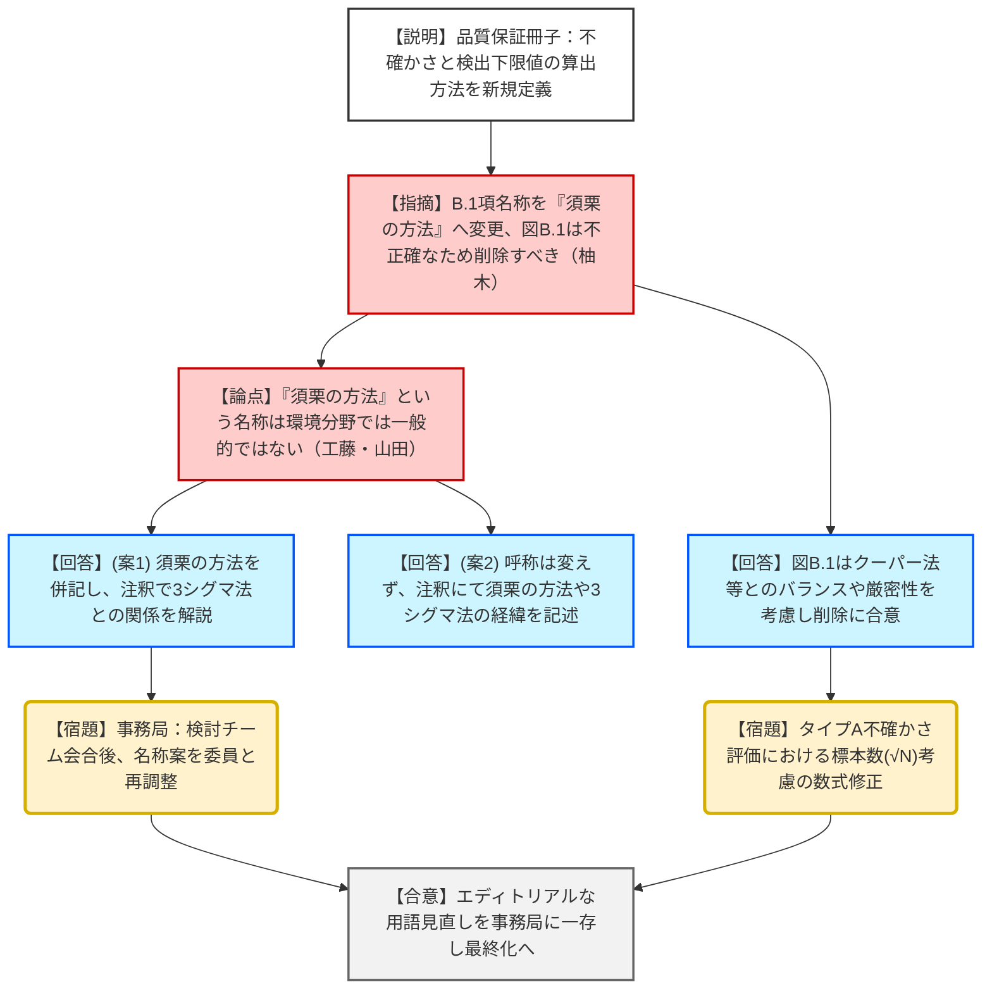
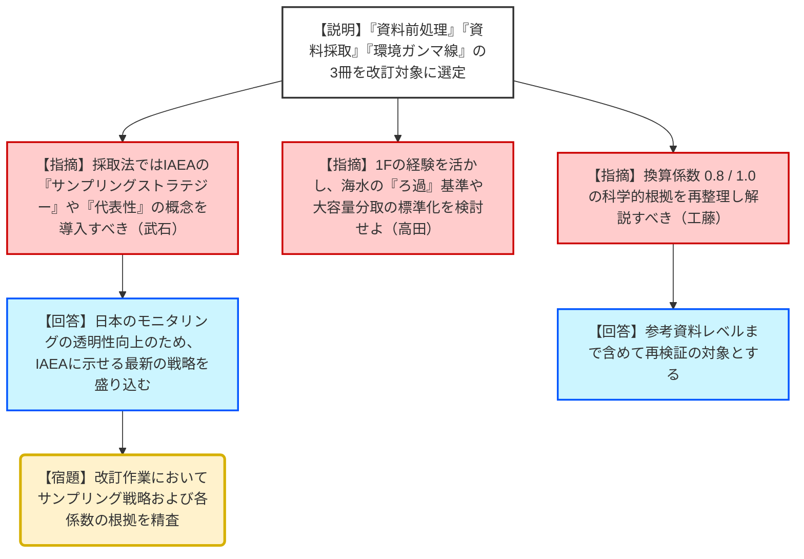
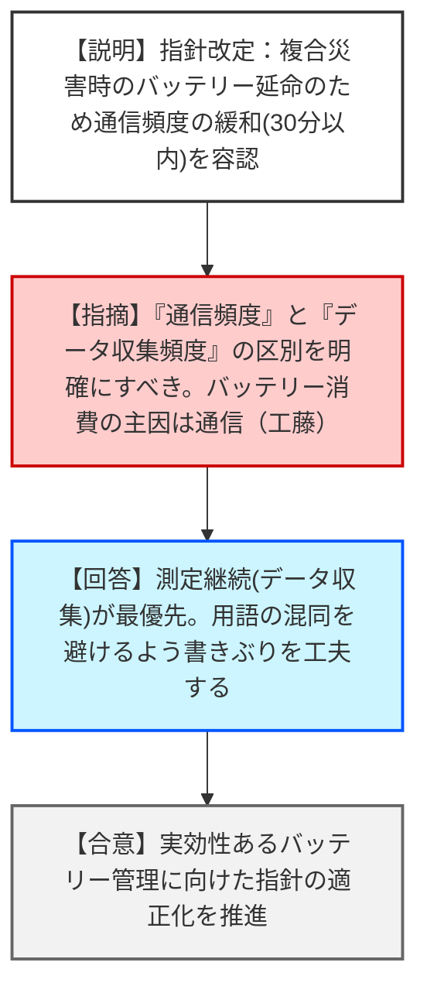

# 第24回環境放射線モニタリング技術検討チーム（令和8年2月10日）
> 出典 : https://youtube.com/live/hA6GKhJLvLY?si=WvFxGfFOkzIuHOLy

# 会合の概要
* **主要3冊子の最終化と実務者目線の徹底:** 2年間にわたって審議された「品質保証」「NaI分析法」「緊急時Sr分析法」の3つの放射能測定法シリーズについて、実務者が混乱せず、かつ科学的妥当性を担保した最終案が合意された。特にNaI分析法は50年ぶりの刷新となる。
* **「検出下限値」の定義を巡る学術的・実務的論争:** 「須栗の方法（3シグマ法）」などの呼称について、専門分野による認知度の違いやISO規格との整合性が議論となった。最終的に、厳密すぎる図解は実務者の誤解を招くとして削除し、用語の定義は事務局で再調整することとなった。
* **サンプリング戦略への転換:** 令和8年度以降の計画において、単なる「採取テクニック」から、IAEAのトレンドである「サンプリングストラテジー（何の目的でどこを測るかという戦略）」を重視した改訂を行う方針が示された。
* **緊急時モニタリングのレジリエンス強化:** 複合災害時におけるモニタリングポストのバッテリー延命のため、通信頻度を30分程度に緩和することを容認する指針改訂が報告された。

---

# 議題ごとの詳細整理（テキスト）

## (1) 放射能測定法シリーズ「放射能測定における品質保証」の新規制定
* **議論の背景と論点:** 測定データの信頼性向上を目的に、ISO/IEC 17025の考え方を導入した新冊子の策定。最大の争点は、解説Bにおける「検出下限値の算出方法（3シグマ法）」の呼称と図解の妥当性。
* **質疑応答（詳細）:**
    * **【規制側】（柚木委員）**: 25ページのB.1項「係数誤差に基づく算出方法」は、内容が「須栗の方法」と一対一対応しているため、名称を「須栗の方法」とすべき。また、26ページの図B.1は説明内容と一致しておらず、実務者が誤解するため削除すべき。
    * **【規制側】（工藤委員）**: 現場では「係数誤差に基づく」という表現の方が浸透しており、変える必要はないのではないか。
    * **【規制側】（武石委員）**: 環境放射能以外の分野（クリアランス等）では「須栗の式」と呼ばれている。耳馴染みがない分野への配慮として併記が妥当。
    * **【規制側】（山田委員）**: ISO11929のときも統計学に寄りすぎて実務者が混乱した。須栗の方法という呼称は一般的ではない。実務者目線を優先し、現状維持（注釈での補足）が良い。
    * **【説明者側】**: 呼称については「（案1）須栗の方法を併記し、注釈で3シグマ法との関係を示す」「（案2）現行のまま注釈で須栗の方法に触れる」の2案で後ほど再調整する。図B.1については、厳密性に欠けるため削除する方向で進める。
    * **【規制側】（黒澤委員）**: 20ページのタイプA不確かさ評価において、繰り返し測定時は標準偏差を $\sqrt{N}$ で割る必要がある。この点の修正を求める。
* **結論と宿題事項:**
    * **結論**: 解説Bの図B.1は削除することを決定。
    * **【宿題】**: 算出方法の名称（須栗の方法の扱い）については、委員の意見を集約し、事務局にて最終案を作成する。タイプA評価の数式修正（ $\sqrt{N}$ ）を反映する。

## (2) 放射能測定法シリーズ「NaI(Tl)シンチレーションスペクトロメータ機器分析法」の改訂
* **議論の背景と論点:** 昭和49年以来の改訂。Ge半導体検出器が主流となった現在、スクリーニング（食品、土壌）に特化したNaIの活用法を再定義。
* **質疑応答（詳細）:**
    * **【規制側】（八塚委員）**: 食品衛生法に基づくスクリーニングは「基準値ありき」の判定法である。一般的なモニタリング目的と混同しないよう整理されていれば問題ない。
    * **【規制側】（武石委員）**: 古いマニュアル（昭和49年版）はアーカイブとして参照可能にすべき。
    * **【説明者側】**: 公用文の定義に照らしてブラッシュアップし、アーカイブ化も進める。
* **結論と宿題事項:**
    * **結論**: 最終案を承認。事務局によるエディトリアルな修正を経て、令和8年6月完成を目指す。

## (3) 放射能測定法シリーズ「緊急時における放射性ストロンチウム分析法」の新規制定
* **議論の背景と論点:** 1F事故の教訓から、迅速なSr分析（Sr-89/90）手法をIAEAレポート等に基づき体系化。
* **質疑応答（詳細）:**
    * **【規制側】（八塚委員）**: カラム抽出剤（クラウンエーテル樹脂）について、商品名を出さないと現場が混乱する。特定の商品を想定している情報は提供すべきではないか。
    * **【説明者側】**: 公文書として特定メーカー名は避けるが、自治体向けの研修事業等で具体的な使用例やノウハウを共有する「二本立て」で対応する。
* **結論と宿題事項:**
    * **結論**: 研修事業との連携による実務補完を前提に、最終案を承認。

## (4) 令和8年度以降の放射能測定法シリーズの制改訂計画（案）
* **議論の背景と論点:** 「資料前処理」「資料採取法」「環境ガンマ線測定法」の3冊の改訂計画。
* **質疑応答（詳細）:**
    * **【規制側】（武石委員）**: 単なる採取技術の解説だけでなく、IAEAが重視する「サンプリングストラテジー（戦略）」や「代表性（1mずれただけで濃度が変わる土壌等の扱い）」の考え方を導入すべき。
    * **【規制側】（高田委員）**: 事故後の経験から、海水の「ろ過」の有無や、数百リットルを均一化してから分取する手法の標準化を検討してほしい。
    * **【規制側】（工藤委員）**: 環境ガンマ線測定法に関連し、空気吸収線量から実効線量への換算係数「0.8」の根拠が不明確。改訂時に整理を望む。
* **結論と宿題事項:**
    * **【宿題】**: 令和8〜9年度の改訂作業において、IAEAの最新知見（戦略、代表性）や、国内の事故対応経験（ろ過、換算係数根拠）を盛り込む検討を行う。

## (5) その他の原子力施設（人形峠、東芝）における平常時モニタリング
* **議論の背景と論点:** 廃止措置中等の施設周辺における、合理的かつ実効的なモニタリング範囲と項目の設定。
* **質疑応答（詳細）:**
    * **【規制側】（武石委員）**: 人形峠において、漏えい検知の指標としてウラン235（低濃縮のため微量）よりも、周辺に豊富にある「ラジウム226」との比率や動きを見る方が科学的。岡山県独自の調査（ラジウム等）を制限しないよう配慮すべき。
    * **【規制側】（工藤委員）**: 6フッ化ウランから生成されるフッ化水素（HF）の測定を不要とした根拠は。
    * **【説明者側】**: 現在の保管状態（シリンダ内、非加熱）では大規模漏えいの可能性が極めて低いため。ただし、加熱処理を伴う将来の工程（2段階目）では再検討する。
* **結論と宿題事項:**
    * **結論**: 人形峠および東芝の平常時モニタリング案を合意。

---

# 論理構造の可視化（Mermaid）

## 議題1：品質保証ガイドの算出方法名称・図解

## 議題4：令和8年度以降の制改訂計画

## 議題6：緊急時モニタリング指針の改定（その他）

