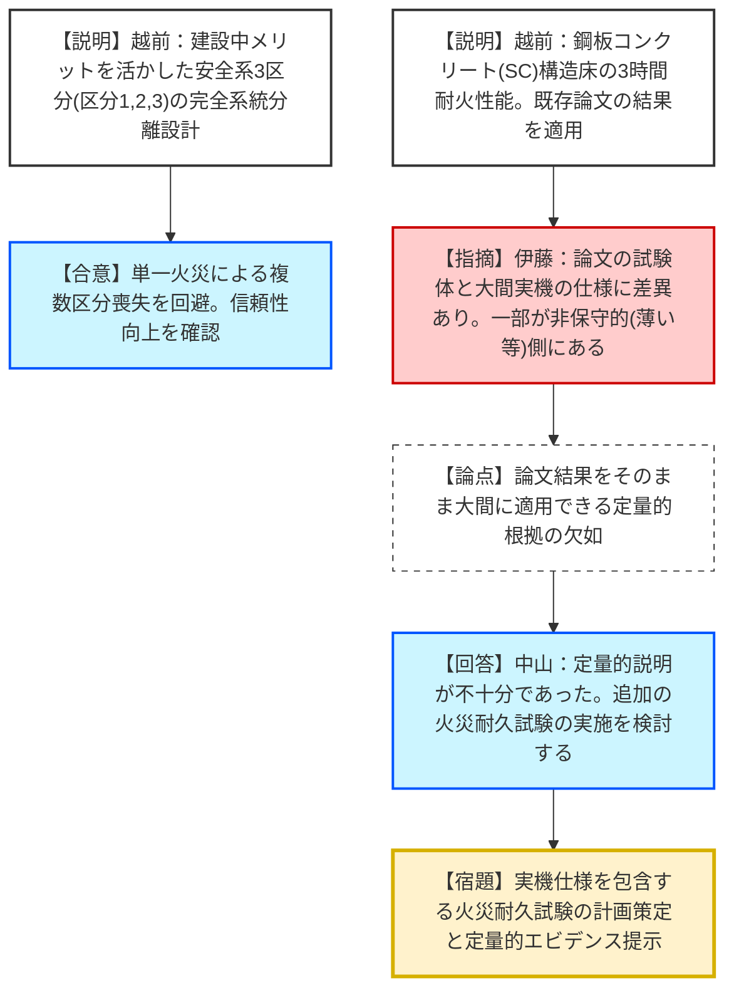
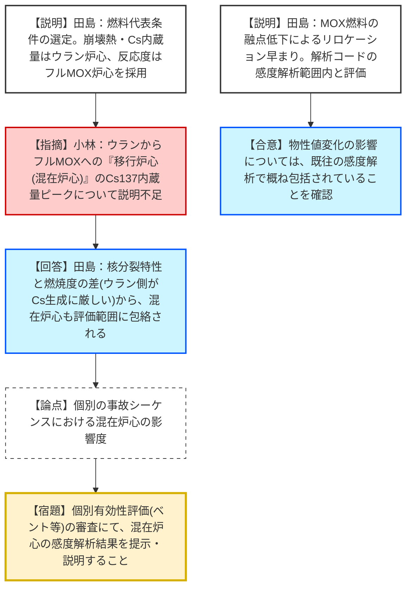

# 第1390回原子力発電所の新規制基準適合性に係る審査会合（令和8年2月12日）
> 出典 : https://youtube.com/live/qEGw9CFuOOQ?si=NIF_BSAfksCunenk

# 会合の概要
* **鋼板コンクリート（SC）構造の耐火性能への疑義：** 大間発電所特有の設計である「鋼板コンクリート構造床」の3時間耐火性能について、規制庁は事業者（電源開発）が提示した既存論文の引用による「定性的説明」を認めず、実機仕様に基づいた「火災耐久試験の実施」を含む定量的根拠の提示を厳格に求めた。
* **フルMOX炉心への移行過程における安全評価の妥当性：** ウラン炉心からフルMOX炉心へ至る「移行炉心（混在炉心）」において、崩壊熱やセシウム137内蔵量などがウラン平行炉心に包絡されるとする事業者の論理について、規制側は移行段階の詳細な感度解析を用いた補足説明を要求した。
* **建設中プラントのメリットを活かした系統分離：** 大間ではケーブル敷設前という利点を活かし、安全系区分1、2、3の「3区分完全系統分離」を採用。火災時の影響を一区分に限定する設計方針については、信頼性向上の観点から有効性が認められた。

---

# 議題ごとの詳細整理（テキスト）

## 1. 火災による損傷の防止（第8条、第41条）
* **議論の背景と論点:**
  建設中プラントの特性を活かした「安全系3区分分離」の有効性と、大間特有の「鋼板コンクリート（SC）構造床」を耐火壁として扱う際の妥当性が焦点となった。
* **質疑応答（詳細）:**
    * **【説明者側（電源開発：越前氏）】:** 安全系区分1～3を完全に火災区域で分離し、単一火災の影響を限定する。また、SC構造（厚さ300mm）については、加熱4時間でも破壊されないとする既存の学術論文の結果を引用し、3時間の耐火性能を有すると説明した。
    * **【規制側（規制庁：伊藤氏）】:** 基準では「火災耐久試験による確認」が原則である。引用された論文の試験体仕様（リブ断面積比やリブ性等）を確認すると、大間の実機仕様は論文の条件よりも「非保守的（耐火性能が低くなる側）」な部分が含まれている。論文の結果をそのまま大間に適用できるとする根拠が不十分である。
    * **【説明者側（電源開発：中山氏）】:** 定量的根拠に基づく説明が不足していた。大間の実機仕様を包含・補完するため、追加の火災耐久試験の実施を検討し、具体策を提示する。
* **結論と宿題事項（アクションアイテム）:**
    * **結論：** SC構造床の3時間耐火性能については、論文の流用ではなく実機仕様を考慮した「具体的・定量的根拠」が必要であると結論づけられた。
    * **【宿題】:** 電源開発は、SC構造の耐火性能を立証するための追加試験の条件・計画を策定し、改めて説明すること。

## 2. 重大事故等対策の有効性評価における燃料の代表条件の設定
* **議論の背景と論点:**
  大間はフルMOX燃料を使用するが、初期のウラン炉心から段階的にMOXへ移行する。この「混在（移行）炉心」が、既に評価済みのウラン炉心またはフルMOX炉心のいずれかに包絡され、代表性が担保されているかが論点。
* **質疑応答（詳細）:**
    * **【説明者側（電源開発：田島氏）】:** 崩壊熱およびセシウム137内蔵量は、燃焼度の高いウラン炉心が最大（最厳）となる。ボイド係数やボロン反応度はフルMOX炉心が最厳。移行炉心（混在炉心）はこれら両極のケースの間に収まるため、ウラン/フルMOXの2点評価で代表性は確保されている。
    * **【規制側（規制庁：小林氏）】:** セシウム137内蔵量について、ウラン平行炉心とフルMOX平行炉心の比較のみでは、その間の「移行過程」で内蔵量がピークを迎えないことの説明が不足している。移行サイクルごとの取り替え体数や燃焼度の変化を踏まえた説明が必要。
    * **【説明者側（電源開発：田島氏）】:** 核分裂回数や放出エネルギーあたりの生成率、平均燃焼度の差（ウラン側が約3割高い）から、混在炉心でもウラン炉心を上回ることはない。今後の個別シーケンス（ベント等）の審査において、混在炉心を考慮した感度解析結果を提示する。
* **結論と宿題事項（アクションアイテム）:**
    * **結論：** 燃料の代表条件の考え方自体はおおむね理解されたが、移行炉心の挙動については個別の有効性評価（各事故シーケンス）の中で詳細を確認することとなった。
    * **【宿題】:** 個別シーケンス（核燃料放出低減対策等）の審査において、混在炉心を用いた感度解析結果を含め、代表性の根拠を資料化すること。

---

# 論理構造の可視化（Mermaid）

## 議題1：内部火災対策（SC構造・系統分離）

## 議題2：有効性評価における燃料代表条件

