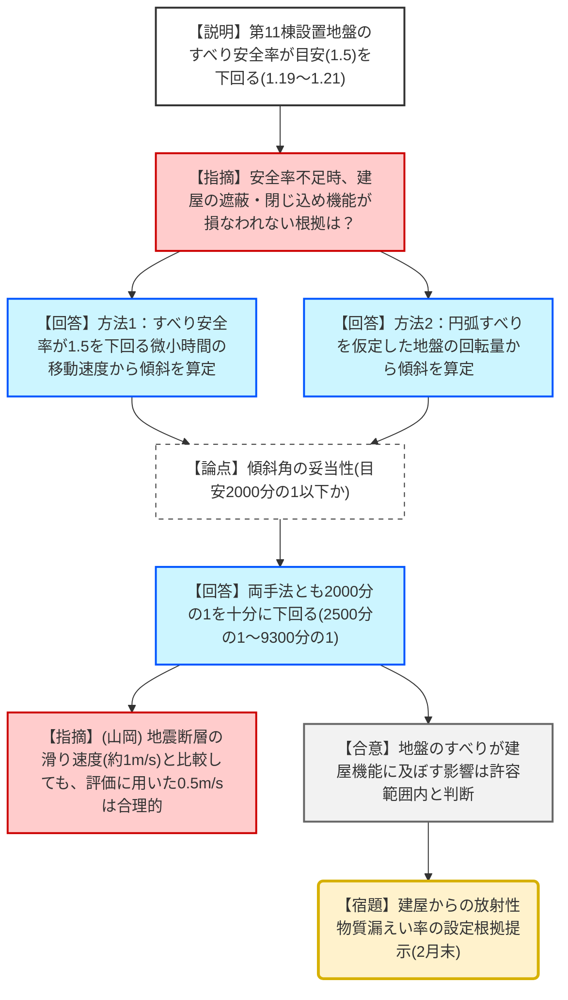
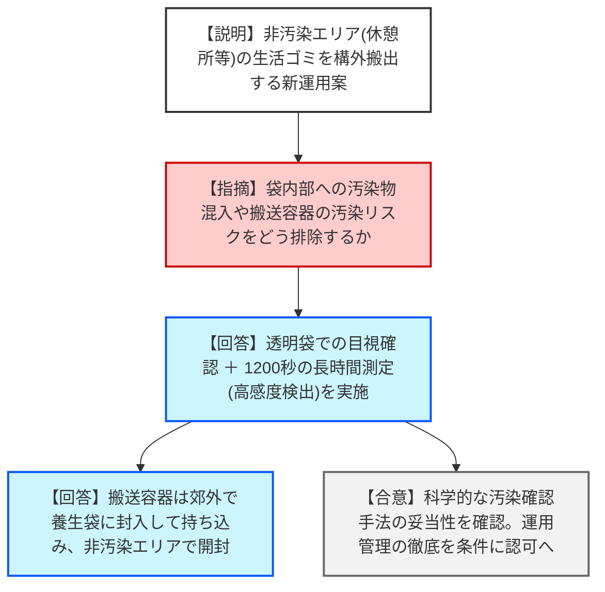
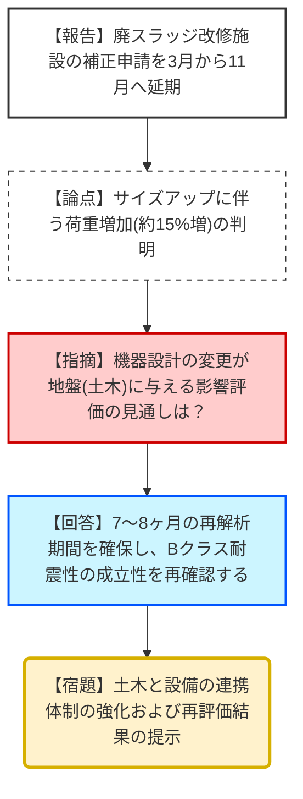

# 第29回特定原子力施設の実施計画の審査等に係る技術会合（令和8年2月12日）
> 出典 : https://youtube.com/live/izacJqCAbUo?si=eTsrn6BMmNds9Ts5

# 会合の概要
* **固体廃棄物貯蔵庫第11棟の地盤安定性評価:** 基準地震動SS900を用いた評価において、すべり安全率が目安の1.5を下回る結果（1.19〜1.21）となった。これに対し、東京電力は「すべり発生時の建屋の傾斜」を2つの手法で定量評価し、目安値（2000分の1）を十分に下回ることを立証。山岡委員からも評価手法の妥当性について概ね理解が得られた。
* **検査実施要領の抜本的改正:** 1Fの審査・検査の改善に向け、溶接検査の使用前検査への統合や、施設定期検査の保安検査への移行を含む実施要領の改正案が提示された。2026年4月1日からの施行に向け、現場運用に支障がないよう東京電力と規制庁間の調整を継続する。
* **非管理区域廃棄物の構外搬出:** 構内休憩所等から発生する生活ゴミを一般廃棄物処分場へ搬出する新運用について議論。測定時間1200秒による高度な汚染確認プロセスが示され、技術的論点は解消した。
* **設計変更によるスケジュール遅延:** 廃スラッジ改修施設において、構造部材のサイズアップに伴う荷重増加が判明し、基礎の再評価が必要となったため、補正申請時期が2026年3月から11月へ大幅に延期されることが報告された。

---

# 議題ごとの詳細整理（テキスト）

## 1. 個体廃棄物貯蔵庫第11棟の設置に関する実施計画の変更認可申請
* **議論の背景と論点:** 屋外保管が続くコンテナ等のがれき類を早期に屋内収容するため、大容量の第11棟（地下1階・地上5階）を新設する。設置場所の地盤において、すべり安全率が1.5を下回った際、建屋の閉じ込め・遮蔽機能が維持されるか（傾斜が許容範囲内か）が技術的争点となった。
* **質疑応答（詳細）:**
    * **【説明者側（東電）】**: SS900による評価の結果、最小すべり安全率は1.19（BB断面）となった。安全率が1.5を下回るわずかな時間（0.03〜0.13秒）における「建屋の移動速度（方法1）」と「円弧すべりによる回転量（方法2）」から傾斜を算定した。結果は最大でも2500分の1〜9300分の1程度であり、目安値である2000分の1を下回る。
    * **【規制側（山岡委員）】**: 方法1の速度0.5m/sという前提に対し、断層運動の滑り速度（約1m/s）とのオーダー比較も含め、2つの独立した手法で評価している点は評価できる。
    * **【規制側（正岡）】**: 方法2において、建屋基礎だけでなく「すべり面上」の地盤要素の速度も確認しているか。
    * **【説明者側（東電）】**: すべり面付近の速度も最大0.4m/s程度であることを確認済み。
    * **【規制側（正岡）】**: 北側エリアは5・6号機の盛土等の履歴があり地質が複雑である。土石流・排水対策において、北側排水路の整備状況や評価スケジュールはどうなっているか。
    * **【説明者側（東電）】**: 現在、140mm/hの降雨強度基準に基づき排水計画を策定中であり、万全を期す。
    * **【規制側（三留）】**: 地下1階の1Sv/h級高線量廃棄物の搬入において、被曝低減対策はどう考えているか。
    * **【説明者側（東電）】**: 第9棟等で実績のある「遠隔操作フォークリフト」を展開する。
* **結論と宿題事項（アクションアイテム）:**
    * **【結論】**: 地盤安定性に関する技術的評価手法については妥当と判断された。
    * **【宿題】**: 東電は、残された論点である「建屋からの環境中放出量（漏えい率）」の設定根拠を2月末までに提示すること。3月末の認可を目指し、審査を加速させる。

## 2. 実施計画検査実施要領の改正案について
* **議論の背景と論点:** 特定原子力施設の規制の合理化・実効性向上を目的とした、規則改正（下位規定の整備）に伴う手続きの整理。
* **質疑応答（詳細）:**
    * **【説明者側（規制庁）】**: 検査種別を使用前・保安・核防護・その他の4種類に再編。溶接検査を使用前検査に統合し、施設定期検査を保安検査に包含させる。
    * **【説明者側（東電）】**: 規則改正の内容が反映されていることを確認。事務的な窓口が「検査課」から「1F室」へ一本化される等の運用面について、現場と調整したい。
* **結論と宿題事項（アクションアイテム）:**
    * **【結論】**: 2026年4月1日の施行を了承。
    * **【宿題】**: 規制庁（1F室）は、東電と現場レベルでの細かな事務手続き（報告時期等）について調整を行う。

## 3. 非管理区域等から発生する廃棄物の管理に関する実施計画
* **議論の背景と論点:** 休憩所等の非汚染エリアから発生する生活ゴミを構外へ搬出することで、構内焼却炉の負荷を軽減する。
* **質疑応答（詳細）:**
    * **【説明者側（東電）】**: 透明な袋による目視確認、スミヤ法による1200秒の精密測定（検出限界0.15Bq/cm²）、封印容器による搬出を行う。
    * **【規制側（松田）】**: 再利用する搬出容器が管理区域を通過する際、中に入れた生活ゴミが汚染されるリスクはないか。
    * **【説明者側（東電）】**: 容器は郊外で袋に入れ養生した状態で搬入し、休憩所境界で取り出す。万一、汚染が確認されれば構内処分へ切り替える。
    * **【規制側（長﨑）】**: スミヤ法は袋の表面しか見られない。袋内部への汚染物品（不使用の防護具等）混入をどう防ぐのか。
    * **【説明者側（東電）】**: そもそも「汚染の恐れがない区域」での運用だが、作業員への理解教育と持ち込み管理を徹底する。
* **結論と宿題事項（アクションアイテム）:**
    * **【結論】**: 汚染管理プロセスの妥当性を確認。認可に向けた補正書の提出へ。

## 4. その他（廃スラッジ改修施設等の状況）
* **議論の背景と論点:** 津波対策として進めている廃スラッジ（高放射性スラッジ）回収の設計進捗とスケジュール。
* **質疑応答（詳細）:**
    * **【説明者側（東電）】**: 屋外収納ユニットの耐震性向上のため、コンテナの柱・梁をサイズアップした結果、機器重量が増加（1770kN→2073kN等）。これにより基礎地盤の再評価が必要となったため、補正申請を2026年3月から11月へ延期する。
    * **【規制側（正岡）】**: 機器設計のブレ幅が通常の原子炉施設（標準プラント）より大きい。土木と設備側の連携・スケジュール管理を強化すべき。
* **結論と宿題事項（アクションアイテム）:**
    * **【結論】**: 2028年度の改修着手時期に変更がないことを確認し、スケジュールの延期を了承。

---

# 論理構造の可視化（Mermaid）

## 議題1：第11棟地盤安定性評価の論理構造

## 議題3：非管理区域等廃棄物の構外搬出プロセス

## 議題4：廃スラッジ改修施設の設計変更・遅延要因

