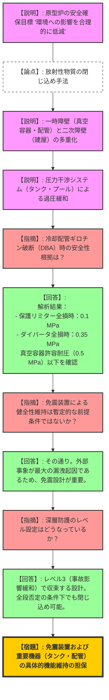
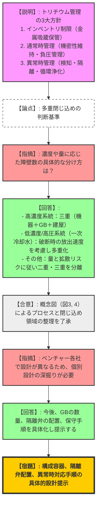
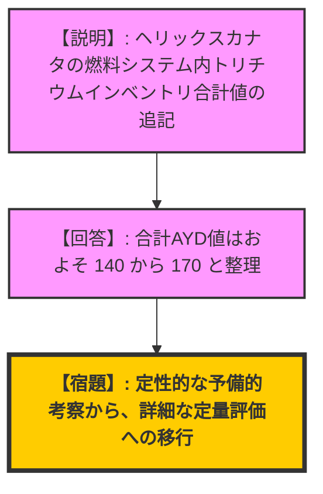

# 第5回フュージョン装置の開発を進める事業者等との意見交換会合（令和8年2月13日）
> 出典 : https://youtube.com/live/XPpPbzTWRXM?si=d1pp19gZaGAspBQO

## 1. 会合の概要
*   **最大の争点:** 放射性物質（主にトリチウム）の「多重閉じ込め構造」の妥当性と、大規模配管破断や巨大地震といった極端な設計基準事象（DBA）に対する機能維持の論証。
*   **審査の進捗状況:** QSTが原型炉概念に基づき、冷却水漏洩時の圧力推移等の具体的な安全解析結果を提示。FAST（Starlight Engine/京都フュージョニアリング）は、トリチウムの「濃度・量・圧力」に応じた閉じ込め階層の設計思想を明確化した。
*   **規制側の納得度:** 規制庁側は、各事業者の設計思想（特に濃度に応じた多重化の考え方）に対し「分かりやすい」と一定の評価を示した一方、免震装置等の外部事象対策が「前提条件」に依存している点を指摘し、個別具体的な設計進展に合わせたさらなる論証を求めた。
*   **特筆すべき決定事項:** 次回会合（3月13日）に向け、各事業者はさらに具体的な設計詳細（隔離弁の配置、構成容器の仕様等）に基づいた議論を進めることで合意した。

---

## 2. 議題ごとの詳細整理

### 【議題1-(1)】QST：ITERサイズ原型炉の事象分析と閉じ込め方針
*   **議論の背景と論点:** 原型炉における放射性物質の閉じ込め機能を、冷却配管のギロチン破断（大規模破断）や地震動に対してどのように担保するか。特に冷却剤のエンタルピーが高い原型炉特有の過圧リスクへの対処が論点となった。
*   **質疑応答（詳細）:**
    *   【説明者側（QST）】: 安全上の特徴として、プラズマは不純物の混入等で自己停止する特性がある。閉じ込めは「一次障壁（真空容器等）」「二次障壁（建屋等）」の多重構造とし、圧力干渉システム（サプレッションタンク/プール）で過圧を緩和する設計である。
    *   【規制側（浜口）】: 設計基準事象（DBA）の想定範囲について詳しく説明してほしい。
    *   【説明者側（QST）】: 解析では「発生防止設備の破損」と「緩和設備の単一故障」を重畳させている。具体的には、プラズマ停止失敗による機器衝突と、遮断弁が閉じずに冷却水が全量流出する過酷な条件（X-best評価）で、真空容器の許容耐圧（0.5 MPa）を下回ることを確認した。
    *   【規制側（森下）】: 免震装置によって外部漏洩を防げるという結論は、現時点では「設計未定の部分を前提とした暫定評価」ではないか。また、外部事象（地震）が最大の漏洩起因となると考えてよいか。
    *   【説明者側（QST）】: その通り。現在検討中の原型炉概念をベースにした安全解析結果であり、外部事象が重要な起因事象になると認識している。
    *   【規制側（浜口）】: 深層防護の観点から、事故発生防止と影響緩和のレベルをどう考慮しているか。
    *   【説明者側（QST）】: 閉じ込め機能が次々と否定される前提（全段否定）での解析を行っており、深層防護のレベル3（事故の影響緩和）で事象を収束させる設計となっている。
*   **結論と宿題事項:**
    *   **結論:** 大規模冷却配管破断時でも圧力干渉系により真空容器の健全性が維持される見通しが得られた。
    *   **条件:** 免震装置による建屋健全性維持が前提。
    *   **宿題:** 免震装置および接続配管（ベローズ等）の具体的な設計進展に応じた再評価が必要。

### 【議題1-(2)】FAST：閉じ込め設計方針について
*   **議論の背景と論点:** ベンチャー企業等が開発する中小型装置において、トリチウムの「インベントリ（内包量）」や「濃度」の違いをどのように閉じ込め設計（二重・三重）に反映させるか。
*   **質疑応答（詳細）:**
    *   【説明者側（FAST）】: トリチウムの量・濃度・圧力に応じてバウンダリを設計する。高濃度の燃料サイクル系統はグローブボックス（二次障壁）内に配置し、不活性ガス循環と負圧維持を行う。異常検知時は隔離運転・循環浄化に切り替える。
    *   【説明者側（京都フュージョニアリング）】: 補足として、一次冷却水のように「濃度は低いが量が多く圧力がある」ものは、破断時の漏洩速度が早いため、濃度が低くても多重の対策が必要となる。ケースバイケースで障壁数を決定する。
    *   【規制側（森下）】: 提示された閉じ込め概念図（図3, 図4）は非常に分かりやすい。
    *   【規制側（森下）】: ただし、各事業者がオリジナルな装置を開発しているため、共通ルール化が難しい。具体的に「構成容器」をどう作るか、どこに「隔離弁」を置くかといった個別設計の情報を得ないと、リスクの把握が困難である。
    *   【説明者側（FAST）】: 配置設計や建屋設計を踏まえ、今後グローブボックスの数量や配置、隔離の具体的手順を定めていく。
*   **結論と宿題事項:**
    *   **結論:** 「量・濃度・圧力」に応じた段階的な閉じ込め思想について、規制側との共通認識が形成された。
    *   **宿題:** 異常時の自動隔離ロジックや、構成容器の具体的仕様、保守手順等、より詳細な設計情報の提示。

---

## 3. 論理構造の可視化（Mermaid）

### 議題1-(1): QST 原型炉の事象分析と閉じ込め論理

### 議題1-(2): FAST 閉じ込め設計方針の論理

### 議題2: その他（Helical Fusion 資料修正）
*   **内容:** 前回提示のトリチウムインベントリ資料に、分散性トリチウムの合計AYD値（140～170）を追記。
*   **規制側確認:** データの性質（暫定/予備的考察）を再確認し、今後の詳細解析の進展を求めた。

