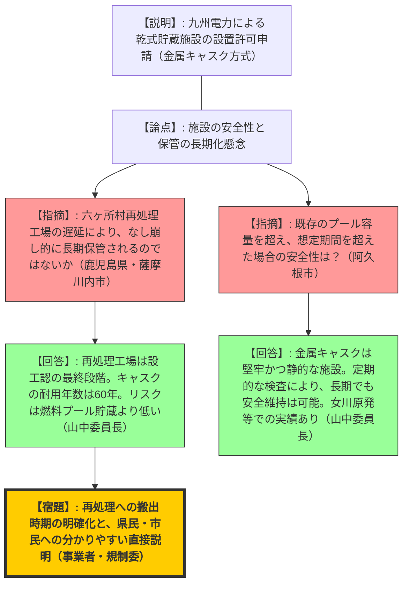
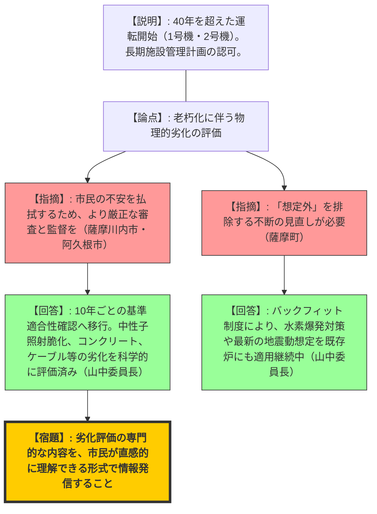
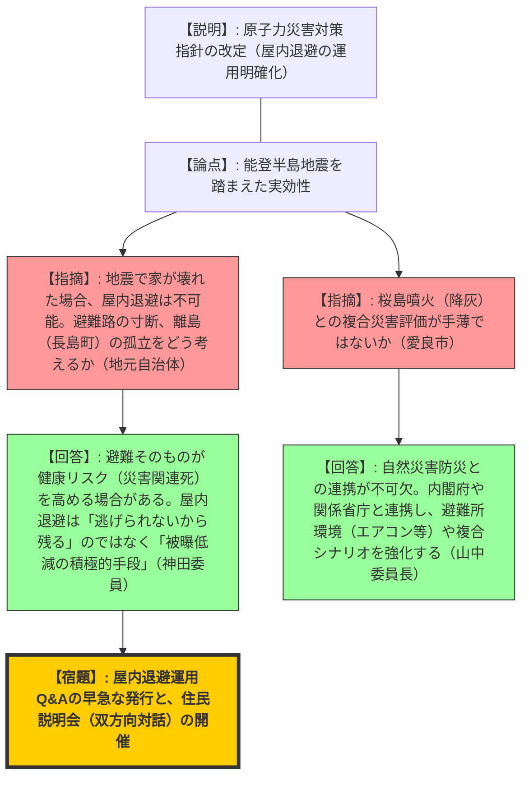
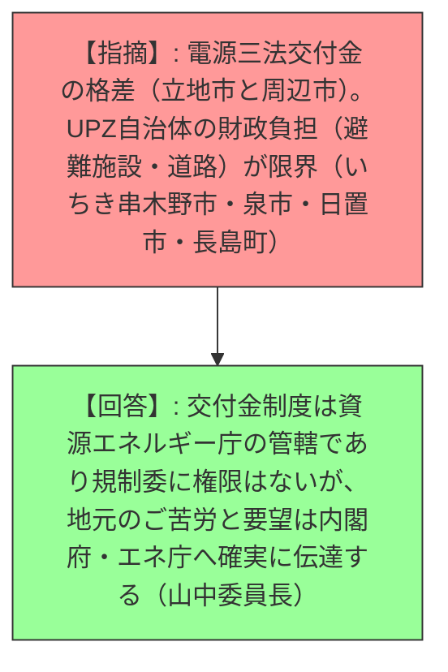

# 山中委員長と神田委員が鹿児島県原子力防災センターで川内原子力発電所に関する地元関係者及び事業者との意見交換（令和8年2月14日）
> 出典 : https://youtube.com/live/j727EOJlbwo?si=fVJbZYZ_Jw1rlJr2

## 1. 会合の概要
*   **最大の争点:** 40年超運転および乾式貯蔵施設設置に伴う「安全性の定量的担保」と、能登半島地震を踏まえた「複合災害時の屋内退避の実効性」に対する地元自治体の強い懸念。
*   **審査の進捗状況:** 乾式貯蔵施設は設置変更許可の審査段階にあり、高経年化対策（40年超運転）については長期施設管理計画の認可を完了し、10年ごとの継続的な監視フェーズに移行している。
*   **規制側の納得度:** 規制委員会は、乾式貯蔵の技術的リスクは低いと判断しているが、地元側は「なし崩し的な長期保管（最終処分場化）」を極めて強く警戒しており、技術的納得感と感情的な安心感に大きな乖離が見られる。
*   **特筆すべき決定事項:** 屋内退避の具体的な運用指針（Q&A）を近々発行し、規制委員自らが地元へ出向いて双方向の説明会（シンポジウム等）を開催する体制を整えることで合意。

---

## 2. 議題ごとの詳細整理

### 【議題1】施設視察の所感と重大事故等対処施設の運用
*   **議論の背景と論点:** 山中委員長・神田委員による川内原発の特定重大事故等対処施設（特重施設）等の視察結果報告。
*   **質疑応答（詳細）:**
    *   【説明者側（山中委員長）】: 特定重大事故等対処施設、緊急時対策所、監視機貯蔵施設（乾式貯蔵施設）の建設予定地を視察。特重施設は完成しており、内部の堅牢さと重大事故への対策が整ったことを確認した。
    *   【説明者側（神田委員）】: 24時間365日の初動体制構築における職員の負荷と緊張感を実地で確認。非常に高いレベルの備えがなされている。
    *   【説明者側（九州電力・西山社長）】: 特重施設および緊急時対策所の完成により、安全確保の備えがより高まった。今後も安全安定運転に努める。
*   **結論と宿題事項:**
    *   重大事故等対処施設の物理的な完成と運用体制を確認。
    *   【宿題】事業者は、施設のハード面に頼るだけでなく、維持管理と職員の訓練を継続し、緊張感を維持すること。

### 【議題2】乾式貯蔵施設の設置許可申請と燃料サイクル
*   **議論の背景と論点:** 九州電力が申請した乾式貯蔵施設の安全性と、六ヶ所村再処理工場の遅延に伴う「一時的保管」の長期化への懸念。
*   **質疑応答（詳細）:**
    *   【説明者側（鹿児島県・塩田知事）】: 乾式貯蔵施設の厳格な審査と、県民への分かりやすい説明を要求。現時点での審査上の懸念点はあるか。
    *   【説明者側（山中委員長）】: 金属キャスクを用いた乾式貯蔵は燃料ピット（プール）貯蔵よりリスクが低い。女川原発等での審査実績もあり、技術的な課題や大きな懸念はない。
    *   【規制側（薩摩川内市・田中市長）】: 「一時的」と言いつつ長期化し、最終処分場化することを市民は極めて強く懸念している。
    *   【規制側（阿久根市・西平市長）】: 六ヶ所村の再処理工場が稼働しない場合、乾式貯蔵施設の容量を超えるのではないか。
    *   【説明者側（山中委員長）】: 六ヶ所村の再処理工場は設工認（設計及び工事の計画の認可）の最終段階にある。キャスクの設計耐用年数は60年であり、静的な施設として安全性は確保される。
*   **結論と宿題事項:**
    *   乾式貯蔵の技術的安全性については実績があり、大きな懸念なし。
    *   【宿題】「一時的保管」の定義と、六ヶ所村への搬出計画の確実性について、事業者は地元への透明性の高い説明を継続すること。

### 【議題3】高経年化（40年超運転）への対応と安全規制
*   **議論の背景と論点:** 1号機・2号機が40年を超えて運転することに対する設備の劣化評価と、最新知見の反映（バックフィット）。
*   **質疑応答（詳細）:**
    *   【説明者側（薩摩川内市・田中市長）】: 高経年化に対する市民の不安が強い。適切な監督指導と厳正な審査を求める。
    *   【説明者側（山中委員長）】: 長期施設管理計画の認可により、40年から50年目までの基準適合性を確認済み。中性子照射脆化、コンクリート劣化、ケーブル劣化等を10年ごとにきめ細かく評価する制度（バックフィット含む）を運用している。
    *   【規制側（薩摩町・墨副町長）】: 「想定外」を生まない姿勢を徹底してほしい。
    *   【説明者側（山中委員長）】: 水素爆発対策や震源を特定しない地震動の想定など、新しい知見は随時基準に反映（バックフィット）させている。
*   **結論と宿題事項:**
    *   現時点での10年間の運転継続に関する技術的基準適合性は確認済み。
    *   【宿題】今後10年間の劣化予測の妥当性について、日々の検査を通じて監視を継続すること。

### 【議題4】能登半島地震を踏まえた複合災害対策と屋内退避
*   **議論の背景と論点:** 能登半島地震を受け、道路寸断等の複合災害時に「屋内退避」が現実的に機能するのかという疑義。
*   **質疑応答（詳細）:**
    *   【規制側（鹿児島市長、いちき串木野市長、愛良市副市長、長島町副町長）】: 地震で家が壊れた中で屋内退避ができるのか。火山灰（桜島）との複合災害はどう評価されているのか。
    *   【説明者側（神田委員）】: 福島事故の教訓は「無計画な避難のリスク」である。健康状況により屋内退避が最適な場合もある。現在、具体的な運用Q&Aを作成中。
    *   【説明者側（山中委員長）】: 自然災害対策（避難所、道路整備）は関係省庁（内閣府等）の管轄だが、規制委としてもエアコン設置等の避難所環境整備を防災会議で強く訴えている。
    *   【規制側（長島町副町長）】: 離島や橋一本の地域では船舶避難しかなく、実効性に乏しい。
*   **結論と宿題事項:**
    *   屋内退避の考え方を「何もしなくてよい」から「積極的な防護措置」として再定義し周知する必要がある。
    *   【アクション】近々、屋内退避の具体的な運用Q&Aを発行する。
    *   【宿題】火山活動（降灰）を含む地域特性に応じた複合災害シナリオを訓練に盛り込むよう内閣府等と連携すること。

---

## 3. 論理構造の可視化（Mermaid）

### 議題2: 乾式貯蔵施設の設置と燃料サイクル

### 議題3: 高経年化対策（40年超運転）

### 議題4: 複合災害時の避難と屋内退避の運用

### 議題5: 行政的課題（財政支援等） ※規制委の管轄外だが重要論点

