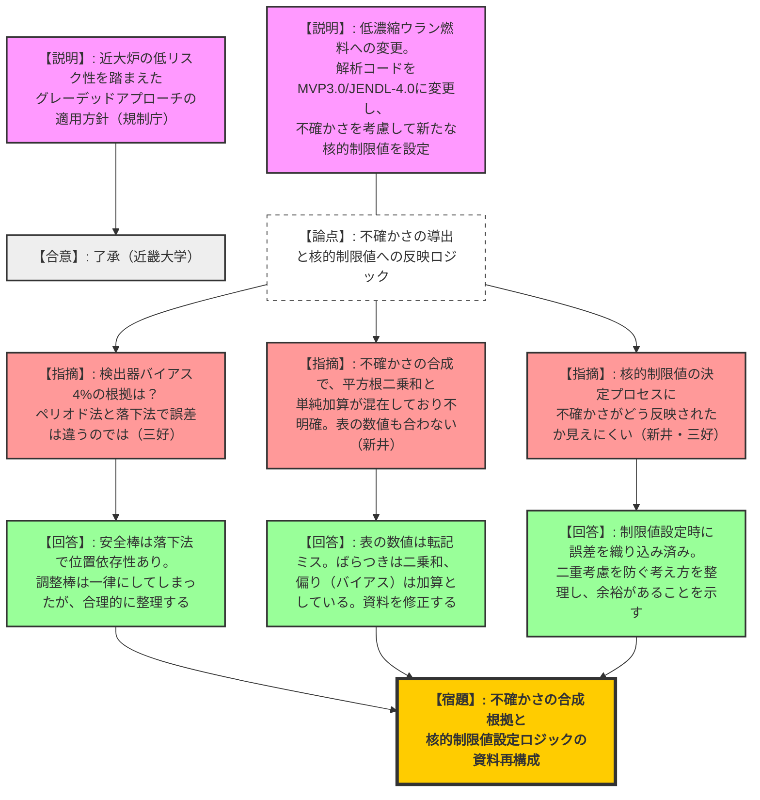
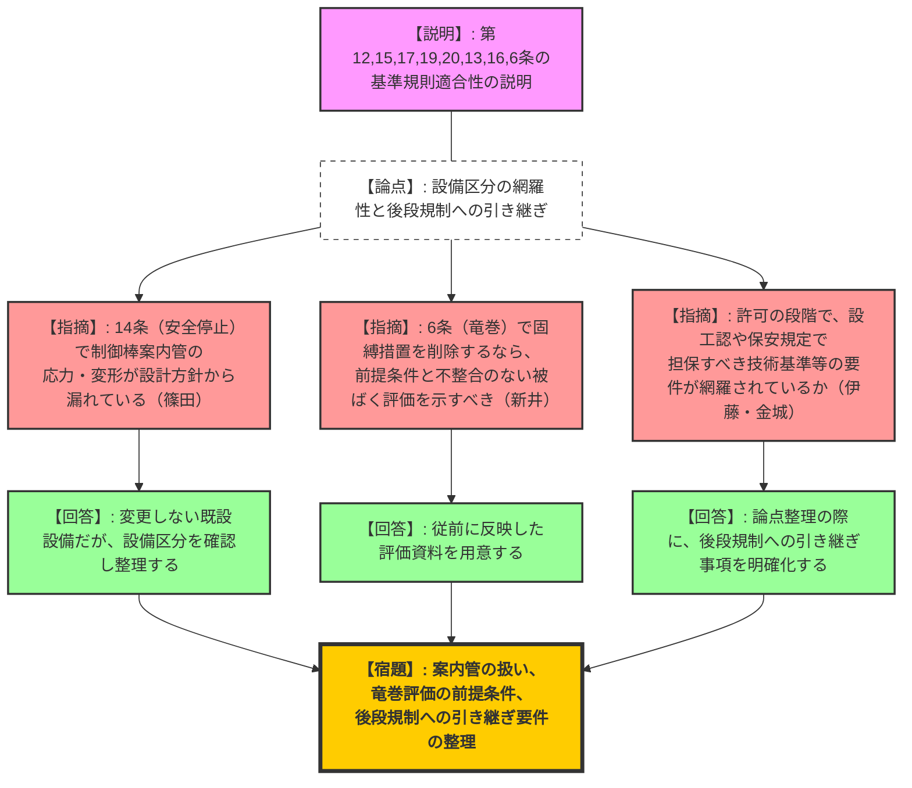
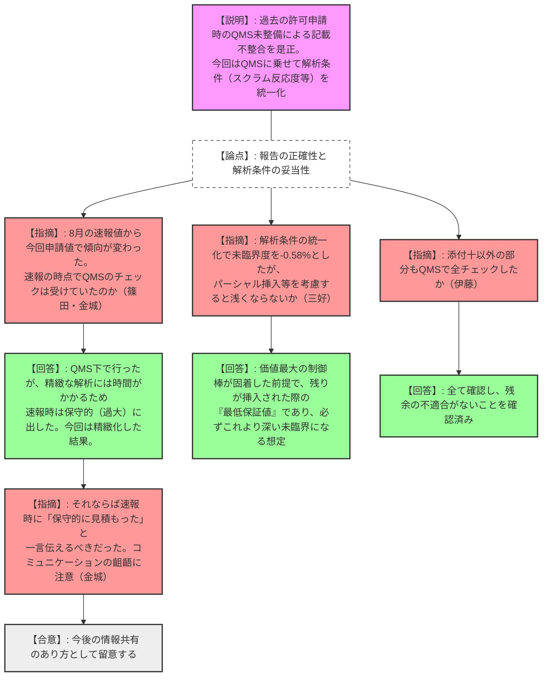

# 第570回核燃料施設等の新規制基準適合性に係る審査会合（令和8年2月16日）
> 出典 : https://youtube.com/live/ONOfYqwiEOo?si=CqeAW1nHwvAmb71H

## 1. 会合の概要
*   **最大の争点:** 高濃縮ウラン燃料から低濃縮ウラン燃料への変更に伴う、実効遅発中性子割合（$\beta_{eff}$）の低下を受けた核的制限値の再設定プロセスの妥当性、および過去の許可申請における添付書類十（安全解析）の記載不整合に対する品質マネジメントシステム（QMS）の有効性。
*   **審査の進捗状況:** 近畿大学の試験研究用原子炉（近大炉）に対し、熱出力が1Wと極めて低くリスクが小さい特徴を踏まえ、「グレーデッドアプローチ」を適用した審査方針が合意された。今回は第1回の技術的な審査であり、炉心特性、基準適合性、解析の適正化等について広範な議論が行われた。
*   **規制側の納得度:** 新たな解析手法（MVP3.0 + JENDL-4.0）の導入自体には一定の理解が示されたものの、不確かさ（ばらつきと偏り）の合成方法や、それが核的制限値にどのように反映されているかのロジックが不明確であるとして、規制側から厳しい指摘と説明資料の再構成要求が相次いだ。QMSに関する過去の不整合対応については、現行の運用でチェックが機能していることが確認された。
*   **特筆すべき決定事項:** 本日の指摘事項（不確かさの合成根拠、核的制限値の設定ロジック、QMS適用状況等）を整理した上で、次回のヒアリングおよび審査会合にて再度確認を行うこととなった。

---

## 2. 議題ごとの詳細整理

**【議題】近畿大学原子力研究所の原子炉設置変更許可申請について**

### 論点1：審査の進め方（グレーデッドアプローチの適用）
*   **議論の背景と論点:** 近大炉の低リスクな特性を踏まえた、合理的な審査プロセスの適用。
*   **質疑応答（詳細）:**
    *   【説明者側（規制庁 宮脇・篠田）】: 近大炉は熱出力1W、大気圧開放プール型、負の温度係数等を有し、リスクが低い。グレーデッドアプローチを適用し、新たに製造する燃料・炉心・貯蔵施設や、竜巻防護など重要なものは公開審査で確認し、その他の事項は書面審査を基本とし、技術的論点が生じた場合のみ公開審査とする方針としたい。
    *   【回答・合意（近畿大学）】: 了承した。

### 論点2：低濃縮ウラン燃料・炉心及び燃料貯蔵施設等の設計と評価（資料1）
*   **議論の背景と論点:** 低濃縮ウラン燃料の採用に伴い、解析コードをMVP3.0・JENDL-4.0に変更し、炉心の再現性および不確かさを評価した上で、新たな核的制限値を設定するプロセスの妥当性。
*   **質疑応答（詳細）:**
    *   【規制側（規制庁 篠田）】: 評価手法の不確かさ（制御棒価値15%、過剰反応度20%、臨界バイアス300pcm等）は、今後の設計において前提として考慮されているのか。
    *   【説明者側（近大 佐根）】: 実測値と計算値の差異から得られた判定基準を、最大限の不確かさとして低濃縮炉心の設計および核的制限値の決定に考慮している。
    *   【規制側（規制庁 三好）】: 検出器バイアスを4%と推定しているが、ペリオド法（調整棒）とロッドドロップ法（安全棒等）では誤差が異なるはずである。一律に4%とした根拠は何か。
    *   【説明者側（近大 佐根）】: 安全棒等はロッドドロップ法でしか測定できず位置依存性のバイアスが見込まれるため設定した。調整棒については一律にした方が考えやすいとしたが、合理的な説明を資料にまとめる。
    *   【規制側（規制庁 新井）】: 不確かさの合成において、表の数値（平方根二乗和）の計算が合っていない。また、「ばらつき成分」は平方根二乗和、「偏り成分（バイアス）」は単純加算とし、最終的に両者を単純加算しているが、その考え方が分かりにくい。
    *   【説明者側（近大 佐根）】: 表の数値は安全棒とシム安全棒の欄の書き間違いであり訂正する。ばらつきは統計的なので平方根二乗和、偏りはバイアスとして単純加算している。合成の考え方を資料に追記する。
    *   【規制側（規制庁 加藤）】: 遅発中性子割合（$\beta_{eff}$）の補正方法の検討で、過去56回の測定データのうち3回のみを厳密計算と比較した理由は何か。また、提示された測定値は56回の平均か。
    *   【説明者側（近大 佐根）】: コストの観点から3ケースで検証し、平均的な結果であったため、簡易手法（合成値の比）の妥当性を確認した。提示した値は56回の平均値である。記載を明確にする。
    *   【規制側（規制庁 篠田）】: 最大反応度添加率比について、これが全体の反応度添加率に係る核的制限値を満足するというロジックまで説明してほしい。
    *   【説明者側（近大 佐根）】: スライドを追加して関係性を明記する。
    *   【規制側（規制庁 三好）】: 15%の誤差を見込むのであれば、計算値に対して核的制限値は余裕を持った（上回る/下回る）設定にすべきだが、提示された表では制限値を超過しているように見える。制限値の決定プロセスと、それを満足する具体的な代表炉心のケースを明確に示すべき。
    *   【説明者側（近大 佐根）】: 制限値の決定プロセスにおいて既に不確かさを織り込んでいるため二重考慮にならないようにしているが、余裕を持った設計であることが分かるよう資料を再構成する。
*   **結論と宿題事項:**
    *   解析コードの変更自体は許容されたが、不確かさの導出と合成、および核的制限値への反映ロジックに説明不足・記載誤りが多数指摘された。
    *   **【宿題】**: 不確かさ（検出器バイアス、ばらつきと偏りの合成）の根拠、および核的制限値の決定プロセスを論理的に整理した資料の再提出。

### 論点3：基準規則への適合性（資料2）
*   **議論の背景と論点:** 各条文に対する適合性説明の中で、後段規制（設工認、保安規定）への引き継ぎ事項や、グレーデッドアプローチ適用の前提条件が満たされているか。
*   **質疑応答（詳細）:**
    *   【規制側（規制庁 篠田）】: 第14条（安全停止）において、制御棒の挿入性を担保するための「案内管（案内ケース）」の応力・変形が設計方針に含まれていないように見える。
    *   【説明者側（近大 方針原）】: 機械的に変更しない既設設備であるが、設備区分を確認して整理する。
    *   【規制側（規制庁 新井）】: 第6条（竜巻防護）で、公衆被ばく5mSvを超えないという評価はグレーデッドアプローチ適用の前提である。今回は固縛等の措置を削除しているため、設計方針と不整合のない条件での評価結果を提示すること。
    *   【説明者側（近大 佐根）】: 従前に反映した資料を用意する。
    *   【規制側（規制庁 伊藤・金城）】: 許可の段階で、後段の設工認や保安規定に引き継ぐべき事項（技術基準適合の担保）が網羅的に約束されているか、整理して説明してほしい。
    *   【説明者側（近大 方針原）】: 論点整理の際に確認して提示する。
*   **結論と宿題事項:**
    *   **【宿題】**: 制御棒案内管の扱い、竜巻評価における固縛削除の前提条件の反映、および後段規制へ引き継ぐ要件の整理・提示。

### 論点4：添付書類十の適正化および品質マネジメントシステム（資料3）
*   **議論の背景と論点:** 過去の新規制基準適合時における安全解析の記載不整合の原因と、8月に提出された速報値から今回の申請値が変動したことへのコミュニケーションの課題。
*   **質疑応答（詳細）:**
    *   【説明者側（近大 方針原）】: 過去の許可申請時はQMSの適用外と判断してしまい、手順書が未整備であった。今回は現行のQMS（設計開発プロセス）に乗せて不適合を発見・是正し、解析条件の統一化（スクラム時未臨界度の見直し等）を実施した。
    *   【規制側（規制庁 篠田・金城）】: 8月の速報時に提示された値よりも、今回の申請値の方が厳しくなっている（温度が上昇している等）部分がある。速報値はQMSのチェックを受けていたのか。
    *   【説明者側（近大 佐根）】: 速報の時点でもQMS下で発見・評価したが、精緻な時系列解析には時間を要するため、速報性を優先し、熱量に比例させた保守的な（過大な）値として提出していた。今回は精緻な解析と条件の統一化を行った結果である。
    *   【規制側（規制庁 金城・篠田）】: グレーデッドアプローチの観点からは保守的なラフ評価で構わないが、精緻化によって値の傾向が変わるのであれば、速報の段階で「保守的に見積もっている」旨を伝えてほしかった。コミュニケーションの齟齬をなくすよう留意すること。
    *   【規制側（規制庁 三好）】: 解析条件の統一化で「-0.58%$\Delta k/k$の未臨界状態に至る」としているが、安全棒1本が全引き抜きから挿入、シム安全棒が途中から挿入される場合、この値より浅くならないか。
    *   【説明者側（近大 佐根）】: 最も価値の大きい制御棒が固着した「ワンロッドスタックマージン」を考慮した上で、残りの棒が入った際の「最低保証値」が-0.58%であり、いかなる状態でもこれより「深い」未臨界になるという想定である。
    *   【規制側（規制庁 伊藤）】: 添付十以外の部分についても、現行のQMSに照らして同様の不適合がないか確認したか。
    *   【説明者側（近大 方針原）】: 計算解析を行う部分は全て確認し、残余がないことを確認済みである。
*   **結論と宿題事項:**
    *   不適合へのQMSの適用および全体チェックの完了は確認された。速報値と申請値の乖離については、今後の情報共有のあり方への教訓とされた。

### 論点5：説明スケジュール（資料4）
*   **結論と宿題事項:**
    *   近大側から4月までに今回指摘事項の再審査、7月までに残る条文の審査、年度末の許可希望が示された。
    *   規制庁側からは、本日の大量の指摘事項を踏まえると2週間後のヒアリングはチャレンジングであるため、資料の熟度を優先し、またグレーデッドアプローチを踏まえた合理的な前倒しも検討しつつ、適宜スケジュールを見直すよう指導された。

---

## 3. 論理構造の可視化（Mermaid）

### 審査方針と資料1（低濃縮ウラン燃料・炉心・貯蔵）の論理構造

### 資料2（基準規則への適合性）の論理構造

### 資料3（添付書類十の適正化・QMS）の論理構造

