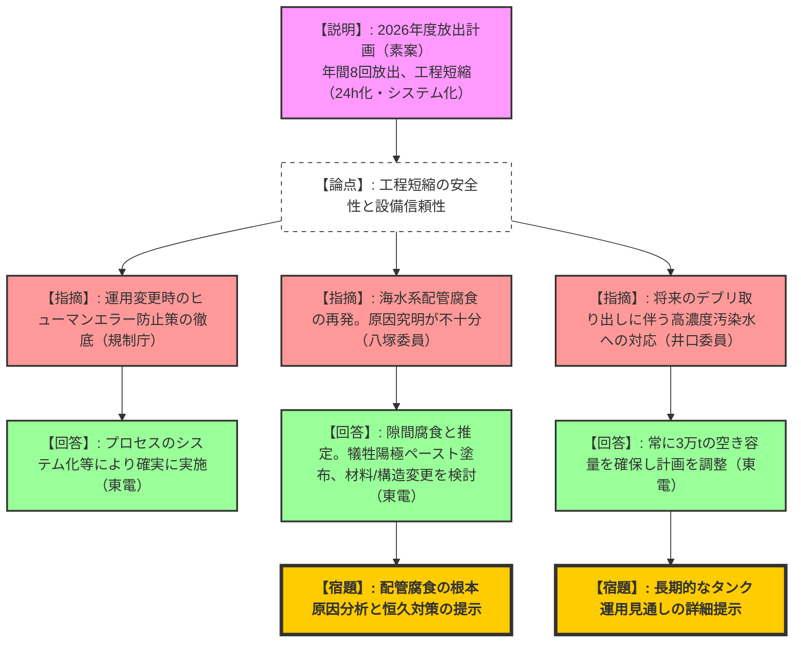
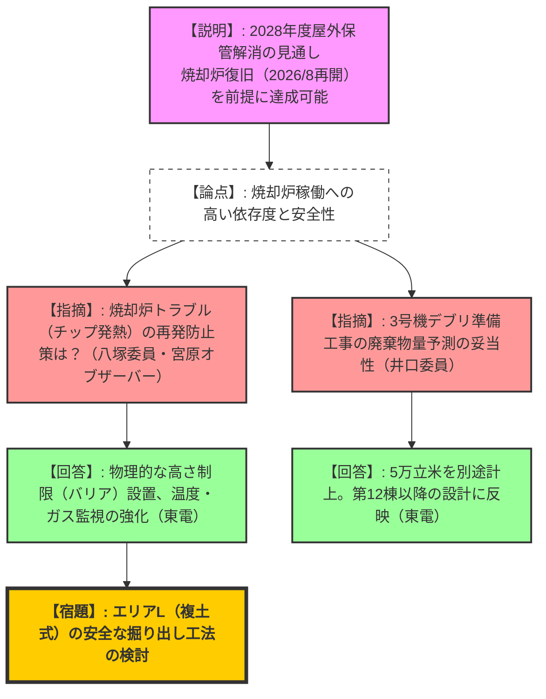
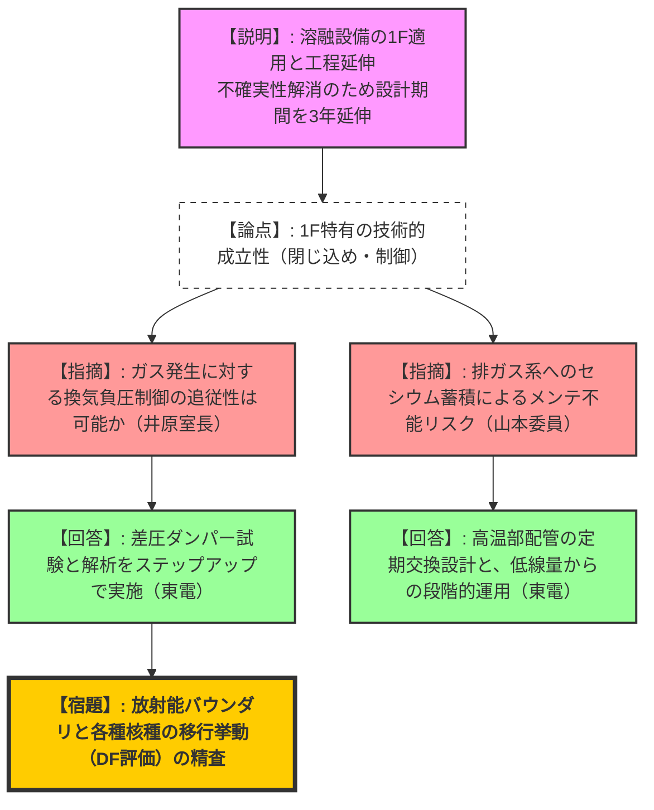

# 第120回特定原子力施設監視・評価検討会（令和8年2月16日）
> 出典 : https://youtube.com/live/2rivyD4_B6g?si=3hQ2ZgX7zKfEVGTe

# 会合の概要
*   **最大の争点:** ALPS処理水放出設備の配管腐食再発問題、および溶融設備（金属瓦礫除染）の1F適用における技術的課題と工程の3年延伸。
*   **審査の進捗状況:** 2026年度の処理水放出計画（素案）が提示され、年間放出回数が7回から8回へ増加。固体廃棄物管理では2028年度までの屋外保管解消に向けた詳細工程が示された。
*   **特筆すべき決定事項:** 実施計画検査実施要領の改正案が概ね了承され、2026年4月1日より施行予定。リスクマップについては、東京電力と規制庁の間で目標達成時期に関する認識の乖離が顕在化したため、今後改善を図る。

---

# 議題ごとの詳細整理

## 【議題1】2026年度のALPS処理水放出計画（素案）について
*   **議論の背景と論点:** 年間放出回数の増加（8回）に伴う工程短縮の妥当性と、希釈放出設備で再発した配管腐食（隙間腐食・孔食）の対策が焦点となった。
*   **質疑応答（詳細）:**
    *   【説明者側（山根：東電）】: 移送作業の24時間化（-10日）と分析プロセスのシステム化（-5日）により工程を短縮し、年間8回放出を行う。トリチウム放出量は約11兆Bq。
    *   【規制側（松田：規制庁）】: 運用変更のタイミングはミスが発生しやすいため、確実な管理を求める。
    *   【規制側（八塚先生）】: 二層ステンレス配管のフランジ部で昨年と同様の腐食が再発している。原因をどう考えているのか。
    *   【説明者側（山根：東電）】: 隙間腐食および孔食と推定。フラッシング対策を行ったが再発したため、今回は犠牲陽極ペースト（犠牲電極）の塗布や、より耐食性の高い材料への変更、フランジ構造の変更を検討する。
    *   【規制側（八塚先生）】: 材料変更だけでなく、なぜ同じ場所で起きるのかメカニズムを徹底究明すべき。
    *   【規制側（井口先生）】: 将来的なデブリ取り出しに伴う高濃度処理水の発生を見据え、タンク解体計画に余裕を持たせるべき。
    *   【説明者側（山根：東電）】: デブリ部門と連携し、常に3万トンの空き容量を確保しながら進める。
*   **結論と宿題事項:**
    *   2026年度計画は素案通り進めるが、年度末に最終決定。
    *   **【宿題】**: 配管腐食の最終的なメカニズム解明と恒久対策の提示。
    *   **【宿題】**: 二次処理水の放出順序および長期的なタンク運用シミュレーションの提示。

## 【議題2】実施計画検査の見直しの検討状況
*   **議論の背景と論点:** 1F規則改正に伴う検査要領の再編。溶接検査を施設検査に統合する等の変更点の確認。
*   **質疑応答（詳細）:**
    *   【説明者側（本島：規制庁）】: 検査種別を4種類（使用前、保安、核物質防護、その他）に整理。保安検査の中で施設管理状況を確認する。
    *   【規制側（井口先生）】: 新旧比較表にて「監視の程度の設定」が削除されているが、核物質防護検査等において融通を利かせる余地があるのか。
    *   【説明者側（本島：規制庁）】: 1Fの特殊な状況に鑑み、一律の設定ではなく柔軟に年度計画を立てる現行運用を継続するための適正化である。
*   **結論と宿題事項:**
    *   改正案は了承。2026年4月1日施行に向けた手続きを進める。

## 【議題3】福島第一原子力発電所 固体廃棄物の保管管理計画について
*   **議論の背景と論点:** 2028年度までの屋外保管解消目標に対する、雑固体廃棄物焼却設備の復旧状況と廃棄物発生量予測の精査。
*   **質疑応答（詳細）:**
    *   【説明者側（斎藤：東電）】: 伐採木のチップ発酵に伴う焼却炉トラブルからの復旧は順調。2026年8月に再稼働予定。3号機デブリ準備で発生する5万立方メートルの廃棄物も収容可能と評価。
    *   【規制側（岩永：規制庁）】: 焼却炉稼働への依存度が極めて高い。稼働が遅れた場合のプランBはあるのか。
    *   【説明者側（斎藤：東電）】: 焼却は必須。トラブル再発防止のため、ピットへの物理的バリア設置（入れすぎ防止）や散水・温度監視を強化する。
    *   【規制側（八塚先生）】: 伐採木の野積み放置が元々の原因。再発防止を徹底すべき。
*   **結論と宿題事項:**
    *   2028年度解消目標は維持。焼却炉の確実な再稼働が前提条件。
    *   **【宿題】**: 高線量廃棄物（エリアL）の掘り出しにおける安全工法の詳細検討。
    *   **【宿題】**: 固体廃棄物貯蔵庫第12棟以降の設計・建設リードタイムの精査。

## 【議題4】中期的リスクの低減目標マップにおける取組の進捗状況
*   **議題4-1: 溶融設備の進捗状況**
*   **議題4-2: リスクマップの改善**
*   **議論の背景と論点:** 金属瓦礫除染を目的とした「溶融設備」の1F適用における難易度と、リスクマップにおける「達成時期」の定義の差異。
*   **質疑応答（詳細）:**
    *   【説明者側（斎藤・田崎：東電）】: 製鋼技術（アーク炉）を応用し、$DF=2000$程度の除染を目指すが、1F特有の課題（放射能閉じ込め、廃ガス系の負圧制御）がある。設計精度向上のため、工程を3年延伸し2032～2034年運用開始とする。
    *   【規制側（井原：規制庁）】: 未経験技術の不確かさを正直に示す姿勢は評価する。15ページの負圧制御（ガス発生への追従性）は技術的に極めて難易度が高いのではないか。
    *   【説明者側（田崎：東電）】: 制御可能なガスと、スクラップ由来の不確実なガスがある。物理的なバリアや差圧ダンパーの試験を行い、ステップアップで確認する。
    *   【規制側（山本先生）】: 排ガス系にセシウムが蓄積し、メンテナンス不能になるリスクはないか。
    *   【説明者側（田崎：東電）】: 1年ごとの配管交換を前提とする。まずは低線量から実績を積む。
    *   【規制側（大橋：規制庁）】: リスクマップ上の「水位低下開始」を達成とする東電と、「目標水位到達」を達成とする規制庁で認識が食い違っている。
*   **結論と宿題事項:**
    *   溶融設備の工程延伸を了承。
    *   **【宿題】**: 溶融設備の放射能バウンダリおよび核種移行挙動の詳細解析結果の提示。
    *   **【宿題】**: リスクマップの改善（達成時期の柔軟な見直しと定義の明確化）。

---

# 論理構造の可視化（Mermaid）

## 議題1：ALPS処理水放出計画と配管腐食対策

## 議題3：固体廃棄物保管管理計画（屋外解消）

## 議題4：溶融設備の技術課題と工程延伸

