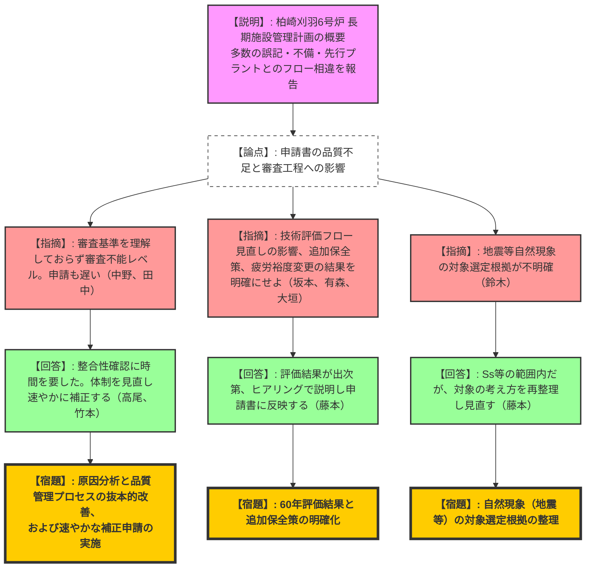
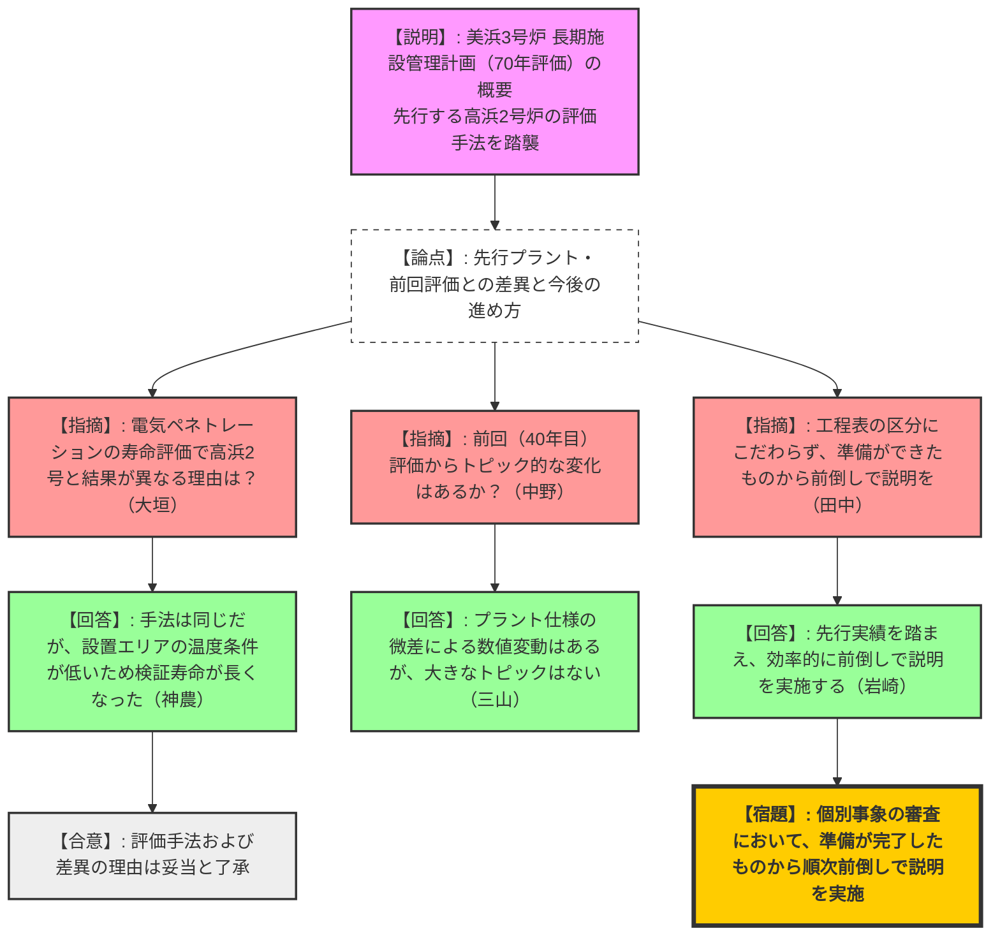

# 第27回実用発電用原子炉の長期施設管理計画等に係る審査会合（令和8年2月17日）
> 出典 : https://youtube.com/live/O8hyqsHFNaw?si=t0hEkNUMy1lYNj46

## 1. 会合の概要
* **最大の争点:** 東京電力・柏崎刈羽6号炉の申請書において、審査基準の理解不足や先行プラントとの整合性欠如に起因する不備・誤記が多数発覚し、現状のままでは審査が困難であるという品質問題。
* **審査の進捗状況:** 柏崎刈羽6号炉（東電）は、ABWRとして初の長期施設管理計画の申請となったが、申請の遅れと品質不足により、抜本的な体制見直しと速やかな補正が求められた。一方、美浜3号炉（関電）は先行する高浜2号炉の評価手法を踏襲しており、概要説明が概ね了承され、今後前倒しで個別審査に進むこととなった。
* **現場の緊張感と納得度合い:** 柏崎刈羽6号炉の審査においては、規制側から「先行審査が公開されているのに咀嚼できていない」「本来の姿ではない」「久々の難物」といった極めて厳しい叱責が相次ぎ、現場には強い緊張感が走った。東電側は社長・CNO層も含めた経営問題として重く受け止め、猛省と改善を誓約した。
* **特筆すべき決定事項:** 柏崎刈羽6号炉については、個別事象の審査に入る前に、東電が原因分析と体制強化を行った上で申請書を速やかに補正すること。美浜3号炉については、今後のヒアリング工程にこだわらず、準備ができたものから順次前倒しで審査を進めることが合意された。

---

## 2. 議題ごとの詳細整理

### 【議題1】東京電力ホールディングス（株）柏崎刈羽原子力発電所6号炉の長期施設管理計画認可申請に係る審査について
* **議論の背景と論点:** ABWRとして初の長期施設管理計画申請（運転開始30年目）であるものの、標準審査期間1年に対して申請が遅れた上、審査基準への適合性が確認できないレベルの誤記や記載不備が多数存在した。申請書の品質確保と補正のタイミングが最大の論点となった。

* **質疑応答（詳細）:**
  * 【説明者側】（東電・高尾、藤本）: 柏崎刈羽6号炉の長期施設管理計画の概要を説明。申請書提出後に先行認可プラントとの相違や審査基準との不整合を確認し、技術評価フローの修正や多数の誤記訂正（計30件）が必要であることを報告。
  * 【規制側】（規制庁・中野）: 標準処理期間が1年であるにもかかわらず、期限まで10ヶ月しかない時期に申請された。さらに、審査基準を理解していないと思われる不備が多数あり、我々がどう審査しているか見えていない状態である。社内のプロセスに問題があるのではないか。
  * 【説明者側】（東電・高尾）: 記載内容とエビデンスの整合性確認に時間を要し申請が遅れた。チェック体制が機能していなかった事実を重く受け止めている。ヒアリング前に社内レビュー会を行うなどプロセスを改善する。
  * 【規制側】（規制庁・坂本）: 技術評価フローを見直すとのことだが、見直し後も申請書本体の評価内容に影響がないことは確認しているか。影響があれば速やかに説明し、補正に反映すること。
  * 【説明者側】（東電・藤本）: 影響がないことは確認している。今後の説明は新フローで実施し、申請書にも反映する。
  * 【規制側】（規制庁・有森、大垣）: 低サイクル疲労について裕度を1.5倍に変更して再評価中とのことだが、60年時点での判定基準を満足するか、追加保全策が必要かを示し、申請書に反映すること。また、新たに追加保全策（配管減肉測定など）が抽出された場合も今後の補正に反映すること。
  * 【説明者側】（東電・藤本）: 現在評価中であり、結果が出次第ヒアリングで説明し反映する。
  * 【規制側】（規制庁・鈴木）: 地震等の影響考慮について、能登半島地震等を対象にする方針とのことだが、設置許可等を踏まえ、どのような根拠・情報に基づき何を対象とするのか整理して説明すること。
  * 【説明者側】（東電・藤本）: 新規制基準で設定した基準地震動（Ss）等の範囲内であることを確認しているが、改めて対象の考え方を整理し見直す。
  * 【規制側】（規制庁・田中、村田、金城）: 現状の申請書では審査基準への適合性が確認できず、審査ができない状態である。すべての審査が終わってからではなく、速やかに補正を行う必要がある。また、先行審査はすべて公開されているにもかかわらず、咀嚼できていないのは本来の姿ではない。
  * 【説明者側】（東電・竹本、柏崎刈羽発電所）: 指摘の通りであり、速やかに補正申請を行いたい。社長やCNOも含め、強いマネジメントの問題として重く受け止め、品質を確保した資料を用意する。

* **結論と宿題事項（アクションアイテム）:**
  * **【結論】**: 申請書の品質が著しく低く、現状のままでは審査に入れない旨が宣告された。東電は社内レビュー体制を抜本的に見直し、速やかな補正申請を行うことで合意した。
  * **【宿題】**: 誤記・不備の根本原因を分析し、品質確保のプロセスを改善した上で、速やかに申請書を補正すること。
  * **【宿題】**: 今後の個別事象（ABWR特有の設計差分を含む）の審査において、60年時点での健全性評価結果および長期施設管理計画期間中に行う保全策を明確に示すこと。
  * **【宿題】**: 自然現象（地震等）の影響考慮の対象について、根拠を整理して再提示すること。

### 【議題2】関西電力（株）美浜発電所3号炉の長期施設管理計画認可申請に係る審査について
* **議論の背景と論点:** 運転開始50年までの計画は認可済であり、今回は運転開始60年（2036年11月）までを見据え、評価期間を70年とした申請。先行認可プラント（高浜2号炉）との評価結果の差異や、前回評価からの変化の有無が論点となった。

* **質疑応答（詳細）:**
  * 【説明者側】（関電・藤田）: 美浜3号炉の長期施設管理計画の概要を説明。高浜2号炉との主な差異として、美浜3号炉には特定重大事故等対処施設が含まれない点や、ピグテール型電気ペネトレーションの絶縁低下評価において、高浜2号では取替を計画しているのに対し、美浜3号では70年以上健全性が維持されると評価した点などを挙げた。
  * 【規制側】（規制庁・大垣）: ピグテール型電気ペネトレーションの検証寿命について、高浜2号と美浜3号で結果に差が生じた理由を説明してほしい。
  * 【説明者側】（関電・神農）: 評価手法は同じだが、美浜3号炉の当該機器が設置されているエリアの温度条件が高浜2号炉よりも低いため、検証寿命が70年以上となった。
  * 【規制側】（規制庁・中野）: 今回70年でフルパッケージの評価を行うにあたり、昨年認可した前回評価から何かトピック的な（大きく変わった）事項はあるか。
  * 【説明者側】（関電・三山）: 先行する高浜2号炉と同じ考え方で条件を設定しており、プラントの仕様や実績に応じた数値の微差はあるが、トピック的に大きく変わったものはない。
  * 【規制側】（規制庁・田中）: 今後の審査スケジュールの提示があったが、区分けの工程にこだわらず、先行審査の実績を踏まえて準備が可能なものから順次前倒しで説明してほしい。
  * 【説明者側】（関電・岩崎）: 効率的な進め方を含め、準備ができたものから随時丁寧に説明し、なるべく早くまとまるよう対応する。

* **結論と宿題事項（アクションアイテム）:**
  * **【結論】**: 美浜3号炉の概要説明および高浜2号炉との差分理由は妥当と認められ了承された。
  * **【宿題】**: 今後の個別事象のヒアリング・審査において、当初提示した工程表にとらわれず、準備が完了したものから順次前倒しで説明を実施していくこと。

---

## 3. 論理構造の可視化（Mermaid）

### 議題1：柏崎刈羽6号炉の長期施設管理計画認可申請

### 議題2：美浜発電所3号炉の長期施設管理計画認可申請

