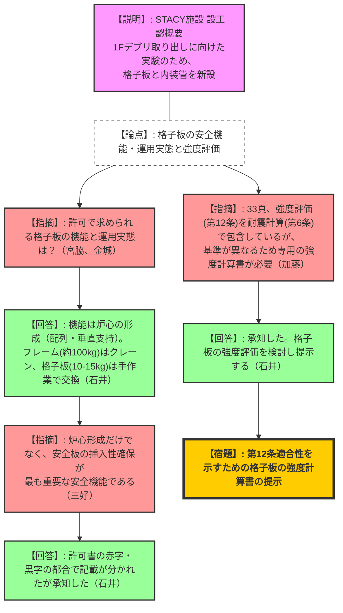
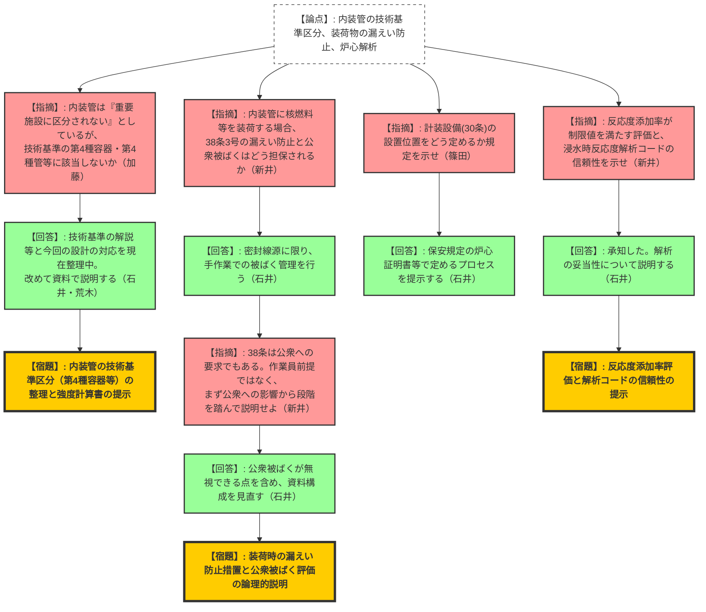

# 第571回核燃料施設等の新規制基準適合性に係る審査会合（令和8年2月17日）
> 出典 : https://youtube.com/live/BLnE5zxKDkI?si=htNS6XiE1bLLtFfo

## 1. 会合の概要
*   **最大の争点:** 新設する内装管の技術基準上の区分（「研究炉の構造等の技術基準」における第4種容器・管への該当性）と、第12条適合性を示すための強度評価と耐震評価（第6条）の論理的な切り分け。
*   **審査の進捗状況:** JAEAより、福島第一原発の燃料デブリ取り出しに向けた臨界実験ニーズに対応するため、STACY施設に大型検出器等を装荷できる新規の内装管および格子板を製作する設工認の概要と技術基準適合性について説明が行われた。規制庁からは設備導入の必要性自体には理解が示されたものの、技術基準への適合を説明するロジックの整理不足が多数指摘された。
*   **規制側の納得度:** 新設設備の仕様や運用実態については質疑を通じて一定の理解が得られたが、強度計算を耐震計算で包含して説明しようとする姿勢や、装荷物からの漏えい防止・公衆被ばく評価の説明において要求事項（公衆への影響）と運用措置（作業員被ばく管理）が混同されている点などに対し、規制庁から厳格な切り分けと再説明が強く求められた。
*   **特筆すべき決定事項:** 内装管の構造等の技術基準上の区分、格子板・内装管の強度計算書の提示、装荷時の被ばく評価、反応度添加率の評価、および炉心解析モデルの信頼性について、JAEA側が整理し直した上で次回以降のヒアリング・審査会合で回答することとなった。

---

## 2. 議題ごとの詳細整理

**【議題】日本原子力研究開発機構原子力科学研究所の原子炉施設（STACY（定常臨界実験装置）施設）の変更に係る設計及び工事の計画の認可申請について**

*   **議論の背景と論点:** STACY施設において、多様なサイズの検出器等を装荷できるよう、最大内径110mmの内装管と、それを支持する格子板を新設する。これら新設設備が、耐震性、強度、漏えい防止等の技術基準に適合しているかの論証プロセスが問われた。
*   **質疑応答（詳細）:**
    *   **格子板の機能・仕様と運用について**
        *   【規制側（宮脇）】: 格子板の根本的な機能と、新設するものが既存の許可範囲内であることの整合性、および交換作業のハードさ（重機か手作業か）を確認したい。
        *   【説明者側（石井）】: 安全機能は「炉心の形成（棒状燃料や実験用装荷物の配列・垂直支持）」。許可申請書に記載の物理的形状・寸法を満たす。交換作業は、格子板フレームはクレーンで取り出すが、格子板自体は10〜15kg程度であり手作業で行う。
        *   【規制側（三好）】: 資料では「燃料の配列維持」が強調されているが、安全板の挿入性を確保することが、異常時に原子炉を止めるための最も重要な安全機能である。
        *   【説明者側（石井）】: 許可の記載箇所（赤字・黒字の違い）の都合上そうなったが、承知した。
        *   【規制側（金城）】: 格子板フレームの重量はどの程度か。
        *   【説明者側（石井）】: 100kg前後である。
    *   **内装管の技術基準上の区分と強度評価について**
        *   【規制側（加藤）】: 資料78頁で、内装管は「研究炉の構造等の技術基準」において安全上重要なものに区分されないとしているが、第1条・第2条及び解説1.9に基づけば「第4種容器」または「第4種管」に該当し、第12条（安全上重要な施設の材料・構造）が適用されるのではないか。
        *   【説明者側（石井・荒木）】: 現在JAEA内で技術基準の各条項と今回の設計の対応を整理中であり、改めて資料をもって説明する。
        *   【規制側（加藤）】: 33頁で格子板の強度計算を「耐震評価に包含される」としているが、第12条適合性を示す強度評価と第6条の耐震評価は別物である。強度計算書を添付して説明すべき。内装管についても同様である。
        *   【説明者側（石井）】: 承知した。格子板・内装管ともに強度評価の必要性を含めて検討し回答する。
    *   **内装管への装荷物と漏えい防止・被ばく評価について**
        *   【規制側（新井）】: 内装管には検出器だけでなく密封された核燃料物質や放射性物質も装荷可能である。第38条3号（漏えい防止）の適合性や、公衆被ばくの担保についてどう考えているか。
        *   【説明者側（石井）】: RI等の密封線源に限ることで漏えいを防止する。作業は手作業であり被ばく管理を行う。
        *   【規制側（新井）】: 38条は作業員だけでなく公衆に対する要求である。作業員前提の回答になっているため、まずは公衆への影響、次に作業員という段階を踏んで説明してほしい。
        *   【説明者側（石井）】: 承知した。STACYは公衆被ばくが無視できるほど小さいが、段階を追って説明する資料に変更する。
    *   **計装設備および炉心解析について**
        *   【規制側（篠田）】: 第30条に関し、計装設備（核計装）の設置箇所は炉心ごとにどう定めるのか。
        *   【説明者側（石井）】: 保安規定に基づく炉心証明書等で定めている。その配置を決定するプロセスを今後説明する。
        *   【規制側（新井）】: 臨界近傍における反応度添加率が制限値を満足することの具体的評価、および内装管の浸水時反応度解析に用いたモンテカルロコードの計算モデルの信頼性について説明を求める。
        *   【説明者側（石井）】: 承知した。反応度添加率と計算コードの信頼性について説明する。
*   **結論と宿題事項:**
    *   本申請に係る設備の必要性や物理的な運用については共有されたが、技術基準適合の法的な整理と評価書（強度・解析）の提示が不十分であることが確認された。
    *   **【宿題1】**: 内装管が「研究炉の構造等の技術基準」における第4種容器・管等に該当するか否かの整理と説明。
    *   **【宿題2】**: 第12条適合性を示すための、格子板および内装管の強度計算書の提示（耐震評価との切り分け）。
    *   **【宿題3】**: 内装管に放射性物質を装荷する場合の、公衆被ばく評価および漏えい防止措置（密封性の担保等）の論理的説明。
    *   **【宿題4】**: 計装設備の配置を定める保安規定等下部規定の手順の提示。
    *   **【宿題5】**: 反応度添加率が制限値を満足することの評価、および浸水時反応度解析（モンテカルロコード）の計算モデルの信頼性の提示。

---

## 3. 論理構造の可視化（Mermaid）

### グラフ1：格子板の機能・運用と強度評価の論理

### グラフ2：内装管の技術基準区分、漏えい防止、炉心解析の論理

