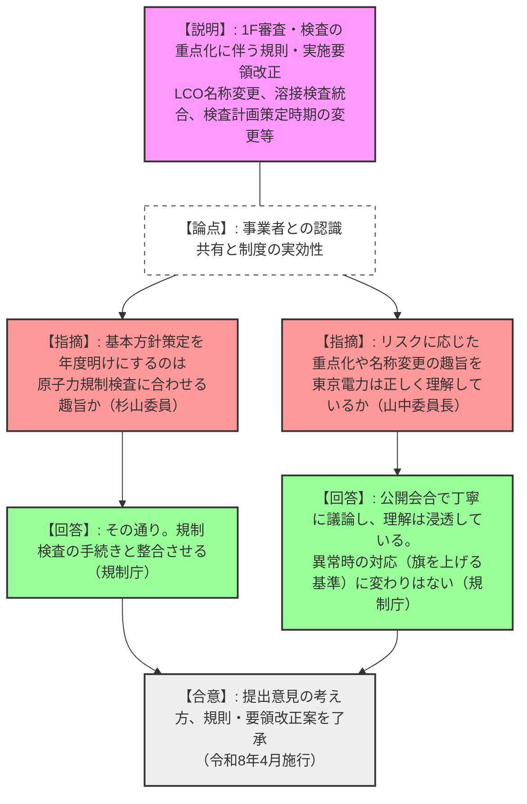
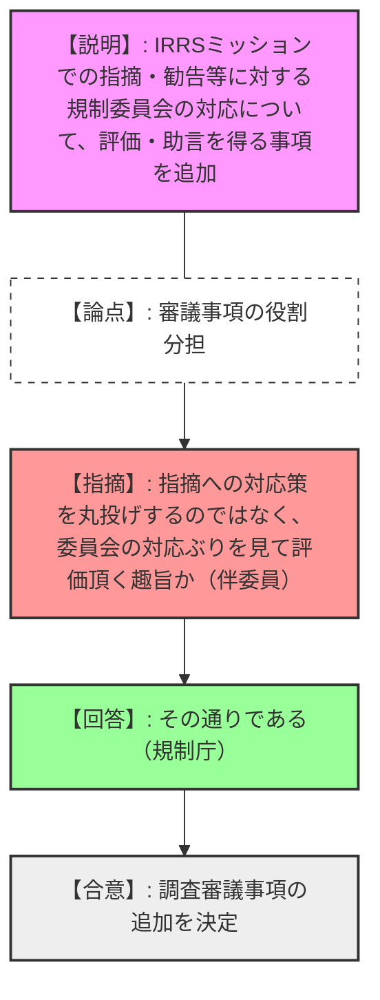
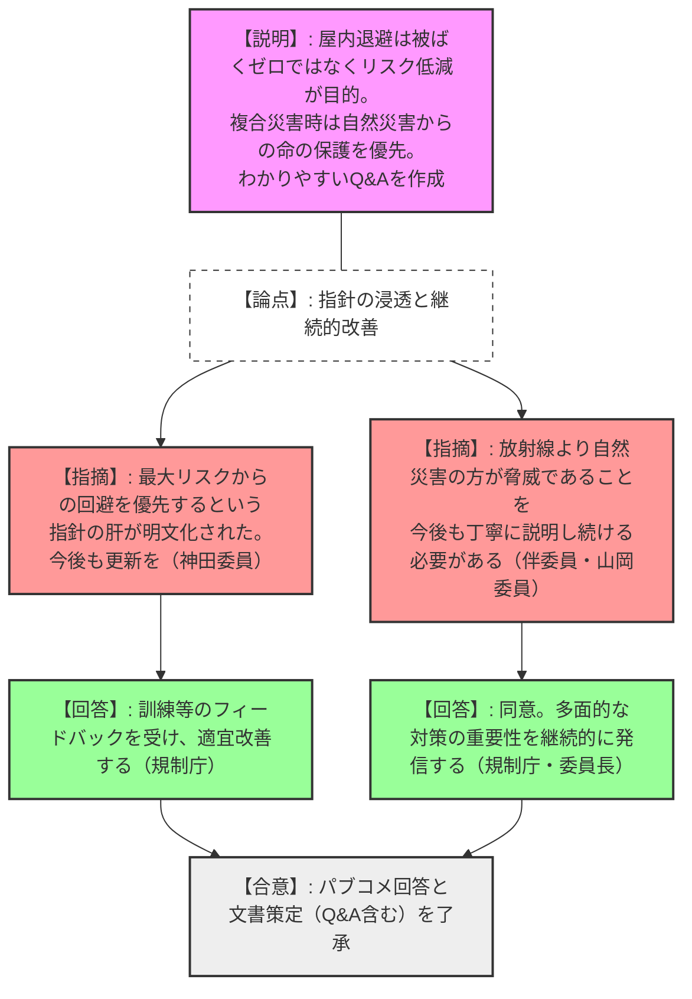
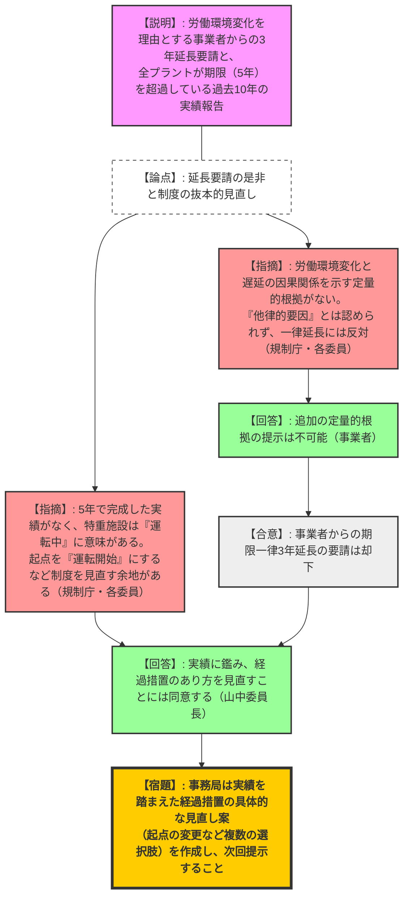

# 第58回原子力規制委員会（令和8年2月18日）
> 出典 : https://youtube.com/live/u5ljInjnBu8?si=S8wlT8jhn1m6z9md

## 1. 会合の概要
*   **最大の争点:** 特定重大事故等対処施設（特重施設）の設置期限について、事業者が求める「建設業界の労働環境変化を理由とした一律3年延長」の是非と、過去10年間で全プラントが期限（5年）に間に合っていない現実を直視した「経過措置規定の抜本的見直し」。
*   **審査の進捗状況と決定事項:**
    *   **1Fの審査・検査改善:** 検査の重点化や「施設運用上の基準」への用語変更等を定めた規則改正および実施要領改正が決定され、事業者（東電）との認識共有も確認された（令和8年4月施行）。
    *   **屋内退避の運用:** パブコメを経て「被ばくゼロを目指すのではなく、自然災害を含めた最大リスクからの命の保護を優先する」という指針の肝を明文化した文書（Q&A含む）の策定が了承された。
    *   **特重施設の経過措置:** 事業者からの期限延長要請は「定量的根拠がなく他律的要因に当たらない」として一蹴された。一方で、規制側は自らの制度（5年の経過措置）が実態と乖離していることを認め、特重施設が「運転中」に機能するという本質に立ち返り、起点の変更等を含む制度見直しの検討に入った。
*   **現場の緊張感と納得度合い:** 特重施設に関する議論では、事業者の甘い見通しを厳しく退ける一方で、規制側自身も過去の規制のあり方（根拠の乏しい5年という期限設定）を冷静に反省し、論理的かつ合理的な新制度の構築へ舵を切るという、非常に引き締まった議論が展開された。

---

## 2. 議題ごとの詳細整理

### 【議題1】東京電力ホールディングス株式会社福島第一原子力発電所に係る審査及び検査の改善に向けた検討
*   **議論の背景と論点:** リスクに応じた審査・検査の重点化を目的とする規則改正案（「運転上の制限」から「施設運用上の基準」への名称変更、溶接検査の使用前検査への統合等）に対する意見公募結果の報告、およびそれに伴う実施計画検査実施要領の改正。
*   **質疑応答（詳細）:**
    *   【説明者側（規制庁）】: 意見公募の結果、本改正は検査の削減ではなく重点化であること等を回答し、原案通り改正を行いたい。また、実施計画検査の基本方針策定時期を、原子力規制検査と整合させるため「年度明け」に変更する。
    *   【規制側（伴委員）】: 軽微な事象の取り扱い等について、担当者が入れ替わっても確実に内規等を把握・運用できる体制を維持してほしい。
    *   【説明者側（規制庁）】: 担当者間でしっかり認識し、ホームページでの見せ方等も検討する。
    *   【規制側（山中委員長）】: 今回の改正の本来の趣旨（リスクに応じた重点化）やLCOの名称変更について、事業者（東京電力）は正しく理解しているか。
    *   【説明者側（規制庁）】: 公開会合で丁寧に意見交換を行っており、理解は十分浸透している。名称変更後も異常時の対応（旗を上げる基準）に変わりはない。
*   **結論と宿題事項:**
    *   提出意見に対する考え方、改正規則・告示を決定し、実施計画検査実施要領の改正案を了承した（令和8年4月1日施行）。

### 【議題2】原子炉安全専門審査会及び核燃料安全専門審査会における調査審議事項の追加
*   **議論の背景と論点:** 2026年1月〜2月に実施されたIAEAのIRRS（総合規制評価サービス）ミッションを踏まえた、専門審査会への諮問事項の追加。
*   **質疑応答（詳細）:**
    *   【説明者側（規制庁）】: IRRSミッションでの指摘・勧告等に対する原子力規制委員会の対応プロセスにおいて、幅広い有識者から構成される炉安審・燃安審から評価・助言を得る事項を追加したい。
    *   【規制側（伴委員）】: 指摘への対応策を丸投げするのではなく、委員会の対応ぶりを見て評価・助言を頂くという趣旨か。
    *   【説明者側（規制庁）】: その通りである。
*   **結論と宿題事項:**
    *   IRRSミッションを踏まえた新たな調査審議事項の追加を決定した。

### 【議題3】屋内退避に関する指針の関連文書案に対する意見公募の結果及び文書の策定
*   **議論の背景と論点:** 屋内退避の実効性や複合災害時の対応に関する意見公募（86件）の結果報告と、わかりやすいQ&Aを含む関連文書の策定。
*   **質疑応答（詳細）:**
    *   【説明者側（規制庁）】: 屋内退避は「被ばくゼロ」ではなく「合理的なリスク低減」が目的であること、PAZでの屋内退避は自然災害等で避難が危険な場合に限ること、複合災害時は自然災害からの命の保護を優先すること等を回答として整理し、Q&Aを作成した。
    *   【規制側（神田委員）】: 「災害時に最も健康を脅かす最大リスクからの回避を優先する」という指針の肝が文書化されたことは前進。今後も訓練等のフィードバックを受けてQ&Aを更新してほしい。
    *   【規制側（伴委員・山岡委員）】: 放射線被ばくよりも地震や津波等の自然現象の方がはるかに脅威であり、多面的な防災対策が重要であることを今後も丁寧に説明し続ける必要がある。
*   **結論と宿題事項:**
    *   提出意見に対する考え方、および本文書案（Q&A含む）の策定を了承。今後の訓練等を通じた継続的な改善を確認した。

### 【議題4】特定重大事故等対処施設等設置の経過措置に係る検討（その2）
*   **議論の背景と論点:** 事業者（ATENA等）からの「建設業界の労働環境変化等を理由とした特重施設設置期限の一律3年延長」の要請の取り扱いと、過去約10年間で全プラントが期限（5年）を超過している実績を踏まえた制度のあり方の見直し。
*   **質疑応答（詳細）:**
    *   【説明者側（規制庁）】: 事業者から追加情報を聴取したが、労働環境変化と設置遅延の因果関係を示す定量的根拠は提示されなかったため、一律延長は認められない。一方で、約10年の実績を見ると5年で完成した例がない。特重施設の本来の目的（運転中のシビアアクシデント対策）に鑑み、経過措置期間のあり方（起点を本体施設の「運転開始」とする等）を見直す余地がある。
    *   【規制側（伴委員・長﨑委員）】: 定量的な根拠がない以上、労働環境変化を「他律的要因」として延長を認めることには反対する。
    *   【規制側（杉山委員・山岡委員）】: 一律延長には反対だが、これまでの遅延実績や、特重施設が「運転中」に機能するという本質を考慮すれば、起点の変更など経過措置のあり方を見直すこと自体は合理的である。
    *   【規制側（山中委員長）】: 法改正に伴う働き方改革を理由とした一律延長要請を退ける事務局案を了承する。その上で、実績を踏まえた経過措置の見直しについては、事務局に具体的な見直し案（複数案）の作成を指示する。
*   **結論と宿題事項:**
    *   **【決定】**: 労働環境変化を理由とする特重施設設置期限の一律3年延長要請は認めない。
    *   **【宿題】**: 事務局は、これまでの実績や特重施設の目的を踏まえた「経過措置期間の具体的な見直し案（起点の変更など複数の選択肢）」を作成し、次回の委員会で提示すること。

---

## 3. 論理構造の可視化（Mermaid）

### 議題1：1F審査・検査改善（規則・実施要領改正）

### 議題2：炉安審・燃安審の調査審議事項の追加

### 議題3：屋内退避に関する指針の関連文書案とQ&A

### 議題4：特重施設等設置の経過措置に係る検討

