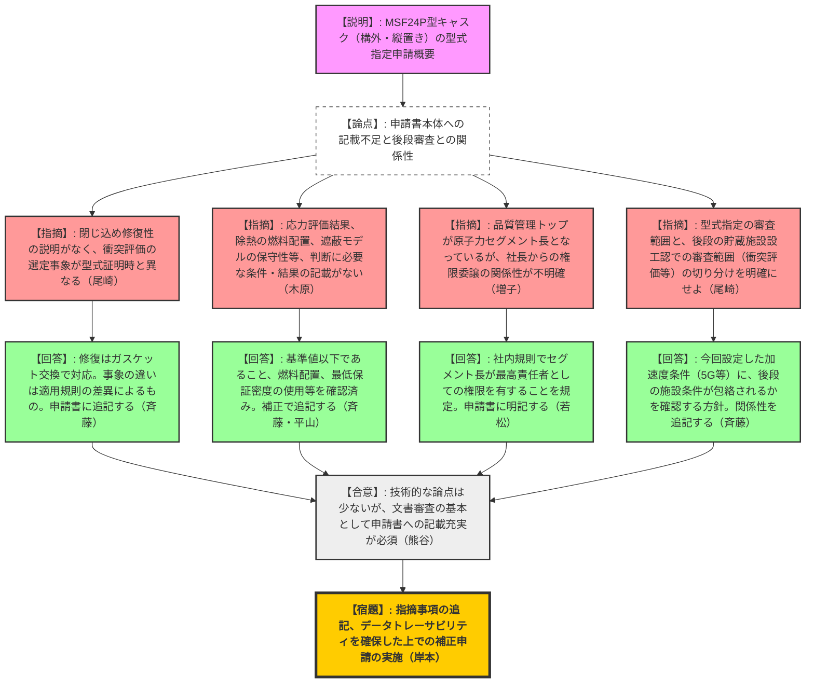

# 第20回輸送容器及び使用済燃料貯蔵施設に係る特定容器に関する審査会合（令和8年2月18日）
> 出典 : https://youtube.com/live/n_A5csxwegQ?si=Ge77wGeBG6LDe91W

## 1. 会合の概要
* **最大の争点:** 構外（中間貯蔵施設等）向け金属キャスク「MSF24P型」の型式指定申請において、先行する型式証明との整合性、技術基準への適合性、品質管理体制などに関する「申請書本体への記載不足」および「後段申請（設工認）との切り分け」。
* **審査の進捗状況:** 三菱重工より申請の概要が説明された。技術的な評価手法や設計の考え方自体には大きな論点は見られなかったものの、許認可の基本である「文書（申請書）による証明」の観点で情報が不足していることが判明し、次回の審査に向けて全面的な補正が行われることとなった。
* **現場の緊張感と納得度合い:** 規制側は、補足説明資料等での三菱重工側の技術的な説明には一定の理解を示した（技術的な欠陥を指摘するものではないと判断された）一方で、「許認可は文書審査が基本である」と強調し、厳格な記載の充実を求めた。三菱重工側もこれを真摯に受け入れ、速やかな補正を約束しており、実務的かつ建設的な議論が展開された。
* **特筆すべき決定事項:** 三菱重工は、指摘された評価条件・結果の明記、品質管理の権限委譲の明確化、後段審査への引き継ぎ事項の整理等を行い、データのトレーサビリティを確保した上で補正申請を行うことが決定した。

---

## 2. 議題ごとの詳細整理

### 【議題】三菱重工業株式会社の使用済燃料貯蔵施設に係る特定容器等の型式指定申請について

* **議論の背景と論点:**
  三菱重工は、発電所構内で実績のある「MSF24PS型」をベースに、構外（中間貯蔵施設等）向けの縦置き型キャスク「MSF24P型」の型式指定を申請した。審査においては、「型式証明との整合性」「技術基準への適合性」「品質管理基準への適合性」の3つの観点から、申請書の記載の妥当性が問われた。

* **質疑応答（詳細）:**
  * **【論点1：型式証明との整合性】**
    * 【規制側（尾崎）】: 申請書において、閉じ込め機能の修復性に関する説明がない。また、衝突評価の選定事象が型式証明時（落下事象）と今回で異なっているが説明が不足している。
    * 【説明者側（斉藤）】: 閉じ込めは二次蓋ガスケット交換で修復可能である。事象の違いは、型式証明が「事業許可基準規則」、今回は「技術基準規則」に基づくためである。補足説明資料には記載しているが、申請書本体に追記して補正する。
    * 【規制側（金城）】: 比較対象としている型式証明は「発電用」と「使用済燃料貯蔵施設用」のどちらか。
    * 【説明者側（岸本・斉藤）】: 「使用済燃料貯蔵施設用」の型式証明との整合性をみている。国内の複数の施設を想定し、構外に運べる容器として申請している。

  * **【論点2：技術基準への適合性（入力条件と結果の明記）】**
    * 【規制側（木原）】: 解析を用いて基準を満たすとしているが、判断に必要な情報が申請書にない。具体的には、①被覆管の周方向応力の評価結果、②除熱解析における使用済燃料の収納配置、③遮蔽解析（3次元モデル）における部材の保守性の見積もり過程である。
    * 【説明者側（斉藤・平山）】: ①応力は基準値（100MPa）以下を確認済み。②中央に最高燃焼度、周辺に調整した平均燃焼度を配置している。③部材の最低保証密度を用いるなど保守性を考慮している。いずれも申請書に追記する。

  * **【論点3：品質管理基準への適合性】**
    * 【規制側（増子）】: 品質管理のトップが「取締役社長」ではなく「原子力セグメント長」と規定されている。トップマネジメントからの権限委譲の関係性が申請書から確認できない。
    * 【説明者側（若松）】: 社内規則等において、原子力セグメント長が最高責任者としての権限を有し、安全品質の維持を最優先することを明記している。この関係性を申請書に追記する。

  * **【論点4：後段申請（設工認）との関係性の明確化】**
    * 【規制側（尾崎）】: 貯蔵架台への衝突評価などについて、今回の型式指定で確認する範囲と、今後の貯蔵施設の設工認審査で確認する範囲の切り分けを明確にすべき。
    * 【説明者側（斉藤）】: 型式指定で設定した加速度条件（吊り上げ時1.3G、衝突時5G等）に、後段の施設側の条件が包絡されるかを確認いただく想定である。この関係性を申請書に記載する。

* **結論と宿題事項:**
  * 規制側から「技術的な論点は特にない」との認識が示された上で、申請書としての体裁・記載内容の不足が指摘された。
  * **【宿題】**: 三菱重工は以下の事項を申請書本体および添付書類に追記し、補正申請を行うこと。
    1. 型式証明との選定事象の違いおよび閉じ込め修復性の説明。
    2. 応力評価結果、除熱解析の燃料配置、遮蔽モデルの保守性等の解析条件と結果。
    3. 取締役社長から原子力セグメント長への品質管理の権限委譲の関係性。
    4. 後段申請（設工認）との引き継ぎ事項（加速度条件等の包絡確認）の明確化。
    5. 各種解析データのトレーサビリティの確保。

---

## 3. 論理構造の可視化（Mermaid）

