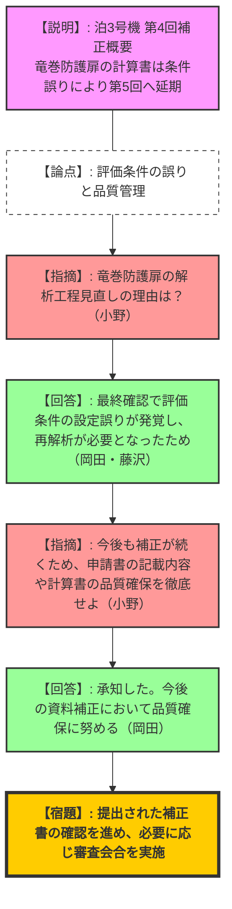
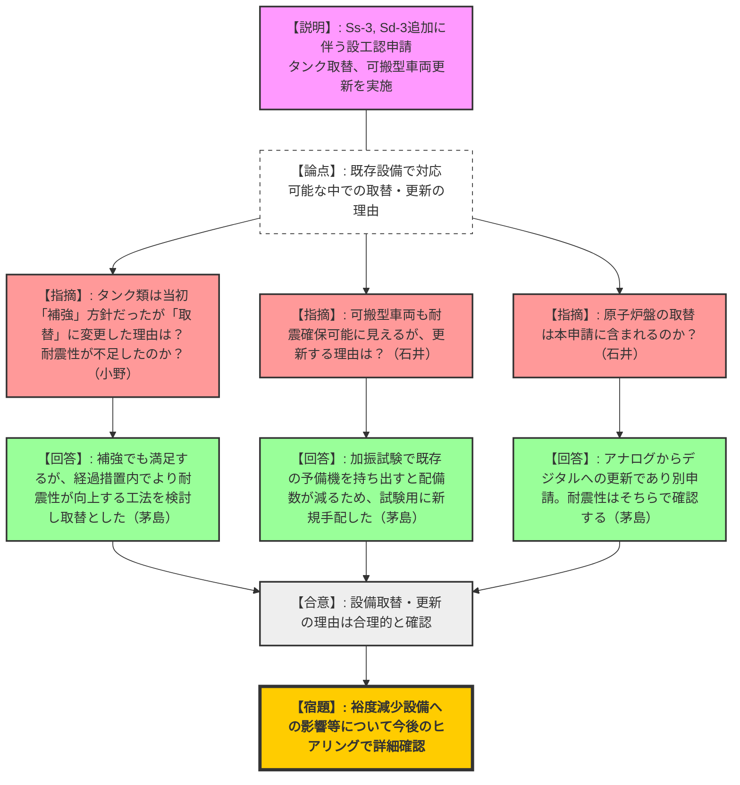
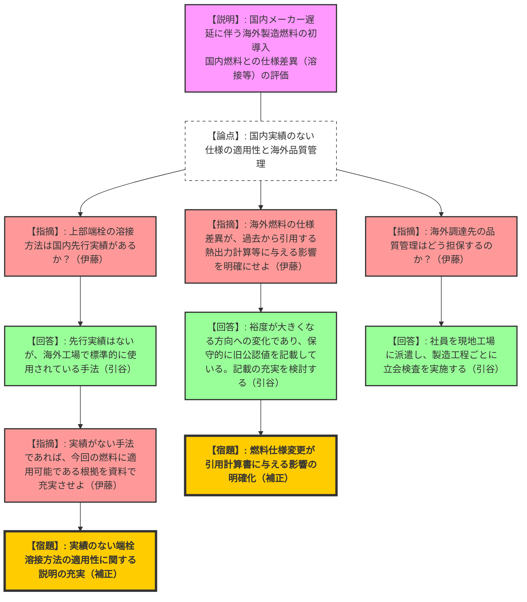

# 第1391回原子力発電所の新規制基準適合性に係る審査会合（令和8年2月19日）
> 出典 : https://youtube.com/live/5bxvUW_7mLo?si=2n2HBOBlUpMiGiMJ

## 1. 会合の概要
*   **最大の争点:** 
    *   【泊3号機】評価条件の設定誤りに起因する竜巻防護扉の再解析と、補正工程の遅延に対する品質管理の徹底。
    *   【川内1, 2号機】新たな標準応答スペクトル（Ss-3, Sd-3）の適用に伴う、タンク取替や可搬型車両更新の妥当性（単なる補強ではなく取替を選択した理由）。
    *   【島根2号機】島根原発として初となる海外製造燃料の導入に伴う、国内実績のない溶接手法の適用性と、海外工場における品質管理体制の担保。
*   **審査の進捗状況:** 泊3号機は全6回中4回目の補正を実施（一部は第5回へ先送り）。川内1,2号機および島根2号機は設工認の概要説明であり、評価の基本方針は概ね確認されたが、詳細なデータや論拠の充実は今後のヒアリングに持ち越された。
*   **規制側の納得度:** 泊3号機の計算誤りに対しては厳しい釘刺しが行われた。川内・島根に対しては、設備更新の背景や海外調達における品質保証プロセスについて合理的な説明がなされ一定の理解を示したが、実績のない手法や過去の評価書の流用に対しては、申請書面上での説明の充実を強く求めた。
*   **特筆すべき決定事項:** 島根2号機の海外燃料導入に関し、実績のない端栓溶接方法の適用性や、燃料仕様の変更が熱出力計算に与える影響について、資料を拡充し補正することが決定した。

---

## 2. 議題ごとの詳細整理

### 【議題1】北海道電力（株）泊発電所3号機の設計及び工事の計画の審査について
*   **議論の背景と論点:** 工事計画認可申請の全6回の補正のうち、第4回補正の概要説明。竜巻防護扉の強度計算書において、評価条件の設定誤りが発覚し、再解析のため第5回補正へ提出が延期されたことが報告された。
*   **質疑応答（詳細）:**
    *   【規制側（小野）】: 竜巻防護扉の強度計算書の解析工程を見直した（提出を遅らせた）具体的な理由は何か。
    *   【説明者側（岡田・藤沢）】: 評価結果の最終確認において、荷重の組み合わせ等（評価条件）の設定に誤りが確認され、再解析が必要となったためである。
    *   【規制側（小野）】: 今後も複数回の補正が予定されている。申請書の記載内容や耐震計算書の確認等、品質確保にはしっかりと対応すること。
    *   【説明者側（岡田）】: 承知した。今後の資料補正においても品質の確保に努める。
*   **結論と宿題事項:**
    *   第4回補正の提出内容は確認されたが、品質管理の徹底が強く要請された。
    *   今後の審査において提出された資料を確認し、論点があれば再度審査会合で議論する。

### 【議題2】九州電力（株）川内原子力発電所第1号機及び第2号機の標準応答スペクトルの取入れ等に伴う設計及び工事の計画の審査について
*   **議論の背景と論点:** 新たな基準地震動（Ss-3）および弾性設計用地震動（Sd-3）の追加に伴う設工認申請。評価手法の妥当性に加え、燃料取替用水タンク等の「補強」ではなく「取替」を選択した理由、および可搬型車両の更新理由が論点となった。
*   **質疑応答（詳細）:**
    *   【規制側（市盛）】: 今回の評価において、既認可から評価手法等を変更し、実績のない手法を用いている設備はないか。
    *   【説明者側（堀田）】: 全て既設工認で実績のある評価手法を用いている。
    *   【規制側（小野）】: 1号機の燃料取替用水タンク等は、許可時点では「補強」の見通しだったはずだが、今回「取替」とする理由は何か。補強では耐震性が確保できなかったのか。
    *   【説明者側（茅島）】: 補強でも耐震性は満足できるが、経過措置期限内でさらに耐震性が向上する工法を検討した結果、取替を行う判断に至った。
    *   【規制側（石井）】: 可搬型車両について、既存設備でもSs-3に対する耐震性は確保できる見通しであるにもかかわらず更新する理由は何か。
    *   【説明者側（茅島）】: 一部の可搬設備で加振試験が必要となるが、既存の予備機を試験のために発電所外へ持ち出すと配備台数が減るリスクがあるため、試験用に新たに手配・更新することとした。
    *   【規制側（石井）】: 1,2号機の原子炉盤の取替も計画されているが、今回の申請とは別か。
    *   【説明者側（茅島）】: アナログからデジタルへの更新案件であり別申請となる。経過措置期限内に取り替え完了見込みであり、Ss-3に対する耐震性はそちらの審査で確認いただく。
*   **結論と宿題事項:**
    *   設備取替や更新の理由について合理性が確認された。
    *   【宿題事項】: 竜巻・地震等による裕度減少設備への影響等について、今後のヒアリングで詳細な事実確認を進める。

### 【議題3】中国電力（株）島根原子力発電所第2号機の海外9×9燃料（A型）の導入に係る設計及び工事の計画の審査について
*   **議論の背景と論点:** 国内燃料加工メーカーの新規制基準対応の遅れに伴い、第21運転サイクル以降の燃料として、海外（GNF-A社）で製造された9×9燃料を初導入する。海外固有の溶接手法の適用性と、海外工場に対する品質管理体制の担保が問われた。
*   **質疑応答（詳細）:**
    *   【規制側（伊藤）】: 今回の強度評価等に用いている解析コードは、過去の設工認で実績のあるものか。
    *   【説明者側（引谷）】: 既工事計画で実績のある評価手法を用いている。
    *   【規制側（伊藤）】: 海外燃料の上部端栓の溶接方法は、国内先行BWRで実績があるか。
    *   【説明者側（引谷）】: 先行BWRでの実績はないが、海外工場では標準的に使用され技術的に確立されている手法である。
    *   【規制側（伊藤）】: 実績のない手法であれば、今回の燃料に適用可能であるという根拠説明を資料上で充実させること。
    *   【規制側（伊藤）】: 熱出力計算書など過去の添付書類を引用している部分について、海外燃料の仕様の違いが評価結果（裕度の減少など）に与える影響を明確にすべき。
    *   【説明者側（引谷）】: 熱出力計算については、裕度が大きくなる方向への温度変化があるため、保守的に旧公認の記載値（裕度が小さい方向）を引用している。指摘を踏まえ記載を検討する。
    *   【規制側（伊藤）】: 島根原発として海外燃料は初導入だが、調達先の品質管理をどう確認するのか。
    *   【説明者側（引谷）】: 社員を現地工場に派遣し、製造工程ごとに立ち会い検査を実施して品質を直接確認する。
*   **結論と宿題事項:**
    *   海外燃料導入の基本方針と品質管理体制は確認されたが、申請書における技術的根拠の記載不足が指摘された。
    *   【宿題事項】: 実績のない端栓溶接方法の適用性に関する説明の充実。
    *   【宿題事項】: 海外燃料の仕様変更が、過去から引用している添付書類（熱出力計算書等）の評価結果に与える影響の明確化と追記。

---

## 3. 論理構造の可視化（Mermaid）

### 議題1：泊発電所3号機 工事計画認可申請（第4回補正）

### 議題2：川内1, 2号機 標準応答スペクトル（Ss-3, Sd-3）対応

### 議題3：島根2号機 海外製造9×9燃料（A型）の導入

