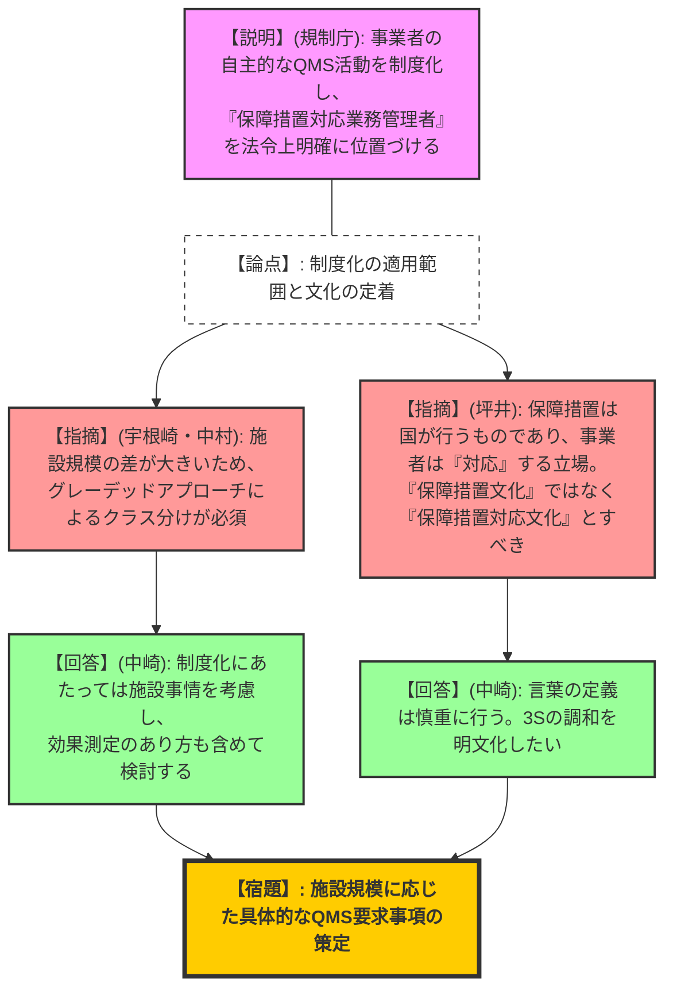
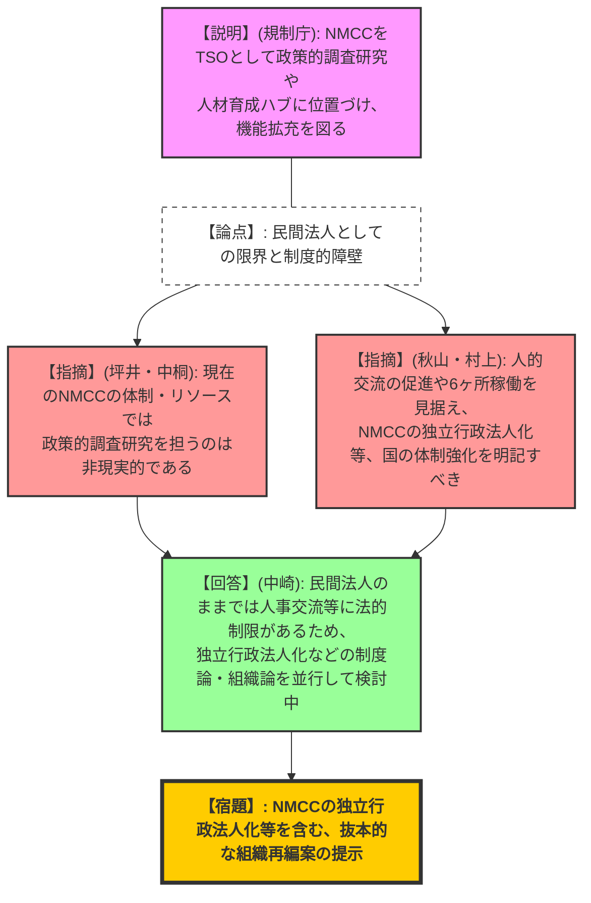
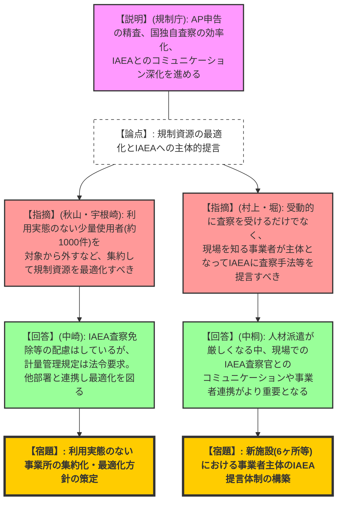

# 第3回国内保障措置制度のあり方検討会（令和8年2月19日）
> 出典 : https://youtube.com/live/OoOJhRInb0Y?si=JHQzBKzKijwmY-lE

## 1. 会合の概要
*   **最大の争点:**
    *   事業者の自主的な品質保証（QMS）活動を法令上の要求事項として制度化する際の、施設規模に応じた「グレーデッドアプローチ」の適用と効果測定のあり方。
    *   六ヶ所再処理施設等の稼働を見据えた、指定機関（NMCC）の機能拡充（TSO機能、政策的調査研究）と、それに伴う独立行政法人化などを含む抜本的な組織論・制度論の見直し。
*   **審査の進捗状況:** 規制庁よりこれまでの議論を踏まえた問題提起（資料1）が行われ、また日本原燃より主要事業者を取りまとめた意見（資料2）が表明された。これに対し、外部有識者を交えて「事業者」「JSGO・NMCC」「IAEAと国」の3つの役割のあり方について深掘りした議論が行われた。
*   **現場の緊張感と納得度合い:** 事業者に対しては「保障措置対応」を組織全体の文化として定着させるよう強い期待が寄せられた。一方、指定機関（NMCC）への過度な機能拡充案に対しては、民間法人としての現在のリソースや権限の限界が有識者から次々と指摘され、規制庁も自らの体制（JSGO）強化を含めた法制度・組織のあり方の再構築が必要であることを認め、真摯に受け止める空気が広がった。
*   **特筆すべき決定事項:** 次回（4月または5月予定）を本検討会の総括とし、規制庁において、NMCCの独立行政法人化を含めた組織のあり方や、自主的取り組みの制度化に関する具体的な方向性を示すこととなった。

---

## 2. 議題ごとの詳細整理

### 【論点1】計量管理制度における原子力事業者の役割
*   **議論の背景と論点:** 事業者が自主的に行っている保障措置業務の品質保証活動（PDCA、CAP）を制度化し、「保障措置対応業務管理者（仮称）」を法令上明確に位置づけることの是非と課題。
*   **質疑応答（詳細）:**
    *   【規制側】宇根崎（有識者）: 自主的な品質管理を制度上の要求とすることに賛成するが、六ヶ所から少量使用施設までスペクトルが広いため、グレーデッドアプローチによるクラス分けが必須である。また、制度導入後の効果測定のあり方も検討すべき。
    *   【説明者側】中崎（規制庁）: 3S（セーフティ、セキュリティ、セーフガード）の調和を明文化し、計量管理責任者を発展させた管理者の法令上の位置づけを検討中である。効果測定の制度的位置づけも検討する。
    *   【規制側】秋山（有識者）: 保障措置部門だけでなく、組織全体の経営層を含めた「文化」として取り組む視点が不可欠である。
    *   【規制側】坪井（有識者）: 保障措置は国が行うものであり、事業者は「対応」を行う立場。「保障措置文化」ではなく「保障措置対応文化」と整理すべき。規制側は文化ではなくルールに基づくべきである。
    *   【説明者側】中村（日本原燃）: （事業者意見として）バルク施設とアイテム施設では保障措置の要求事項が全く異なるため、明確な要求事項の整理とグレーデッドアプローチを要望する。
*   **結論と宿題事項:**
    *   事業者の品質保証活動の制度化については方向性が一致したが、施設規模に応じた要求レベルの最適化（グレーデッドアプローチ）を具体化することが課題とされた。

### 【論点2】JSGOと指定機関（NMCC）の役割のあり方
*   **議論の背景と論点:** 六ヶ所再処理施設の本格稼働に向け、NMCCをTSO（技術支援機関）として政策的調査研究や人材育成ハブに位置づける案の実現可能性。
*   **質疑応答（詳細）:**
    *   【規制側】坪井（有識者）: NMCCの現在の体制とリソースでは、政策的な調査研究まで担うのは非常に厳しいと言わざるを得ない。
    *   【規制側】秋山（有識者）: NMCCとJSGOの人的交流を促進するため、JICAのような独立行政法人化によるステータス変更は有効か。
    *   【説明者側】中崎（規制庁）: 民間法人と国の間の人事交流には、財源の制限や退職手当等の不利益といった制度的障壁がある。そのため、独立行政法人化などの制度論・組織論を並行して検討している。
    *   【規制側】村上（有識者）: 六ケ所再処理施設の稼働を前提とすると、民間法人の増強だけでは対応困難である。国の体制（JSGOの技量）をいかに高めるかが重要であり、NMCCの独立行政法人化等も含めて検討を明記すべき。
    *   【説明者側】中桐（規制庁）: NMCCの現場経験は頼りになるが、現在の交付金・人員の制約で政策研究まで手が回らない現状を認識している。
*   **結論と宿題事項:**
    *   **【宿題】**: 規制庁は、NMCCへの機能追加に見合うだけの組織再編（独立行政法人化など）や、JSGO自身の体制強化に関する具体的な制度設計案を次回提示すること。

### 【論点3】IAEAと我が国の役割のあり方
*   **議論の背景と論点:** IAEAの申告情報分析に対する国の役割、少量核物質使用事業所（約1800箇所）の最適化、およびIAEAへの主体的提言のあり方。
*   **質疑応答（詳細）:**
    *   【規制側】秋山（有識者）: 少量規制物質使用事業所のうち、利用実態がない施設を対象から外すルールを作れないか。
    *   【説明者側】中崎（規制庁）: IAEA査察は免除され、国の単独査察も必要時に限定し負担を軽減しているが、法令上、計量管理規定の整備は求められる。
    *   【規制側】宇根崎（有識者）: 利用実態のない使用者の集約管理は、核物質の安全管理向上や規制資源の最適化に直結するため、他部署とも共有して進めてほしい。
    *   【規制側】村上（有識者）: IAEAからの査察を受動的に受けるだけでなく、日本のノウハウを提言すべき。新施設については、事業者が早い段階で参加しIAEAに提言を行うべき。
    *   【規制側】堀（有識者）: IAEAへの査察手法の提案は、現場を知る施設者（事業者）しか考えられない。国独自査察の根拠と目的も明確にすべき。
    *   【規制側】坪井（有識者）: 追加議定書に基づく未申告活動の探索等を、国内の原子力等規制法の枠組みで行う意義を明確にすべき。
    *   【説明者側】中桐（規制庁）: AP申告の精査は情報の質・網羅性を高めることが目的であり、未申告活動の探索そのものが主目的ではない。IAEAへの職員派遣（コストフリーエキスパート等）の維持が難しくなる中、事業者からの派遣や現場でのコミュニケーションがより重要になる。
*   **結論と宿題事項:**
    *   利用実態のない少量使用事業所の集約化に向けた庁内連携と、現場の知見を持つ事業者を巻き込んだIAEAへの主体的提言体制の構築を進める。

---

## 3. 論理構造の可視化（Mermaid）

### 論点1：計量管理制度における原子力事業者の役割

### 論点2：JSGOと指定機関（NMCC）の役割のあり方

### 論点3：IAEAと我が国の役割のあり方

