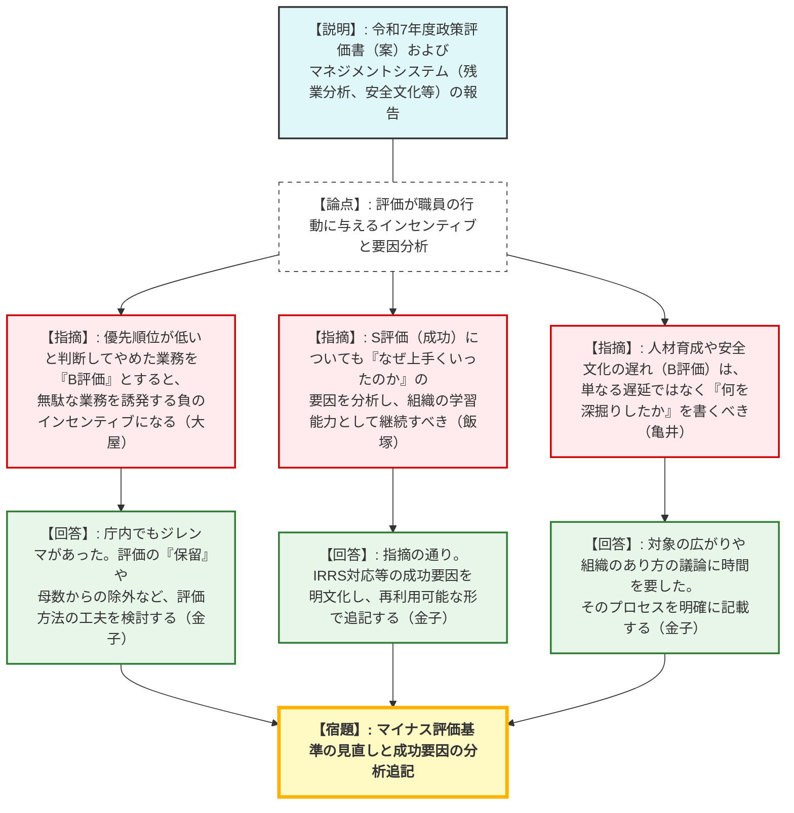
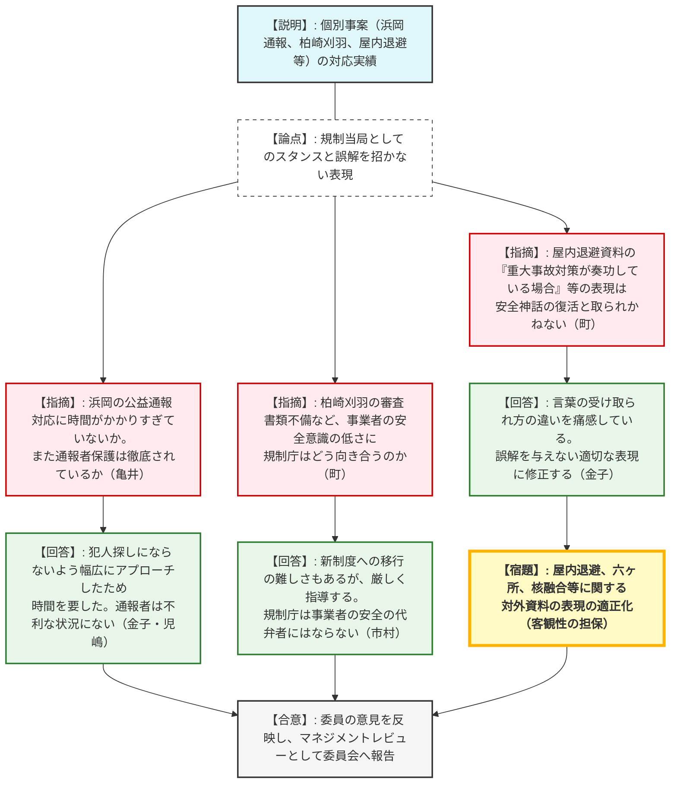

# 第2回令和7年度原子力規制委員会政策評価懇談会（令和8年2月19日）
> 出典 : https://youtube.com/live/CnXIfjkloS8?si=5q19dcBZbROFrAbe

## 1. 会合の概要
*   **最大の争点:** 政策評価におけるS・A・Bの「記号付け」の目的化の排除。特に、B評価（未達）が職員に無駄な業務を誘発する負のインセンティブとなる問題や、S評価（成功）の要因分析の不足が指摘され、評価を動的な業務改善（PDCA）にいかに繋げるかが問われた。
*   **審査の進捗状況:** 事務局（原子力規制庁）より、令和7年度実施施策の政策評価書案およびマネジメントシステム（安全文化アンケート等）の実施状況が報告された。委員からの意見を踏まえ、文言の修正や評価方針の整理を行った上で、次年度の年度業務計画に反映することとなった。
*   **現場の緊張感と納得度合い:** 委員からは、浜岡原発の公益通報対応、柏崎刈羽原発の審査書類不備、屋内退避の表現など、個別事案に対する規制庁の姿勢や対外的な情報発信のあり方について、非常に厳しくかつ本質的な指摘が相次いだ。規制庁幹部（長官、次長、技監）はこれらを真摯に受け止め、表現の危うさや組織マネジメントの課題を率直に認め、改善を誓約する真剣な議論の場となった。
*   **特筆すべき決定事項:** 委員からの意見（成功要因の分析追加、マイナス評価のあり方見直し、誤解を招く対外的表現の修正など）を取りまとめ、委員会へのマネジメントレビューとして報告し、次年度計画へ反映することが決定した。

---

## 2. 議題ごとの詳細整理

### 【議題1】令和7年度実施施策の事後評価等
*   **議論の背景と論点:**
    規制庁が作成した令和7年度の政策評価書（案）およびマネジメントシステムの実績（残業時間分析、内部監査、安全文化アンケート等）に対し、外部有識者から評価の妥当性や今後の組織運営のあり方について意見を求める。

*   **質疑応答（詳細）:**

    **＜評価のあり方と組織マネジメントについて＞**
    *   【説明者側】（新田参事官）: 政策評価書案のS評価・B評価の理由や、職員の残業時間、安全文化アンケート等の分析結果を報告する。
    *   【規制側】（亀井委員）: 評価をつけることが目的化し、静的な評価になっていないか。人材育成や安全文化の策定遅れ（B評価）は、「なぜ遅れたのか（何を深掘りすべきと判断したのか）」という動的な理由を具体的に書くべき。
    *   【規制側】（大屋委員）: 評価が職員のインセンティブに与える影響を考慮すべき。他機関との調整等で「優先順位が高くない」と判断して作業を止めたことをB評価（マイナス評価）とすると、「不要な業務でもとりあえずやっておく」という無駄を誘発する。評価「保留」や母数から外すなどの対応が必要。
    *   【規制側】（飯塚座長）: S評価（成功）についても「なぜ上手くいったのか（仕組みや価値観の定着など）」を分析し、継続できる仕組みにすべき。また、ヒューマンエラーを個人の責任にせず、業務インフラとのミスマッチとして分析してほしい。
    *   【説明者側】（金子長官）: 評価の付け方については庁内でも議論がある。やめたものをBにするジレンマは感じており、保留等の工夫を考えたい。S評価の要因分析も追記する。
    *   【説明者側】（児嶋次長）: 「安全文化」だけでなく「組織文化」の醸成がこれからの課題である。残業時間分析も、人員増だけでなく規制の効率化やAI活用を含めて分析していく。

    **＜個別事案への対応と対外的な表現について＞**
    *   【規制側】（亀井委員）: 浜岡原発の公益通報案件は、通報から回答まで時間がかかっているが妥当だったか。また通報者保護は徹底されているか。
    *   【説明者側】（金子長官・児嶋次長）: 誰が通報したか特定されないよう、幅広にアプローチしたため事実関係の把握に時間がかかった。通報者は不利な状況には置かれていない。
    *   【規制側】（町委員）: 柏崎刈羽原発において、30年超運転の審査書類にミスがあったことなど、事業者の安全に対する意識の低さをどう正すのか。
    *   【説明者側】（市村技監）: 柏崎刈羽の再稼働ではトラブル時に立ち止まる姿勢は評価できるが、新制度への移行に伴う書類不備等はしっかり直させる。規制庁は事業者の安全の代弁者にならないよう気をつけている。
    *   【規制側】（町委員）: 屋内退避の資料において「重大事故対策が奏功している場合」という表現は、安全神話の復活と取られかねず、住民の不安解消に繋がらない。また、六ヶ所再処理施設に関する記載が稼働前提となっている点や、核融合への「積極的」な姿勢など、バランスを欠く表現が見受けられる。
    *   【説明者側】（金子長官）: 言葉の使い方による受け止められ方の違いを痛感している。誤解を与えないような表現に修正する。
    *   【説明者側】（児嶋次長）: 六ヶ所の記載（査察機器搬入）については、新設されるMOX燃料加工施設において、運転中のプルトニウム計量のための機器を米国と協力して搬入・据付する事務的準備が進捗したことを指している。

*   **結論と宿題事項:**
    *   **【結論】:** 委員からの意見を取りまとめ、政策評価書案を修正した上で、原子力規制委員会へのマネジメントレビューとして提出し、次年度業務計画の参考とすることが合意された。
    *   **【宿題】:** S評価の要因分析の追記、および優先順位を下げた業務に対する「B評価」の付与方法（評価保留等の適用）の再検討。
    *   **【宿題】:** 屋内退避、六ヶ所再処理施設、核融合などの対外的な説明資料・評価書において、規制当局としての独立性と客観性を保ち、誤解を与えない表現への修正。

---

## 3. 論理構造の可視化（Mermaid）

### グラフ1：政策評価のあり方と組織マネジメント

### グラフ2：個別事案への対応と対外的な表現の適正化

