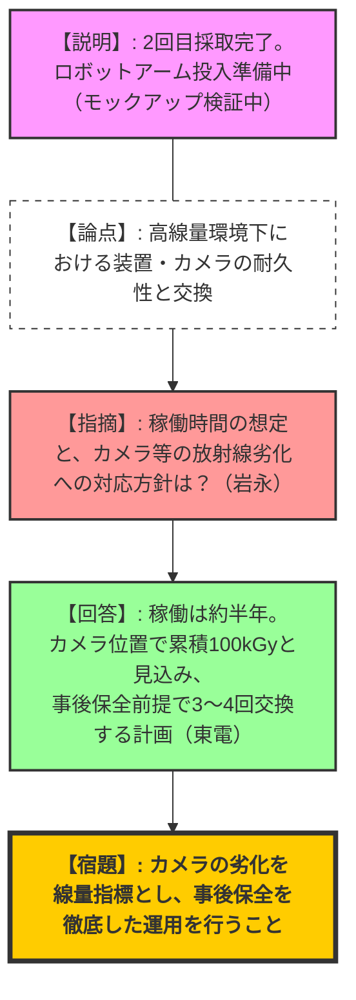
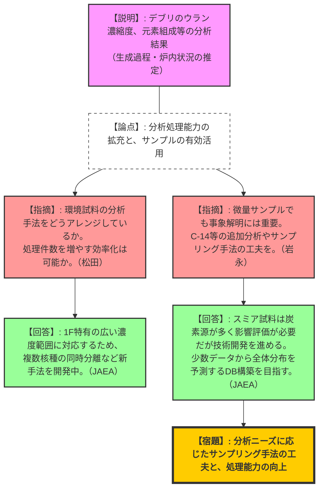
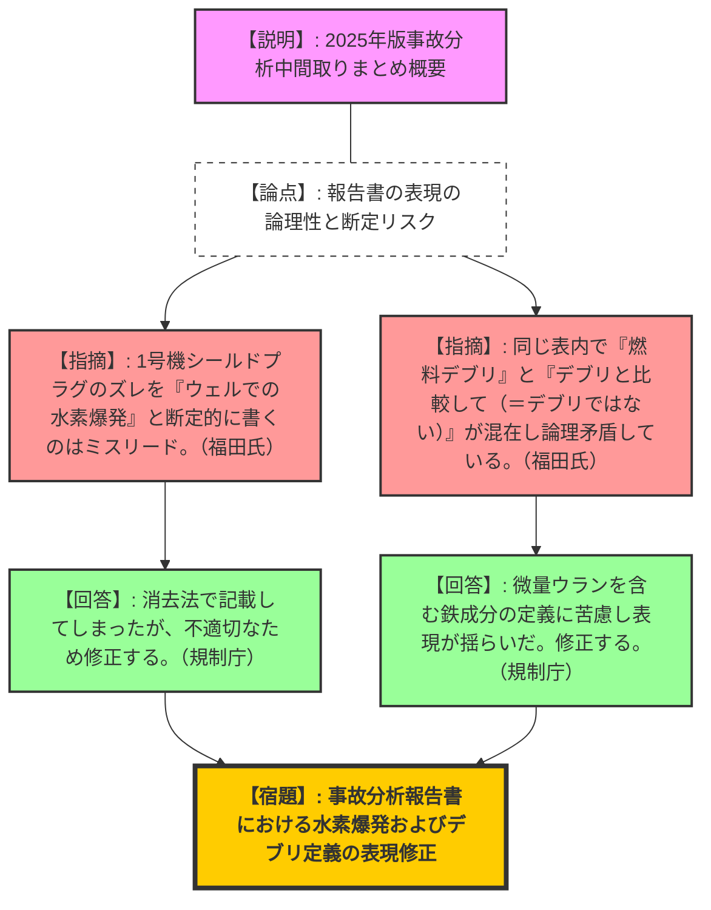

# 第15回福島第一原子力発電所廃炉・事故調査に係る連絡・調整会議（令和8年2月20日）
> 出典 : https://youtube.com/live/HIuYgGd_CJo?si=NKkGU2u9LLkrLnBr

## 1. 会合の概要
*   **最大の争点:** 
    *   2号機の燃料デブリ試験的取り出しにおいて、ロボットアームを用いた本格的な取り出しに向けた高線量下での機器（カメラ等）の耐放射線性確保と、事後保全を前提とした交換サイクルの確立。
    *   事故分析において、採取されたサンプルの量が微量であっても、生成過程（溶融物の挙動や構成成分）の解明に向けた分析を継続し、廃炉作業（除染・解体）へフィードバックする仕組みの構築。
    *   事故分析報告書における「燃料デブリ」の定義の揺らぎや、「水素爆発」の可能性に関する断定的な表現への修正要求。
*   **審査の進捗状況:** 2号機におけるテレスコ式装置による2回のデブリ採取が完了し、次段階のロボットアームのモックアップ検証が大詰めを迎えている。採取されたデブリのJAEAによる分析結果が報告され、ウラン濃縮度が炉心平均に近いこと、揮発性核種（Cs）の減少などが確認された。
*   **現場の緊張感と納得度合い:** 廃炉作業の現場（高線量）の過酷さを双方が共有しつつも、規制側からは「現場が厳しいからといって事故調査（HCUのサンプリング等）を諦めるべきではない」と強い牽制があった。東電側もこれに理解を示し、廃炉工程と並行して機会を伺うことで合意した。また、報告書の表現方法に対する有識者（福田氏）からの厳しい指摘に対し、規制庁が素直に反省・修正を約束する一幕もあった。
*   **特筆すべき決定事項:** ロボットアームの運用において、カメラ等の劣化を線量指標として捉え、事後保全（定期交換）を前提とした作業計画を立案すること。事故分析報告書における表現の適正化（デブリの呼称統一、水素爆発の表現修正）を行うこと。

---

## 2. 議題ごとの詳細整理

### 【議題1】2号機燃料デブリの試験的取り出しについて
*   **議論の背景と論点:** テレスコ式装置による2回のデブリ採取実績と、次段階であるロボットアームの投入に向けた準備状況。特に、高線量環境下（約100kGyの累積線量）でのカメラ等の耐放射線性と交換サイクルが問われた。
*   **質疑応答（詳細）:**
    *   【規制側（宮本）】: ロボットアームとエンクロージャーは一体で搬入されるのか。ウォータージェット切断時にダストで視界不良になる懸念はないか。
    *   【説明者側（東電・中川）】: エンクロージャーにロボットアームとマニピュレータを格納した状態で一式として搬入する。ウォータージェット噴射中は視界が失われるため、事前に短時間の試射を行い、ダストの上昇傾向を確認しながら作業を進める。
    *   【規制側（岩永）】: 高線量下での稼働時間をどう想定しているか。カメラの劣化そのものを「アーム全体への照射線量の指標」として管理し、交換できない機器の故障リスクを低減すべき。
    *   【説明者側（東電・中川）】: 一連の作業（アクセスルート構築〜内部調査）で約半年を想定。カメラ位置での累積線量は最大100kGy程度と見込み、3〜4回程度はエンクロージャー内でカメラを交換する前提で計画している。
    *   【規制側（岩永）】: カメラは事後保全（劣化してからの交換）を前提として宣言し、確実に運用してほしい。

### 【議題2】2号機の使用済燃料プールからの燃料取り出しについて
*   **議論の背景と論点:** 2号機SFPからの燃料取り出しに向け、原子炉建屋南側に構台を設置し、新型の燃料取扱設備を用いた遠隔操作による取り出し手順と、要員育成（メーカーへの出向）の取り組み。
*   **質疑応答（詳細）:**
    *   【規制側（松田）】: 汚染確認後にハウス（汚染拡大防止ハウス）を収納した後のエリアは、レッドゾーンからイエローゾーン（Yゾーン）になるという理解でよいか。除染ピットのダスト管理はどうするのか。
    *   【説明者側（東電・上西）】: 現在の試運転ではYゾーンとしているが、本番は現場状況に応じて管理する。ダスト監視は建屋と構台の換気設備で行う。
    *   【規制側（宮本）】: 新型クレーンの遠隔操作において、試運転で気がかりな点はないか。
    *   【説明者側（東電・鈴木）】: 自動運転と手動運転が切り替わるポイントでの習熟が課題だが、メーカー出向者が対応しており特段の問題は起きていない。ワンスルー試験は数日程度で完了する予定。
    *   【規制側（岩永）】: サプライチェーンへの出向による人材育成は非常に重要。放射線環境下での特殊な技能を持つ「廃炉人材」のあり方について、経産省の意見はどうか。
    *   【説明者側（経産省）】: 東電エンジニアの能力向上は総合特別事業計画でも重要とされており、国としても支援していく。

### 【議題3】東京電力福島第一原子力発電所のサンプル分析について
*   **議論の背景と論点:** JAEA大熊分析・研究センターにおける、1回目および2回目に採取されたデブリサンプルの分析結果。ウラン濃縮度、元素組成、生成過程の推定状況。
*   **質疑応答（詳細）:**
    *   【規制側（石川）】: 年間10サンプルの分析依頼に対するJAEAの負担感はどうか。可能であれば処理数を増やしてほしい。
    *   【説明者側（JAEA・古瀬）】: 既存の瓦礫分析（100件以上）との兼ね合いがあるため、関係各所と調整して配分を決定したい。
    *   【規制側（松田）】: 分析フローにおける「分離精製」は既存手法か、新規開発か。
    *   【説明者側（JAEA・古瀬）】: 1F特有の広い濃度範囲に対応するため、複数の核種を同時分離できるような新しい分離剤等を用い、既存技術を改良・合理化している。
    *   【規制側（岩永）】: サンプル量が少なくても事象解明には重要。炭素（C-14）などの追加分析は可能か。
    *   【説明者側（JAEA・古瀬）】: 今回のスミア試料は炭素源が多いため影響評価が必要だが、技術開発を進める。今後、少ない分析点数で全体の分布を予測できるデータベース構築を目指す。

### 【議題4】3号機制御棒駆動水圧系水圧制御ユニット(HCU)の取扱いについて
*   **議論の背景と論点:** 炉心下部の損傷範囲推定のため、HCU系統の残水や汚染状況を調査したい規制庁と、高線量のため即時の調査は困難とする東電との調整。
*   **質疑応答（詳細）:**
    *   【規制側（宮本）】: HCUの残水確認は系統の健全性推定に有用だが、現場の高線量を踏まえ、直ちにサンプリングを求めるものではない。廃炉作業の進捗に合わせて調査のタイミングを相談したい。
    *   【説明者側（東電・伊藤/今福）】: 現場は非常に高線量（通路通過だけで1mSv等）であり、一気に撤去・調査するのは困難。今後、線量低減や撤去が進み、現場に近づける段階になった際にサンプリング箇所等を相談したい。
    *   【規制側（岩永）】: 線量が高いからといって事故調査の重要データを諦めるべきではない。将来の作業時にデータが消失しないよう、両者で認識を共有しておきたい。

### 【議題5】原子力規制庁における最近の事故分析の状況について
*   **議論の背景と論点:** 2025年版の事故分析中間取りまとめの概要と、今後の取り組み方針（短期・中長期）。
*   **質疑応答（詳細）:**
    *   【有識者（福田氏）】: 報告書の記載について3点指摘する。
        1. 1号機ICの流量推定について、行きと戻りの「流動様式」を推定できれば流量の特定につながるのではないか。
        2. 1号機シールドプラグのズレについて「ウェルでの水素爆発が原因である可能性が高い」と赤字で断定的に書くのはミスリードである。酸素の供給源など未解明な点が多い。
        3. 堆積物について、左欄で「燃料デブリ」と呼びながら右欄で「燃料デブリと比較して」と書き分けるのは論理矛盾である。
    *   【説明者側（規制庁・宮本/岩永）】: 
        1. 凝縮して戻る水量の推定に苦慮しているが、戻り側にフォーカスして再検討する。
        2. シールドプラグの表現は不適切であったため修正する。消去法で水素爆発と考えたくなるジレンマがある。
        3. 鉄成分が多くウランが極微量な堆積物を「デブリ」と呼ぶかどうかの端境期にあり、表現が揺らいでしまった。国語の作法として反省し、表現を整理する。

---

## 3. 論理構造の可視化（Mermaid）

### 議題1：2号機燃料デブリ試験的取り出し（ロボットアーム）

### 議題3：燃料デブリのサンプル分析

### 議題5：事故分析の中間取りまとめと表現の適正化

