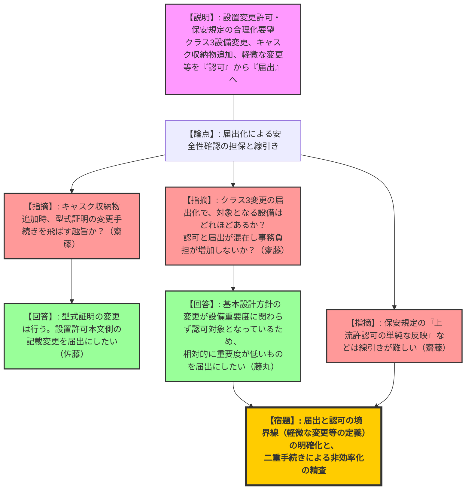
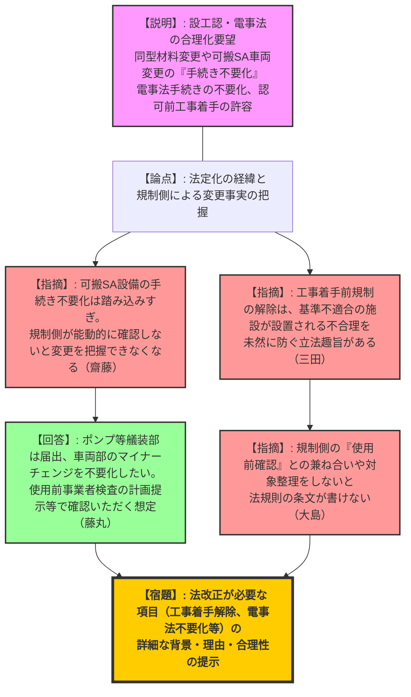
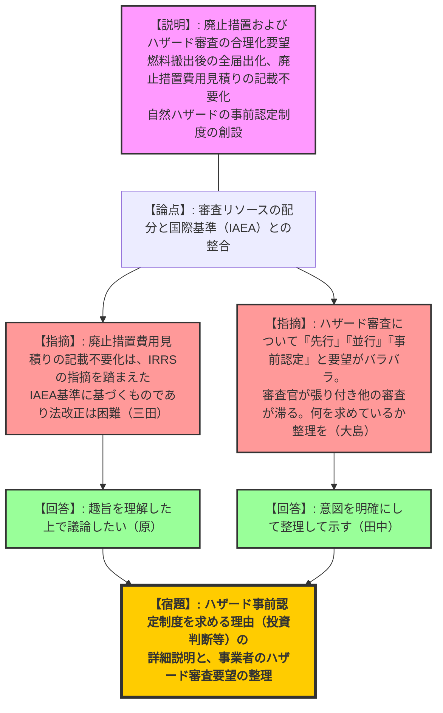

# 第1回実用発電用原子炉の許認可制度等の見直しに関する意見交換会合（令和8年2月20日）
> 出典 : https://youtube.com/live/GSByDRBToWQ?si=HJIWgeGB1VtmvwYA

## 1. 会合の概要
*   **最大の争点:** 事業者から提案された「届出化の拡大」「手続きの不要化」「工事着手前規制の解除」「自然ハザードの事前認定制度」など多岐にわたる制度緩和要望に対し、規制の安全性担保（特に規制側が変更事実をいかに把握・確認するか）と法改正のハードルをどうクリアするか。
*   **審査の進捗状況:** 昨年12月に規制委員会で示された「グレーデッドアプローチに基づく審査手続きの合理化」のイメージ案に対し、事業者（ATENA・各電力）から具体的な要望が提示された第1回会合。議論のキックオフとして、事業者側の要望の意図確認と、法改正を要する優先項目の切り分けが行われた。
*   **現場の緊張感と納得度合い:** 事業者側が実務上の負担軽減を目的とした広範な要望（全42項目）を提示したのに対し、規制側（規制庁）は「要求がバラバラでリソース配分の見通しが立たない」「法改正の趣旨（法定化の経緯やIAEA基準への適合）を無視した緩和は困難」と厳しく牽制しつつも、合理化の方向性自体には一定の理解を示し、今後の法的な落とし込みに向けた詳細な論拠の提示を求めた。
*   **特筆すべき決定事項:** 次回以降の会合では、法改正が必要となる優先項目（①自然ハザードの事前認定制度、②電事法手続きの不要化、③認可前工事着手の許容）に絞って、事業者が詳細な背景と合理性を説明することとなった。中長期的な課題やガイド類の見直しについては、別の場（CNO会議等）で議論を深めることとされた。

---

## 2. 議題ごとの詳細整理

### 【議題】実用発電用原子炉の許認可制度等の見直しに関する事業者意見

#### 1. 設置変更許可・保安規定に関する届出化の拡大
*   **議論の背景と論点:** クラス3設備の変更や、軽微な組織変更、型式証明取得キャスクへの収納燃料追加など、安全性への影響が小さい変更について「認可」から「届出」へ移行する事業者の提案。
*   **質疑応答（詳細）:**
    *   【規制側（齋藤）】: キャスクの収納物追加について、型式証明側の変更手続き（承認/届出）を飛ばして、設置許可の変更届出だけで済ませたいという趣旨か。
    *   【説明者側（東北電・佐藤）】: 型式証明の変更手続きはしっかりと行う。その上で、設置許可（本文五号の型式証明番号の変更等）側を届出にしたいという趣旨である。
    *   【規制側（市川）】: 軽微な変更（組織名等）の届出化について、責任の所在や事故時手順等の重要な組織変更は含まれないという認識でよいか。
    *   【説明者側（ATENA・田中）】: その認識で間違いない。
    *   【規制側（齋藤）】: クラス3変更で「評価結果が変わらないもの」を届出とする提案について、廃棄物処理設備などは本文記載が少なく対象が限定的ではないか。また、認可と届出が分かれることによる事務負担の増加も懸念される。
    *   【説明者側（東電・藤丸）】: 設備重要度に関わらず基本設計方針等の変更が認可対象となっているため、相対的に重要度が低いものは届出に拡大したいという趣旨である。
    *   【規制側（齋藤）】: 保安規定においても、「上流の許認可の単純な反映」と言いつつ審査してみるとそうでない場合がよくあるため、線引きの整理が必要である。
*   **結論と宿題事項:**
    *   **【宿題】**: 届出と認可の境界線（「軽微な変更」「単純な反映」の定義）を明確にし、二重手続きによる非効率化を招かないよう整理すること。

#### 2. 設工認・電事法手続きの不要化と工事着手前規制の解除
*   **議論の背景と論点:** 同型材料への変更や可搬型SA設備のマイナーチェンジに伴う「手続き不要化」、電事法手続きの不要化、および設工認認可前の工事着手を許容する提案。
*   **質疑応答（詳細）:**
    *   【規制側（齋藤）】: 可搬型SA設備の改造手続き不要化は、1F事故の教訓を踏まえて法定化した経緯からして踏み込みすぎではないか。規制側が能動的に確認しに行かないと変更の事実を把握できなくなる。
    *   【説明者側（東電・藤丸）】: ポンプ等の艤装部の仕様変更は届出とし、車両部（一般産業品）のマイナーチェンジに伴う寸法変更等を手続き不要としたい。変更事実は「使用前事業者検査」の計画情報提供等で確認いただくことを想定している。
    *   【規制側（三田）】: 電事法手続きの不要化は原子力安全以外の観点もある。また、工事着手前規制の解除は「基準不適合の施設が設置される不合理を未然に防ぐ」という立法趣旨があるため、詳細な説明が必要である。
    *   【規制側（大島）】: 工事着手を解除して使用前事業者検査で確認するというが、規制側の「使用前確認」との兼ね合いや対象範囲を整理しないと、法律や規則に落とし込むことができない。
*   **結論と宿題事項:**
    *   **【宿題】**: 法改正が必要となる「工事着手前規制の解除」「電事法手続きの不要化」について、次回、詳細な背景・理由・合理性を示す資料を提示すること。

#### 3. 廃止措置・ハザード審査の合理化
*   **議論の背景と論点:** 燃料搬出完了後の廃止措置における全届出化、ハザード審査の先行・並行審査、および建て替え炉のための「自然ハザードの事前認定制度」の創設。
*   **質疑応答（詳細）:**
    *   【規制側（市川）】: 廃止措置における「使用済燃料の搬出完了時」の届出化は、すべての変更を届出にしたい趣旨か。原子炉解体作業のリスク評価をしっかり説明してほしい。
    *   【説明者側（関電・原）】: 廃止措置計画全体の変更を届出にしたい趣旨。廃止措置は基本的にリスクが下がる活動であると認識している。
    *   【規制側（三田）】: 廃止措置の費用見積りの記載不要化は、IRRSの指摘を踏まえIAEA基準に整合させるため導入した制度であり、法改正は困難である。
    *   【規制側（大島）】: ハザード審査について、「どれでも先行してほしい」「施設と並行審査してほしい」「建て替えのための事前認定をしてほしい」と事業者の要望がバラバラで、審査リソース配分の見通しが立たない。既設炉のハザード先行は安全性向上のメリットが薄いと考えており、何を求めているか整理してほしい。
    *   【説明者側（ATENA・田中）】: 意図を明確にして整理して提示する。
    *   【規制側（齋藤）】: 兼用キャスクの型式証明の部分活用について、雰囲気温度等の条件が少し外れても評価温度以下なら適用したいという要望は、別の場（技術基盤課等）で審査実績を踏まえて議論すべき。
*   **結論と宿題事項:**
    *   **【宿題】**: ハザード事前認定制度を求める理由（投資判断との関係性等）の詳細説明、および事業者が求めるハザード審査の進め方（先行・並行）の要望の整理。

---

## 3. 論理構造の可視化（Mermaid）

### グラフ1：設置変更許可・保安規定関係（届出化の拡大）

### グラフ2：設工認・電事法手続きの不要化と工事着手条件

### グラフ3：廃止措置・ハザード審査の合理化

