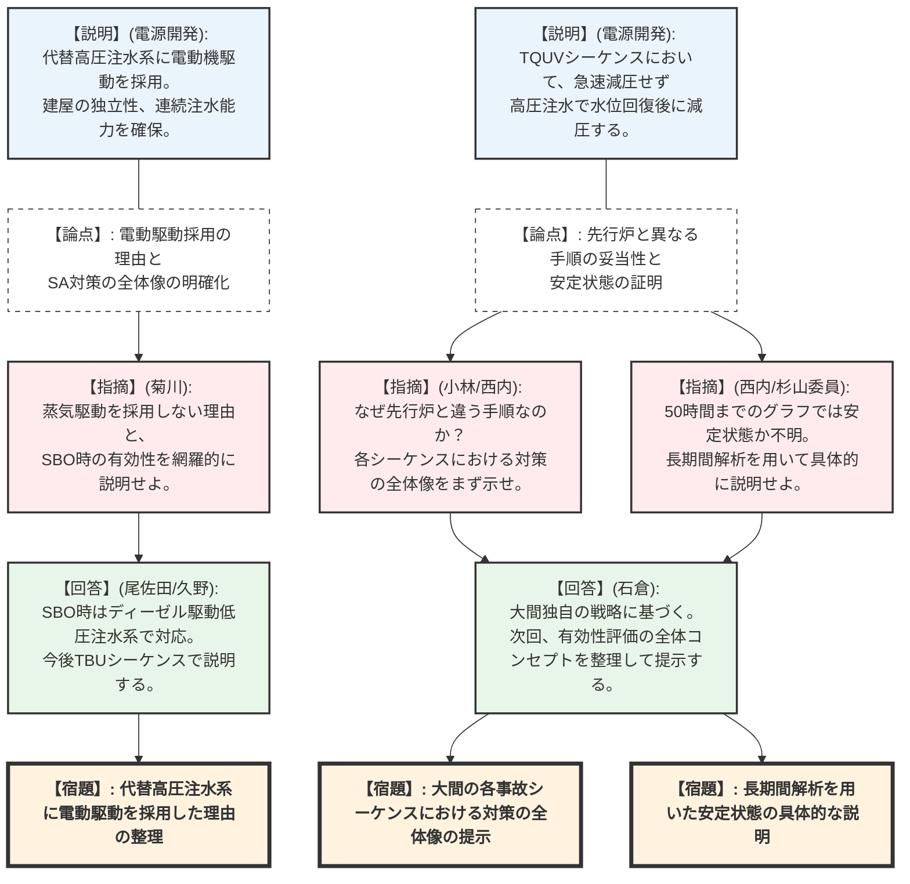
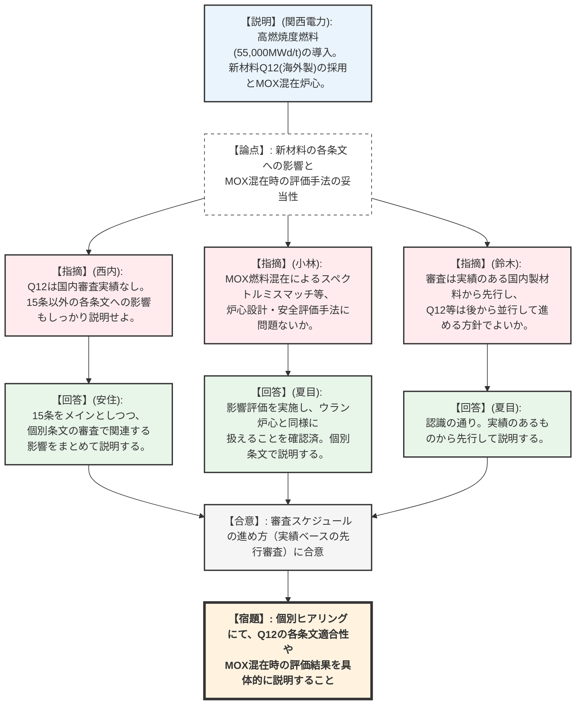

# 第1392回原子力発電所の新規制基準適合性に係る審査会合（令和8年2月24日）
> 出典 : https://youtube.com/live/5f3tdgk25_Y?si=7wEZgRsCZjKPx7a2

# 1. 会合の概要
* **最大の争点:**
  * 【大間原発】先行の沸騰水型軽水炉（BWR）プラントと異なるSA（重大事故等）対策（電動機駆動の代替高圧注水系の採用や、過渡事象時に急速減圧を行わない手順など）の全体コンセプトの妥当性と、有効性評価における「安定状態への移行」の証明方法。
  * 【高浜原発】国内初となる海外製ジルコニウム基合金（Q12）の中間支持格子への採用、およびMOX燃料混在炉心における高燃焼度燃料（55,000MWd/t）導入が各条文や炉心設計手法に与える影響の評価。
* **審査の進捗状況:** 
  * 【大間原発】代替高圧注水系および有効性評価の個別シーケンス（高圧・低圧注水機能喪失等）の初回説明が行われた。独自の対策に関する全体像の整理や、長期間解析を用いた安定状態の説明不足が指摘され、資料の再構成が求められた。
  * 【高浜原発】高燃焼度燃料導入に係る設置変更許可申請の概要説明が行われた。実績のある国内製材料から先行して審査を進め、新材料（Q12）やMOX混在影響については準備が整い次第詳細を説明していく方針で合意した。
* **現場の緊張感と納得度合い:** 
  * 大間原発の審査では、先行プラントと異なるアプローチをとること自体は「建設中プラントのメリットを活かした優れた戦略」と規制側（杉山委員等）からも一定の評価を得た。しかし、その意図や全体像が資料から読み取れず、個別シーケンスの切り取り説明になっていた点に対し、「大間として何をどう説明したいのか伝わらない」と厳しい指摘が相次いだ。事業者は説明不足を率直に認め、全体像の整理を約束した。
* **特筆すべき決定事項:** 
  * 【大間原発】次回以降の審査において、個別シーケンスの説明に入る前に、大間原発のSA対策の全体像（先行実績との違いや採用理由など）を整理して説明すること。また、有効性評価において、原子炉および格納容器が安定状態に導かれていることを、長期間解析を用いて具体的に説明することが決定した。

---

# 2. 議題ごとの詳細整理

### 【議題1】電源開発（株）大間原子力発電所の重大事故等対策について
* **議論の背景と論点:** 大間原発は建設中プラントのメリットを活かし、重大事故等対処設備として蒸気駆動（RCIC等）の代替ではなく、新設建屋に電動機駆動の「代替高圧注水系」を設置する。この独自の対策が、全交流動力電源喪失（SBO）時を含めた各事故シーケンスにおいて、どのように有効に機能するのか（戦略の全体像）が論点となった。
* **質疑応答（詳細）:**
  * 【説明者側】: 代替高圧注水系に電動駆動を採用した理由は、設備との共通要因故障の排除（位置的分散）、高圧から低圧までの連続注水による運用性向上、および常設代替交流電源設備（空冷式ディーゼル発電機）からの給電が可能であるためである。
  * 【規制側】（菊川）: 蒸気駆動を採用しない理由が直接的に説明されていない。また、SBO時の対策（TBUシーケンス）としての有効性を含め、安全対策に関連する項目を網羅的に整理して説明すべき。
  * 【説明者側】: SBO時には電動の代替高圧注水系が使用できないため、ディーゼル駆動の低圧注水系を使用する。今後、TBUシーケンスの中で説明する。
  * 【説明者側】: 高圧・低圧注水機能喪失（TQUV）シーケンスでは、代替高圧注水系で水位を回復させた後に、逃がし安全弁1個で減圧する手順としている。
  * 【規制側】（小林）: TQUVは通常、47条（代替低圧注水設備）の有効性を確認するシーケンスだが、大間は高圧注水で対応している。この対策を採用した考え方を整理してほしい。また、フィルターベントを使わないシナリオになっているが、その有効性はどのシーケンスで確認するのか。
  * 【説明者側】: 代替高圧注水系は高圧・低圧連続で使用できるため45条・47条双方に適合する。47条の低圧注水としての有効性はLOCAシーケンスで確認し、フィルターベントはTBUシーケンスで代表して確認する予定である。
  * 【規制側】（西内・杉山委員）: 大間独自の対策について、個別シーケンスごとに説明されても全体像が見えない。先行プラントとの違いを含め、SA対策の全体コンセプトをまず説明すべき。また、TQUV等の50時間までのグラフでは「低下傾向（安定状態）」にあることが判然としない。長期間解析を用いて具体的に説明せよ。
  * 【説明者側】: 指摘を承知した。まずは有効性評価のシーケンス全体として、どのような対策を当てはめているかの全体像を整理した上で次回以降説明する。
* **結論と宿題事項:**
  * **【宿題】**: 代替高圧注水系に蒸気駆動ではなく電動駆動を採用した理由を整理して説明すること。
  * **【宿題】**: 全交流動力電源喪失時の対策を含め、大間の各事故シーケンスグループにおける対策の全体像（採用した理由や先行プラントとの違い）を網羅的に整理して説明すること。
  * **【宿題】**: 有効性評価において、事象発生後50時間までのグラフだけでは不十分であるため、長期間解析等を用いて原子炉および格納容器が安定状態に導かれていることを具体的に説明すること。
  * **【宿題】**: 審査資料リストにおいて、追而（後日提出）となっている箇所や解消時期が分かるように明記し、スケジュールを見直すこと。

### 【議題2】関西電力（株）高浜発電所3号炉及び4号炉の高燃焼度燃料導入に係る設置変更許可申請の審査について
* **議論の背景と論点:** 高浜3、4号炉において、燃料の安定調達と使用済燃料発生量の低減を目的に、ウラン燃料の最高燃焼度を48,000MWd/tから55,000MWd/tに引き上げる。これに伴い、国内初となる海外製材料（Q12）の採用や、MOX燃料が混在する炉心における設計手法・安全評価手法の妥当性が論点となった。
* **質疑応答（詳細）:**
  * 【説明者側】: 高燃焼度化に伴い、被覆管材料をジルコニウム基合金に変更し、濃縮度やペレット密度を引き上げる。また、海外製燃料の中間支持格子材質として新たに「Q12」を追加する。
  * 【規制側】（西内）: Q12は国内での審査実績がない新しい材料である。今後、第15条（炉心等）に限らず、各条文への適合性を審査する中で、その特性や影響を具体的に説明してほしい。
  * 【説明者側】: 15条をメインとしつつ、他の関連する条文への影響も考慮した上で、個別の条文のところでまとめて説明する。
  * 【規制側】（小林）: PWRのMOX混在炉心に関する審査は規制庁体制になって初となる。高燃焼度ウラン燃料とMOX燃料が混在することによる中性子スペクトルの違い（スペクトルミスマッチ）等について、炉心設計手法や安全評価手法に問題がないか確認しているか。
  * 【説明者側】: 今回はMOX燃料自体の設計変更はないが、高燃焼度ウラン燃料とMOXの併用による影響評価は実施しており、ウラン炉心と同様に扱えることを確認している。詳細は個別条文の審査で説明する。
  * 【規制側】（鈴木）: 審査スケジュールの進め方について、実績のある国内製材料（ZIRLO等）に関する説明を先行させ、Q12等の新材料については準備ができ次第、並行して確認を進めるという形でよいか。
  * 【説明者側】: その認識で間違いない。実績のあるものから先行して説明し、新しいものについては個別審査の中で説明する。
* **結論と宿題事項:**
  * 高燃焼度燃料導入の申請概要および今後の審査スケジュールの進め方（実績のあるものから先行して審査する方針）について合意した。
  * **【宿題】**: 今後の個別ヒアリングにおいて、新材料（Q12）の各条文への適合性や、MOX混在炉心における炉心設計コードの妥当性について、具体的な評価結果をもって説明すること。

---

# 3. 論理構造の可視化（Mermaid）

### 議題1：大間原子力発電所の重大事故等対策について

### 議題2：高浜発電所3号炉及び4号炉の高燃焼度燃料導入

