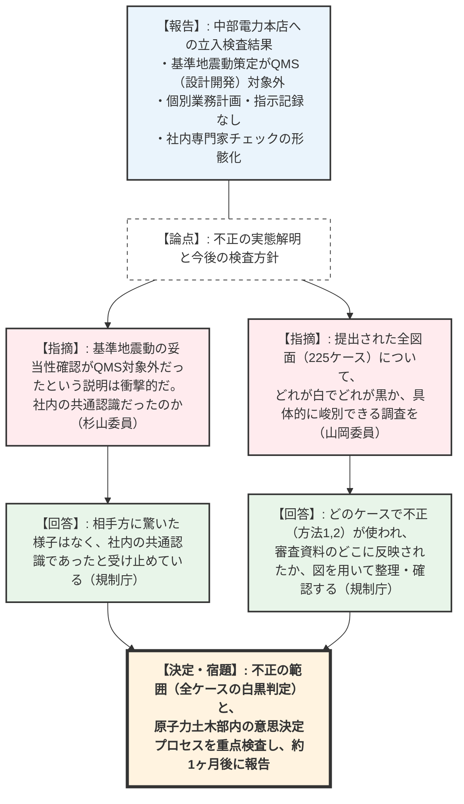
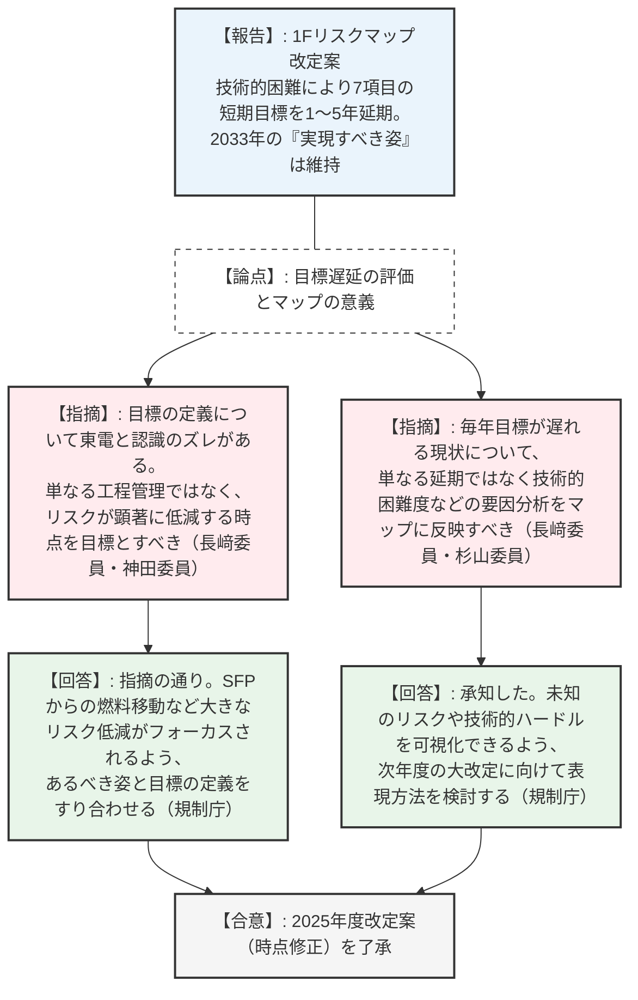
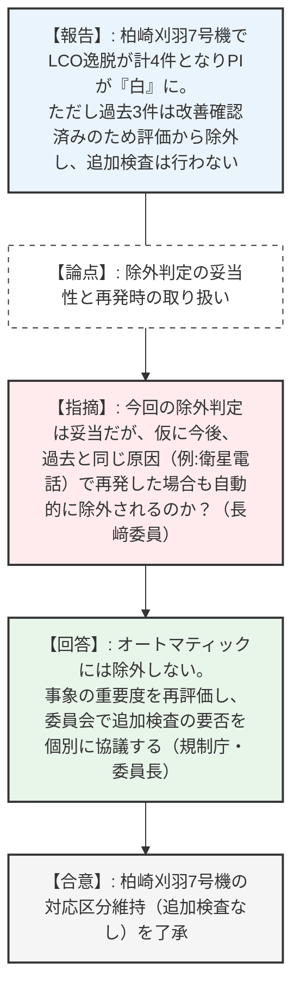

# 第61回原子力規制委員会（令和8年2月25日）
> 出典 : https://youtube.com/live/PvZBefrQQp0?si=O5sXLpO_qneCHbUM

## 1. 会合の概要
*   **最大の争点:** 中部電力浜岡原発における基準地震動評価のデータ不正事案に対し、規制庁が実施した立入検査の初動報告と、今後の検査の重点方針（不正の範囲と意思決定プロセスの解明）。
*   **審査の進捗状況と決定事項:**
    *   **浜岡データ不正:** 検査により「品質マネジメントシステム（QMS）の対象外とされていた」「社内専門家のチェック記録が機能・保存されていない」等のずさんな実態が判明。今後、対象全225ケースの不正範囲と意思決定プロセスを重点的に調査し、次回報告することが確認された。
    *   **1Fリスクマップ:** 新たな技術的困難（ゼオライト回収、スラリー脱水等）により、7項目の目標時期見直し（1〜5年の延期）を含む2025年度改定案が了承された。
    *   **EALの長期課題:** 設備ベースからパラメータベースへの移行（ステップ1の課題整理）と、屋内退避解除要件の具体化に向けた論点整理状況が報告された。
    *   **四半期検査結果:** 柏崎刈羽7号機でLCO逸脱（通信系トラブル）が発生したが、過去の追加検査で原因究明済みの事案を除外した結果、対応区分（第1区分）の変更は不要と判断され、了承された。
*   **現場の緊張感と納得度合い:** 浜岡原発の不正事案報告において、規制庁側から「耐震設計の大前提である基準地震動の妥当性確認がそもそもQMS対象外だったという説明に衝撃を受けた」との強い懸念が示された。委員からも「どういう指示で不正が行われたのか白黒はっきりつけるべき」と厳しい注文がつき、今後の徹底した真相解明への強い意志が共有された。

---

## 2. 議題ごとの詳細整理

### 【議題1】中部電力株式会社の不正行為に係る検査状況の報告（1回目）
*   **議論の背景と論点:** 中部電力浜岡原発の基準地震動策定業務において発覚したデータ不正事案について、1月下旬から2月に実施された規制庁による本店への立入検査（計3日）の結果報告と、今後の重点調査方針。
*   **質疑応答（詳細）:**
    *   【説明者側（忠内）】: 検査の結果、①基準地震動策定がQMS（設計開発）の対象外とされており、検証・妥当性確認が行われていなかった。②個別業務計画が存在せずプロセスが不明確。③委託業者への「代表波選定」の指示記録が見当たらない。④社内専門家のチェック結果やその取り扱い記録が残っていない、という事実が判明した。
    *   【規制側（山岡委員）】: 原因や手法の解明に加え、提出された資料（図）の一つ一つについて「これは白（正しい）、これは黒（不正）」と明確に評価・峻別できるような調査をお願いしたい。
    *   【説明者側（鈴木）】: 断層モデルを用いた全225ケースについて、どのケースで不正（方法1、方法2）が行われたか、審査会合資料のどこに使われたかを確認し、図を用いて分かりやすく整理したい。
    *   【規制側（杉山委員）】: 「基準地震動策定がQMSの対象外」という説明に衝撃を受けた。これは「別のカテゴリーだった」という意味か、それとも「社内の共通認識としてレビュー不要と思っていた」のか。
    *   【説明者側（竹内）】: 検査時の感触として、相手方に驚いた様子はなく、社内の共通認識であったと受け止めている。我々としてもかなり驚いた。
    *   【規制側（伴委員）】: 第3者委員会の調査と並行しているが、関係者へのヒアリング等で支障は出ていないか。
    *   【説明者側（忠内）】: 第3者委員会からの「記憶の上書きを防ぐためインタビューは控えてほしい」との要望で社内調査は進んでいないが、我々の規制検査は独立して資料確認や聞き取りを逐次進めている。
    *   【規制側（山中委員長）】: 平成30年の審査会合での「誤記が多いので専門家に見せなさい」という規制側の指示は、不正を疑ったものではなく単純な誤記対応か。
    *   【説明者側（忠内）】: その通り。不正を疑ったものではなく、品質保証の観点からの指摘であった。
*   **結論と宿題事項:**
    *   **【決定】**: 引き続き、①不正行為の範囲と具体的な様態（全225ケースの白黒判定）、②原子力土木部内の意思決定プロセス（委託業者への指示内容等）を重点的に検査する。
    *   **【宿題】**: 3月末の中部電力からの報告聴取命令の回答を踏まえ、概ね1ヶ月後を目途に次回報告を行うこと。

### 【議題2】東京電力福島第一原子力発電所のリスク低減に係る活動の進捗とリスクマップの改定
*   **議論の背景と論点:** 1F廃炉作業における短期目標の進捗状況と、技術的困難（ゼオライト回収、スラリー脱水、溶融設備等）に伴う達成時期の大幅な見直し（1〜5年延期）を含む2025年度リスクマップ改定案の了承。
*   **質疑応答（詳細）:**
    *   【説明者側（大橋）】: 7件の短期目標について時期を見直す。ゼオライト回収着手は2025年度→27年度、スラリー脱水処理開始は2028年度→30年度、溶融設備設計は2029〜31年度→32〜34年度などへ延期する。今年度は短期目標の時点修正のみを行い、2033年度の「実現すべき姿」は維持する。
    *   【規制側（長﨑委員）】: 脚注にある「規制庁と東電の定義（達成目標の解釈）のズレ」は、リスクマップの意義を損なうため、共通認識を徹底すべき。また、毎年目標が遅れる現状について、単に遅らせるだけでなく原因を分析し、東京電力の知見として残るようにすべき。
    *   【規制側（神田委員）】: 技術的困難による遅延は理解するが、リスクが大きく下がる（達成による顕著なリスク低減）ポイントをもって「目標達成」と定義すべきではないか。東電が「譲らない」と言っている点についてどう考えるか。
    *   【説明者側（岩永）】: 指摘の通り。例えば「6号機使用済燃料の共用プールへの移動」は大きなリスク低減である一方、遅ればかりがフォーカスされがちである。結果としてリスクが下がらない状況を冷静に見極め、あるべき姿を考えていく。
    *   【規制側（杉山委員）】: 来年度は「2033年度の姿」そのものの改定が必要になるかもしれない。また、マップ上は敷地に余裕があるように見えるが、実際は放射線防護機材やスラリーで逼迫しているのではないか。
    *   【説明者側（岩永）】: 実際の敷地（タンク等の占有率）はぎっしり詰まっており、非常に切迫しているのが事実である。今後はそのような状況が分かる説明も工夫したい。
*   **結論と宿題事項:**
    *   **【決定】**: 提示されたリスクマップの2025年度改定案（時点修正）を了承した。
    *   **【宿題】**: 来年度の大改定に向けて、単なる工程遅延ではなく、技術的困難度や未知のリスクを可視化できるようなマップの表現方法、および東電との「目標達成」の定義のすり合わせを行うこと。

### 【議題3】緊急時活動レベル（EAL）の長期課題に係る検討状況
*   **議論の背景と論点:** EALの現行体系（設備ベース）を米国・IAEA基準（パラメータベース・障壁ベース）に近づけるためのステップ1の検討状況、および「屋内退避解除」の要件具体化の議論状況の報告。
*   **質疑応答（詳細）:**
    *   【説明者側（阿部）】: 現行EALは設備機能喪失をベースとしており、深刻度のばらつきや不必要な避難（GEの早期発出）を招く懸念がある。ステップ1として米国等との比較整理を終え、今後ステップ2（事象のエスカレーションの整理）へ進む。また、屋内退避解除要件として、注水・除熱の複数系統確保や、パラメータの「安定・低下傾向」の継続見通しなどを提案し議論中である。
    *   【規制側（杉山委員）】: EAL改正は、信頼性の高い代替注水手段が残っていてもGE（全面緊急事態）が発出され、不要な避難を強いる現状を合理化するものである。SE（施設敷地緊急事態）よりも、住民避難に直結する「GEのレベル」を揃えることを優先して議論すべきであり、その際はオフサイト防災側（神田委員）も参加してほしい。
    *   【説明者側（阿部）】: 指摘の通り進める。事業者の準備が整い次第、ステップ2の議論（事象進展とEAL発出の関係整理）に着手する。
*   **結論と宿題事項:**
    *   報告を了承。GEのレベル整理を優先し、防災側と連携しながら、あまり長引かせず（1年程度で）一定の結論を得て、訓練等で検証していく方針を確認した。

### 【議題4】令和7年度第3四半期の原子力規制検査等の結果
*   **議論の背景と論点:** 第3四半期の検査結果（指摘事項2件）と、柏崎刈羽7号機における安全実績指標（PI）「白」に対する対応方針（追加検査の要否）の決定。
*   **質疑応答（詳細）:**
    *   【説明者側（平野）】: 指摘事項は、泊3号機の消火水系代替措置未実施（緑・SL4）と、女川2号機の火災時手動停止手順書未作成（緑・SL4）の2件。柏崎刈羽7号機は、通信系トラブル等によりLCO逸脱が計4件となりPIが「白」となった。しかし、過去3件は既に追加検査で改善確認済みであるため、評価対象から除外し、対応区分（第1区分）の変更および追加検査は行わないこととしたい。
    *   【規制側（杉山委員）】: 女川2号機の手順書未作成は、設計側が一方的に決め、現場の運用者と協議・引き継ぎされていないプロセスに問題があるのではないか。柏崎刈羽の判定除外は妥当である。
    *   【規制側（長﨑委員）】: 今回の除外判定は妥当だが、仮に今後、過去と同じ原因（例：衛星電話の故障）が再発して4件目に達した場合も、自動的に「除外」となるのか。再発なら別途議論すべきではないか。
    *   【説明者側（平野）】: 再発の場合は、その事象自体の重要度評価を行った上で、PIの評価対象とするか、追加検査が必要かを個別に検討することになる。
    *   【規制側（山中委員長）】: オートマティックに除外されるわけではなく、再発等の場合は委員会で対応を協議するということでよいか。
    *   【説明者側（平野）】: その通りである。
*   **結論と宿題事項:**
    *   第3四半期の検査結果を了承し、柏崎刈羽7号機の対応区分を維持（追加検査なし）する方針を決定した。

---

## 3. 論理構造の可視化（Mermaid）

### 議題1：中部電力 浜岡原発データ不正事案の検査状況

### 議題2：1Fリスクマップ改定（2025年度版）

### 議題4：第3四半期 規制検査結果と柏崎刈羽7号機の対応

