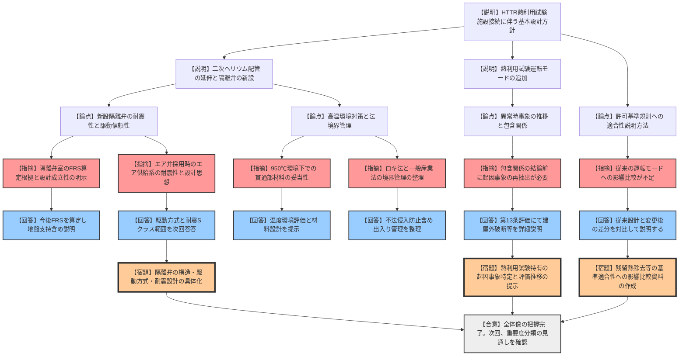

# 第572回核燃料施設等の新規制基準適合性に係る審査会合（令和8年2月25日）
> 出典 : https://youtube.com/live/91adxH3i_fI?si=axoAtWjEhiSC44GN

## 1. 会合の概要
*   **最大の争点:** 二次ヘリウム配管の原子炉建屋外への延伸に伴う安全設計の抜本的変更。特に、既設の安全評価（既許可）への影響範囲と、新設される隔離弁の耐震・設計成立性が焦点となった。
*   **審査の進捗:** 基本設計方針の全体像が提示されたが、規制側からは「従来の運転モードへの影響」や「起因事象の再抽出」など、より深掘りした比較説明が求められ、詳細設計の妥当性確認は次回以降へ持ち越しとなった。
*   **規制側の納得度:** 全体像の把握については概ね得られたものの、建屋外隔離弁の駆動方式（エア弁）の信頼性や、建屋から独立した隔離弁室の耐震評価手法（FRSの適用）について厳しい注文がついた。
*   **特筆事項:** 放射性物質の閉じ込め機能を担う隔離弁（MS2）に対し、設計基準を超える事象（BDBA）を想定したSSクラスの耐震性能を期待するという、高度な安全設計方針が示された。

---

## 2. 議題の詳細整理

**【議題1】日本原子力研究開発機構（JAEA）HTTRの熱利用試験施設接続に係る設置変更許可申請について**

*   **議論の背景と論点:**
    HTTRから水素製造装置等へ熱を供給するため、二次ヘリウム配管を原子炉格納容器および建屋の外へ延伸する設計変更。これに伴い、「閉じ込め機能」の維持を目的とした隔離弁の新設、および「熱利用試験運転モード」の追加が必要となる。技術的な争点は、延伸配管の破損リスクへの対処、および新設設備が既存の安全設計（冷却・停止）に及ぼす影響の評価手法である。

*   **質疑応答（詳細）:**
    *   **【論点：基準適合性の説明手法】**
        *   **【説明者（JAEA）】:** 設置変更箇所の条文適合性を整理し、安全設計の基本方針（改造、運転制御、異常時対策）を説明。
        *   **【規制側（塩川）】:** 単なる新設箇所の説明では不十分。従来の運転モード（熱利用なし）との整合性や、残留熱除去設備の基準適合性に影響がないかを、図表を用いて比較・整理して示すべき。
        *   **【説明者（JAEA）】:** 承知した。従来の設備構成・対処法と、熱利用接続後の変更点を対比し、影響の有無を丁寧に説明する。
    *   **【論点：隔離弁の耐震・設計成立性】**
        *   **【規制側（駒井）】:** 原子炉建屋の外に新設される「隔離弁室」はエキスパンションジョイント接続であり、既設建屋の床応答スペクトル（FRS）は使えない。設計の成立性をどう示すのか。
        *   **【説明者（JAEA）】:** 現在、隔離弁室独自のFRSを検討中。地盤の支持性能を含め、今後、設計成立性の根拠を提示する。
        *   **【規制側（内藤）】:** 建屋隔離弁にエア弁を採用する場合、エア供給系の耐震性もセットで考えなければ機能しない。駆動方式（電動弁 vs エア弁）の選択理由を含め、設計思想を再整理せよ。
        *   **【説明者（JAEA）】:** 次回の安全重要度分類の説明時に、弁の構造やどこまでを耐震Sクラスとするかを含め説明する。
    *   **【論点：安全評価と起因事象】**
        *   **【規制側（加藤）】:** 二次ヘリウム配管が建屋外に延伸され、運転モードも変わる。結果として既存の事故評価に「包含される」という結論ありきではなく、建屋外破断などの新たな起因事象をゼロベースで抽出し、事象推移を説明すべき。
        *   **【説明者（JAEA）】:** 第13条（安全評価）の説明において、新たな起因事象の特定と、それが安全機能に及ぼす影響を詳細に示す。
    *   **【論点：高温環境下の設計】**
        *   **【規制側（金城）】:** 950℃に達する極高温のヘリウムが建屋を貫通する。材料や環境温度への影響について、実態に即した説明が必要。
        *   **【説明者（JAEA）】:** 貫通部の冷却装置や材料の妥当性について、準備して説明する。

*   **結論と宿題事項（アクションアイテム）:**
    *   **結論:** 基本設計の全体像は共有されたが、詳細な基準適合性の議論には、既存設計との「比較・差分」の明確化が必須であると結論づけられた。
    *   **宿題事項:**
        1.  **重要度分類の提示:** 次回、耐震重要度・安全重要度の分類を確定させる（これに基づき地盤・耐震審査へ移行）。
        2.  **比較資料の作成:** 従来の運転モードと熱利用試験運転モードの対比（残留熱除去、インターロック等）。
        3.  **起因事象の再抽出:** 延伸配管破断を含む、新たな異常事象の網羅的な整理。
        4.  **設計根拠の提示:** 隔離弁の駆動方式（エア供給系含む）および隔離弁室の耐震評価手法。
        5.  **境界管理の整理:** 原子炉規制法と一般産業法の境界における、出入り管理や保安管理の具体策。

---

## 3. 論理構造の可視化（Mermaid）

---
**アナリストAIの注記:**
本議事録では、規制庁側の「既存設計との比較を重視する姿勢」と、事業者側の「既存評価に包含されるとする説明」の間のギャップを重視して整理しました。特に、隔離弁の駆動方式や耐震評価手法に関する指摘は、今後の詳細設計審査（設工認）を見据えた重要な布石となっております。
