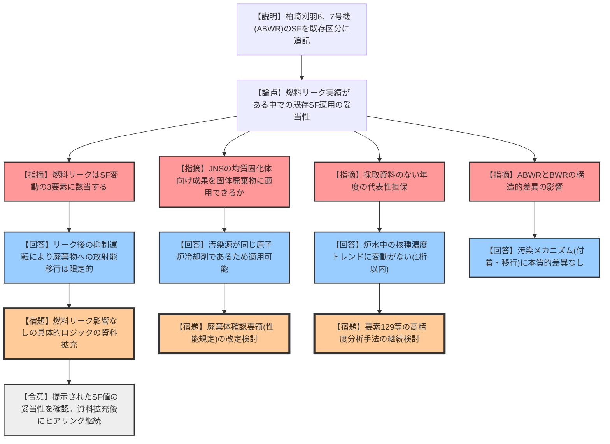
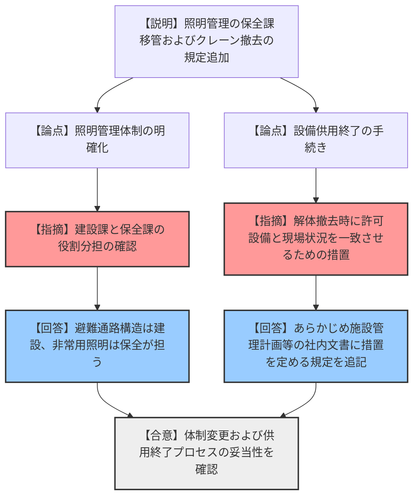

# 第573回核燃料施設等の新規制基準適合性に係る審査会合（令和8年2月26日）
> 出典 : https://youtube.com/live/B0NHq0JEA6U?si=T3b0kD4ofuUGXEto

## 1. 会合の概要
*   **最大の争点:** 柏崎刈羽原子力発電所6、7号機（ABWR）の充填固化体受入れに伴うスケーリングファクタ（SF）の妥当性。過去の燃料リーク実績（ヨウ素131濃度上昇）がある中で、既存のSFを適用できるかどうかの論理構成が厳しく問われた。
*   **審査の進捗:** SFの適用ロジック、資料の代表性、および設備供用終了の措置について、規制側の理解は概ね得られた。ただし、JNS（旧原子力安全システム研究所）の知見を現代の知見（性能規定化）に合わせてアップデートすることや、まとめ資料の拡充が条件となった。
*   **規制側の納得度:** 燃料リークによる廃棄物への影響がないとする立証（抑制運転による濃度低下、実測値の相関）については納得が得られたが、今後の「廃棄体確認要領」の改定や、より高精度な分析手法（ヨウ素129等）の検討について強い要請があった。
*   **決定事項:** 提示された3つの変更点（SF追加、管理体制変更、供用終了措置）の方向性は了承。詳細な事実関係はヒアリングで継続確認。

---

## 2. 議題の詳細整理

**【議題1】日本原燃(株)濃縮・埋設事業所廃棄物埋設施設保安規定の変更認可申請について**

### (1) スケーリングファクタ（SF）等一覧への柏崎刈羽6、7号機の追加
*   **議論の背景と論点:**
    2027年度に柏崎刈羽6、7号機の充填固化体を受け入れるため、放射能濃度評価に用いるSFを設定する必要がある。特に、6、7号機はABWR（改良型沸騰水型軽水炉）であり、かつ過去に燃料リークの判断基準（20 Bq/g）を超過した実績があるため、従来のSF（1～5号機用）がそのまま適用可能かどうかが焦点となった。

*   **質疑応答（詳細）:**
    *   **【論点：SF設定の基本ロジック】**
        *   **【規制側（佐野田）】:** SF変動の「3要素（材料、燃料損傷、固化装置）」の変動がないことが前提。燃料リークがあった点は先行実績と異なる。このロジックをどう整理したのか。
        *   **【説明者（日本原燃）】:** 検討項目を4つ（考え方、代表性、同等性、地震影響）設定。リークはあったが、抑制運転等により廃棄物への影響は限定的であることを実証した。
    *   **【論点：ABWRの構造的差異】**
        *   **【説明者（日本原燃）】:** ABWR特有の構造（インターナルポンプ、FMCRD等）を確認したが、汚染メカニズムや各種組成比に影響を及ぼすものではない。
        *   **【規制側（大塚）】:** 汚染の源泉が原子炉冷却剤であるという点において、BWRとABWRで差がないという認識でよいか。
        *   **【説明者（日本原燃）】:** その通り。付着・汚染プロセスに本質的な差異はない。
    *   **【論点：燃料リークの影響評価】**
        *   **【規制側（大塚）】:** JNSの検討成果（均質固化体向け）を、今回の固体状廃棄物（充填固化体）に適用できる根拠は何か。
        *   **【説明者（日本原燃）】:** 源泉が同じ原子炉水であるため。リーク発生後、速やかに原子炉を停止・抑制運転しており、冷却剤中のヨウ素131濃度が低下した後に発生した廃棄物には影響がないことを実測で確認した。
        *   **【規制側（大塚）】:** 6号機のセシウム137分析値がばらついている理由は何か。
        *   **【説明者（東京電力）】:** 共存するコバルト60の影響。目標検出下限値（4 * 10^-2 Bq/g）は維持しており、分析の妥当性は確保されている。
    *   **【論点：資料の代表性（欠落年度の補完）】**
        *   **【規制側（大塚）】:** 採取できていない年度（1996、2007、2010年）の代表性をどう担保するのか。
        *   **【説明者（日本原燃）】:** 当該年度の前後で冷却剤中のコバルト・要素のトレンドに1桁以上の変動がないことを確認しており、他年度の資料で代表可能と判断した。トリチウムについても同様。
    *   **【論点：中越沖地震の影響】**
        *   **【説明者（日本原燃）】:** 地震直後のモニターデータや炉水濃度を確認したが、燃料損傷の兆候はなく、特異な廃棄物の発生もなかった。

*   **結論と宿題事項:**
    *   **結論:** 既存のSFを適用することの妥当性は概ね認められた。
    *   **宿題:** 
        1. JNS成果を固体廃棄物に適用したロジック、分析のばらつき要因、含水率評価の詳細をまとめ資料に拡充すること。
        2. 「廃棄体確認要領」を、燃料リークがあっても核種比に影響がない場合は新規設定を不要とするよう、性能規定化の流れに沿って改定すること。
        3. ヨウ素129等の難測定核種に対し、より高精度な分析手法の検討を電力各社と進めること。

### (2) 管理体制の変更および設備の供用終了措置
*   **議論の背景と論点:**
    1号埋設地点検路の運用開始に伴う非常用照明の管理を「建設課」から「保全課」へ移管すること、および2号埋設クレーンの撤去（供用終了）に伴う保安規定上の手続きを明確化すること。

*   **質疑応答（詳細）:**
    *   **【論点：役割分担】**
        *   **【規制側（勘定）】:** 安全避難通路の構造維持は建設課長、照明設備は保全課長ということで、役割が明確化されたと理解してよいか。
        *   **【説明者（日本原燃）】:** その通り。電気設備の所掌である保全課が整備を担うことで円滑な保安活動を行う。
    *   **【論点：供用終了の定義】**
        *   **【規制側（勘定）】:** 許可対象設備が現場からなくなる際の手続きが、面談の議論（後段規制との整合）を反映しているか。
        *   **【説明者（日本原燃）】:** あらかじめ社内文書に解体・撤去等の措置を定める旨を規定した。

*   **結論:** 変更内容は妥当。適切に社内文書へ展開することを条件に了承。

---

## 3. 論理構造の可視化（Mermaid）

### 議題1-1: 柏崎刈羽6、7号機のSF追加

### 議題1-2: 管理体制変更および供用終了措置

