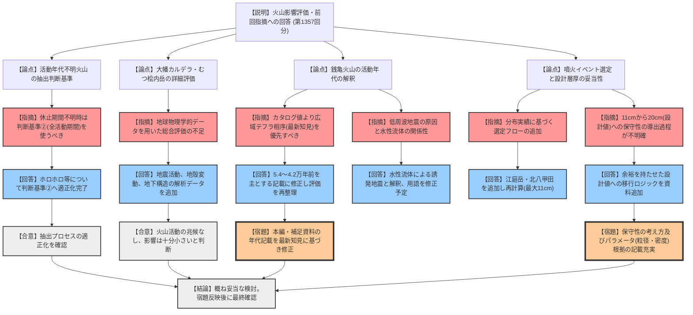

# 第1395回原子力発電所の新規制基準適合性に係る審査会合（令和8年2月27日）
> 出典 : https://youtube.com/live/QUCd8hjZtyo?si=LlLbJHkFBQVjMLyh

## 会合の概要
*   **最大の争点:** 銭亀火山の活動年代評価の妥当性と、降下火砕物シミュレーションにおける噴火イベント選定プロセスの適正化。
*   **審査の進捗状況:** 前回の指摘事項（5項目）に対し、地球物理学的データの拡充や最新の科学的知見（広域テフラ相序）の反映が行われ、評価の妥当性について規制側から概ねの理解が得られた。
*   **特筆すべき決定事項:** 銭亀火山の活動年代について、文献（火山カタログ）の数値よりも、広域テフラとの前後関係（相序）に基づく科学的評価（約5.4万年〜4.2万年前）を優先して資料を適正化することで合意した。
*   **現場の雰囲気:** 規制側は、事業者が提示したシミュレーション結果（11cm）と設計値（20cm）の間の「保守性の考え方」や「最新知見の採用根拠」について、より丁寧な論理構成を求めており、技術的な厳密さを重視する緊張感のあるやり取りが行われた。

---

## 議題ごとの詳細整理

### 【議題1】電源開発（株）大間原子力発電所の火山影響評価について

*   **議論の背景と論点:**
    前回の審査会合（第1357回）で出された「将来の活動可能性の抽出基準」「銭亀火山の現状評価」「噴火イベントの選定フロー」等の指摘に対する回答。特に、銭亀火山の活動年代の解釈と、シミュレーション対象選定における分布実績の考慮が技術的な争点となった。

*   **質疑応答（詳細）:**

    **1. 原子力発電所に影響を及ぼし得る火山の抽出（ホロホロ等）**
    *   【説明者側】: 途中の活動年代が不明な火山（ホロホロ特殊別、オロフレライバ等）について、最大休止期間ではなく全活動期間を用いる「判断基準②」を適用するよう記載を適正化した。
    *   【規制側】: 前回の指摘を踏まえ、適切な判断基準に変更されたことを確認した（武田）。

    **2. 大幡カルデラ及びむつ桧内岳の個別評価（近傍20km未満）**
    *   【説明者側】: 地震活動（低周波地震）、地殻変動、地下構造（比抵抗、地震波速度）のデータに基づき詳細評価を追加。下浦沖の低周波地震は、深さや頻度から火山活動を示唆するものではないと判断した。
    *   【規制側】: 地球物理学的データを収集し、総合的に評価された結果、運用期間中に影響を及ぼす可能性が十分小さいことが再確認された（佐藤）。

    **3. 銭亀火山の活動可能性評価（活動年代と現状）**
    *   **【論点】活動年代の解釈**
        *   【説明者側】: カタログ値（3.3〜4.5万年前）と最新の相序知見（4.2〜5.4万年前）を併記していたが、相序に基づく解釈でも「活動終了からの期間が全活動期間より長い」ため、評価は整合すると説明。
        *   【規制側】: 最近の知見（広域テフラKT1、KT3との前後関係）や自社測定データに基づけば、科学的には5.4〜4.2万年前とするのが妥当ではないか（佐藤）。
        *   【説明者側】: 科学的には相序に基づく評価が正しいと考える。十勝平野の広域テフラ相序に従った評価をメインとして資料を修正する。
    *   **【論点】低周波地震の解釈**
        *   【規制側】: 銭亀火山下の低周波地震について、吉田他(2020)の知見（水性流体の移動）との調和性を確認したい（佐藤）。
        *   【説明者側】: 解釈は同じである。メルト（マグマ）を示唆する構造はなく、水性流体（アキフェラスフリート）による地震誘発と考えている。次回資料では「水性流体」の表現に直す。

    **4. 降下火砕物シミュレーション（イベント選定と設計層厚）**
    *   **【論点】選定フローと結果**
        *   【説明者側】: 距離・規模に加え、分布実績に基づく選定フローを追加。江庭岳（ENA）、北八甲田（WP）、北海道駒ヶ岳（KOD）を対象とし、最大層厚はKODの11cmとなった。
        *   【規制側】: シミュレーション結果11cmに対し、設計値を20cmとした保守性の加味プロセスが不明確である（武田）。
        *   【説明者側】: 11cmを参照しつつ、余裕を持たせて20cmとした。その導出過程の記載を充実させる。
    *   **【論点】粒径と密度**
        *   【規制側】: 設計パラメータである流径（4mm以下）と密度（1.5）についても、根拠を確認（武田、佐藤）。
        *   【説明者側】: 文献調査に基づき設定している。説明が不足していた点は申し訳ない。

*   **結論と宿題事項（アクションアイテム）:**
    *   **結論:** 大間原子力発電所の火山影響評価は、今回追加されたデータと最新知見の反映により、概ね妥当な検討がなされたと評価された。
    *   **宿題事項:**
        1.  **銭亀火山の年代記載修正:** 広域テフラ相序に基づく年代（5.4〜4.2万年前）を主軸とした記載に本編・補足資料ともに適正化する。
        2.  **設計層厚の論理構成:** シミュレーション結果（11cm）から設計値（20cm）を導き出した保守性の考え方を具体的に資料へ明記する。
        3.  **専門用語の適正化:** 「水性流体」等の用語を最新の学術的表現に統一する。
        4.  **まとめ資料の作成:** 本日の指摘（保守性の考え方、年代評価の根拠、パラメータ設定の経緯）を反映した「まとめ資料」を作成し、再度事務局の確認を受ける。

---

## 論理構造の可視化（Mermaid）

