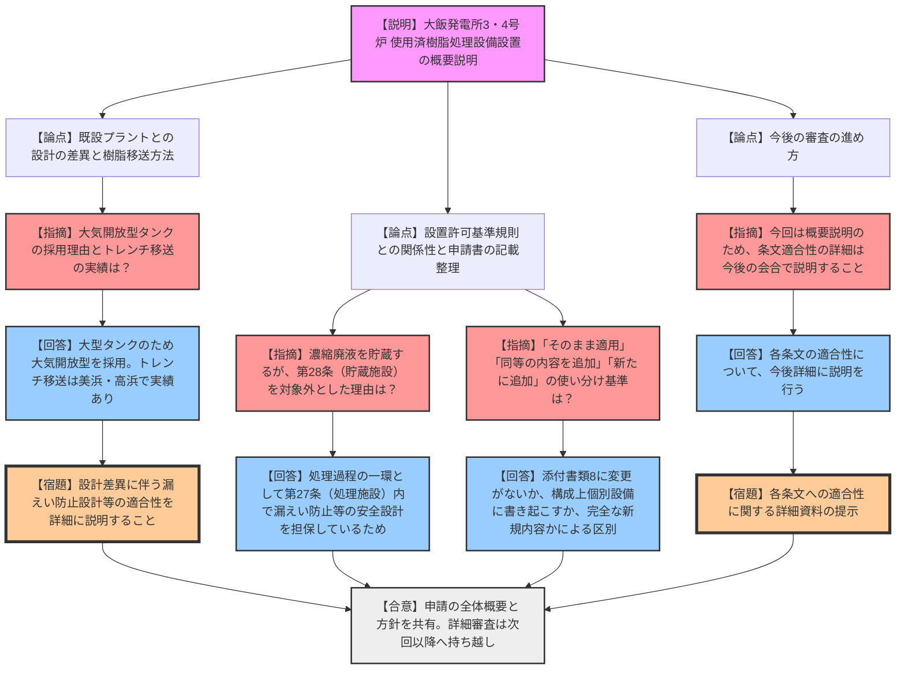

# 第1396回原子力発電所の新規制基準適合性に係る審査会合（令和8年3月2日）
> 出典 : https://youtube.com/live/oBATfyhH4lU?si=iI9IbqVAHBWNBgYf

## 1. 会合の概要
*   **最大の争点:** 大飯発電所3号炉および4号炉における「使用済樹脂処理設備」の新規設置に伴う、既設プラント（美浜・高浜）との設計の差異（大気開放型タンクからの移送方法等）および設置許可基準規則各条文の適用整理の妥当性。
*   **審査の進捗状況:** 今回は設置変更許可申請の「概要説明」の位置付けであり、設備導入の目的や処理フロー、設計の相違点について全体像が共有された。詳細な条文への適合性審査は次回以降の会合に持ち越された。
*   **規制側の納得度:** 既設プラントとの相違点や、条文整理における「そのまま適用」と「同等の内容を追加」の使い分けなど、申請書上の記載の根拠について細かく確認が行われ、規制庁側は基本的な考え方を理解した上で、今後の詳細説明を求めた。

---

## 2. 議題の詳細整理

**【議題1】関西電力（株）大飯発電所３号炉及び４号炉の設置変更許可申請（使用済樹脂処理設備の設置）に係る審査について**

*   **議論の背景と論点:**
    大飯発電所3・4号炉において、脱塩等使用済樹脂の廃棄物量を低減し、物理的により安定的な状態（濃縮廃液）で貯蔵保管することを目的として、使用済樹脂処理設備を新設するための設置変更許可申請が行われた。技術的な争点として、既設プラントとは異なる「大気開放型タンクからの移送設計」の妥当性と、設置許可基準規則に対する適用条文の整理方法が論点となった。

*   **質疑応答（詳細）:**
    *   **【論点：既設プラントとの設計の差異と移送方法】**
        *   【説明者側（関西電力）】: 既設プラント（美浜・高浜等）との設計の相違点として、大飯3・4号炉は「大気開放型」の使用済樹脂貯蔵タンクを採用しているため、N2圧送等ではなくポンプと連絡トレンチを用いた移送を行う。
        *   【規制側（有森）】: 大気開放型を採用した理由と、トレンチを介して放射性廃棄物を移送する方法に過去の実績はあるか。
        *   【説明者側（関西電力）】: 大飯3・4号炉のタンクが大型であるため大気開放型の設計となっている。また、トレンチを介した移送については美浜・高浜でも実績がある。
        *   【規制側（有森）】: 大気開放型タンクからの移送などの設計の違いについて、今後の審査において、放射性廃棄物の漏えい防止設計等の適合性を丁寧に説明すること。
    *   **【論点：設置許可基準規則との関係性および条文整理】**
        *   【規制側（坂本）】: 廃液貯蔵タンクで濃縮廃液を貯蔵保管するにもかかわらず、第28条（放射性廃棄物の貯蔵施設）を「関係がない条文」とし、第27条（処理施設）で整理した理由は何か。
        *   【説明者側（関西電力）】: 濃縮廃液を一定期間貯蔵する点も含め、処理過程の一環として第27条に関連すると整理しており、漏えい防止等の安全設計も第27条の中で担保している。
        *   【規制側（坂本）】: 適用する条文について「既許可の設計方針をそのまま適用」とするものと、「同等の内容を追加」とするものの使い分けの基準は何か。また、第27条等における「新たに設計方針を追加」との違いは何か。
        *   【説明者側（関西電力）】: 添付書類8の記載に変更がないものは「そのまま適用」とした。「同等の内容を追加」は、内容は既許可と同等だが、申請書の構成上、個別設備に対して設計方針を新たに書き起こす必要があるための措置である。また「新たに設計方針を追加」は、使用済樹脂の処理過程という既許可にはない内容を新たな設計方針として追記していることを意味する。
    *   **【論点：今後の進め方】**
        *   【規制側（田中）】: 今回は概要説明であるため、各条文の具体的な適合性については今後の審査会合で詳細を説明すること。
        *   【説明者側（関西電力）】: 承知した。各条文の適合性については今後詳細に説明する。

*   **結論と宿題事項（アクションアイテム）:**
    *   **結論:** 使用済樹脂処理設備設置に係る申請の全体概要、他プラントとの設計差異、および条文整理の基本方針について認識が共有された。
    *   **宿題事項:** 
        1. 大気開放型タンクからの移送等、既設プラントと異なる設計部分の漏えい防止対策について、詳細な条文適合性の説明を次回以降の会合で行うこと。
        2. 各条文の具体的な適合性に関する詳細な資料を準備し、今後の会合で説明すること。

---

## 3. 論理構造の可視化（Mermaid）

