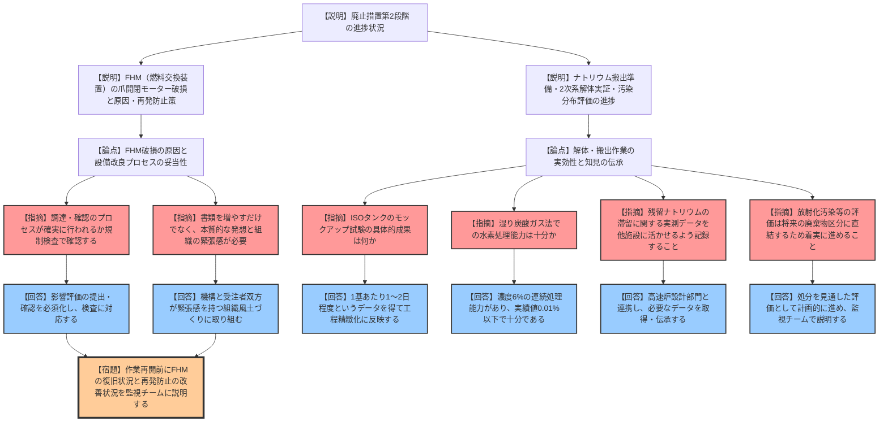
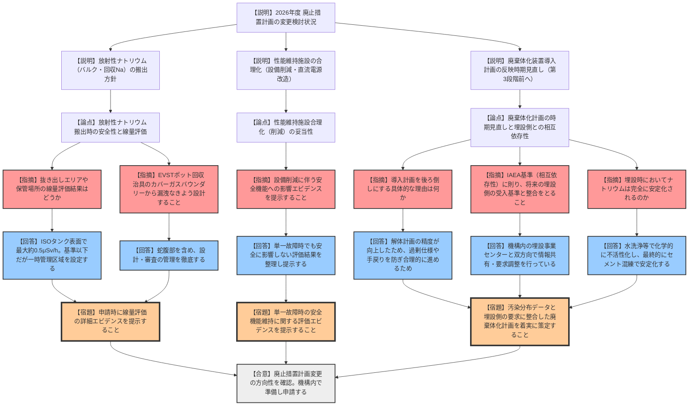

# 第51回もんじゅ廃止措置安全監視チーム（令和8年3月2日）
> 出典 : https://youtube.com/live/PrE5D6K2zOA?si=qgBGb-nef5teyc-0

## 1. 会合の概要
*   **最大の争点:** 燃料交換装置（FHM）の爪開閉モーター破損事象の原因と組織的な再発防止策の実効性。および、廃棄体化装置の導入計画を「第3段階着手前」へ後ろ倒しにする方針の妥当性と埋設施設側との整合性（相互依存性）。
*   **審査の進捗状況:** 廃止措置第2段階の作業自体はFHMの不具合により約1年の遅延が見込まれるが、第2段階全体の終了時期には影響しない見通し。ナトリウム搬出準備や2次系の解体実証は概ね計画通り進行している。2026年度の廃止措置計画変更に向けた検討方針についても、規制側から一定の理解が得られた。
*   **特筆すべき決定事項:** FHM不具合の要因が「設備改良時の影響評価の確認不足」と特定され、今後は影響評価の提出・確認を必須化するルール変更がなされた。また、廃棄体化装置については、解体計画の精緻化に合わせた合理的な仕様決定を行うため、計画確定時期を見直すことが了承された。
*   **現場の雰囲気・納得度:** 設備トラブルの再発防止に対して、規制側からは「チェックシートを増やすだけでなく、組織間の緊張感と本質的な発想のバランスが必要」との苦言が呈された。廃棄体化装置の検討においては、IAEAの安全基準（相互依存性）を引き合いに出し、将来の埋設事業側との連携を強く念押しするなど、先を見据えた厳しい指導が行われた。

---

## 2. 議題ごとの詳細整理

### 【議題1】廃止措置第2段階の進捗状況
*   **議論の背景と論点:**
    燃料交換装置（FHM）のナトリウム中動作試験において、爪開閉モーターが上蓋と干渉し破損する事象が発生した。この原因究明・再発防止策と、ナトリウム搬出準備、2次メンテナンス冷却系の解体（残留ナトリウムの安定化）、汚染分布評価の進捗が論点となった。

*   **質疑応答（詳細）:**
    *   **【論点：FHMモーター破損の原因と再発防止】**
        *   【説明者】: FHMの爪開閉モーターを大型の高出力なものに交換した際、上蓋を一部削って対応したが「旋回動作」を考慮していなかったため、旋回時にモーターが干渉し破損した。従来の所内ルールでは、この改良が詳細設計検討の対象外となっていたことが要因。今後は設備改良による影響評価の提出と確認を義務化し、組織風土の改革に取り組む。
        *   【規制側】: モーター交換自体は安全に直結する背景ではないと理解したが、設備改良プロセスの影響評価は重要である。今後の調達・確認プロセスが確実に行われるか、規制検査の中で引き続き確認していく。
        *   【説明者】: 評価プロセスと評価結果を必ず確認し、改善状況についても規制検査にしっかり対応していく。
        *   【規制側】: チェックシートなどの書類を増やすだけでなく、「そもそもなぜそこだけ削れば良いという発想になったのか」という本質を見失わないよう、バランス良く組織間の緊張感を持って再発防止に取り組むこと。
        *   【説明者】: 機構と受注者双方が緊張感を持って業務に取り組む組織風土づくりを徹底する。
    *   **【論点：ナトリウム搬出準備と解体実証の成果】**
        *   【規制側】: ナトリウム搬出に向けたISOタンク等のモックアップ試験で、具体的に得られた成果は何か。
        *   【説明者】: 現場状況を模擬した試験により、タンク1基あたりの作業に1〜2日程度を要することが判明し、今後の工程の精緻化に反映させる。
        *   【規制側】: 2次メンテナンス冷却系の解体における湿り炭酸ガス法による安定化処理について、水素の処理能力は十分か。
        *   【説明者】: 水素処理装置は濃度6%程度の連続処理が可能な設計であり、今回の実績でも処理後は0.01%以下まで低減できているため、十分な能力がある。
        *   【規制側】: 実際に配管を切断して得られたナトリウムの局所的な滞留データは、今後の他施設にも活かせるよう経験として残していくこと。
        *   【説明者】: 機構内の高速炉設計部門とも連携し、必要なデータを取得して伝承していく。
    *   **【論点：汚染分布評価】**
        *   【規制側】: 炉周りの放射化汚染（L1相当）の評価精緻化や、二次的汚染の評価は、将来の放射性廃棄物のレベル区分にダイレクトに影響するため、試料採取装置の製作などを着実に進めること。
        *   【説明者】: 処分を見通した評価が重要と認識しており、今後も計画的に進めて監視チーム会合で説明する。

*   **結論と宿題事項（アクションアイテム）:**
    *   FHMトラブルへの機構の対応方針は概ね確認されたが、ルールの形骸化を防ぐ組織的な取り組みが求められた。
    *   **【宿題】**: 遮蔽体等取り出し作業を再開する前に、FHMの復旧状況および再発防止の改善状況について、監視チーム会合で説明を行うこと。

---

### 【議題2】廃止措置計画の検討状況
*   **議論の背景と論点:**
    2026年度に廃止措置計画の変更申請を予定している3つの項目（放射性ナトリウムの搬出、性能維持施設の合理化、廃棄体化装置の導入計画時期の見直し）について、その妥当性と安全確保の考え方が論点となった。

*   **質疑応答（詳細）:**
    *   **【論点：放射性ナトリウムの搬出における線量評価と安全対策】**
        *   【説明者】: 放射性バルクナトリウムおよび回収ナトリウムの搬出を行う。放射能濃度は十分低く公衆・従事者へのリスクは著しく低いと評価しているが、非放射性ナトリウムと同様の漏洩対策に加え、抜き出しエリア等には一時管理区域を設定する。
        *   【規制側】: 抜き出しエリアや保管場所（屋内貯蔵所）の具体的な線量評価は行っているか。
        *   【説明者】: 1次系ナトリウムの分析値（Na-22で1.5Bq/g）に基づき、ISOタンク表面で最大約0.4〜0.5μSv/hと見積もっている。管理区域の設定基準を十分に下回るが、万全を期して一時管理区域とする。
        *   【規制側】: EVST燃料移送ポットのナトリウムを回収するための専用治具において、カバーガスバウンダリーとなる蛇腹部から放射性物質を含む気体が漏洩しないよう、しっかり設計・製作すること。
        *   【説明者】: 審査において線量を明確に示せるよう準備し、バウンダリーの設計・審査管理もしっかり行う。
    *   **【論点：性能維持施設の合理化】**
        *   【説明者】: 遮蔽体等取り出し作業の終了に伴い、工程遅延リスク回避のために維持していた補助蒸気設備や窒素雰囲気調節装置の予備機を削減する。また、直流電源等の系統数を削減する改造を行う。
        *   【規制側】: 設備削減に伴う安全機能への影響について、申請時にエビデンスとともに確認していくので準備すること。
        *   【説明者】: 単一故障が発生しても安全機能に影響しないという評価内容を整理し、審査でエビデンスを提示する。
    *   **【論点：廃棄体化装置の計画見直しと埋設側との相互依存性】**
        *   【説明者】: 廃棄体化装置の導入計画の反映時期を「第3段階着手前」へ後ろ倒しにする。解体方法や廃棄物発生量の精度が高まってきたため、幅広い不確実性を前提とした現段階での仕様確定を避け、過剰仕様や手戻りリスクを削減するためである。
        *   【規制側】: 計画の精緻化を待つという理由は理解した。しかし、IAEAの安全基準（GSR Part6等）にある「相互依存性」の観点から、プレディスポーザル（処理側）は将来の埋設施設の廃棄体受け入れ基準に適合するよう連携しなければならない。埋設センターとの連携状況はどうか。
        *   【説明者】: 廃棄体と埋設施設が一体となって安全を担保するという認識のもと、機構内の埋設事業センターと双方向で情報共有（要求の受領と性状の伝達）を行い、調整しながら進めている。
        *   【規制側】: 軽水炉と異なりナトリウムが存在することが最大の違いである。埋設時に地下水への影響が出ないようナトリウムの除去・安定化を適切に実施し、先行する発電用原子炉の経験（スケーリングファクタ等）も情報収集すること。埋設時にはナトリウムは安定化されているのか。
        *   【説明者】: 解体時の水洗浄等により化学的に不活性な化合物に転換し、最終的にはセメントと混練して廃棄体として安定化させた上で処分する計画である。

*   **結論と宿題事項（アクションアイテム）:**
    *   2026年度変更申請に向けた検討の方向性（搬出方針、設備合理化、計画見直し）は概ね妥当として了承された。
    *   **【宿題】**: 放射性ナトリウム搬出時の線量評価エビデンス、および性能維持施設削減時の単一故障評価エビデンスを、申請時に詳細に提示すること。
    *   **【宿題】**: 廃棄体化計画の策定にあたっては、汚染分布データの実測と、将来の埋設側の要求（受入基準）との整合性を確実に図り、遅滞なく進めること。

---

## 3. 論理構造の可視化（Mermaid）

### 【議題1】廃止措置第2段階の進捗状況

### 【議題2】廃止措置計画の検討状況

