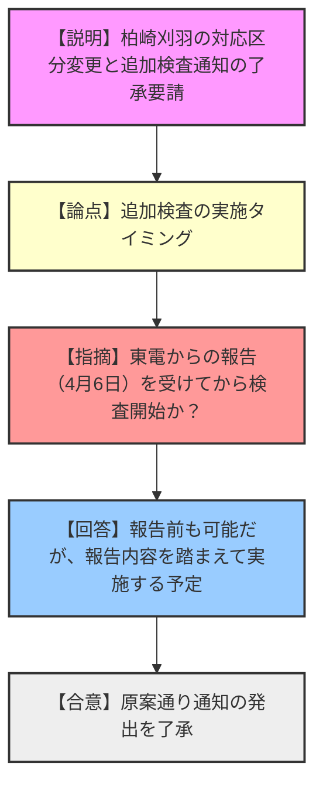
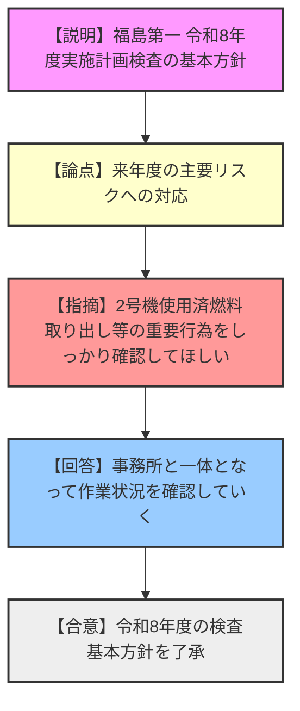
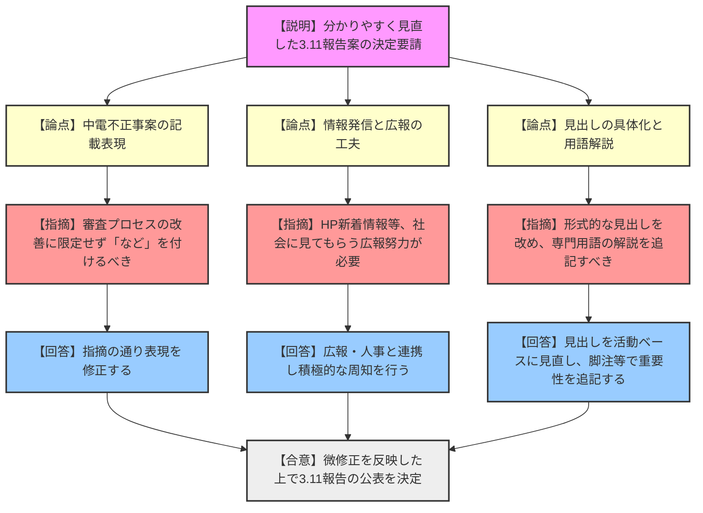
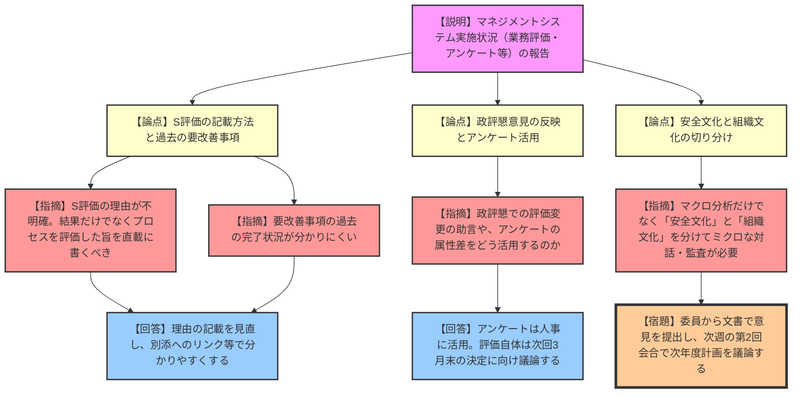

# 第63回原子力規制委員会（令和8年3月4日）
> 出典 : https://youtube.com/live/A8Lx3aRme7E?si=LSKrMSPmnh8Da5tL

# 会合の概要
* **3.11報告の抜本的見直しと公表決定:** 組織の取組を社会へ分かりやすく発信するため、図表を活用した簡潔な構成へとリニューアルされた「3.11報告」の公表が決定されました。委員からは、専門用語の平易な解説や積極的な広報展開を求める意見が相次ぎました。
* **マネジメントレビューにおける「安全文化」と「組織文化」の切り分け:** 規制庁内の業務評価や職員アンケート結果に関し、委員長から「原子力規制当局としての安全文化」と「一般的な組織の健全性（組織文化）」は明確に分けてマクロ・ミクロ両面から分析すべきとの強い問題提起がなされました。
* **中部電力不正事案への対応に関する自己評価:** 同事案の告発に対する規制庁の対応が「S評価」とされたことについて、委員から「単に見つけたからSと受け取られないよう、プロセスにおける慎重・確実な対応を明記すべき」との厳格な指摘がなされました。
* **東電柏崎刈羽・福島第一への検査方針の確定:** 柏崎刈羽の核物質防護事案に対する対応区分の変更及び追加検査の通知、ならびに福島第一の令和8年度検査基本方針が、いずれも滞りなく了承されました。

---

# 議題ごとの詳細整理

## 【議題1】東京電力ホールディングス株式会社柏崎刈羽原子力発電所に対する令和7年度原子力規制検査の結果を踏まえた対応区分の変更及び追加検査の実施に係る通知の発出
* **議論の背景と論点:** 柏崎刈羽における核物質防護秘密の不適切取扱いに係る検査指摘事項（重要度「白」、深刻度「SL3」）について、東電からの意見がないことが確認された。これに伴う対応区分の「第2区分」への変更と、追加検査実施の通知について了承を求めるもの。
* **質疑応答（詳細）:**
  * 【説明者側（規制庁 吉川・小澤）】: 東電の意見なしの回答を受け評価が確定した。対応区分を変更し、原因分析や改善措置の実施状況等に係る追加検査を行う。東電には令和8年4月6日までに事実関係や根本原因の特定結果等の報告を求める。
  * 【規制側（委員）】: 東電からの報告を受けてから、実際の追加検査が始まるという認識でよいか。
  * 【説明者側（規制庁 小澤）】: 報告を受ける前も可能だが、現状は4月6日までの報告内容を踏まえて追加検査を実施する予定である。
* **結論と宿題事項（アクションアイテム）:**
  * 柏崎刈羽の対応区分変更および追加検査実施に係る通知の発出は原案通り了承された。

## 【議題2】東京電力ホールディングス株式会社福島第一原子力発電所における令和8年度実施計画検査の基本方針
* **議論の背景と論点:** 福島第一原発における令和8年度の実施計画検査の基本方針について。前年度に特段の安全上の問題がなかったため基本項目に変更はないが、規則改正に伴う保安検査項目の再整理（施設管理の追加等）が行われる。
* **質疑応答（詳細）:**
  * 【説明者側（規制庁 元嶋）】: 令和8年度より保安検査の項目に「施設管理」を追加し、トラブル事象の対応は「その他の保安活動」に統合する。計7項目および核物質防護検査について確認していく。
  * 【規制側（長﨑委員）】: 方針は結構だが、来年度は使用済燃料の取り出しというリスクを下げる大きな行為が予定されている。その点も含めてしっかりと対応してほしい。
  * 【説明者側（規制庁 宮本）】: 指摘の通り、特に2号機の燃料取り出しに係る作業状況については、事務所と一体となって確認していく。
* **結論と宿題事項（アクションアイテム）:**
  * 令和8年度実施計画検査の基本方針は了承された。

## 【議題3】原子力規制委員会の取組（3.11 報告）の公表
* **議論の背景と論点:** 毎年3月11日に公表する「3.11報告」について、見直された作成方針に基づき、要点を簡潔な文章と図表で分かりやすく構成した案の決定を求めるもの。
* **質疑応答（詳細）:**
  * 【説明者側（規制庁 新田）】: 自治体との対話、IRRSミッション、継続的改善、中部電力の不正への対応等をまとめた。決定後、3月11日に公表する。
  * 【規制側（杉山委員）】: 中部電力の件で「審査プロセスの改善により」と断定して書かれているが、委員会として限定的な対応を決定した認識はない。「など」を付けるか、例示に過ぎない位置づけに修正すべき。
  * 【説明者側（規制庁 新田）】: 指摘の通り修正する。
  * 【規制側（神田委員）】: 分かりやすく作った以上、社会に見てもらう工夫が必要。HPの新着情報への掲載等、積極的な情報発信をお願いしたい。
  * 【説明者側（規制庁 高木・新田・児嶋）】: 新着情報への掲載をはじめ、広報部門や人事課とも連携し周知に努める。
  * 【規制側（山岡委員）】: 表題が「原子炉安全専門審査会」など形式的で分かりにくい。具体的な活動内容をタイトルにすべき。また「保障措置」や「グレーディッドアプローチ」などの専門用語は本文中で解説を入れるべき。
  * 【説明者側（規制庁 新田）】: 「審議結果を踏まえた規制の改善」等の見出しに見直し、専門用語は重要性を含めた解説を追記する。
  * 【規制側（神田委員）】: 毎年同じような内容になるのを避けるため、来年度以降は3.11からの歩みや組織の成長が見える工夫（年表の追加など）を検討してほしい。
  * 【説明者側（規制庁 新田）】: 来年度に向けて工夫を検討する。
  * 【説明者側（規制庁 金子）】: 文言は修正する。本報告は年次報告の概要編的な位置づけである。
  * 【規制側（山中委員長）】: 中部電力の件は審査・検査に限らず幅広く改善すべきであり、修正指示に賛同する。IAEAレビューを受けた継続的改善の姿勢も示せた。微修正を反映した上で決定したい。
* **結論と宿題事項（アクションアイテム）:**
  * 委員の指摘による微修正（表現の緩和、見出しの具体化、用語解説の追加）を条件に、「3.11報告」の公表が決定された。

## 【議題4】令和7年度マネジメントレビュー(第1回)
* **議論の背景と論点:** 原子力規制委員会のマネジメントシステム実施状況（年度業務計画の評価、投入人員、内部監査、要改善事項、安全文化アンケート結果、政策評価懇談会の意見等）の報告。本報告を踏まえ、次回会合で次年度の業務計画を議論する。
* **質疑応答（詳細）:**
  * 【説明者側（規制庁 新田）】: 業務計画の評価（S:22件、B:5件）、残業時間の推移、要改善事項の是正措置、職員アンケートに基づく相関分析、政策評価懇談会（政評懇）での意見等を報告する。
  * 【規制側（杉山委員）】: 3点指摘する。①中部電力の件がS評価だが「見つけたからS」と誤解されないよう、プロセスにおける慎重・確実な対応を評価した旨を明記すべき。②18ページのS評価の理由が意味不明であり、良かった点をダイレクトに書くべき。③要改善事項の表が新規分のみで過去の完了状況が分かりにくいため、別添へのリンクが必要。
  * 【説明者側（規制庁 新田）】: 過去分は別添にあり、リンク等で分かりやすくする。
  * 【規制側（神田委員）】: 政策評価書で「優先順位が高くない」としてB評価になっている理由が概要では分かりにくい。また、アンケートの属性ごとの差を人事戦略に活用すべき。政評懇の委員からの「評価理由の記載充実」「SABの判定見直し」等の助言は今回どう反映されるのか。
  * 【説明者側（規制庁 新田）】: B評価の理由は別添に詳細があるが、概要にも追記する。アンケート結果は人事担当と共有する。政評懇の指摘のうち「要因記載の充実」は一部反映した。評価（SAB）自体は現時点で見直していないが、3月末の決定に向けて議論していく。
  * 【規制側（山中委員長）】: アンケートの相関関係などのマクロな分析はなされたが、よりミクロな対話や監査が必要。「原子力の規制当局としての安全文化」の理解度と、「健全な組織であるかという組織文化」は分けて分析・対応しないと本質を誤る。IAEA（IRRS）でも丁寧な監査が指摘されている。
* **結論と宿題事項（アクションアイテム）:**
  * 第1回としての報告がなされた。
  * **【宿題】**: 各委員は本報告を踏まえ、次週の第2回会合に向けて文書で意見を提出し、それをもとに令和8年度業務計画の議論を行うこと。

---

# 論理構造の可視化（Mermaid）

## 【議題1】柏崎刈羽への通知発出

## 【議題2】福島第一 令和8年度実施計画検査基本方針

## 【議題3】3.11報告の公表

## 【議題4】令和7年度マネジメントレビュー(第1回)

