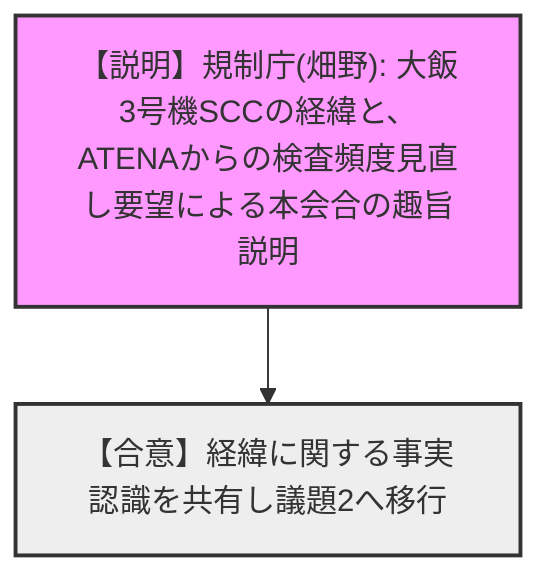
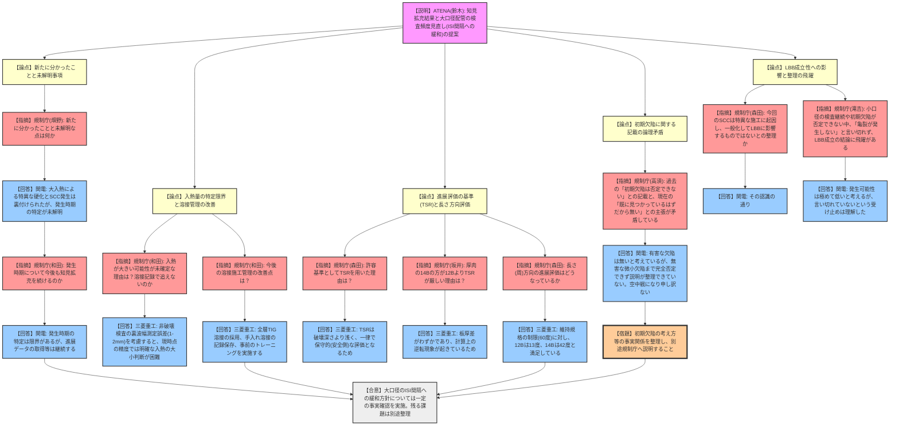

# 第12回大飯3号機加圧器スプレイライン配管溶接部における有意な指示に係る公開会合（令和8年3月5日）
> 出典 : https://youtube.com/live/rFtsmvnJ_n8?si=u9ZrD7ARXqWrozfe

## 1. 会合の概要
* **最大の争点:** 大飯3号機での粒界型応力腐食割れ（SCC）事象を受けた知見拡充結果の妥当性と、それに基づく「大口径配管の特別検査（毎定検）から標準ISI間隔への頻度緩和」の可否。ならびに、初期欠陥の有無とLBB（Leak Before Break：破断前漏えい）成立性に関する事業者の論理の整合性。
* **審査の進捗状況:** 大口径配管においては内表面が圧縮応力となり亀裂の進展が遅いというメカニズムが示され、検査頻度緩和の方向性については一定の理解が得られた。一方で、小口径配管の検査合理化に向けた「裏波幅による入熱量の特定」は現在の非破壊検査精度では困難であり、今後の課題として残された。
* **現場の雰囲気・規制側の納得度:** 被ばく低減を目的とした検査頻度見直しには理解が示されたものの、規制側（高須）から「初期欠陥は否定できないとする過去の記載」と「（進展していれば）すでに見つかっているはずだから無い」とする現在の主張の矛盾を鋭く突かれる場面があり、事業者側が「空中戦になっている、整理し直す」と弁明するなど、論理構成の厳密性を巡って強い緊張感が走った。また、LBB成立性についても、規制側（滝吉）から「亀裂が発生しないと言い切れていない以上、整理に飛躍がある」と懐疑的な指摘がなされた。

---

## 2. 議題ごとの詳細整理

### 【議題1】大飯３号機加圧器スプレイライン配管溶接部における有意な指示に係るこれまでの経緯
* **議論の背景と論点:**
  令和2年8月に大飯3号機で発見されたSCC（粒界割れ）に関し、これまでに11回の公開会合を実施し、原因が「溶接時の入熱増加と変形制約」であることを確認してきた。今回、ATENAから作業員の被ばく低減の観点から特別検査の頻度を見直したいとの要望があり、事実関係を確認するために本会合が設定された。
* **質疑応答（詳細）:**
  * 【説明者側（規制庁 畑野）】: これまでの経緯を説明。当初は斜め割れと推定されたが、切り出し調査で熱影響部に沿う割れと判明。以後、PWR事業者に対して少なくとも3回の定期検査で非破壊検査を実施してきた。今回、1,000箇所以上の検査で有意な指示がなく、被ばく量が増大していることから、ATENAより検査頻度見直しの提案を受けた。
  * 【規制側・事業者側】: 経緯に関する事実認識について異論なし。

* **結論と宿題事項:**
  * これまでの経緯に関する共通認識が図られ、議題2の実質的な議論へと移行した。

---

### 【議題2】大飯3号機加圧器スプレイライン配管における亀裂を受けて実施している知見拡充結果及びその結果を踏まえた供用期間中特別検査の今後の取り扱いについて
* **議論の背景と論点:**
  ATENAおよび関西電力による知見拡充（モックアップ試験、残留応力解析等）の結果、配管の口径によって残留応力状態が異なることが判明した。大口径（12B, 14B）は内表面が圧縮応力で進展が遅いため、毎定検実施している特別検査を「標準ISI間隔」へ緩和する提案がなされた。この根拠の妥当性、小口径配管への対応、初期欠陥の考え方、LBB成立性が論点となった。

* **質疑応答（詳細）:**
  * **【論点：知見拡充で新たに分かったことと未解明な点】**
    * 【規制側（畑野）】: 前回会合から新たに分かったことと、未だ分かっていないことは何か。
    * 【説明者側（関西電力 坂口）】: 大入熱により特異に硬化しSCCが発生したという当初の想定が裏付けられた。一方で、亀裂が「いつ」発生したかの特定には至っていない。
    * 【規制側（畑野）】: 大口径は検査間隔を変更するが、小口径は発生時期が分からないため変更できないということか。
    * 【説明者側（関西電力 坂口）】: 大口径は内表面が圧縮応力であり、亀裂の進展性が問題にならないことが分かったため頻度を延ばす判断をした。
  * **【論点：発生時期の特定と今後のアプローチ】**
    * 【規制側（和田）】: 発生タイミングが不明とのことだが、今後も知見拡充を続けるのか。
    * 【説明者側（関西電力 大前・坂口）】: PWR環境でのSCC発生は極めて稀であり、発生時期の特定は実験でも困難。ただし、進展データの取得等は継続し、メカニズムの推定確度を高めていく。
  * **【論点：入熱量の特定（裏波幅）の限界と溶接管理の改善】**
    * 【規制側（和田）】: 水平展開フローにおいて「入熱が大きくなる可能性」が未だ可能性のままである理由は？
    * 【説明者側（三菱重工 菊池）】: 入熱が大きいと裏波幅が大きくなるが、現在の非破壊検査の測定誤差（1〜2mm）を考慮すると、実機の裏波幅の差（大飯3号8mm、大飯4号5〜6mm）から明確な入熱の大小を判断（特定）することが難しいため。
    * 【規制側（和田）】: 今後の溶接施工管理（補修・手入れ溶接等）の改善点は？
    * 【説明者側（三菱重工 菊池）】: 従来は初層TIG＋2層目被覆アークであったため初層入熱を大きくしたのが要因。今後は全層TIG溶接とする。また、手入れ溶接の記録も残す運用とし、事前のトレーニングも徹底する。
  * **【論点：進展評価の基準（TSR）と長さ方向の評価】**
    * 【規制側（森田）】: 進展評価図で許容基準としてTSR（維持規格における許容限界）を用いている理由は？
    * 【説明者側（三菱重工 菊池）】: 部位により破壊に至る深さは異なるが、TSRは破壊に至るより浅い（保守的・安全側）値であるため、一律でTSRを下回ることで安全性を確認した。
    * 【規制側（坂井）】: 板厚が厚いはずの14Bの方が12BよりTSRの許容深さが厳しい（浅い）のはなぜか？
    * 【説明者側（三菱重工 菊池）】: ともにSch160だが板厚差はわずかであり、板厚で計算すると逆転現象が起きているため。
    * 【規制側（森田）】: 深さ方向だけでなく、長さ（周）方向の進展評価はどうなっているか？
    * 【説明者側（三菱重工 菊池）】: 長さ方向も確認済み。維持規格の制限（60度）に対し、12Bは13度、14Bは42度と下回っている。
  * **【論点：初期欠陥の考え方に関する記載の矛盾】**
    * 【規制側（高須）】: 過去の資料に「初期欠陥は否定できない」とあるが、本日は「初期欠陥があればすでに見つかっているはずだから無い」と説明している。論理が矛盾していないか？
    * 【説明者側（関西電力 坂口・岡本）】: 破面観察で明らかな溶接欠陥はなかった。SCCに進展するような有害な初期欠陥があったなら、これまでの運転期間で進展し検出されているはずなので、そういった欠陥は無かったと考えている。しかし、SCCに成長しない微小な欠陥まで全く無かったかと問われると完全には否定できない。説明が整理できておらず空中戦になって申し訳ない。
  * **【論点：LBB（Leak Before Break）成立性への影響】**
    * 【規制側（森田）】: LBB成立性について、今回のSCCは大飯3号機の特異な製造プロセスに起因するものであり、一般化されてLBBに影響を与えるものではないという整理か。
    * 【説明者側（関西電力 大前）】: その認識の通り。
    * 【規制側（滝吉）】: 資料では「他部位でSCCが発生する可能性は十分低い」と結論付けてLBB成立としているが、小口径は検査を続けることや初期欠陥を完全否定できていない現状を踏まえると、「亀裂が発生しない」と言い切れておらず、整理に飛躍があるのではないか。
    * 【説明者側（関西電力 坂口）】: 検査実績から発生の可能性は極めて低いと考えているが、言い切れていないという規制側の受け止めは理解した。

* **結論と宿題事項:**
  * **結論:** 大口径配管が圧縮応力状態にあり進展が遅いというメカニズム評価に基づき、大口径の検査間隔を標準ISIに緩和する方向性については一定の事実確認がなされた。
  * **宿題事項（関西電力・ATENA）:**
    1. 「初期欠陥の有無」に関する過去の記載と現在の主張の整合性について、事実関係を整理し、別途面談や書面で規制庁へ説明すること。
    2. 小口径配管の検査合理化に向けて、PFM（確率論的破壊力学）解析等を用いた進展評価を引き続き実施し、まとまり次第報告すること。

---

## 3. 論理構造の可視化（Mermaid）

### 議題1: これまでの経緯

### 議題2: 知見拡充結果及び検査の今後の取り扱い

