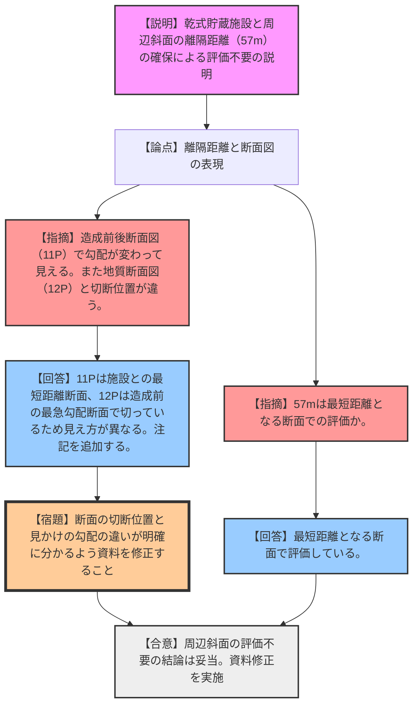
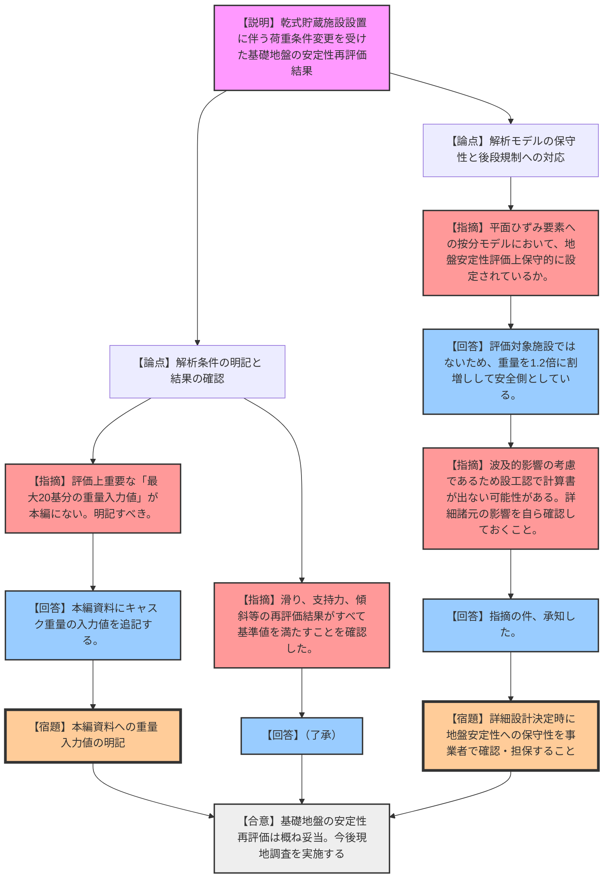

# 第1398回原子力発電所の新規制基準適合性に係る審査会合（令和8年3月6日）
> 出典 : https://youtube.com/live/narxL7XjhMo?si=QLRw8yqHzHX9afky

## 1. 会合の概要
*   **最大の争点:** 川内原子力発電所における使用済燃料乾式貯蔵施設の設置に伴う、既設建屋の基礎地盤および周辺斜面の安定性再評価の妥当性。特に、解析モデルにおける乾式キャスクの重量設定と波及的影響の考慮が焦点となった。
*   **審査の進捗状況:** 事業者からの説明および質疑応答を経て、基礎地盤の滑り・支持・傾斜等に関する再評価結果が基準値を満たしていることが確認され、概ね妥当な検討がなされたと評価された。今後は現地調査による確認へと進む。
*   **規制側の納得度:** 評価結果そのものには納得が得られたが、資料の記載（斜面の勾配の表現、断面図の位置、入力重量の明記）について複数の修正要求が出された。また、後段規制（設工認）を見据えた保守性の確認について念押しがなされた。

---

## 2. 議題の詳細整理

### 【議題1】九州電力（株）川内原子力発電所 1 号炉及び 2 号炉の使用済燃料乾式貯蔵施設に係る周辺斜面の安定性評価について
*   **議論の背景と論点:**
    乾式貯蔵施設の設置に伴い、周辺斜面の安定性評価が不要であることの根拠（離隔距離の確保）について、前回の合同会合での指摘を踏まえ、地質情報や造成断面図を追加した説明が行われた。断面図の表現方法（勾配の見え方や切断位置）の正確性が論点となった。

*   **質疑応答（詳細）:**
    *   **【論点：離隔距離と断面の設定】**
        *   【規制側（三井）】: 施設と斜面法尻との距離が57mであり、基準（50m以上かつ斜面高さ1.4倍以上）を満たすため評価不要とする結論は確認した。この57mは、最短距離となる断面で評価しているか。
        *   【説明者側（九州電力）】: 施設と斜面法尻が最短距離となる断面で評価している。
    *   **【論点：断面図における勾配の表現】**
        *   【規制側（三井）】: 資料11ページの造成前後断面図において、斜面勾配は変わらないと説明されているが、図上では横の長さが変わっており、勾配（1:2.0）になっていないように見える。
        *   【説明者側（九州電力）】: 造成後の最短距離断面で切っているため、造成前の斜面に対しては直角に交わっておらず、断面図上は幅が長くなり勾配がずれて見えている。
        *   【規制側（三井）】: 図だけ見ると誤解を招くため、注記等で記載を充実させるか、非公開の断面図上に参考線を追記するなどの対応を求める。
        *   【説明者側（九州電力）】: 記載を充実させる。
    *   **【論点：地質断面図の切断位置】**
        *   【規制側（岩田）】: 12ページの地質断面図が、11ページのA断面とは異なる位置で切られている理由は何か。
        *   【説明者側（九州電力）】: 12ページは造成前の形状で斜面が一番急勾配になる角度で切っているため、11ページと位置が異なっている。
        *   【規制側（岩田）】: 11ページと12ページを合わせ、どのような断面を切っているかが明確に分かるよう工夫すること。

*   **結論と宿題事項:**
    *   **結論:** 周辺斜面の安定性評価が不要であること（十分な離隔距離の確保）は確認された。
    *   **宿題事項:** 資料11ページ・12ページの断面図について、切断位置の違いや見かけ上の勾配のずれに関する注記・説明を追記すること。

---

### 【議題2】九州電力（株）川内原子力発電所 1 号炉及び 2 号炉の基礎地盤及び周辺斜面の安定性評価について
*   **議論の背景と論点:**
    乾式貯蔵施設の設置により既設建屋の評価断面上の重量条件が変わるため、基礎地盤の安定性（滑り、支持力、傾斜）の再評価が行われた。解析モデルへの施設重量の入力方法や、後段規制（設工認）における保守性の担保が論点となった。

*   **質疑応答（詳細）:**
    *   **【論点：解析モデルの入力値の明記】**
        *   【規制側（三井）】: 既許可の断面に乾式貯蔵施設（最大20基分）の重量を考慮して再評価したことは確認した。しかし、評価上重要な「最大20基の具体的な重量値」が参考資料にしか記載されていない。本編資料（施設の概要等）に明記すべき。
        *   【説明者側（九州電力）】: 本編資料にキャスク重量の入力値を追記して対応する。
    *   **【論点：評価結果の確認】**
        *   【規制側（三井）】: 滑り安全率（最小2.5 > 基準1.5）、最大接地圧（6.43 N/mm² < 極限支持力13.7 N/mm²）、基礎地盤の傾斜（最大1/11000 < 目安1/2000）、地殻変動と地震動の重畳（1/9000 < 目安1/2000）について、すべて基準値を満足していることを確認した。
    *   **【論点：解析モデルの保守性と後段規制への対応】**
        *   【規制側（名倉）】: 解析において、乾式貯蔵施設を平面ひずみ要素に按分してモデル化しているが、地盤安定性評価の観点で安全側（保守的）に設定されているか。
        *   【説明者側（九州電力）】: 当該施設は評価対象施設ではないため、影響を与える重量について1.2倍の割増しを行い、安全側（保守的）に設定している。
        *   【規制側（名倉）】: 設工認段階では建屋の詳細な重量や剛性が決まるが、本施設は「波及的影響」としての考慮であるため、計算書に直接示されない可能性がある。許可との整合性の観点から、詳細諸元が地盤安定性にどう影響するか、事業者側でしっかり検討・確認しておくこと。
        *   【説明者側（九州電力）】: 指摘の件、承知した。

*   **結論と宿題事項:**
    *   **結論:** 乾式貯蔵施設設置に伴う基礎地盤の安定性再評価は概ね妥当であると評価された。今後は現地調査にて実際の状況を確認する。
    *   **宿題事項:** 
        1. 本編資料にキャスク（最大20基）の重量入力値を明記すること。
        2. 後段規制（設工認）に向け、詳細設計に基づく諸元が波及的影響（地盤安定性）に与える保守性を自ら確認しておくこと。
        3. 事務局と調整の上、現地調査を実施すること。

---

## 3. 論理構造の可視化（Mermaid）

### 【議題1】周辺斜面の安定性評価

### 【議題2】基礎地盤及び周辺斜面の安定性評価

