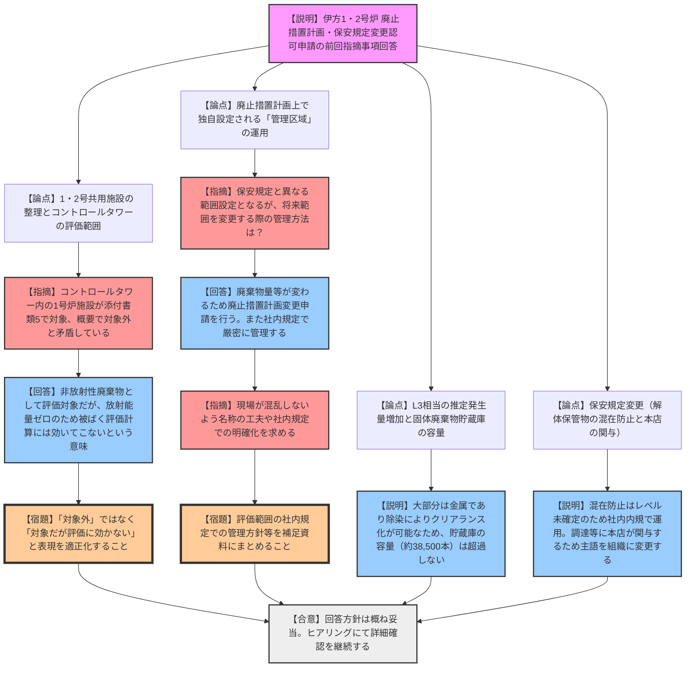

# 第45回実用発電用原子炉施設の廃止措置計画に係る審査会合（令和8年3月9日）
> 出典 : https://youtube.com/live/EX454nAogQg?si=Y_o2NZ634jk9ZbZ4

## 1. 会合の概要
*   **最大の争点:** 伊方発電所1号炉の廃止措置第2段階移行に伴う「1・2号共用施設」の評価範囲の明確化、および廃止措置計画上で独自に定義される「管理区域」の名称・範囲管理の妥当性。
*   **審査の進捗状況:** 前回の審査会合（第44回）での指摘事項に対する四国電力からの回答が行われた。共用施設の整理、廃棄物発生量と保管容量の見通し、保管物の混在防止対策、保安規定の変更（本店の関与）について概ね理解が得られ、今後のヒアリングを通じた詳細確認へと進むこととなった。
*   **現場の緊張感と規制側の納得度:** 廃止措置計画上でのみ設定される「管理区域（評価範囲）」について、規制側から「現場の作業員が混乱する可能性がある」との懸念が示された。これに対し、事業者が社内規定での厳密な管理を約束することで一定の納得が得られたが、用語の使い分けについて工夫を求める釘刺しが行われた。
*   **特筆すべき決定事項:** コントロールタワー内の1号炉施設について、「被ばく評価の対象外」とする表現から「評価対象ではあるが放射能量ゼロのため実質的に評価に効いてこない」という正確な表現へ適正化することが決定した。

---

## 2. 議題の詳細整理

**【議題1】四国電力（株）伊方発電所1号炉及び2号炉の廃止措置計画変更認可申請及び原子炉施設保安規定変更認可申請の審査について**

*   **議論の背景と論点:**
    伊方1号炉の廃止措置第2段階（原子炉領域周辺設備解体撤去期間）への移行に伴う変更認可申請。前回の審査会合において、①1・2号共用施設の整理方法、②L3相当の推定発生量増加と固体廃棄物貯蔵庫の容量、③解体保管物の処理エリア設置、④保安規定における混在防止対策や本店関与の明記、に関する指摘があり、それらに対する事業者の回答と妥当性が技術的な争点となった。

*   **質疑応答（詳細）:**

    **【論点1：1・2号共用施設の整理と被ばく評価の範囲】**
    *   **【説明者側（四国電力）】**: 1・2号共用施設は、両方の解体対象施設として整理する。被ばく評価および物量算出は、実際に作業を行う建屋ごと（1号炉建屋分は1号炉、2号炉建屋分は2号炉）に選定する。
    *   **【規制側（坂本）】**: 評価対象を「1号炉の施設」と「2号炉のみとの共用施設」に分けて記載しているが、それ以外の施設が対象範囲にあるのか。
    *   **【説明者側（四国電力）】**: それ以外はない。対象施設を具体的に明確化する意図で分けて記載した。
    *   **【規制側（坂本）】**: コントロールタワー内の1号炉施設について、添付書類5では評価対象とされているが、概要資料では「対象外」と記載されている。どちらが正しいか。
    *   **【説明者側（四国電力）】**: 添付書類5では非放射性廃棄物も含めて評価対象としているが、放射能量がゼロであるため、被ばく評価（添付書類3,4）の算出には実質的に影響しない（対象外となる）という意味である。
    *   **【規制側（坂本）】**: 「対象外」ではなく「対象だが評価に効いてこない」という表現に見直すよう求める。

    **【論点2：廃止措置計画上の「管理区域」の運用と管理】**
    *   **【規制側（有森）】**: 評価対象として整理された「1号炉の管理区域」等は、保安規定上の管理区域を変更するものではなく、廃止措置計画上でのみ設定される範囲という理解でよいか。
    *   **【説明者側（四国電力）】**: その通りである。現地の管理区域の範囲や管理方法に変更はない。
    *   **【規制側（有森）】**: 今後、廃止措置計画上のこの範囲を変更する場合、保安規定に変更が現れないがどのように管理するのか。最新の評価範囲が曖昧にならないよう社内規定で明確化すべき。
    *   **【説明者側（四国電力）】**: 範囲が変われば廃棄物量等が変動するため廃止措置計画の変更認可申請となる。範囲の管理は社内規定（内規）で確実に行う。
    *   **【規制側（金城）】**: 保安規定と廃止措置計画で「管理区域」という名称の使い方が異なると現場が混乱する。廃棄物管理にのみ使う区域であれば別の名称にする等の工夫を期待する。

    **【論点3：推定発生量と固体廃棄物貯蔵庫の容量】**
    *   **【説明者側（四国電力）】**: 汚染状況調査に基づくL2・L3等の推定発生量は、除染効果を見込んだ後の値である。第2段階の解体撤去物の大部分は金属であり、除染によりクリアランスにできる可能性が高い。そのため、固体廃棄物貯蔵庫（約38,500本容量、現在約23,400本保管）の容量を超過することはない。

    **【論点4：保安規定の変更（混在防止対策および本店の関与）】**
    *   **【説明者側（四国電力）】**: 解体保管物の混在防止対策は、放射能レベル区分が未確定の段階であるため現時点では保安規定に反映せず、社内内規で運用する。レベル区分確定時に保安規定等で確実な対策を講じる。また、第2段階以降は本店（原子力部等）も調達管理等に関与するため、規定の主語を「発電所」から「組織」へ変更する。
    *   **【規制側】**: （保安規定の変更方針について特段の反論・追加指摘なし）

*   **結論と宿題事項（アクションアイテム）:**
    *   **結論:** 四国電力からの指摘事項に対する回答は概ね妥当と判断された。今後は事務局のヒアリングを通じて申請書等の詳細確認を進める。
    *   **宿題事項:**
        1.  コントロールタワー内の1号炉施設に係る記載を「評価対象外」から「評価対象であるが放射能量ゼロのため被ばく評価に影響しない」旨の表現に適正化すること。
        2.  廃止措置計画上でのみ設定される「管理区域（評価範囲）」について、現場の混乱を招かないための名称の工夫や、社内規定による厳密な範囲管理方針を補足説明資料にまとめること。

---

## 3. 論理構造の可視化（Mermaid）

